# Create and Customize the DR Switchover Plan

## Introduction

In this lab, we will create a DR Switchover plan and customize the plan with additional steps. Ashburn is a primary region, and Phoenix is the standby region. FSDR provides two types of plan

- Switchover (Maintenance/Planned Disaster Recovery)
- Failover   (Actual Disaster Recovery/Unplanned)

This lab will focus on how to create a Switchover plan and customize the plan as per MuShop application requirements. DR Plan *must* be created in the standby region (Phoenix). It is because, in the case of the worst-case scenario, the entire primary region outside the FSDR will not be accessible from the primary region.

Estimated Time: 20 Minutes

Watch the video below for a quick walkthrough of the lab.

[Create DR Switchover plan](videohub:1_zf3hto6p)

### Objectives

- Create a Switchover plan
- Gather Load Balancer OCID's
- Customize the Switchover plan- Remove Primary Load Balancer Backends group
- Customize the Switchover plan- Restore Database Wallet group
- Customize the Switchover plan- Restore the Application Group
- Customize the Switchover plan- Add Standby Load Balancer Backends group
- Review the Switchover plan- Reorder groups

## Task 1: Create a Switchover plan

1. Login into OCI Console with your provided Credentials. Select region as **Phoenix**.

  

2. Select Migration and Disaster Recovery from the Hamburger menu, then **Disaster Recovery** -> **DR Protection Groups**. Verify the region is **Phoenix**

  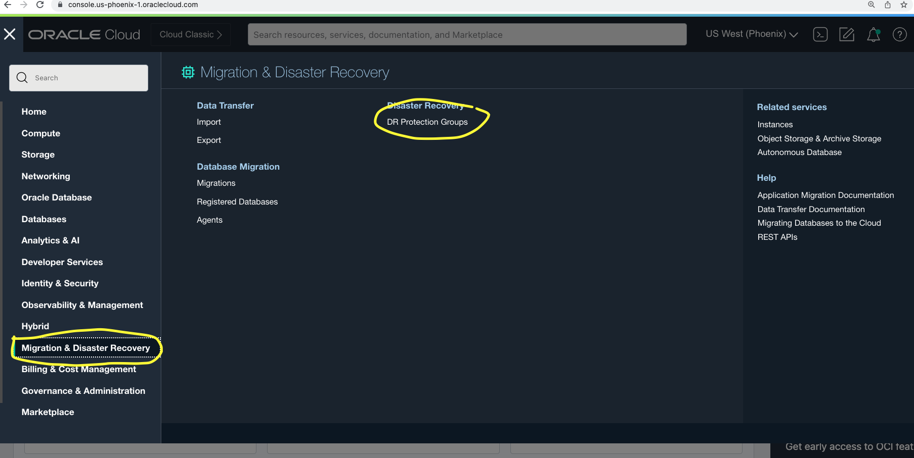

3. You will land on the Disaster Recovery Protection group home page; make sure you have selected the Phoenix region. **DR Plans always be created in the Standby DRPG (Phoenix region)**

  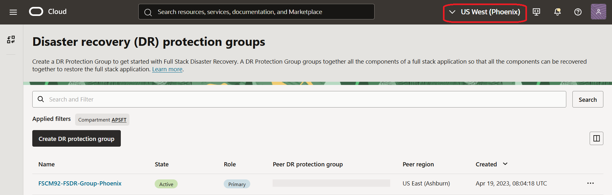

4. Select the **mushop-phoenix** DRPG and navigate to Plans under the resources section.

  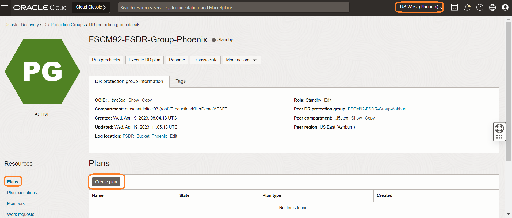

- Create plan
- Name as **mushop-app-switchover**
- Plan type as **Switchover (planned)**
- Hit Create

  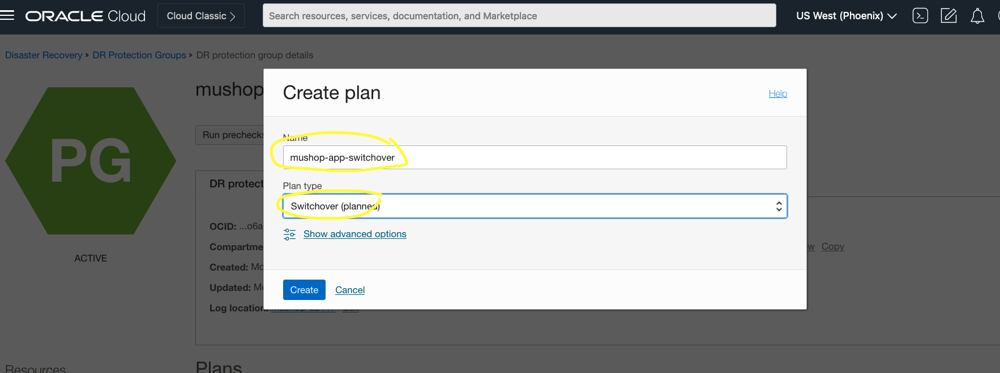

  The plan will start creating; select the plan **mushop-app-switchover**.

  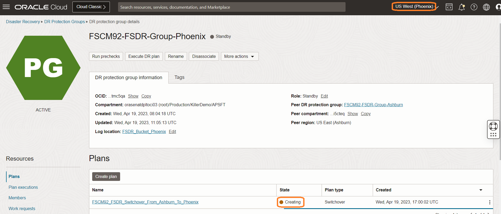

  Refresh the DR Plan page if required. You can monitor the request's status in the **Work requests** section under Resources. Within a minute, the plan will get created, and it should be in *active* State.

  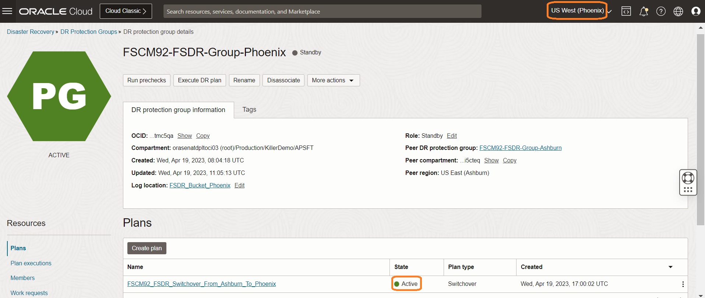

  Select the **mushop-app-switchover** plan, and you should be able to various built-in plan groups.

  

  Based on the members we added in both primary and standby DRPG, FSDR created these built-in plans. You can navigate the plan groups to see the various steps created.

  

- Built-in Prechecks - These are prechecks for the app, DB, and volume group switchover
- Stop Compute Instances (Primary) - Stop app virtual machines in the Ashburn region (primary)
- Switchover Volume Group (Standby) - Switchover volume group in the phoenix region (standby)
- Switchover Autonomous Databases (Standby) - Switchover ATP DB from Ashburn to Phoenix region
- Launch Compute Instances (Standby) - Create app virtual machines in the phoenix region (standby)
- Terminate Compute Instances (Primary) - Though the group says terminate compute instances, FSDR *will not terminate* the app virtual machines in the primary region.
- Reverse Volume Group Replication policies (Standby)- Set up reverse volume group replication from Phoenix to Ashburn region.
- Delete Volume Group (Primary)- Though the group says as delete volume group, we will not delete those in the Ashburn region.

## Task 2: Gather Load Balancer OCID's

1. As a prerequisite, we need to gather OCIDs (Oracle Cloud Identifier) of load balancers running in the Ashburn (Primary) and Phoenix (Standby) region.

2. Leave the existing DRPG console tabs as running. Now open two new OCI console tabs and ensure you are logged into the auburn region and phoenix region, respectively.

3. From the Hamburger menu, select **Networking**, then **Load Balancers**. Make sure you are logged in to **Ashburn** region.
  
  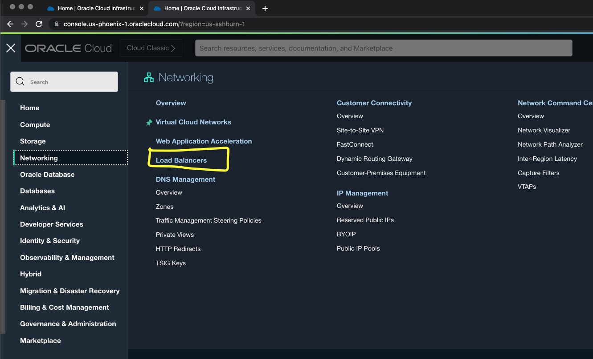

4. You should have a load balancer with the name **mushop-xxxx**; choose the right compartment assigned to you. Select the three dots on the right end of the load balancer details. Select **Copy OCID** and paste the OCID details safely into any preferred notes. You should have something similar to below

 **ocid1.loadbalancer.oc1.iad.aaaaaaaa2t4kwwavlgwghuebrce6mgqm5ewrsj5kscw2t5ncdpxdpo6ztvaq** (**Don't use this**)

  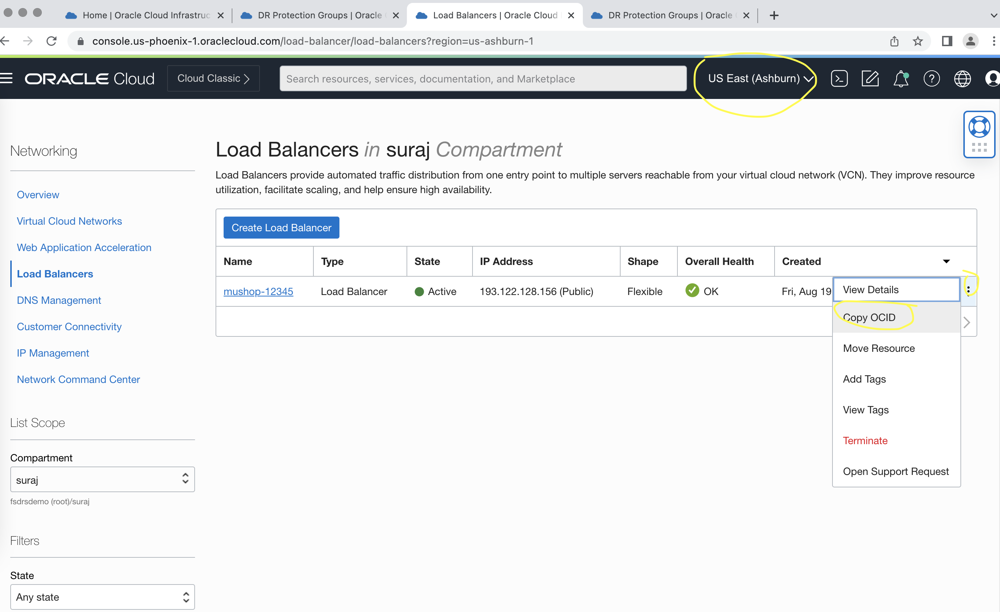

5. From the Hamburger menu, select **Networking**, then **Load Balancers**. Make sure you are logged in to **Phoenix** region.
  
  

6. You should have a load balancer with the name **mushop-xxxx**; choose the right compartment assigned to you. Select the three dots on the right end of the balancer details. Select **Copy OCID** and paste the OCID details safely into any preferred notes. You should have value something similar to below

 **ocid1.loadbalancer.oc1.phx.aaaaaaaaqo6sn6xku3vcuiqjb7emuastpzdrd4yrdgozh5g2c3bahwdkhiyq**  (**Don't use this**)

  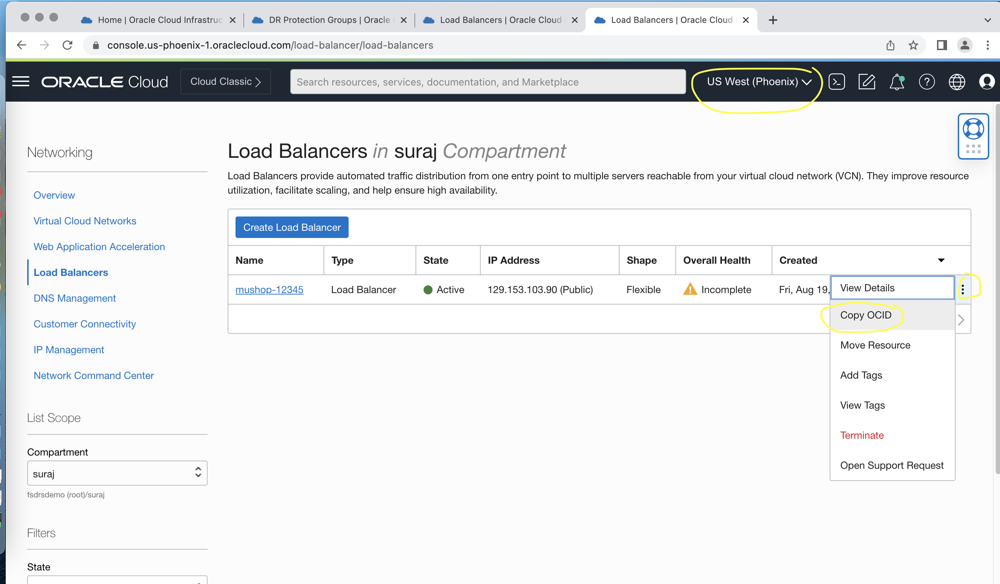


## Task 3: Customize the Switchover plan- Remove Primary Load Balancer Backends group

1. Use the browser tab where you have created the switchover plan in phoenix region. Create user-defined groups for mushop application switchover. We need to create four user-defined groups. Let's create those. You can do this by selecting **Add group** in the *mushop-app-switchover* plan

  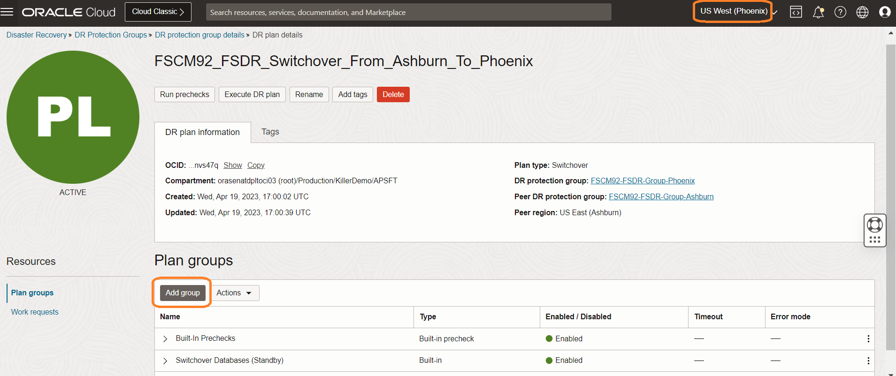

2. Add "Remove Primary Load Balancer Backends" User defined group

  - Add *Remove Primary Load Balancer Backends* in Group name
  - Add *Remove Primary Backend on Node-0* in Step name
  - Select Error mode as "Stop on error."
  - Leave the default "3600" seconds in Timeout in seconds
  - Leave the enabled tick mark
  - In the region, select "US East (Ashburn)."
  - Select the "Run local script" option
  - Select "mushop-xxxxx-0" instance in "Target instance in compartment"
  - In script parameters, add the below script
 
  ````
    <copy>/usr/bin/sudo /home/opc/fsdrsscripts/removeFromBackendset.py <REPLACE WITH YOUR OCID></copy>
  ````

  **Replace the OCID of the primary (Ashburn) load balancer as per step 2.4; make sure you replace the OCID of your load balancer without fail in the above command,remove angle brackets,note there is space after removeFromBackendset.py**

  - Leave the field blank in "Run as user."
  - Verify all the details and hit add

  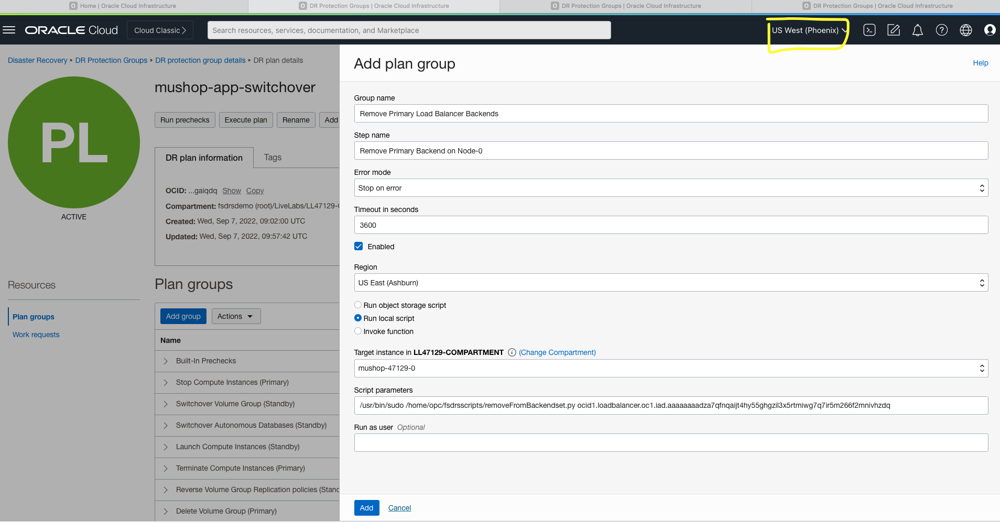

  - **mushop-phoenix**  DRPG will go into updating state, and after a few seconds, it will return to the active state. Refresh the DRPG page if required. You should be able to see that the *Remove Primary Load Balancer Backends* Plan group has been added successfully with the *Remove Primary Backend on Node-0* step. Note that the type in the group name it will show as **User defined** as this is a user-defined group.

  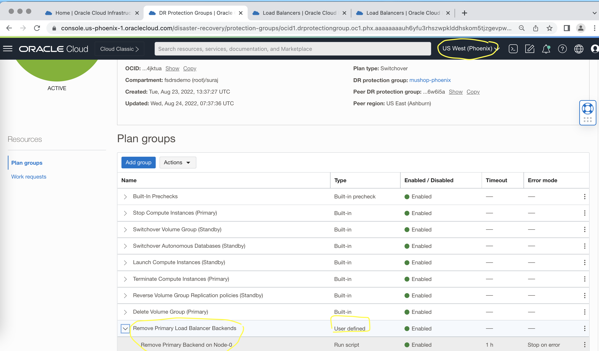

3.Need to add another step for *Remove Primary Backend on Node-1* in *Remove Primary Load Balancer Backends* Plan group

- Select the three dots section in the right end from the *Remove Primary Load Balancer Backends* Plan group. Select **Add Step**

  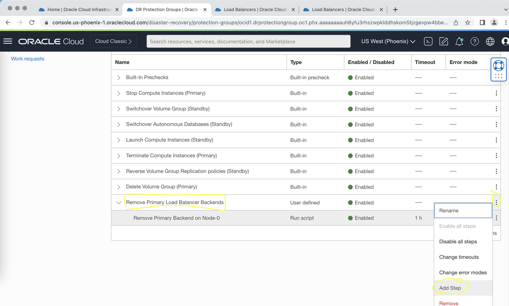

- Leave the default Group name
- Add *Remove Primary Backend on Node-1* in Step name
- Select Error mode as "Stop on error."
- Leave the default "3600" seconds in Timeout in seconds
- Leave the enabled tick mark
- In the region, select "US East (Ashburn)."
- Select the "Run local script" option
- Select "mushop-xxxxx-1" instance in "Target instance in compartment"
- In script parameters, add the below script

    ````
    <copy>/usr/bin/sudo /home/opc/fsdrsscripts/removeFromBackendset.py <REPLACE WITH YOUR OCID></copy>
    ````

 **Replace the OCID of the primary (Ashburn) load balancer as per step 2.4; make sure you replace the OCID of your load balancer without fail in the above command,remove angle brackets,note there is space after removeFromBackendset.py**

- Leave the field blank in "Run as user."
- Verify all the details and hit add

  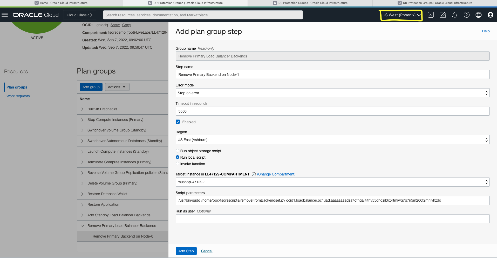

- **mushop-phoenix** DRPG will go into updating state, and after a few seconds, it will return to the active state. Refresh the DRPG page if required. You should be able to see that the *Remove Primary Load Balancer Backends* Plan group has been modified successfully with the *Remove Primary Backend on Node-1* step. Now you can see that both steps have been added to the group.

  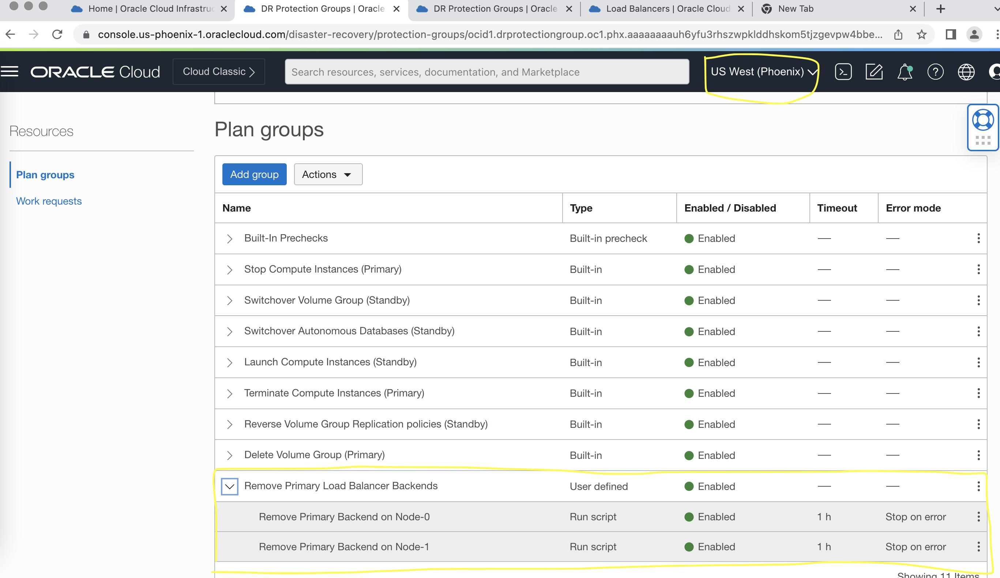


## Task 4: Customize the Switchover plan- Restore Database Wallet group

1. Create a user-defined group for "Restore Database Wallet." This can be done by selecting **Add group** in the *Restore Database Wallet* plan

  

2. Add "Restore Database Wallet" User defined group

- Add *Restore Database Wallet* in the Group name
- Add *Restore Database Wallet on Node-0* in Step name
- Select Error mode as "Stop on error."
- Leave the default "3600" seconds in Timeout in seconds
- Leave the enabled tick mark
- In the region, select "US East (Ashburn)."
- Select the "Run local script" option
- Select "mushop-xxxxx-0" instance in "Target instance in compartment"
- In script parameters, add the below script

    ````
    <copy>/usr/bin/sudo /home/opc/fsdrsscripts/mushop_db_wallet_restore.sh</copy>
    ````
- Leave the field blank in "Run as user."
- Verify all the details and hit add

  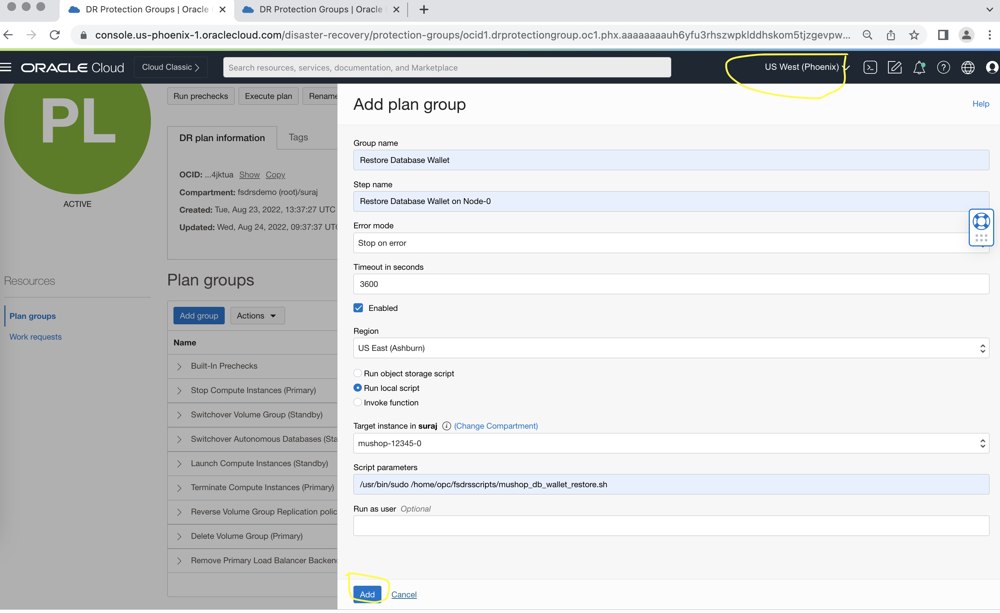

- **mushop-phoenix** drpg will go into updating state, and after a few seconds, it will return to active state. Refresh the DRPG page if required. You should be able to see that the *Restore Database Wallet* plan group has been added successfully with the *Restore Database Wallet on Node-0* step. Note the type in the group name. It will show as **User defined** as this is a user-defined group.

  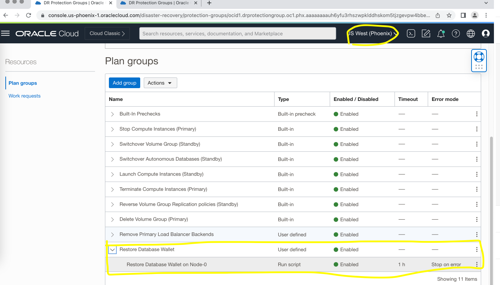

3.Need to add another step for *Restore Database Wallet on Node-1* in *Restore Database Wallet* plan group

- From the *Restore Database Wallet* Plan group, select the three dots section at the right end. Select **Add Step**

  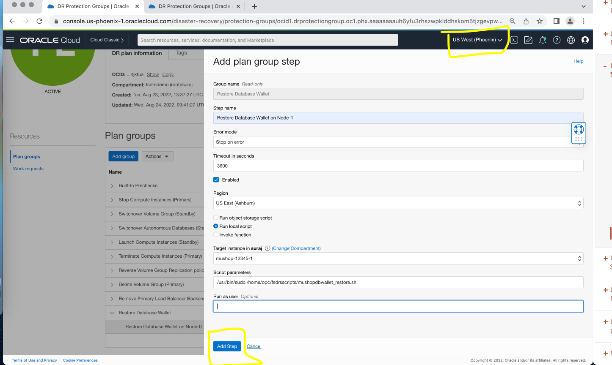

- Leave the default Group name
- Add *Restore Database Wallet on Node-1* in Step name
- Select Error mode as "Stop on error."
- Leave the default "3600" seconds in Timeout in seconds
- Leave the enabled tick mark
- In the region, select "US East (Ashburn)."
- Select the "Run local script" option
- Select "mushop-xxxxx-1" instance in "Target instance in compartment"
- In script parameters, add the below script

    ````
        <copy>/usr/bin/sudo /home/opc/fsdrsscripts/mushop_db_wallet_restore.sh</copy>
    ````
- Leave the field blank in "Run as user."
- Verify all the details and hit add

  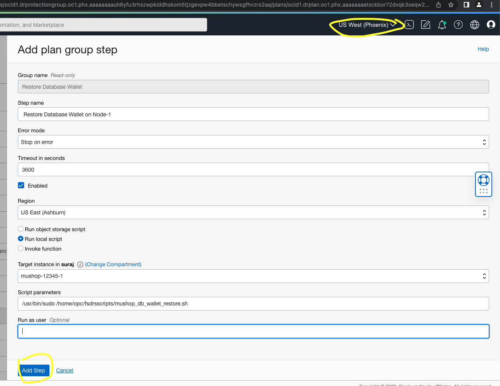

- **mushop-phoenix** drpg will go into updating state, and after a few seconds, it will return to active state. Refresh the DRPG page if required. You should be able to see that the *Restore Database Wallet* Plan group has been modified successfully with the *RRestore Database Wallet on Node-1* step. Now you can see that both steps have been added to the group.

  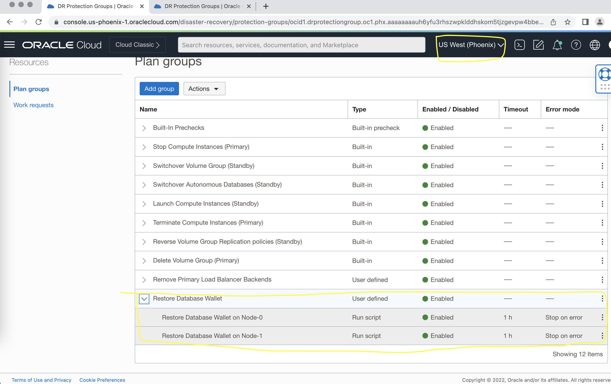

## Task 5: Customize the Switchover plan- Restore the Application Group

1. Create a user-defined group for "Restore Application." This can be done by selecting **Add group** in the *mushop-app-switchover* plan

  

2. Add "Restore Application" User defined group

- Add *Restore Application* in the Group name
- Add *Restore Application on Node-0* in Step name
- Select Error mode as "Stop on error."
- Leave the default "3600" seconds in Timeout in seconds
- Leave the enabled tick mark
- In the region, select "US East (Ashburn)."
- Select the "Run local script" option
- Select "mushop-xxxxx-0" instance in "Target instance in compartment"
- In script parameters, add the below script
    ````
        <copy>/usr/bin/sudo /home/opc/fsdrsscripts/mushop_reconfigure.sh</copy>
    ````
- Leave the field blank in "Run as user."
- Verify all the details and hit add

  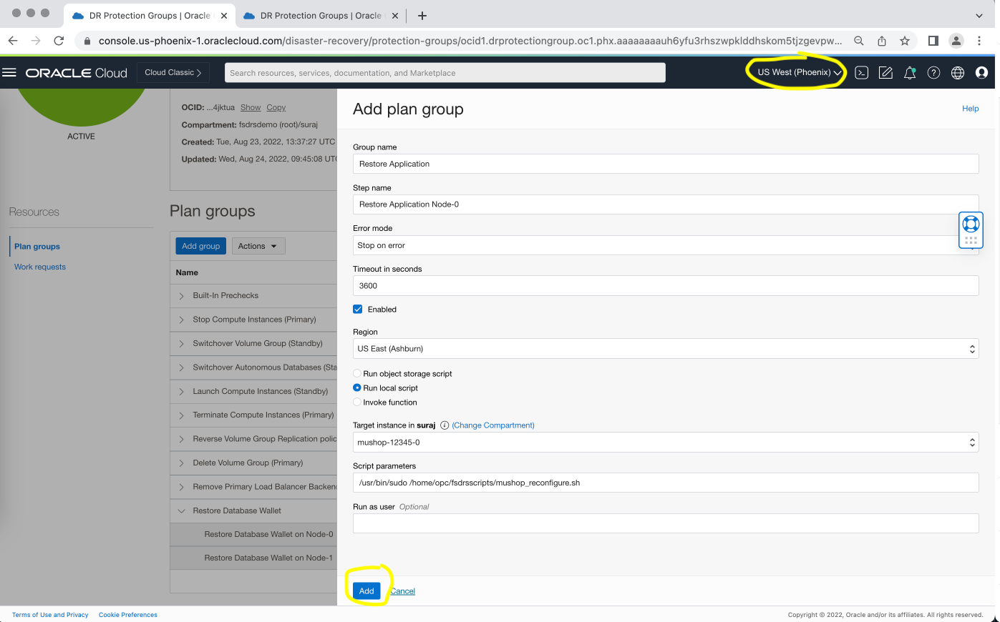

- **mushop-phoenix** drpg will go into updating state, and after a few seconds, it will return to active state. Refresh the DRPG page if required. You should be able to see that the *Restore Application* plan group has been added successfully with the *Restore Application on Node-0* step. Note the type in the group name. It will show as **User defined** as this is a user-defined group.

  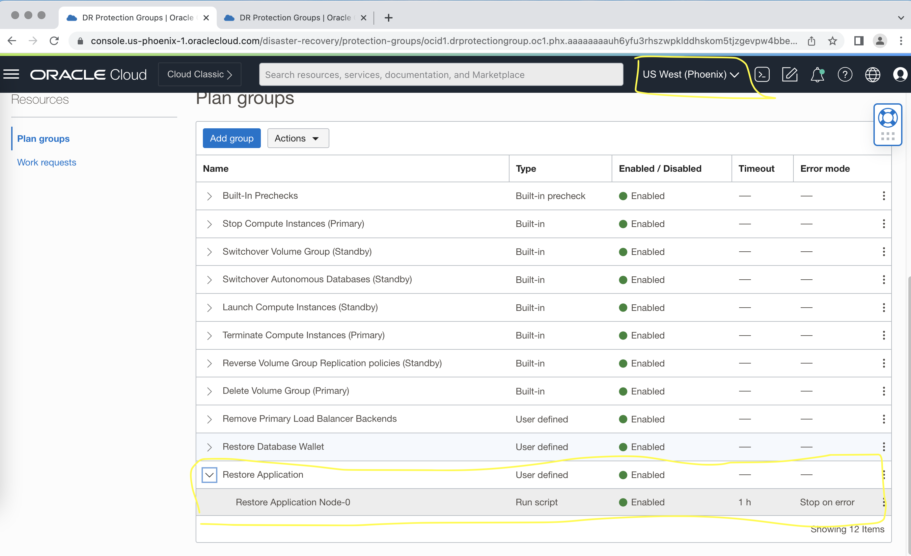

3.We Need to add another step for *Restore Application on Node-1* in the *Restore Application* plan group

- From the *Restore Application* Plan group, select the three dots section at the right end. Select **Add Step**

  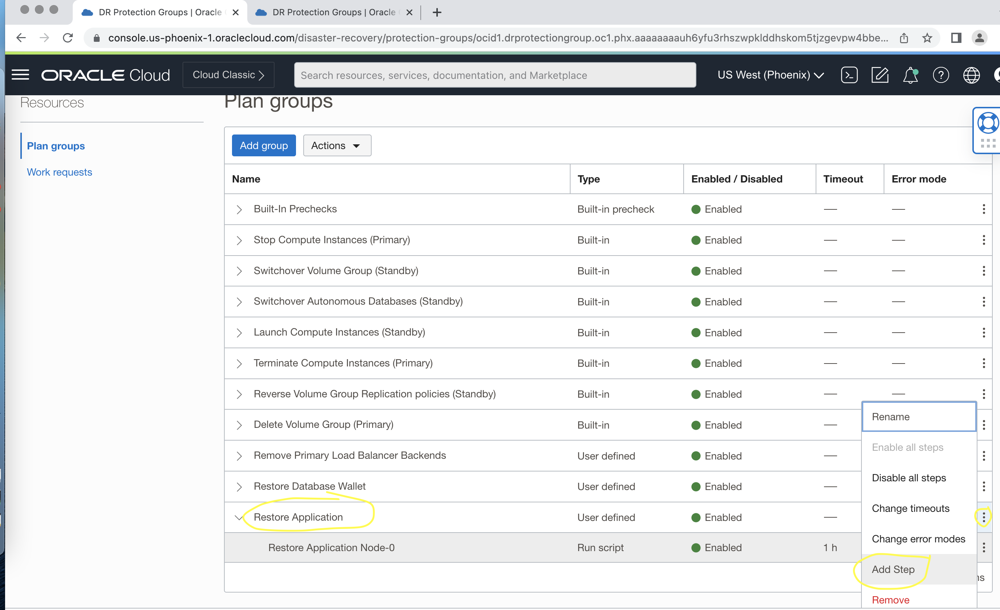

- Leave the default Group name
- Add *Restore Application on Node-1* in Step name
- Select Error mode as "Stop on error."
- Leave the default "3600" seconds in Timeout in seconds
- Leave the enabled tick mark
- In the region, select "US East (Ashburn)."
- Select the "Run local script" option
- Select "mushop-xxxxx-1" instance in "Target instance in compartment"
- In script parameters, add the below script
    ````
        <copy>/usr/bin/sudo /home/opc/fsdrsscripts/mushop_reconfigure.sh</copy>
    ````
- Leave the field blank in "Run as user."
- Verify all the details and hit add

  

- **mushop-phoenix** drpg will go into updating state, and after a few seconds, it will return to active state. Refresh the DRPG page if required. You should be able to see that the *Restore Application* Plan group has been modified successfully with the *RRestore Application on Node-1* step. Now you can see that both steps have been added to the group.

  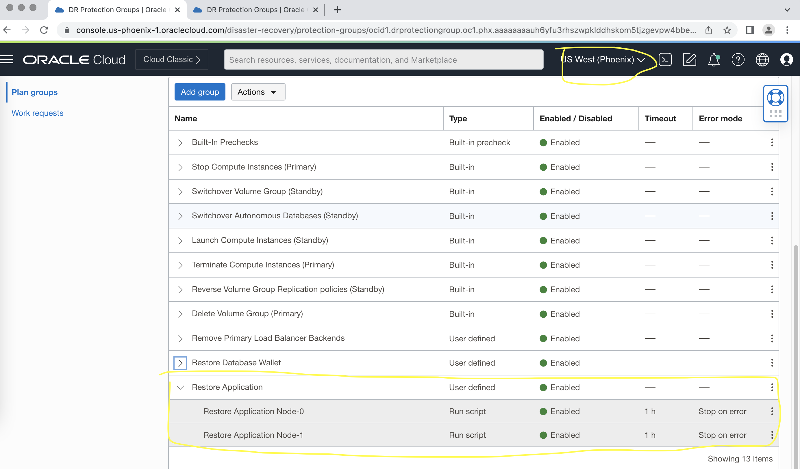


## Task 6: Customize the Switchover plan- Add Standby Load Balancer Backends group

1. Create a user-defined group for "Add Standby Load Balancer Backends." This can be done by selecting **Add group** in the *mushop-app-switchover* plan

  

2. Add "Add Standby Load Balancer Backends" User defined group

- Add *Add Standby Load Balancer Backends* in Group name
- Add *Add Standby Backend on Node-0* in Step name
- Select Error mode as "Stop on error."
- Leave the default "3600" seconds in Timeout in seconds
- Leave the enabled tick mark
- In the region, select "US East (Ashburn)."
- Select the "Run local script" option
- Select "mushop-xxxxx-0" instance in "Target instance in compartment"
- In script parameters, add the below script

    ````
        <copy>/usr/bin/sudo /home/opc/fsdrsscripts/addToBackendset.py <REPLACE WITH YOUR OCID></copy>
    ````

 **You need to replace the OCID of the standby (Phoenix) load balancer as per step 2.6; make sure you replace the OCID of your load balancer without fail in the above command,remove angle brackets,note there is space after addToBackendset.py**


- Leave the field blank in "Run as user."
- Verify all the details and hit add

  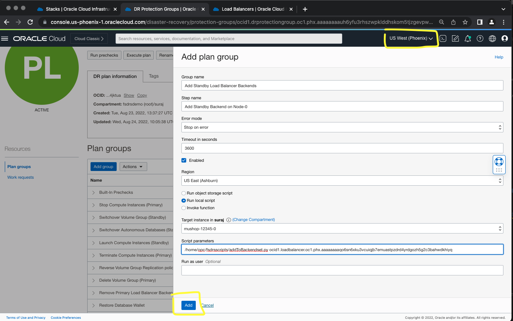

- **mushop-phoenix** drpg will go into updating state, and after a few seconds, it will return to active state. Refresh the DRPG page if required. You should be able to see that the *Add Standby Load Balancer Backends* Plan group has been added successfully with the *Add Standby Backend on Node-0* step. Note the type in the group name. It will show as **User defined** as this is a user-defined group.

  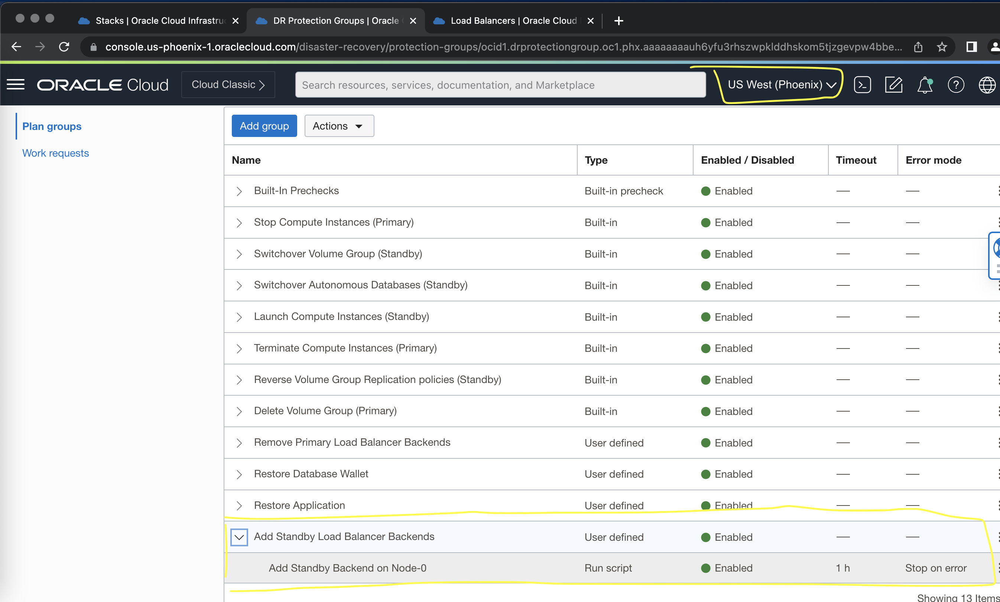

3.Need to add another step for *Add Standby Backend on Node-1* in *Add Standby Load Balancer Backends* Plan group

- Select the three dots section in the right end from the *Add Standby Load Balancer Backends* Plan group. Select **Add Step** 

  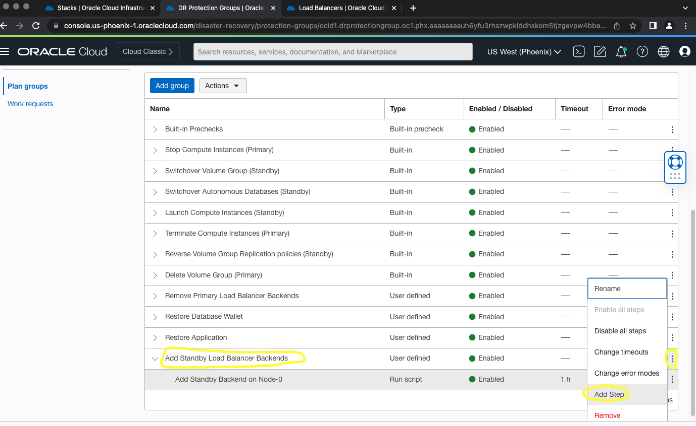

- Leave the default Group name
- Add *Add Standby Backend on Node-1* in Step name
- Select Error mode as "Stop on error."
- Leave the default "3600" seconds in Timeout in seconds
- Leave the enabled tick mark
- In the region, select "US East (Ashburn)."
- Select the "Run local script" option
- Select "mushop-xxxxx-1" instance in "Target instance in compartment"
- In script parameters, add the below script

    ````
        <copy>/usr/bin/sudo /home/opc/fsdrsscripts/addToBackendset.py <REPLACE WITH YOUR OCID></copy>
    ````

 **You need to replace the OCID of the standby (Phoenix) load balancer as per step 2.6; make sure you replace the OCID of your load balancer without fail in the above command,remove angle brackets,note there is space after addToBackendset.py**

- Leave the field blank in "Run as user."
- Verify all the details and hit add

  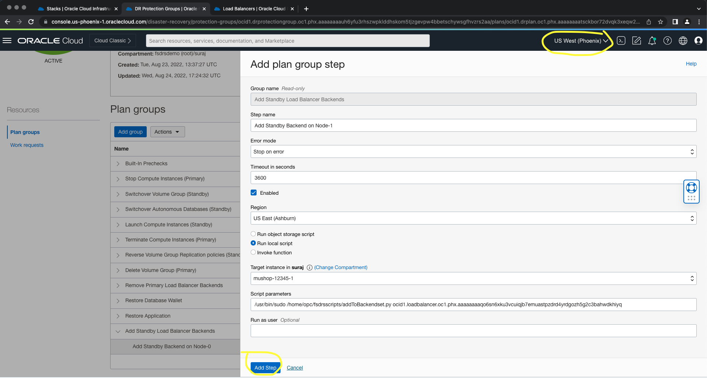

- **mushop-phoenix** drpg will go into updating state, and after a few seconds, it will return to active state. Refresh the DRPG page if required. You should be able to see that the *Add Standby Load Balancer Backends* Plan group has been modified successfully with the *Add Standby Backend on Node-1* step. Now you can see that both steps have been added to the group.

  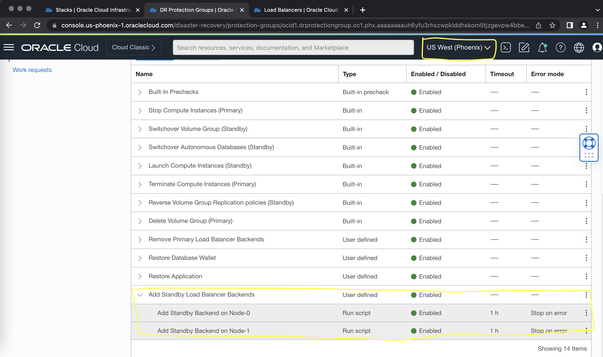


## Task 7: Verify and reorder the User defined groups

1. We have created all the required user-defined groups in the **mushop-app-switchover** switchover plan as part of the Mushop application switchover.

   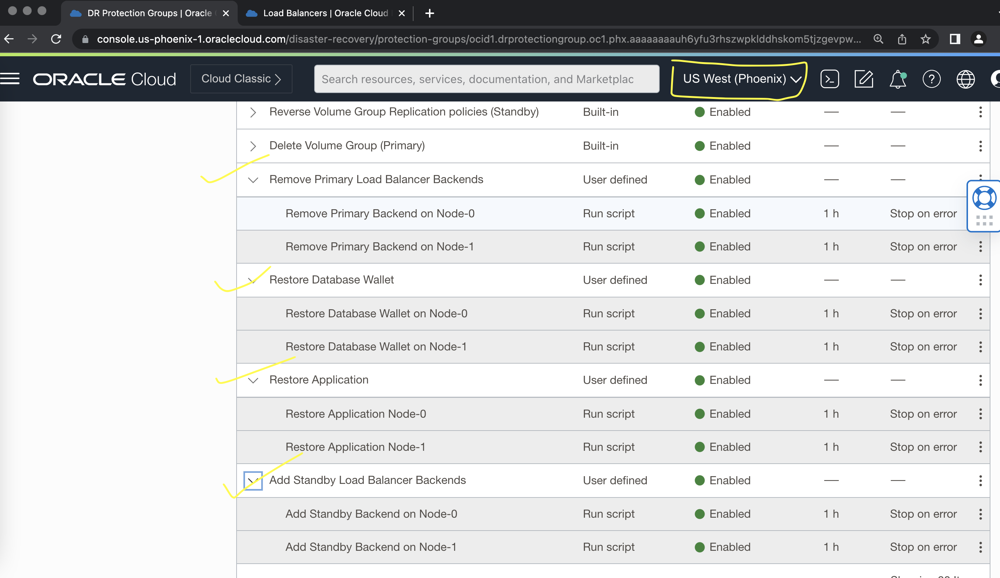

2. Let's review the **mushop-app-switchover** switchover plan 

-  Built-in Prechecks - These are the built-in prechecks groups for all the Plan groups (Built-in and User defined)
-  Based on the members we have added in both Primary DRPG and Standby DRPG, FSDRS created seven Built-in switchover plan
-  We have manually created four user-defined groups per the Mushop application switchover requirement.
-  In summary, the **mushop-app-switchover** switchover plan has created with *one*- Built-in precheck plan group, *seven*- Built-in Plan group,*four*- User defined Plan group

  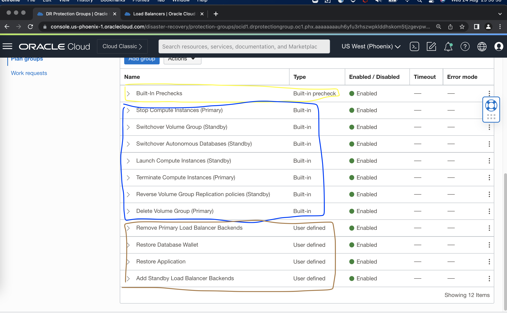

3.Plan groups can be reordered as per the switchover workflow requirement. As part of the Mushop Switchover plan, we would like to execute **Remove Primary Load Balancer Backends** plan group after the **Built-In Prechecks** plan group. Use the **Actions** after the Add group, and select **Reorder groups**

  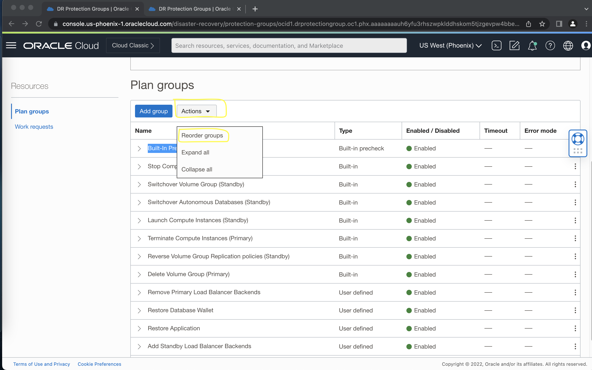

4.Go to the **Remove Primary Load Balancer Backends** plan group, use the move up **^** symbol, and keep moving up the **Remove Primary Load Balancer Backends** plan group and place it after the **Built-In Prechecks** plan group. This is very important to execute the plan groups in the proper order. Verify and hit **Save changes**. Don't move the other groups. 

  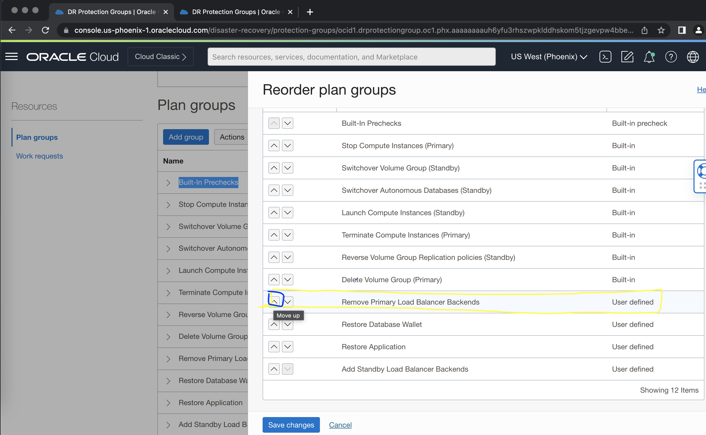
  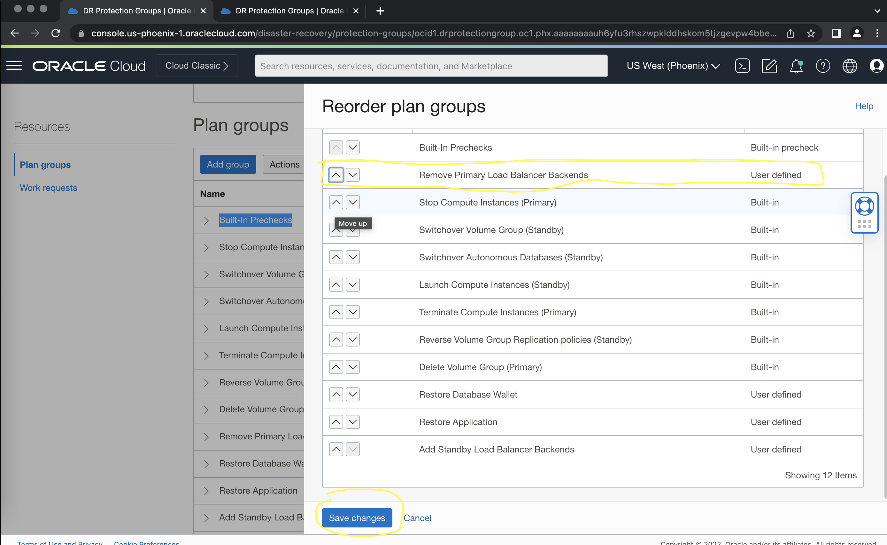 

5.You should be able to see **Remove Primary Load Balancer Backends** plan group moved after the **Built-In Prechecks** plan group.

  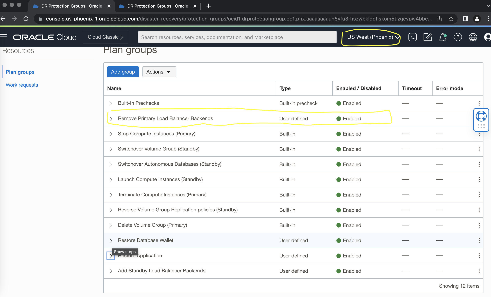

   You may now **proceed to the next lab**.

## Acknowledgements

- **Author** -  Suraj Ramesh, Principal Product Manager
- **Last Updated By/Date** -  Suraj Ramesh,September 2022
