# Create and Customize the DR Switchover Plan

## Introduction

In this lab, we will create a DR Switchover plan and customize the plan with the additional steps. Ashburn is the primary region and Phoenix is the standby region. FSDR provides two types of plan

- Switchover (Maintenance/Planned Disaster Recovery)
- Failover   (Actual Disaster Recovery/Unplanned)

This lab will focus on how to create a Switchover plan and customize the plan as per the PeopleSoft application requirements. 

**DR Plan *must* be created in the standby region (Phoenix)**. It is because, in the case of the worst-case scenario, the entire primary region outside the FSDR will not be accessible from the primary region.

Estimated Time: 180 Minutes

### Objectives

- Enable Run Commands on all the Compute Instances
- Create a Switchover plan
- Customize the Switchover plan - Add PeopleSoft Application Shutdown group in Ashburn
- Customize the Switchover plan - Disable files synchronization (rsync) jobs in Ashburn
- Customize the Switchover plan - Add DNS Record Update Script
- Customize the Switchover plan - Add PeopleSoft Application boot up group in Phoenix
- Customize the Switchover plan - Add Elastic Search Service boot up group in Phoenix
- Customize the Switchover plan - Add Kibana Service boot up group in Phoenix
- Customize the Switchover plan - Enable files synchronization (rsync) jobs in Phoenix 
- Customize the Switchover plan - DR Plan Re-Ordering

### Prerequisites

- Install oci cli packages in the compute instance which will run the DNS record update script. Refer to [OCI CLI Installation Guide](https://docs.oracle.com/en-us/iaas/Content/API/SDKDocs/cliinstall.htm)
- OCI user API Key added in OCI tenancy and place the configuration file in the compute instance which will be used to run the DNS record update script. Refer to [Add an API Signing Key](https://docs.oracle.com/en-us/iaas/Content/Identity/Tasks/managingcredentials.htm)

## Task 1: Enable Run Commands on an Instance

Run command feature will help in executing custom start and shutdown scripts as part of the FSDR.

Please refer below link to know more about on how to enable Run Commands in Compute Instance.

[Running Commands on an Instance](https://docs.oracle.com/en-us/iaas/Content/Compute/Tasks/runningcommands.htm)

1. Create a dynamic group that includes the instances that you want to allow commands to run on. For example, a rule inside the dynamic group can state:

     ````
      <copy>any { instance.id = 'ocid1.instance.oc1.phx.<unique_ID_1>', 'ocid1.instance.oc1.phx.<unique_ID_2>' }</copy>

     ````
  We will create a new dynamic group and add PeopleSoft Application Server Compute Instance, PeopleSoft Process Scheduler (Linux) Compute Instance, PeopleSoft Process Scheduler (Windows) Compute Instance, PeopleSoft Web Server and Elastic Search & Kibana services Compute Instance.

  Login to OCI Console and select *Ashburn* or *Phoenix* region as Dynamic Group will be created at tenancy level.

  Select Migration and Disaster Recovery from the Hamburger menu, then **Identity & Security** -> **Dynamic Group**. On the Domains list page, select the domain in which you want to make changes.

    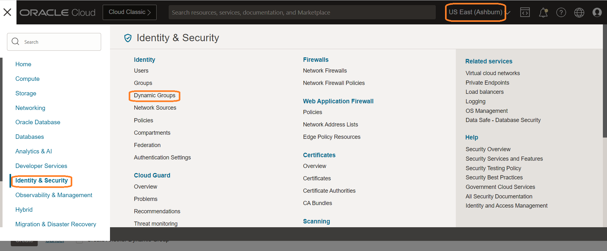

2. On the details page, select Dynamic groups. A list of dynamic groups in the domain is displayed. Click on Create Dynamic group.

    

    Enter the following information:

    **Name**: A unique name for the group. The name must be unique across all groups in the tenancy (dynamic groups and user groups). You can't change the name later. Avoid entering confidential information.

    **Description**: A friendly description.

    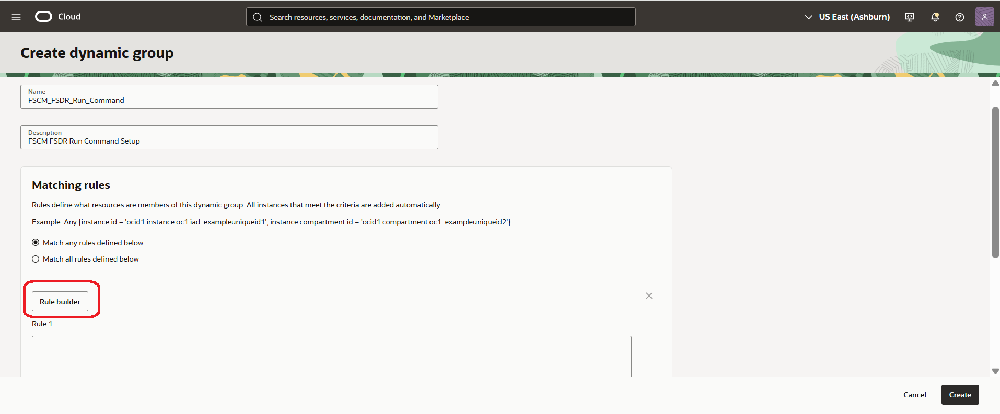

    Click on Rule Builder.

    Change Include instances that match: to Any of the following.

    Add one by one OCID's of both Ashburn and Phoenix regions hosted PeopleSoft Application Server Compute Instance, PeopleSoft Process Scheduler (Linux) Compute Instance, PeopleSoft Process Scheduler (Windows) Compute Instance, PeopleSoft Web Server and Elastic Search & Kibana services Compute Instance.

    Click on Add rule.

    

    Click on Create.

    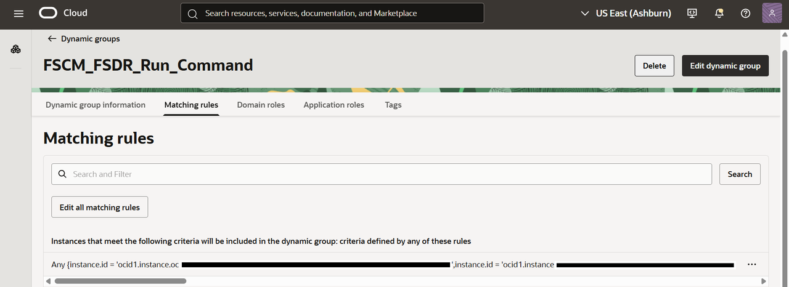

    You will now be able to see all the PeopleSoft Compute Instances of both *Ashburn* and *Phoenix* regions are added in the Dynamic Group.

3. Running Commands with Administrator Privileges

  If a command requires administrator permissions, you must grant administrator permissions to the Compute Instance Run Command plugin to be able to run the command. The plugin runs as the ocarun user.

  To grant sudo permissions on Linux instances, please run below commands in all of the PeopleSoft Application, Web, Process Scheduler and Elastic Search & Kibana servers of Linux.

    - On the instance, create a sudoers configuration file for the Compute Instance Run Command plugin:

     ````
      <copy>vi ./101-oracle-cloud-agent-run-command</copy>

     ````

    - Allow the ocarun user to run all commands as sudo by adding the following line to the configuration file:

     ````
      <copy>ocarun ALL=(ALL) NOPASSWD:ALL</copy>

     ````

    - Validate that the syntax in the configuration file is correct:

     ````
      <copy>visudo -cf ./101-oracle-cloud-agent-run-command</copy>

     ````

    If the syntax is correct, the follow message is returned:


      **./101-oracle-cloud-agent-run-command: parsed OK**

    - Add the configuration file to /etc/sudoers.d:

     ````
      <copy>sudo cp ./101-oracle-cloud-agent-run-command /etc/sudoers.d/</copy>

     ````

    **To grant administrator permissions on Windows instances**

    - On all of the Windows instances, run the following command in PowerShell:

     ````
      <copy>Add-LocalGroupMember -Group "Administrators" -Member "NT SERVICE\OCARUN" | Restart-Service -Name OCARUN -Force</copy>

     ````

## Task 2: Create a Switchover plan

1. Login into OCI Console. Select region as **Phoenix**.

  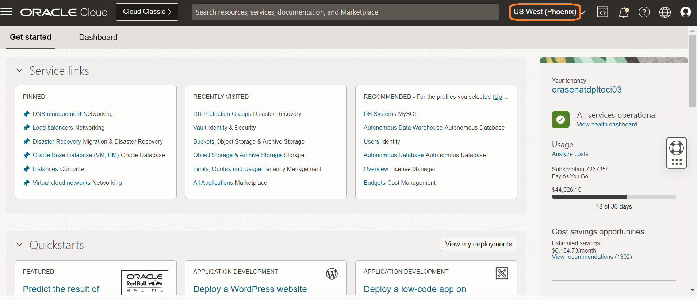

2. Select Migration and Disaster Recovery from the Hamburger menu, then **Disaster Recovery** -> **DR Protection Groups**. Verify the region is **Phoenix**

  

3. You will land on the Disaster Recovery Protection group home page; make sure you have selected the Phoenix region. **DR Plans always be created in the Standby DRPG (Phoenix region)**

  

4. Select the **FSCM92-FSDR-Group-Phoenix** DRPG and click on Plans. Click on Create Plan.

  

  Provide a name for the Switchover Plan.

  Select Plan type as **Switchover (planned)**.

  

  The plan will start creating.

  Refresh the DR Plan page if required. You can monitor the request's status in the **Work requests** section under Resources. Within few minutes, the plan will get created, and it should be in *active* State.

  

  Select the **FSCM92\_FSDR\_Switchover\_From\_Ashburn\_To\_Phoenix** plan, and you should be able to see the built-in plan groups.

  

  Based on the members we added in both primary and standby DRPG, FSDR created these built-in plans.

- **Built-in Prechecks** - These are the prechecks for the DB switchover.
- **Switchover Databases (Standby)** - Database switchover.

  

## Task 3: Customize the Switchover plan - Add PeopleSoft Application Shutdown group in Ashburn

We will shutdown PeopleSoft Applications in **Ashburn** region as we are doing the switchover from *Ashburn* to *Phoenix*. 

1. Click on Manage plan groups.

    

2. Add "Stop PeopleSoft Application in Ashburn" User defined group. Click on Add.

    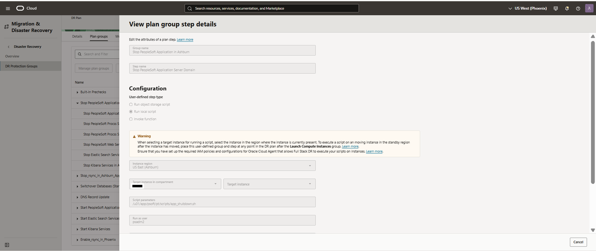

  - Add *Stop PeopleSoft Application in Ashburn* in Group name
  - Add *Stop PeopleSoft Application Server Domain* in Step name
  - Select configurations as **Run local script**
  - In the region, select "**US East (Ashburn)**"
  - Select the Application Server instance in "Target instance in compartment" where you have placed the Application Server Domain Shutdown script
  - In the script parameters, add the location of the Application Server Domain Shutdown script. Below is an example of Application Server Domain Shutdown script, please write a shutdown shell script according to your setup and configurations
  - Run as user will be the user who has access to shut down
  - Select Error mode as "Stop on error"
  - Leave the default "3600" seconds in Timeout in seconds
  - Enable Step

    **#!/bin/bash**

    **psadmin -c shutdown! -d APPDOM01**

    **cd /u01/app/psoft/fscm92-dbaas-app/ps\_cfg\_home/appserv/APPDOM01/**

    **rm -rf CACHE**

    **psadmin -c cleanipc -d APPDOM01**

  - Run as user will be the username who has access to shutdown PeopleSoft Application Server Domain.

Click on Add Step.

3. We will now add Process Scheduler server (Linux) shutdown step. Click on Add Step.

   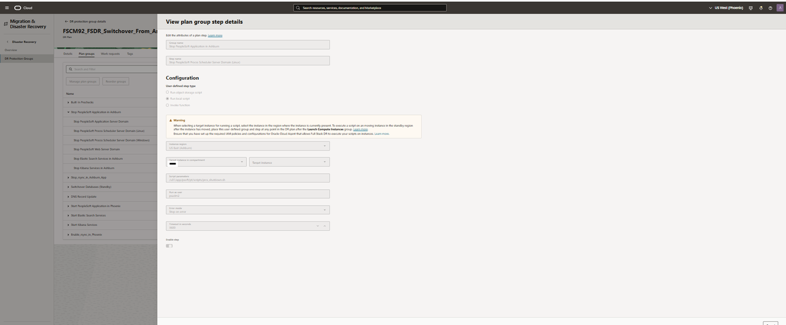

  - Add *Stop PeopleSoft Process Scheduler Server Domain (Linux)* in Step name
  - Select configurations as **Run local script**
  - In the region, select "**US East (Ashburn)**"
  - Select the Process Scheduler Server instance in "Target instance in compartment" where you have placed the Application Server Domain Shutdown script
  - In the script parameters, add the location of the Process Scheduler Server Domain Shutdown script. Below is an example of Process Scheduler Domain Shutdown script, please write a shutdown shell script according to your setup and configurations
  - Run as user will be the user who has access to shut down
  - Select Error mode as "Stop on error"
  - Leave the default "3600" seconds in Timeout in seconds
  - Enable Step

    **#!/bin/bash**

    **psadmin -p stop -d PRCSDOM01**

    **cd /u01/app/psoft/fscm92-dbaas-prcs/ps\_cfg\_home/appserv/prcs/PRCSDOM01**
    
    **rm -rf CACHE** 

    **psadmin -p cleanipc -d PRCSDOM01**

  - Run as user will be the username who has access to shutdown PeopleSoft Process Scheduler Server Domain.

Click on Add.

4. We will now add Process Scheduler server (Windows) shutdown step. Click on Add Step.

    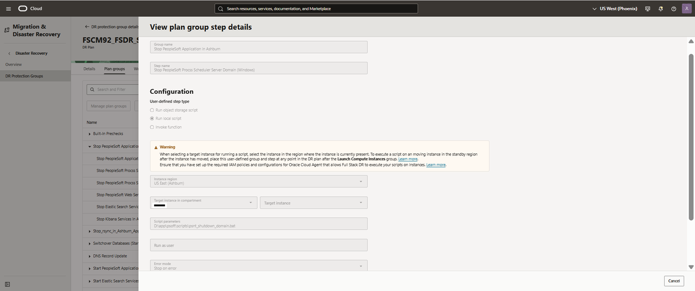

  - Add *Stop PeopleSoft Process Scheduler Server Domain (Windows)* in Step name
  - Select configurations as **Run local script**
  - In the region, select "**US East (Ashburn)**"
  - Select the Process Scheduler Server instance in "Target instance in compartment" where you have placed the Process Scheduler Server Domain Shutdown script
  - In the script parameters, add the location of the Process Scheduler Server Domain Shutdown script. Below is an example of Process Scheduler Server Domain Shutdown script, please write a shutdown shell script according to your setup and configurations
  - Run as user will be the user who has access to shut down
  - Select Error mode as "Stop on error"
  - Leave the default "3600" seconds in Timeout in seconds
  - Enable Step

    **@ECHO OFF**

    **SET TUXDIR=D:\app\psoft\ps\_home\pt\bea\tuxedo\tuxedo12.2.2.0.0\_VS2017**

    **SET PS\_HOME=D:\app\psoft\ps\_home\pt\ps\_home8.60.03**

    **SET PS\_APP\_HOME=D:\app\psoft\ps\_app\_home\pt\fscm\_app\_home**
    **SET PS\_CFG\_HOME=D:\app\psoft\ps\_cfg\_home\FSCM92**

    **SET PS\_CUST\_HOME=D:\app\psoft\ps\_cust\_home\FSCM92**

    **d:**

    **cd D:\app\psoft\ps\_home\pt\ps_home8.60.03\appserv**
    
    **psadmin.exe -p stop -d FSCM92\_PSNT** 

  - Leave Run as user blank for Windows Compute Instance.

Click on Add.

5. We will now add Web Server shutdown step. Click on Add Step.

    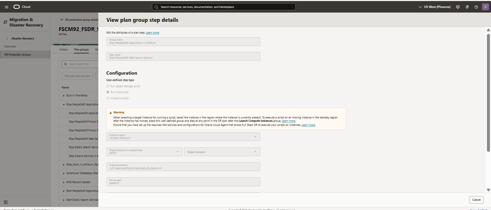

  - Add *Stop PeopleSoft Web Server Domain* in Step name
  - Select configurations as **Run local script**
  - In the region, select "**US East (Ashburn)**"
  - Select the Web Server instance in "Target instance in compartment" where you have placed the Web Server   Domain Shutdown script
  - In the script parameters, add the location of the Web Server Domain Shutdown script. Below is an example of Web Server Domain Shutdown script, please write a shutdown shell script according to your setup and configurations
  - Run as user will be the user who has access to shut down
  - Select Error mode as "Stop on error"
  - Leave the default "3600" seconds in Timeout in seconds
  - Enable Step

    **#!/bin/bash**

    **psadmin -w shutdown! -d WEBSERVER01** 
    
    **cd /u01/app/psoft/fscm92-dbaas-web/ps\_cfg\_home/webserv/WEBSERVER01/applications/peoplesoft/PORTAL.war/**

    **rm -rf cache**

  - Run as user will be the username who has access to shutdown PeopleSoft Web Server Domain.

  Click on Add.

Now, we have added shutdown steps for PeopleSoft Application Server, Process Scheduler (both Linux and Windows) and Web server domains hosted in *Ashburn* region.

6. We will now add Elastic Search services shutdown step. Click on Add Step.

    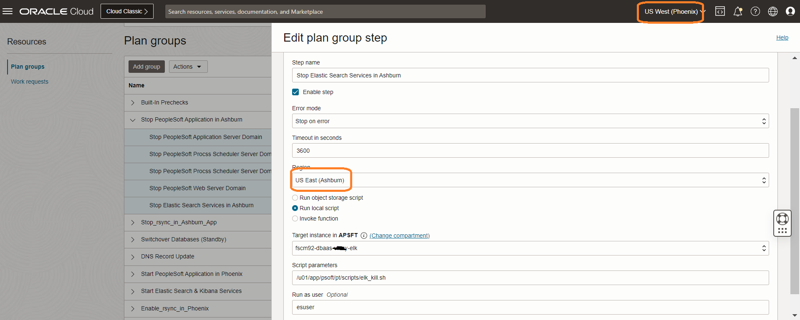

  - Add *Stop Elastic Search Services in Ashburn* in Step name
  - Select configurations as **Run local script**
  - In the region, select "**US East (Ashburn)**"
  - Select the Web Server instance in "Target instance in compartment" where you have placed the Elastic Search Server Domain Shutdown script
  - In the script parameters, add the location of the Elastic Search Server Domain Shutdown script. Below is an example of Elastic Search server Domain Shutdown script, please write a shutdown shell script according to your setup and configurations
  - Run as user will be the user who has access to shut down
  - Select Error mode as "Stop on error"
  - Leave the default "3600" seconds in Timeout in seconds
  - Enable Step

    **#!/bin/bash**

    **PID=`ps -eaf | grep "elas" | awk '{print $2}'`**
    
    **echo "$PID"**

    **if [[ -z "$PID" ]];**

    **then(**
    
      **echo "Elastic Search is not running!"**
    
    **)else(**
            
      **kill -9 $PID**

    **)fi**

  Click on Add Step.

7. We will now add Kibana services shutdown step. Click on Add Step.

    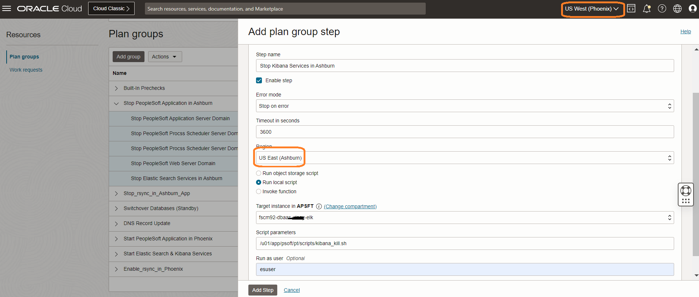

  - Add *Stop Kibana Services in Ashburn* in Step name
  - Select configurations as **Run local script**
  - In the region, select "**US East (Ashburn)**"
  - Select the Web Server instance in "Target instance in compartment" where you have placed the Kibana  services Shutdown script
  - In the script parameters, add the location of the Kibana services Shutdown script. Below is an example of Kibana services Shutdown script, please write a shutdown shell script according to your setup and configurations
  - Run as user will be the user who has access to shut down
  - Select Error mode as "Stop on error"
  - Leave the default "3600" seconds in Timeout in seconds
  - Enable Step

    **#!/bin/bash**

    **PID=`ps -eaf | grep "./node/bin" | awk '{print $2}'`**
    
    **echo "$PID"**

    **if [[ -z "$PID" ]];**

    **then(**
    
      **echo "Kibana Service is not running!"**
    
    **)else(**
            
      **kill -9 $PID**

    **)fi**

  - Run as user will be the username who has access to shutdown Kibana services.

  Click on Add.

  Now, we have added shutdown steps for PeopleSoft Application Server, Process Scheduler (both Linux and Windows), Web server domains, Elastic Search and Kibana services hosted in *Ashburn* region.
   
## Task 4: Customize the Switchover plan - Disable files synchronization (rsync) jobs in Ashburn

As part of this task, we will disable all the synchronization jobs that are enabled to run in Ashburn region to keep DR (standby) in sync with production environment.

1. Click on Manage group.

    

2. We will disable cronjob (rsync) in Application Server. Add "Stop\_rsync\_in\_Ashburn\_App" User defined group. Click on Add Step.

    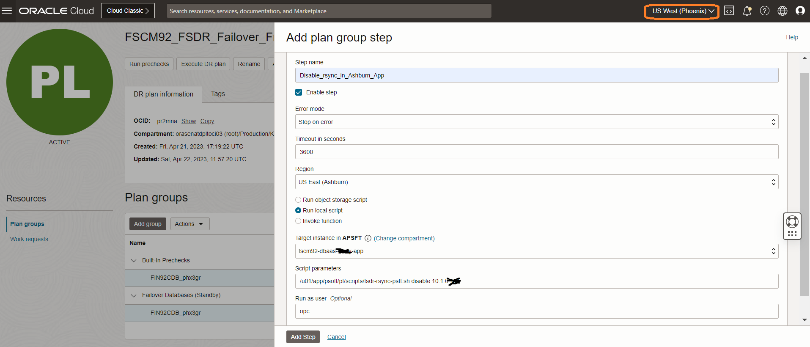    

    - Add *Disable\_rsync\_in\_Ashburn\_App* in Step name
    - Select configurations as **Run local script**
    - In the region, select "**US East (Ashburn)**"
    - Select the Server instance in "Target instance in compartment" where you have placed the cronjob (rsync) disable script
    - In the script parameters, add the location of the cronjob (rsync) disable script
    - Run as user will be the user who has access to disable cronjobs
  
    Click on Add Step.

3. We will now disable cronjob (rsync) in Process Scheduler Server. Click on Manage plan group. 

     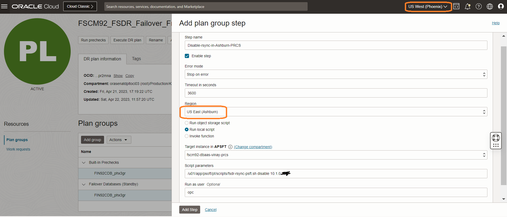    

    - Add *Disable-rsync-in-Ashburn-PRCS* in Step name
    - Select configurations as **Run local script**
    - In the region, select "**US East (Ashburn)**"
    - Select the Server instance in "Target instance in compartment" where you have placed the cronjob (rsync) disable script
    - In the script parameters, add the location of the cronjob (rsync) disable script
    - Run as user will be the user who has access to disable cronjobs

  Click on Add Step.

4. We will now disable cronjob (rsync) in Web Server. Click on Manage plan group.

     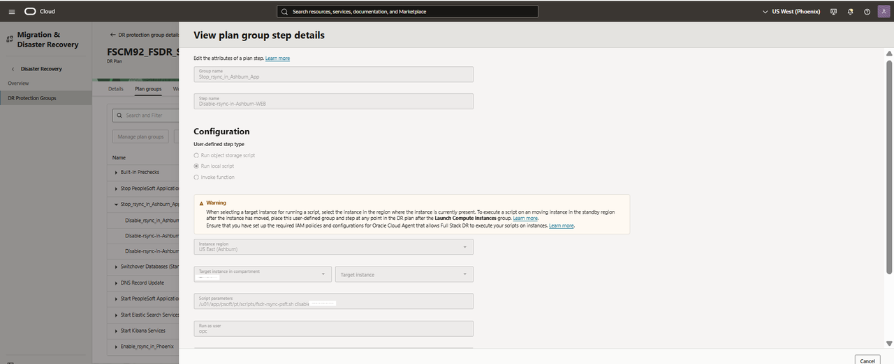    

    - Add *Disable-rsync-in-Ashburn-WEB* in Step name
    - Select configurations as **Run local script**
    - In the region, select "**US East (Ashburn)**"
    - Select the Server instance in "Target instance in compartment" where you have placed the cronjob (rsync) disable script
    - In the script parameters, add the location of the cronjob (rsync) disable script
    - Run as user will be the user who has access to disable cronjobs

  Click on Add Step.
   
## Task 5: Customize the Switchover plan - Add DNS Record Update Script

1. Click on Manage plan group.

    

2. Add "DNS Record Update" User defined group. Click on Add Step.

    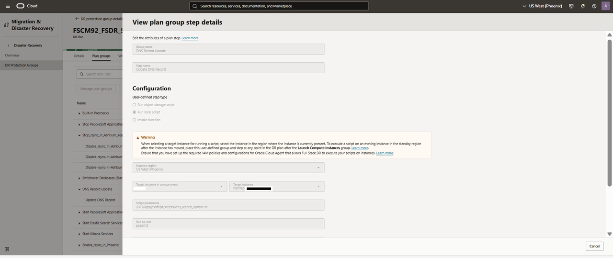

  - Add *DNS Record Update* in Group name
  - Add *Update DNS Record* in Step name
  - Select configurations as **Run local script**
  - In the region, select "**US East (Ashburn)**"
  - Select the Server instance in "Target instance in compartment" where you have placed the DNS Record update script
  - In the script parameters, add the location of the DNS Record update script
  - Run as user will be the user who has access to update DNS records
  - Below is an example of DNS record update script, please write a boot up shell script according to your setup and configurations. Please note oci cli is installed in this compute instance and a config file is created by adding an API key in users settings in OCI.

    **#!/bin/bash**

    **oci dns record rrset update --config-file /u01/app/psoft/fscm92-dbaas-app/home/psadm2/.oci/config --zone-name-or-id "psftchatbot.tk" --domain "fscm92.psftchatbot.tk" --rtype "A" --items '[{"domain":"fscm92.psftchatbot.tk","rdata":"158.101.xx.xx","rtype":"A","ttl":60}]' --force**

  Click on Add Step.
 
 
## Task 6: Customize the Switchover plan - Add PeopleSoft Application Boot-up Group in Phoenix

1. Click on Manage plan groups.

  

2. Add "Start Application Server Domains" User defined group. We will now add PeopleSoft Application Server boot up step. Click on Manage plan group. 

    

  - Add *Start PeopleSoft Application in Phoenix* in Group name
  - Add *Boot of Application Server Domains* in Step name
  - Select configurations as **Run local script**
  - In the region, select "**US West (Phoenix)**"
  - Select the Application Server instance in "Target instance in compartment" where you have placed the Application Server Domain start-up script
  - In the script parameters, add the location of the Application Server Domain start-up script. Below is an example of Application Server Domain start-up script, please write a start-up shell script according to your setup and configurations
  - Run as user will be the user who has access to start-up
  - Select Error mode as "Stop on error"
  - Leave the default "3600" seconds in Timeout in seconds
  - Enable step
 
   **#!/bin/bash**

  **cd /u01/app/psoft/fscm92-dbaas-app/ps\_cfg\_home/appserv/APPDOM01/**

  **rm -rf CACHE**

  **psadmin -c cleanipc -d APPDOM01**

  **psadmin -c purge -d APPDOM01**

  **psadmin -c boot -d APPDOM01**

Click on Add Step.
 
3. We will now add PeopleSoft Process Scheduler (Linux) boot up step. Click on Manage plan group. 

    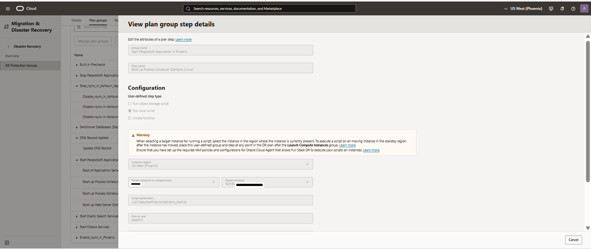

  - Add *Boot up Process Scheduler Domains (Linux)* in Step name
  - Select configurations as **Run local script**
  - In the region, select "**US West (Phoenix)**"
  - Select the Process Scheduler Server instance in "Target instance in compartment" where you have placed the Application Server Domain start-up script
  - In the script parameters, add the location of the Process Scheduler Server Domain start-up script. Below is an example of Process Scheduler Domain start-up script, please write a start-up shell script according to your setup and configurations
  - Run as user will be the user who has access to start-up
  - Select Error mode as "Stop on error"
  - Leave the default "3600" seconds in Timeout in seconds
  - Enable Step
  
  **#!/bin/bash**

  **cd /u01/app/psoft/fscm92-dbaas-prcs/ps\_cfg\_home/appserv/prcs/PRCSDOM01**

  **rm -rf CACHE**

  **psadmin -p cleanipc -d PRCSDOM01**

  **psadmin -p start -d PRCSDOM01**

  
Click on Add Step.
 
4. We will now add PeopleSoft Process Scheduler (Windows) boot up step. Click on Manage plan group.

    

  - Add *Boot up Process Scheduler Domains (Windows)* in Step name
  - Select configurations as **Run local script**
  - In the region, select "**US West (Phoenix)**"
  - Select the Process Scheduler Server instance in "Target instance in compartment" where you have placed the Process Scheduler Server Domain start-up  script
  - In the script parameters, add the location of the Process Scheduler Server Domain start-up  script. Below is an example of Process Scheduler Server Domain start-up  script, please write a start-up  shell script according to your setup and configurations
  - Run as user will be the user who has access to start-up 
  - Select Error mode as "Stop on error"
  - Leave the default "3600" seconds in Timeout in seconds
  - Enable Step
  
  **@ECHO OFF**

  **SET TUXDIR=D:\app\psoft\ps\_home\pt\bea\tuxedo\tuxedo12.2.2.0.0\_VS2017**

  **SET PS\HOME=D:\app\psoft\ps\_home\pt\ps\_home8.60.03**

  **SET PS\_APP\_HOME=D:\app\psoft\ps\_app\_home\pt\fscm\_app\_home**

  **SET PS\_CFG\_HOME=D:\app\psoft\ps\_cfg\_home\FSCM92**

  **SET PS\_CUST\_HOME=D:\app\psoft\ps\_cust\_home\FSCM92**
  
  **d:**
  
  **cd D:\app\psoft\ps\_home\pt\ps\_home8.60.03\appserv**

  **psadmin.exe -p start -d FSCM92\_PSNT**

  Click on Add Step.
 
Click on Add.

5. We will now add Web Server Boot up step. Click on Manage plan group. 

    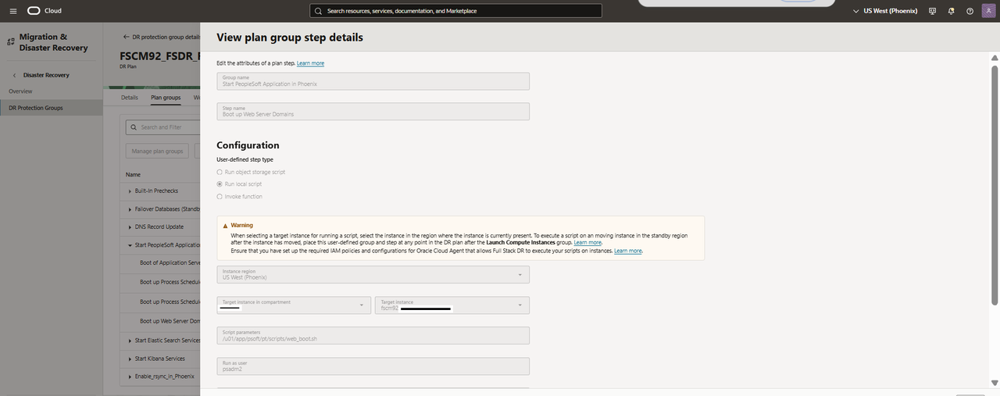

  - Add *Boot up Web Server Domains* in Step name
  - Select configurations as **Run local script**
  - In the region, select "**US West (Phoenix)**"
  - Select the Web Server instance in "Target instance in compartment" where you have placed the Web Server   Domain start-up script
  - In the script parameters, add the location of the Web Server Domain start-up script. Below is an example of Web Server Domain start-up script, please write a start-up shell script according to your setup and configurations
  - Run as user will be the user who has access to start-up
  - Select Error mode as "Stop on error"
  - Leave the default "3600" seconds in Timeout in seconds
  - Enable Step
  
    **#!/bin/bash**

    **cd /u01/app/psoft/fscm92-dbaas-web/ps\_cfg\_home/webserv/WEBSERVER01/applications/peoplesoft/PORTAL.war/**

    **rm -rf cache**

    **psadmin -w start -d WEBSERVER01**

  Click on Add Step.

  Click on Add.

## Task 7: Customize the Switchover plan - Add Elastic Search Services Boot-up Scripts in Phoenix
    
1. Click on Manage plan groups. Provide a name to the group as Start Elastic Search Services.

    

2. We will now add Elastic Search boot up script. Click on Manage plan group. 

    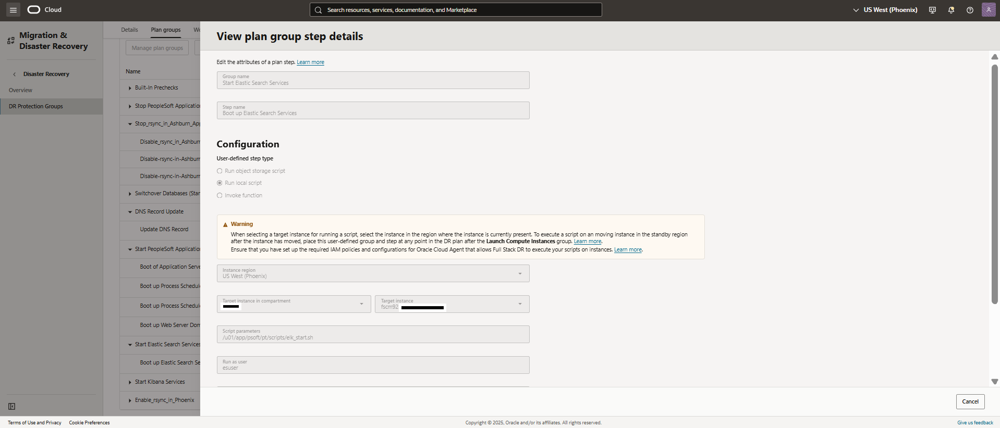

  - Add *Start Elastic Search Services* in group name
  - Add *Boot up Elastic Search Services* in Step name
  - Select configurations as **Run local script**
  - In the region, select "**US West (Phoenix)**"
  - Select the Web Server instance in "Target instance in compartment" where you have placed the Elastic Search Server Domain start-up script
  - In the script parameters, add the location of the Elastic Search Server Domain start-up script. Below is an example of Elastic Search server Domain start-up script, please write a start-up shell script according to your setup and configurations
  - Run as user will be the user who has access to start-up
  - Select Error mode as "Stop on error"
  - Leave the default "3600" seconds in Timeout in seconds
  - Enable Step
  
      **#!/bin/bash**

      **export JAVA\_HOME=/u01/app/es\_home/es/pt/es\_jdk11.0.17**

      **# This is a wrapper script -- wrapper.sh**

      **echo "Invoking command in nohup.."**

      **nohup /u01/app/es\_home/es/pt/elasticsearch7.10.0/bin/elasticsearch > /tmp/elas.out 2>&1 &**
      
      **echo `sleep 30`**
      
      **exit 0**

   Click on Add.

    
## Task 8: Customize the Switchover plan - Add Kibana Services Boot-up Scripts in Phoenix

1. Click on Manage plan group. Provide a name to the group as Start Kibana Services.

    

2. We will now add Kibana Services boot up script. Click on Manage plan group. 

    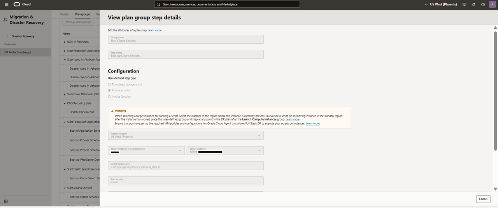

  - Add *Start Kibana Services* in group name
  - Add *Boot up Kibana Services* in Step name
  - Select configurations as **Run local script**
  - In the region, select "**US West (Phoenix)**"
  - Select the Web Server instance in "Target instance in compartment" where you have placed the Kibana  services start-up script
  - In the script parameters, add the location of the Kibana services start-up script. Below is an example of Kibana services start-up script, please write a start-up shell script according to your setup and configurations
  - Run as user will be the user who has access to start-up
  - Select Error mode as "Stop on error"
  - Leave the default "3600" seconds in Timeout in seconds
  - Enable Step
  
      **#!/bin/bash**

      **export JAVA\_HOME=/u01/app/es\_home/es/pt/es\_jdk11.0.17**

      **# This is a wrapper script -- wrapper.sh**

      **echo "Invoking command in nohup.."**

      **nohup /u01/app/es\_home/es/pt/Kibana7.10.0/bin/kibana > /tmp/kibana.out 2>&1 &**

      **echo `sleep 30`**

      **exit 0**

  

  Click on Add.

## Task 9: Customize the Switchover plan - Enable files synchronization (rsync) jobs in Phoenix

 As part of this task, we will enable synchronization (rsync) jobs in Phoenix to reverse the sync from Phoenix to Ashburn post switchover as the roles (priamry and standby) will be reversed.

1. Click on Manage plan groups.

    

2. We will enable cronjob (rsync) in Application Server. Add "Enable\_rsync\_in\_Phoenix" User defined group. Click on Manage plan group. 

        

    - Add *Enable-rsync-in-Phoenix-App* in Step name
    - Select configurations as **Run local script**
    - In the region, select "**US West (Phoenix)**"
    - Select the Server instance in "Target instance in compartment" where you have placed the cronjob (rsync) enable script
    - In the script parameters, add the location of the cronjob (rsync) enable script
    - Run as user will be the user who has access to enable cronjobs
    - Leave the Enable Step as ticked

  Click on Add Step.

3. We will now enable cronjob (rsync) in Process Scheduler Server. Click on Add Step.

        

    - Add *Enable-rsync-in-Phoenix-PRCS* in Step name
     - Select configurations as **Run local script**
    - In the region, select "**US West (Phoenix)**"
    - Select the Server instance in "Target instance in compartment" where you have placed the cronjob (rsync) enable script
    - In the script parameters, add the location of the cronjob (rsync) enable script
    - Run as user will be the user who has access to enable cronjobs
    - Leave the Enable Step as ticked

Click on Add Step.

4. We will now enable cronjob (rsync) in Web Server. Click on Add Step.

    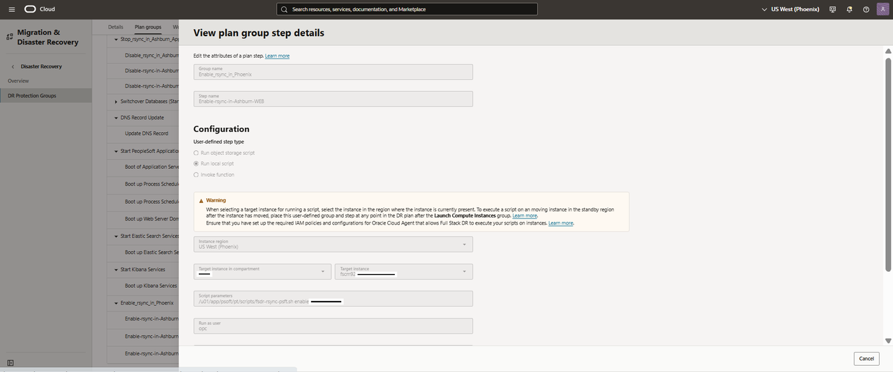    

    - Add *Enable-rsync-in-Phoenix-WEB* in Step name
    - Select configurations as **Run local script**
    - In the region, select "**US West (Phoenix)**"
    - Select the Server instance in "Target instance in compartment" where you have placed the cronjob (rsync) enable script
    - In the script parameters, add the location of the cronjob (rsync) enable script
    - Run as user will be the user who has access to enable cronjobs
    - Leave the Enable Step as ticked

  Click on Add Step.

Click on Add.

## Task 10: Customize the Switchover plan - DR Plan Re-Ordering

  We will now re-order the DR plan to stop PeopleSoft Application in Primary (*Ashburn*) region first 
  followed by switchover to Standby (*Phoenix*) region.

1. Click on Actions under the DR plan and click on **Reorder groups**.

   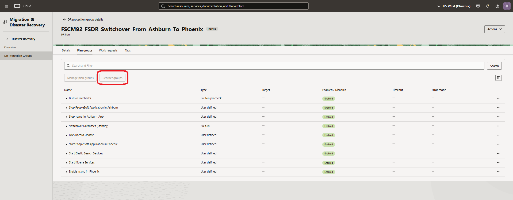

   Move group **Stop PeopleSoft Application in Ashburn** one order above **Switchover Databases (Standby)** so that Ashburn region hosted Primary production application is shutdown before switchover.

     

   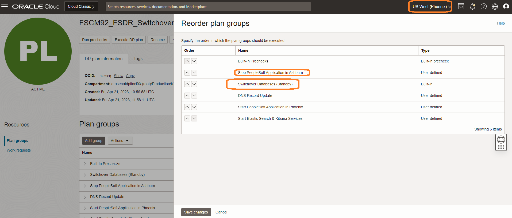

Click Save changes.

2. Click on Actions under the DR plan and click on **Reorder groups**.

   

   Move group **Stop\_rsync\_in\_Ashburn\_App** order above **Switchover Databases (Standby)**.

   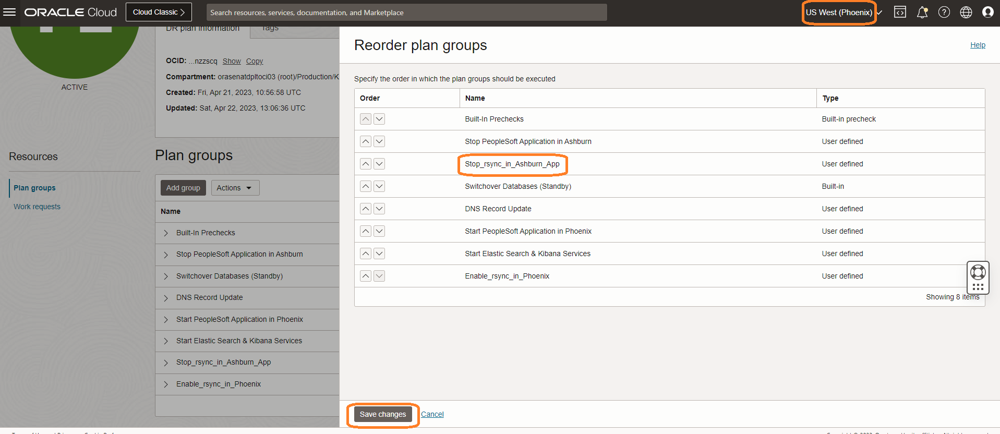 

   Click Save changes.

   Now the DR Swithover plan is re-ordered as below.

   

   You may now **proceed to the next lab**.

## Acknowledgements

- **Author** -  Vinay Shivanna, Principal Cloud Architect
- **Contributors** - Suraj Ramesh, Principal Product Manager
- **Last Updated By/Date** -  Vinay Shivanna, Principal Cloud Architect, November 2025
