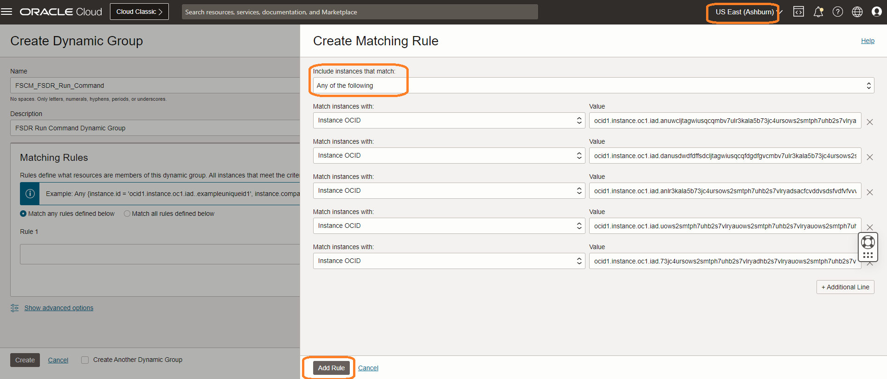
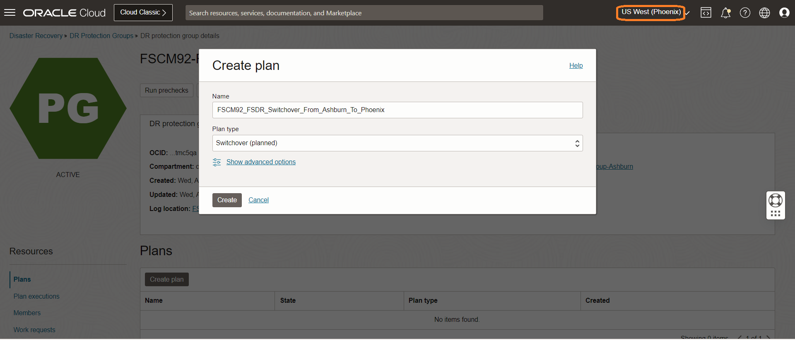
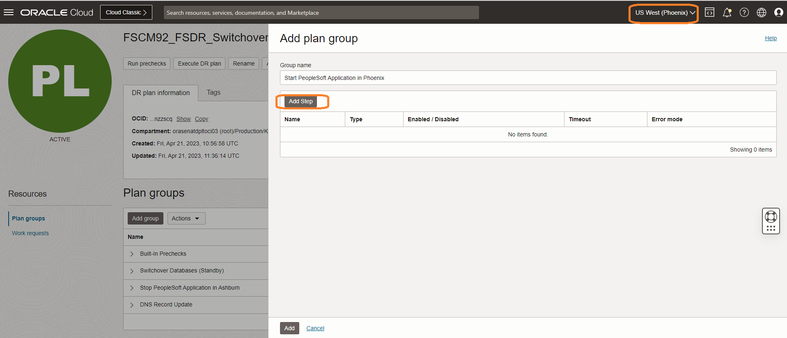
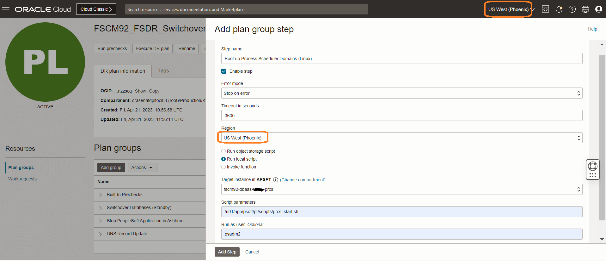
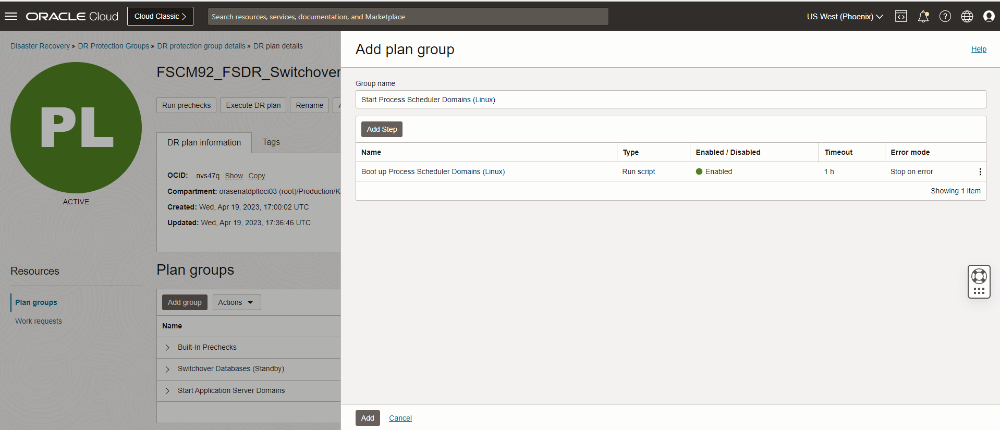

# Create and Customize the DR Switchover Plan

## Introduction

In this lab, we will create a DR Switchover plan and customize the plan with the additional steps. Ashburn is the primary region and Phoenix is the standby region. FSDR provides two types of plan

- Switchover (Maintenance/Planned Disaster Recovery)
- Failover   (Actual Disaster Recovery/Unplanned)

This lab will focus on how to create a Switchover plan and customize the plan as per PeopleSoft application requirements. 

**DR Plan *must* be created in the standby region (Phoenix)**. It is because, in the case of the worst-case scenario, the entire primary region outside the FSDR will not be accessible from the primary region.

Estimated Time: 20 Minutes

### Objectives

- Enable Run Commands on all the Compute Instances
- Create a Switchover plan
- Customize the Switchover plan - Add PeopleSoft Application Server boot up group
- Customize the Switchover plan - Add PeopleSoft Process Scheduler Server (Linux) boot up group
- Customize the Switchover plan - Add PeopleSoft Process Scheduler Server (Windows) boot up group
- Customize the Switchover plan - Add PeopleSoft Web Server boot up group
- Customize the Switchover plan - Add PeopleSoft Elastic Search & Kibana Service boot up group

## Task 1: Enable Run Commands on an Instance

   Run command feature will help in exeucting custom boot up scripts as part of the FSDR.

1. Create a dynamic group that includes the instances that you want to allow commands to run on. For example, a rule inside the dynamic group can state:

     ````
      <copy>any { instance.id = 'ocid1.instance.oc1.phx.<unique_ID_1>', 'ocid1.instance.oc1.phx.<unique_ID_2>' }</copy>

     ````
  We will create a new dynamic group and add PeopleSoft Application Server Compute Instance, PeopleSoft Process Scheduler (Linux) Compute Instance, PeopleSoft Process Scheduler (Windows) Compute Instance, PeopleSoft Web Server and Elastic Search & Kibana services Compute Instance.

  Login to OCI Console and select *Ashburn* or *Phoenix* region as Dynamic Group will be created at tenancy level.

  Select Migration and Disaster Recovery from the Hamburger menu, then **Identity & Security** -> **Dynamic Group**.

    

2. Click on Create Dynamic Group.

   Provide a name for the Dynamic Group.

   Provide a description for the Dyanmic Group.

   Click on Rule Builder.

    

    Change Include instances that match: to **Any of the following**.

    Add one by one OCID's of both *Ashburn* and *Phoenix* regions hosted PeopleSoft Application Server Compute Instance, PeopleSoft Process Scheduler (Linux) Compute Instance, PeopleSoft Process Scheduler (Windows) Compute Instance, PeopleSoft Web Server and Elastic Search & Kibana services Compute Instance.

    

    Click on Add Rule.

    Click on Create.

    

    You will now be able to see all the PeopleSoft Compute Instances of both *Ashburn* and *Phoenix* regions are added in the Dynamic Group.

## Task 1: Create a Switchover plan

1. Login into OCI Console. Select region as **Phoenix**.

  

2. Select Migration and Disaster Recovery from the Hamburger menu, then **Disaster Recovery** -> **DR Protection Groups**. Verify the region is **Phoenix**

  

3. You will land on the Disaster Recovery Protection group home page; make sure you have selected the Phoenix region. **DR Plans always be created in the Standby DRPG (Phoenix region)**

  

4. Select the **FSCM92-FSDR-Group-Phoenix** DRPG and navigate to Plans under the resources section. Click on Create Plan.

  

  Provide a name for the Switchover Plan.

  Select Plan type as **Switchover (planned)**.

  

  The plan will start creating.

  

  Refresh the DR Plan page if required. You can monitor the request's status in the **Work requests** section under Resources. Within few minutes, the plan will get created, and it should be in *active* State.

  

  Select the **FSCM92\_FSDR\_Switchover\_From\_Ashburn\_To\_Phoenix** plan, and you should be able to see the built-in plan groups.

  

  Based on the members we added in both primary and standby DRPG, FSDR created these built-in plans.

- **Built-in Prechecks** - These are the prechecks for the DB switchover.
- **Switchover Databases (Standby)** - Database switchover.

  

## Task 2: Customize the Switchover plan - Add Application Server Boot-up Script

1. Click on Add group.

  

2. Add "Start Application Server Domains" User defined group. Click on Add Step.

    

  - Add *Start Application Server Domains* in Group name
  - Add *Boot of Application Server Domains* in Step name
  - Leave the Enable Step as ticked
  - Select Error mode as "Stop on error"
  - Leave the default "3600" seconds in Timeout in seconds
  - In the region, select "US East (Phoenix)"
  - Select the "Run local script" option
  - Select application server instance in "Target instance in compartment"
  - In script parameters, add the location of the application server domain start-up script. Below is an example boot-up script, please write a boot up shell script according to your setup and configurations.

  **#!/bin/bash**

  **cd /u01/app/psoft/fscm92-dbaas-vinay-app/ps\_cfg\_home/appserv/APPDOM01/**

  **rm -rf CACHE**

  **psadmin -c cleanipc -d APPDOM01**

  **psadmin -c purge -d APPDOM01**

  **psadmin -c boot -d APPDOM01**

  - Run as user will be the username who has access to boot Application Server domain

  Click on Add Step.
 
  Click on Add.

  

## Task 3: Customize the Switchover plan - Add Process Scheduler Server (Linux) Boot-up Script
    
1. Click on Add group.

  

2. Add "Start Process Scheduler Domains (Linux)" User defined group. Click on Add Step.

    

  - Add *Start Process Scheduler Domains (Linux)* in Group name
  - Add *Boot up Process Scheduler Domains (Linux)* in Step name
  - Leave the Enable Step as ticked
  - Select Error mode as "Stop on error"
  - Leave the default "3600" seconds in Timeout in seconds
  - In the region, select "US East (Phoenix)"
  - Select the "Run local script" option
  - Select process scheduler server instance in "Target instance in compartment"
  - In script parameters, add the location of the application server domain start-up script. Below is an example boot-up script, please write a boot up shell script according to your setup and configurations.

  **#!/bin/bash**

  **cd /u01/app/psoft/fscm92-dbaas-vinay-prcs/ps_cfg_home/appserv/prcs/PRCSDOM01**

  **rm -rf CACHE**

  **psadmin -p cleanipc -d PRCSDOM01**

  **psadmin -p start -d PRCSDOM01**

  - Run as user will be the username who has access to boot Process Scheduler Server domain

  Click on Add Step.
 
  Click on Add.

    

## Task 4: Customize the Switchover plan - Add Process Scheduler Server (Windows) Boot-up Script
    
1. Click on Add group.

  

2. Add "Start Process Scheduler Domains (Windows)" User defined group. Click on Add Step.

    

  - Add *Start Process Scheduler Domains (Windows)* in Group name
  - Add *Boot up Process Scheduler Domains (Windows)* in Step name
  - Leave the Enable Step as ticked
  - Select Error mode as "Stop on error"
  - Leave the default "3600" seconds in Timeout in seconds
  - In the region, select "US East (Phoenix)"
  - Select the "Run local script" option
  - Select process scheduler server instance in "Target instance in compartment"
  - In script parameters, add the location of the application server domain start-up script. Below is an example boot-up script, please write a boot up shell script according to your setup and configurations.

  **@ECHO OFF**

  **SET TUXDIR=D:\app\psoft\ps\_home\pt\bea\tuxedo\tuxedo12.2.2.0.0\_VS2017**

  **SET PS\HOME=D:\app\psoft\ps_home\pt\ps\_home8.60.03**

  **SET PS\_APP\_HOME=D:\app\psoft\ps\_app\_home\pt\fscm\_app\_home**

  **SET PS\_CFG\_HOME=D:\app\psoft\ps\_cfg\_home\FSCM92**

  **SET PS\_CUST\_HOME=D:\app\psoft\ps\_cust\_home\FSCM92**
  
  **d:**
  
  **cd D:\app\psoft\ps_home\pt\ps\_home8.60.03\appserv**

  **psadmin.exe -p start -d FSCM92\_PSNT**

  - Run as user will be blank for Windows compute instance.

  Click on Add Step.
 
  Click on Add.

    


  **Replace the OCID of the primary (Ashburn) load balancer as per step 2.4; make sure you replace the OCID of your load balancer without fail in the above command,remove angle brackets,note there is space after removeFromBackendset.py**

  - Leave the field blank in "Run as user."
  - Verify all the details and hit add

  

  - **mushop-phoenix**  DRPG will go into updating state, and after a few seconds, it will return to the active state. Refresh the DRPG page if required. You should be able to see that the *Remove Primary Load Balancer Backends* Plan group has been added successfully with the *Remove Primary Backend on Node-0* step. Note that the type in the group name it will show as **User defined** as this is a user-defined group.

  

3.Need to add another step for *Remove Primary Backend on Node-1* in *Remove Primary Load Balancer Backends* Plan group

- Select the three dots section in the right end from the *Remove Primary Load Balancer Backends* Plan group. Select **Add Step**

  

- Leave the default Group name
- Add *Remove Primary Backend on Node-1* in Step name
- Select Error mode as "Stop on error."
- Leave the default "3600" seconds in Timeout in seconds
- Leave the enabled tick mark
- In the region, select "US East (Ashburn)."
- Select the "Run local script" option
- Select "mushop-xxxxx-1" instance in "Target instance in compartment"
- In script parameters, add the below script

    ````
    <copy>/usr/bin/sudo /home/opc/fsdrsscripts/removeFromBackendset.py <REPLACE WITH YOUR OCID></copy>
    ````

 **Replace the OCID of the primary (Ashburn) load balancer as per step 2.4; make sure you replace the OCID of your load balancer without fail in the above command,remove angle brackets,note there is space after removeFromBackendset.py**

- Leave the field blank in "Run as user."
- Verify all the details and hit add

  

- **mushop-phoenix** DRPG will go into updating state, and after a few seconds, it will return to the active state. Refresh the DRPG page if required. You should be able to see that the *Remove Primary Load Balancer Backends* Plan group has been modified successfully with the *Remove Primary Backend on Node-1* step. Now you can see that both steps have been added to the group.

  


## Task 4: Customize the Switchover plan- Restore Database Wallet group

1. Create a user-defined group for "Restore Database Wallet." This can be done by selecting **Add group** in the *Restore Database Wallet* plan

  

2. Add "Restore Database Wallet" User defined group

- Add *Restore Database Wallet* in the Group name
- Add *Restore Database Wallet on Node-0* in Step name
- Select Error mode as "Stop on error."
- Leave the default "3600" seconds in Timeout in seconds
- Leave the enabled tick mark
- In the region, select "US East (Ashburn)."
- Select the "Run local script" option
- Select "mushop-xxxxx-0" instance in "Target instance in compartment"
- In script parameters, add the below script

    ````
    <copy>/usr/bin/sudo /home/opc/fsdrsscripts/mushop_db_wallet_restore.sh</copy>
    ````
- Leave the field blank in "Run as user."
- Verify all the details and hit add

  

- **mushop-phoenix** drpg will go into updating state, and after a few seconds, it will return to active state. Refresh the DRPG page if required. You should be able to see that the *Restore Database Wallet* plan group has been added successfully with the *Restore Database Wallet on Node-0* step. Note the type in the group name. It will show as **User defined** as this is a user-defined group.

  

3.Need to add another step for *Restore Database Wallet on Node-1* in *Restore Database Wallet* plan group

- From the *Restore Database Wallet* Plan group, select the three dots section at the right end. Select **Add Step**

  

- Leave the default Group name
- Add *Restore Database Wallet on Node-1* in Step name
- Select Error mode as "Stop on error."
- Leave the default "3600" seconds in Timeout in seconds
- Leave the enabled tick mark
- In the region, select "US East (Ashburn)."
- Select the "Run local script" option
- Select "mushop-xxxxx-1" instance in "Target instance in compartment"
- In script parameters, add the below script

    ````
        <copy>/usr/bin/sudo /home/opc/fsdrsscripts/mushop_db_wallet_restore.sh</copy>
    ````
- Leave the field blank in "Run as user."
- Verify all the details and hit add

  

- **mushop-phoenix** drpg will go into updating state, and after a few seconds, it will return to active state. Refresh the DRPG page if required. You should be able to see that the *Restore Database Wallet* Plan group has been modified successfully with the *RRestore Database Wallet on Node-1* step. Now you can see that both steps have been added to the group.

  

## Task 5: Customize the Switchover plan- Restore the Application Group

1. Create a user-defined group for "Restore Application." This can be done by selecting **Add group** in the *mushop-app-switchover* plan

  

2. Add "Restore Application" User defined group

- Add *Restore Application* in the Group name
- Add *Restore Application on Node-0* in Step name
- Select Error mode as "Stop on error."
- Leave the default "3600" seconds in Timeout in seconds
- Leave the enabled tick mark
- In the region, select "US East (Ashburn)."
- Select the "Run local script" option
- Select "mushop-xxxxx-0" instance in "Target instance in compartment"
- In script parameters, add the below script
    ````
        <copy>/usr/bin/sudo /home/opc/fsdrsscripts/mushop_reconfigure.sh</copy>
    ````
- Leave the field blank in "Run as user."
- Verify all the details and hit add

  

- **mushop-phoenix** drpg will go into updating state, and after a few seconds, it will return to active state. Refresh the DRPG page if required. You should be able to see that the *Restore Application* plan group has been added successfully with the *Restore Application on Node-0* step. Note the type in the group name. It will show as **User defined** as this is a user-defined group.

  

3.We Need to add another step for *Restore Application on Node-1* in the *Restore Application* plan group

- From the *Restore Application* Plan group, select the three dots section at the right end. Select **Add Step**

  

- Leave the default Group name
- Add *Restore Application on Node-1* in Step name
- Select Error mode as "Stop on error."
- Leave the default "3600" seconds in Timeout in seconds
- Leave the enabled tick mark
- In the region, select "US East (Ashburn)."
- Select the "Run local script" option
- Select "mushop-xxxxx-1" instance in "Target instance in compartment"
- In script parameters, add the below script
    ````
        <copy>/usr/bin/sudo /home/opc/fsdrsscripts/mushop_reconfigure.sh</copy>
    ````
- Leave the field blank in "Run as user."
- Verify all the details and hit add

  

- **mushop-phoenix** drpg will go into updating state, and after a few seconds, it will return to active state. Refresh the DRPG page if required. You should be able to see that the *Restore Application* Plan group has been modified successfully with the *RRestore Application on Node-1* step. Now you can see that both steps have been added to the group.

  


## Task 6: Customize the Switchover plan- Add Standby Load Balancer Backends group

1. Create a user-defined group for "Add Standby Load Balancer Backends." This can be done by selecting **Add group** in the *mushop-app-switchover* plan

  

2. Add "Add Standby Load Balancer Backends" User defined group

- Add *Add Standby Load Balancer Backends* in Group name
- Add *Add Standby Backend on Node-0* in Step name
- Select Error mode as "Stop on error."
- Leave the default "3600" seconds in Timeout in seconds
- Leave the enabled tick mark
- In the region, select "US East (Ashburn)."
- Select the "Run local script" option
- Select "mushop-xxxxx-0" instance in "Target instance in compartment"
- In script parameters, add the below script

    ````
        <copy>/usr/bin/sudo /home/opc/fsdrsscripts/addToBackendset.py <REPLACE WITH YOUR OCID></copy>
    ````

 **You need to replace the OCID of the standby (Phoenix) load balancer as per step 2.6; make sure you replace the OCID of your load balancer without fail in the above command,remove angle brackets,note there is space after addToBackendset.py**


- Leave the field blank in "Run as user."
- Verify all the details and hit add

  

- **mushop-phoenix** drpg will go into updating state, and after a few seconds, it will return to active state. Refresh the DRPG page if required. You should be able to see that the *Add Standby Load Balancer Backends* Plan group has been added successfully with the *Add Standby Backend on Node-0* step. Note the type in the group name. It will show as **User defined** as this is a user-defined group.

  

3.Need to add another step for *Add Standby Backend on Node-1* in *Add Standby Load Balancer Backends* Plan group

- Select the three dots section in the right end from the *Add Standby Load Balancer Backends* Plan group. Select **Add Step** 

  

- Leave the default Group name
- Add *Add Standby Backend on Node-1* in Step name
- Select Error mode as "Stop on error."
- Leave the default "3600" seconds in Timeout in seconds
- Leave the enabled tick mark
- In the region, select "US East (Ashburn)."
- Select the "Run local script" option
- Select "mushop-xxxxx-1" instance in "Target instance in compartment"
- In script parameters, add the below script

    ````
        <copy>/usr/bin/sudo /home/opc/fsdrsscripts/addToBackendset.py <REPLACE WITH YOUR OCID></copy>
    ````

 **You need to replace the OCID of the standby (Phoenix) load balancer as per step 2.6; make sure you replace the OCID of your load balancer without fail in the above command,remove angle brackets,note there is space after addToBackendset.py**

- Leave the field blank in "Run as user."
- Verify all the details and hit add

  

- **mushop-phoenix** drpg will go into updating state, and after a few seconds, it will return to active state. Refresh the DRPG page if required. You should be able to see that the *Add Standby Load Balancer Backends* Plan group has been modified successfully with the *Add Standby Backend on Node-1* step. Now you can see that both steps have been added to the group.

  


## Task 7: Verify and reorder the User defined groups

1. We have created all the required user-defined groups in the **mushop-app-switchover** switchover plan as part of the Mushop application switchover.

   

2. Let's review the **mushop-app-switchover** switchover plan 

-  Built-in Prechecks - These are the built-in prechecks groups for all the Plan groups (Built-in and User defined)
-  Based on the members we have added in both Primary DRPG and Standby DRPG, FSDRS created seven Built-in switchover plan
-  We have manually created four user-defined groups per the Mushop application switchover requirement.
-  In summary, the **mushop-app-switchover** switchover plan has created with *one*- Built-in precheck plan group, *seven*- Built-in Plan group,*four*- User defined Plan group

  

3.Plan groups can be reordered as per the switchover workflow requirement. As part of the Mushop Switchover plan, we would like to execute **Remove Primary Load Balancer Backends** plan group after the **Built-In Prechecks** plan group. Use the **Actions** after the Add group, and select **Reorder groups**

  

4.Go to the **Remove Primary Load Balancer Backends** plan group, use the move up **^** symbol, and keep moving up the **Remove Primary Load Balancer Backends** plan group and place it after the **Built-In Prechecks** plan group. This is very important to execute the plan groups in the proper order. Verify and hit **Save changes**. Don't move the other groups. 

  
   

5.You should be able to see **Remove Primary Load Balancer Backends** plan group moved after the **Built-In Prechecks** plan group.

  

   You may now **proceed to the next lab**.

## Acknowledgements

- **Author** -  Suraj Ramesh, Principal Product Manager
- **Last Updated By/Date** -  Suraj Ramesh,September 2022
