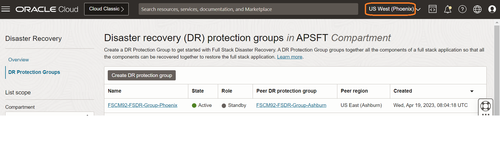
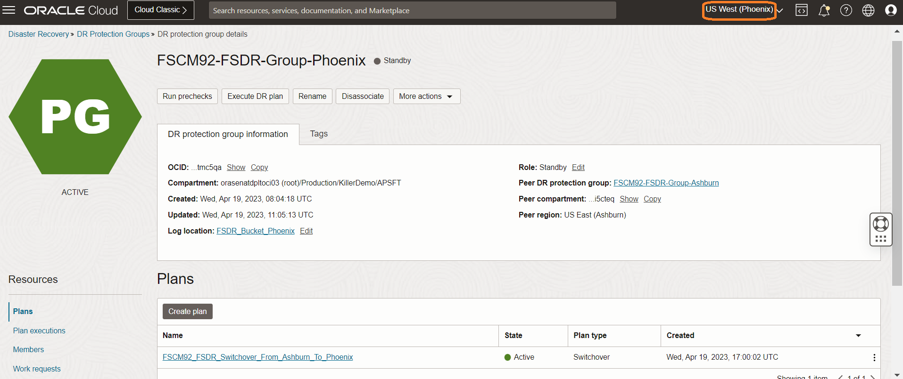
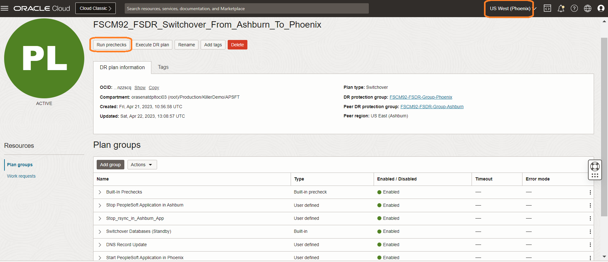
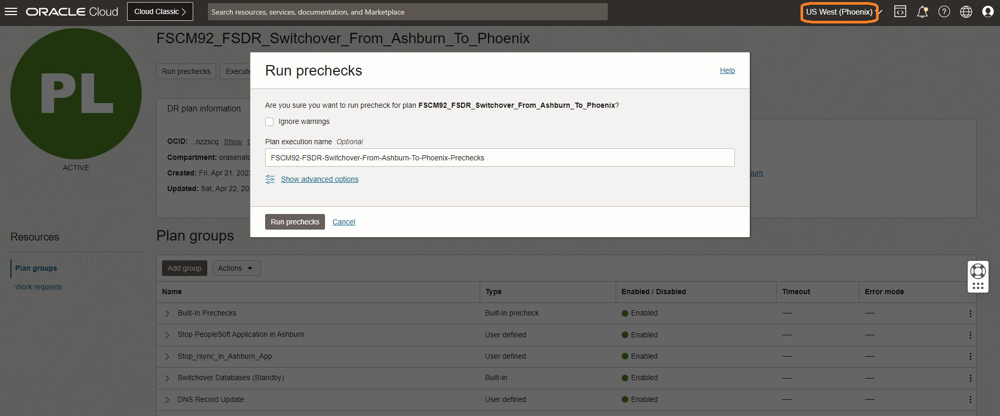

# Perform pre-checks for the DR Switchover Plan and Pre-check the MuShop Application

## Introduction

In this lab, we will execute **Run Prechecks** for the **mushop-app-switchover** switchover plan, which we have created in lab4. **Run Prechecks**
will execute all the **Built-in Prechecks** in parallel.

Execute **Run Prechecks**  will perform only the *pre-checks* and not the actual execution. Having the pre-checks completed successfully is essential as a pre-requisite for running the actual switchover plan.

Estimated Time: 10 Minutes

Watch the video below for a quick walkthrough of the lab.

[Perform prechecks and break MuShop app](videohub:1_i1toadew)

### Objectives

- Perform Run prechecks for the MuShop-app-switchover  plan
- Monitor the executed prechecks plan
- Verify the executed prechecks plan
- Verify the MuShop application and break the application

## Task 1: Perform Run prechecks for the mushop-app-switchover plan

1. Login into OCI Console with your provided Credentials. Select region as **Pheonix**.

  

2. Select Migration and Disaster Recovery from the Hamburger menu, then **Disaster Recovery** -> **DR Protection Groups**. Verify the region is **Phoenix**

  

3. You will land on the Disaster Recovery Protection group home page; make sure you have selected the Phoenix region.

  

4. Select the **mushop-phoenix** DRPG and select **mushop-app-switchover** plan

  

5. Navigate to the **Run prechecks** section, which will be right below the **mushop-app-switchover** plan

  

6. In the **Run prechecks** window, provide the Plan execution name as **mushop-app-switchover-prechecks** and hit **Run prechecks**

  

## Task 2: Monitor the executed prechecks plan

1. Navigate to **Plan executions** section under **Resources** and select the **mushop-app-switchover-prechecks** plan execution.Initially, it will show all the **Built-in Prechecks** as *Queued*

  

2. Refresh the page; within a few seconds, the **State** will change from *Queued* to *In Progress*.

  

3. All the **Built-in Prechecks**  steps will execute in parallel; you can monitor the various steps log. Navigate to the three dots section for the respective built-in step and click. You get the option to view the log and download the log. These logs are stored in the object storage bucket provided during the DRPG creation. You can monitor the Progress and download the log if necessary for troubleshooting.

   

## Task 3: Verify the executed prechecks plan

1. After 2-3 mins, **Built-in Prechecks**  will be completed successfully. You can verify the duration of each step, status, duration of entire prechecks, etc. *It is essential to have successful completion of pre-check execution*

      

Refer to the **Troubleshooting tips** section for known failures and correction actions.

## Task 4: Verify the MuShop application and break the application

1. Login into OCI Console with your provided Credentials. Select region as **Ashburn**.

  
  
2. Gather the Load Balancer public IP

  From the Hamburger menu, select **Networking**, then **Load Balancers**
  
     

 Gather the Public IP address of the Load Balancer

     

  Open a tab in your browser and verify the Mushop Application using the gathered public IP address. Play around the site and verify various cat products.

      

3. Let us break the MuShop Application to create an outage.

   Click the mushop-xxxxx load balancer details; in the resources section, select Listeners.

   

   

4. Select the edit option using the three dots symbol at the right end of the port 80 listeners, mushop-xxxxx-80

      

   Modify the listener port from 80 to 81 to break the application, and save changes. You will get work requests submitted and select close requests.

      
      
      

  Wait for a few seconds and refresh the browser tab of the MuShop application. You should see that the MuShop site can't be reached.  

      

We have created an outage to a working MuShop application; in the next lab, we will use the Full Stack DR service to initiate the Switchover of the Full Stack (App VM's/Database/Application Customization) from Ashburn to the Phoenix region.

   You may now **proceed to the next lab**.

## Troubleshooting tips

1. During the pre-check execution logs, if you messages like "Requests are being throttled for instance ocid1", retry the **Run prechecks** again

[ocid1.instance.oc1.iad.anuwcljt5h22avqcjswxs6tublhrz2qonyjmucpxlyjxplybldbpxz2jqkaq] -- Error returned by PutObject operation in ObjectStorage service.(409, Conflict, false) Server is busy. Requests are being throttled for instance ocid1.instance.oc1.iad.anuwcljt5h22avqcjswxs6tublhrz2qonyjmucpxlyjxplybldbpxz2jqkaq (opc-request-id: B7721980580148749787FE758C9440FC/3D8758622598943932D50842DCD7EAA1/143166BA790ECD35695B548600382010)

2. In case you see error **Error: Request failed with status code 500** while navigating the mushop website, reboot **both** compute VM's (mushop-xxxxx-0 and mushop-xxxx-1).
  
  Navigate to Compute from OCI Console, select the three dots in the respective compute instances and reboot the VMs.

     

  After a couple of minutes, refresh the browser and re-verify the app.

## Acknowledgements

- **Author** -  Suraj Ramesh, Principal Product Manager
- **Last Updated By/Date** -  Suraj Ramesh,September 2022
