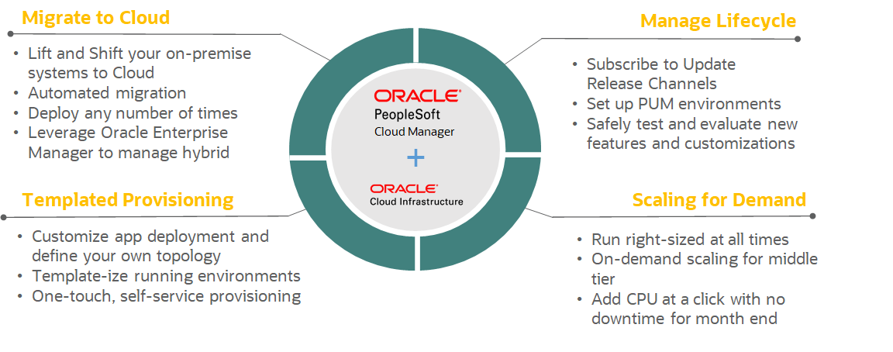

# Introduction

## About this Workshop ##

This workshop guides you through the steps to import PeopleSoft environments running on Oracle Cloud Infrastructure to PeopleSoft Cloud Manager.

After completing this workshop, you will have a better insight and understanding of importing PeopleSoft environments into PeopleSoft Cloud Manager for better lifecycle management of PeopleSoft environments.

Watch the video below for an Introduction To PeopleSoft Cloud Manager.

 [PeopleSoft Cloud Manager](youtube:msMcUr3fny4&t=4s:large)

The below image provides a high-level overview of PeopleSoft Cloud Manager benefits.

 

## PeopleSoft Cloud Manager overview ##

PeopleSoft Cloud Manager is a PeopleSoft application that runs on Oracle Cloud Infrastructure (OCI) to help accelerate adoption as well as to optimize the benefits of running PeopleSoft on Cloud. PeopleSoft Cloud Manager brings an unprecedented extent of automation to migrate your existing environment from on-premises and to rapidly clone and create new environments on the cloud tailored for specific functional use — such as development, customization, user acceptance testing, performance testing or production. PeopleSoft Cloud Manager comes with a built-in automated download manager and provides automated lifecycle operations such as PeopleTools only upgrade, PeopleTools update, setting up of selective adoption environments and automated self-update to the latest Cloud Manager Image. 

**Estimated Time**: 2 hours

**Notes:**

* The workshop is quite technical and in-depth. Please go slowly and without skipping any steps.
*  The IP addresses and URLs in this workbook's screenshots are dynamically generated, so they might not match what you use in the labs
* For security purposes, some sensitive text (such as IP addresses) may be redacted in the screenshots in this workbook.
* The user interface for the Oracle Cloud Infrastructure is constantly evolving. As a result, the screens depicted in this tutorial may not exactly coincide with the current release. This tutorial is routinely updated for functional changes to Oracle Cloud Infrastructure, at which time any differences in the user interface will be reconciled.

### Objectives

In this lab, you will:

* Import PeopleSoft Environments to PeopleSoft Cloud Manager
* Check PeopleSoft lifecycle management in PeopleSoft Cloud Manager

### Prerequisites

You will need the following to complete this workshop:

* A modern browser
* Running PeopleSoft Cloud Manager
* PeopleSoft Database Running on Database as a Service Platform
* PeopleSoft Application Server Domain Running on Linux 
* PeopleSoft Process Scheduler Server Domain Running on Linux 
* PeopleSoft Web Server Domain Running on Linux 
* PeopleSoft Process Scheduler Server Domain Running on Windows 
* PeopleSoft Elastic Search and Kibana Running on Linux 

## Appendix

**Terminology**

The following terms are commonly employed in PeopleSoft cloud operations and are used throughout our documentation:

* **PS_HOME** - PeopleSoft PeopleTools Home
* **PS_APP_HOME** - PeopleSoft Application Home
* **PS_CFG_HOME** - PeopleSoft Configuration Home
* **OCID** - Oracle Cloud ID
* **PDB** - Pluggable Database
* **ELK** - Elasticsearch, Logstash, Kibana
* **DbaaS** - Database as a service

## Acknowledgements
* **Author** - Vinay Shivanna, Principal Cloud Architect
* **Contributor** - Vinay Shivanna, Principal Cloud Architect
* **Last Updated By/Date** - Vinay Shivanna, Principal Cloud Architect, March 2023

