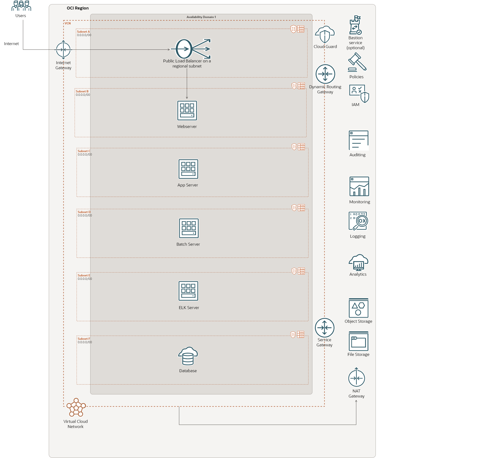

# PeopleSoft Environment Details

## PeopleSoft Environment Architecture

Below is the architecture of PeopleSoft environment running on Oracle Cloud Infrastructure(OCI) which will be imported into PeopleSoft Cloud Manager in this workshop.

## PeopleSoft environment details are below.

PeopleSoft Application -HCM 9.2.45
PeopleTools - 8.60.03
Database - 19.17.0.0.0
Oracle WebLogic - 14.1.1
Tuxedo - 12.2.2.0.0
Elastic Search - 7.10.0

## PeopleSoft Environment Infrastructure details are below.

**PeopleSoft Component** | **Operating System**
------------------------ | --------------------
Application Server | Oracle Enterprise Linux 7
Process Scheduler Server | Oracle Enterprise Linux 7
Web Server | Oracle Enterprise Linux 7
Database | Oracle Enterprise Linux 7
Elastic Search | Oracle Enterprise Linux 7

## Acknowledgements
* **Author** - Vinay Shivanna, Principal Cloud Architect
* **Contributor** - Vinay Shivanna, Principal Cloud Architect
* **Last Updated By/Date** - Vinay Shivanna, Principal Cloud Architect, March 2023

