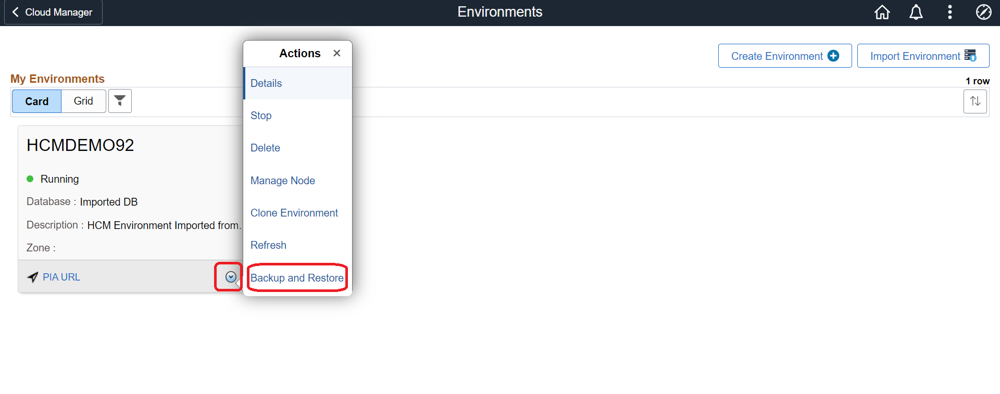
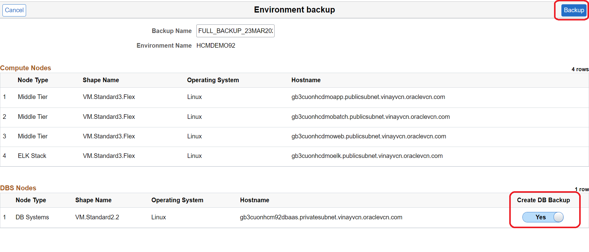
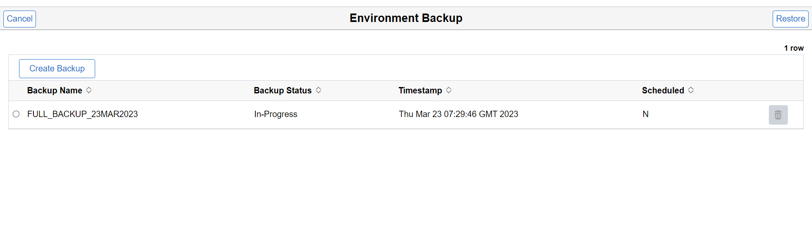
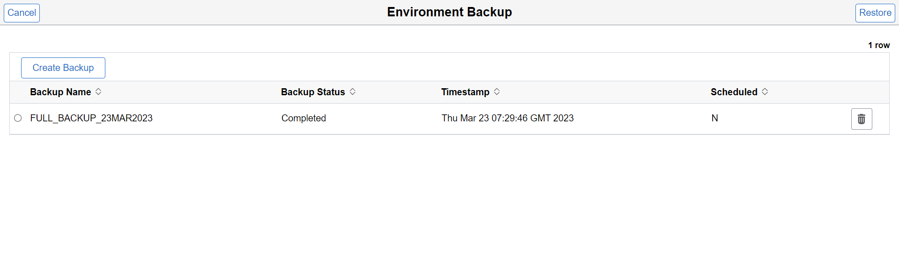

# Backup Imported PeopleSoft Environment

## Introduction

In this lab, you will backup the imported PeopleSoft Environment.

## Task 1: Backup PeopleSoft Environment

1. Login to PeopleSoft Cloud Manager and click on Environments tile.

2. Click on Action drop down and click on Backup and Restore.

3. Enter Backup Name and make sure Create DB Backup is enabled. Click on Backup to start the backup process.

Backup of environment will be in progress.

4. Backup of the imported PeopleSoft Environment is completed.

Please refer to below **PeopleSoft Cloud Manager On OCI** workshop to learn more on lifecycle managment such as Patching an environment, Upgrading an environment, cloning an environment, refreshing an environment and selective adoption of PUM patching.

https://apexapps.oracle.com/pls/apex/r/dbpm/livelabs/view-workshop?wid=716&clear=RR,180&session=108710964343427
    
## Summary

In this lab, you have taken a full backup of the imported PeopleSoft Environment in PeopleSoft Cloud Manager.

You may now **proceed to the next lab.**

## Acknowledgements
* **Author** - Vinay Shivanna, Principal Cloud Architect
* **Contributor** - Vinay Shivanna, Principal Cloud Architect
* **Last Updated By/Date** - Vinay Shivanna, Principal Cloud Architect, March 2023

