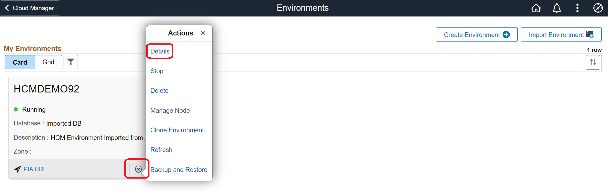
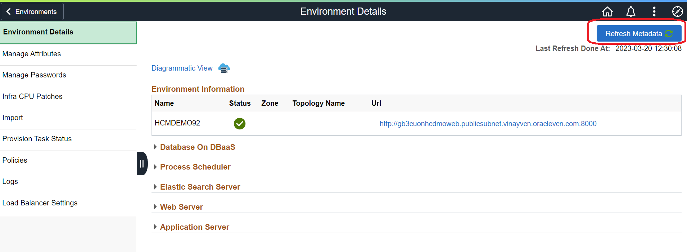
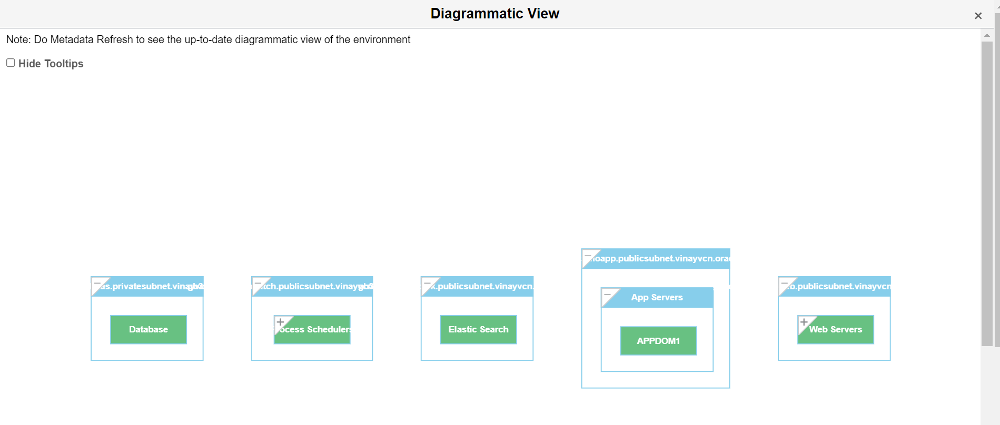

# Review Imported PeopleSoft Environment in PeopleSoft Cloud Manager

## Introduction

You will now review the status of imported PeopleSoft environment in PeopleSoft Cloud Manager.

**Estimated Time**: 15 minutes

### Objectives

* In this lab, you will review the imported PeopleSoft environment in PeopleSoft Cloud Manager.

## Task 1:  Review Environment Details

1. Login to PeopleSoft Cloud Manager and click on Environments tile.

    

 Click on the imported PeopleSoft Environment (in this workshop it is HCMDEMO92) environment action drop down button and click on Details.

   

2. Click on Refresh Metadata to refresh the OCI data.

    

3. Click on Diagrammatic View to view the architecture of imported PeopleSoft environment.

    

 Diagrammatic View of the PeopleSoft Environment will look like below.

   

In this lab, you have reviewed imported PeopleSoft Environment in PeopleSoft Cloud Manager.

You may now **proceed to the next lab.**

## Acknowledgements
* **Author** - Vinay Shivanna, Principal Cloud Architect
* **Contributor** - Vinay Shivanna, Principal Cloud Architect
* **Last Updated By/Date** - Vinay Shivanna, Principal Cloud Architect, March 2023

