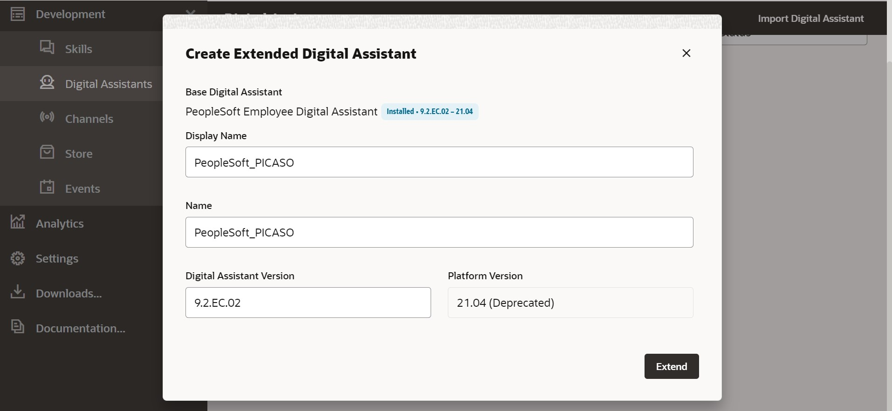

# Set Up OCI for Oracle Digital Assistant

## Introduction

In this lab, we'll provision the Oracle Digital Assistant from Oracle Cloud Infrastructure services utilizing the freshly created OCI Trial tenancy.

Estimated Time: 30 minutes

### Objectives

To set up the Oracle Digital Assistant on the OCI tenancy, you will:
*   Provision Oracle Digital Assistant from OCI services
*   Deploy PeopleSoft PICASO from Oracle Digital Store
*   Clone and create a new digital assistant
*   Create the channel for the skills

### Prerequisites

* A user with access to provision & manage Core OCI services like Oracle Digital Assistant

## Task 1: Provision Oracle Digital Assistant from OCI services

In this part of the lab, we begin with provision of Oracle Digital Assistant or ODA on OCI.

When your tenancy is provisioned, a root compartment is created for you. Your root compartment holds ***all*** of your cloud resources

1.  If you haven't already, log into your OCI tenancy by clicking the button below. Using Ashburn as an example, go to https://console.us-ashburn-1.oraclecloud.com/.

2.  On the Oracle Cloud Infrastructure Console Home page, click the Navigation Menu in the upper-left corner, select Analytics & AI, and then select Digital Assistant.

  

3.  On the OCI Digital Assistants page,  click on the create digital assistant instance button

    
    

4.	Select the  compartment where you want to create the digital assistant, provide a name,  description for the digital assistant and select development as the shape and click create.

  
  

5.  The Oracle Digital Assistant is being provisioned and below screen shows the current status and the final status of the ODA provision.

  

     The Oracle Digital Assistant is provisioned
  

## Task 2:  Deploy PeopleSoft PICASO from Oracle Digital Store

In this part of the lab, we begin by deploying PeopleSoft PICASO from the Oracle Digital Assistant Store. 

1.  From the previous task, once the digital assistant is provisioned, click on the service console and launch the Oracle Digital Assistant service homepage.

  

    On the Oracle Digital Assistants Service Console Home page, click the Navigation Menu in the upper-left corner, select development, and then select the skill store option

  

2.  On the Digital Skill Store page, search with PICASO

  

    Click the three dots at the bottom of the PICASO skill and perform the pull
  
  
    
    Once the pull request is completed, the PICASO digital assistant will be added to your list of digital assistants.
  

## Task 3:  Extend and create a new digital assistant

In this lab, we start by extending the existing PICASO digital assistant and building a new digital assistant specifically for this task.

1.  From the previous task, once the PICASO digital assistant pull request is completed, navigate to the digital assistants' tab under development and click on the extend to begin the cloning process.

  

    From the dialog box, click extend to begin the process

  

    PeopleSoft PICASO digital assistant is created
  

## Task 4:  Create the channel for the skills

In this part of the lab, we begin with creating a Web channel for the Skills and routing this to the extended PeopleSoft PICASO digital assistants'

1.  On the Oracle Digital Assistants Service Console Home page, click the Navigation Menu in the upper-left corner, select development, and then select the Channels option and create a new channel

  

    From the channel create dialog box, enter the data as shown below and begin with the create process

  

  

    From the route to option drop down, select the cloned PeopleSoft PICASO and continue
  

  
    Client authentication is disabled in the above screen

  **Important:** To configure PeopleSoft, take note of the channel ID and ODA URL (copy only oda-xxx.digitalassistant.oci.oraclecloud.com, not the complete url and not even https://) from the above page.
    
     

## Summary

In this lab, Oracle Digital assistant was provisioned, cloned the existing PeopleSoft PICASO assistant, and created a Web channel for interaction with PeopleSoft.

You may now **proceed to the next lab.**

## Acknowledgements
* **Authors** - Deepak Kumar M, Principal Cloud Architect
* **Contributors** - Deepak Kumar M, Principal Cloud Architect
* **Last Updated By/Date** - Deepak Kumar M, Principal Cloud Architect, March 2023

