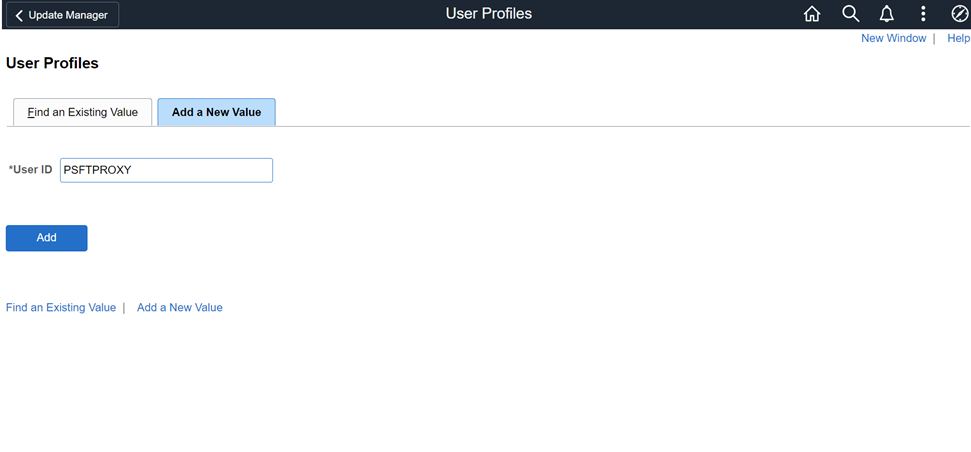
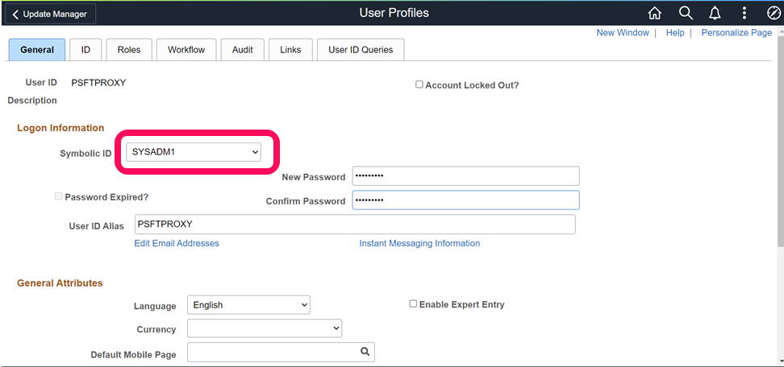
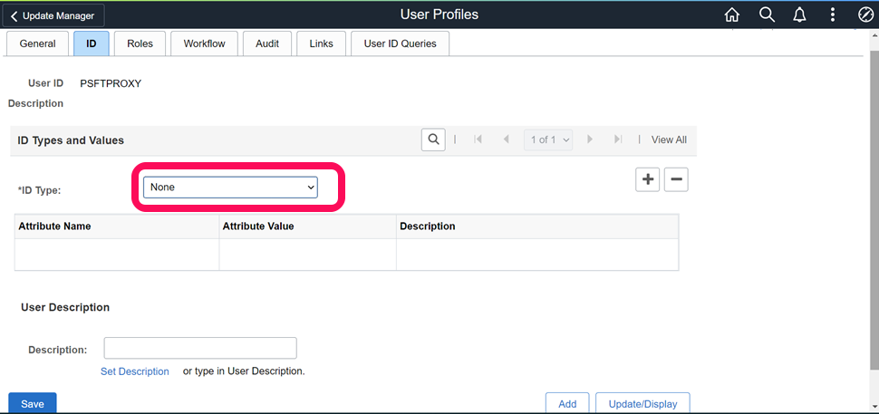
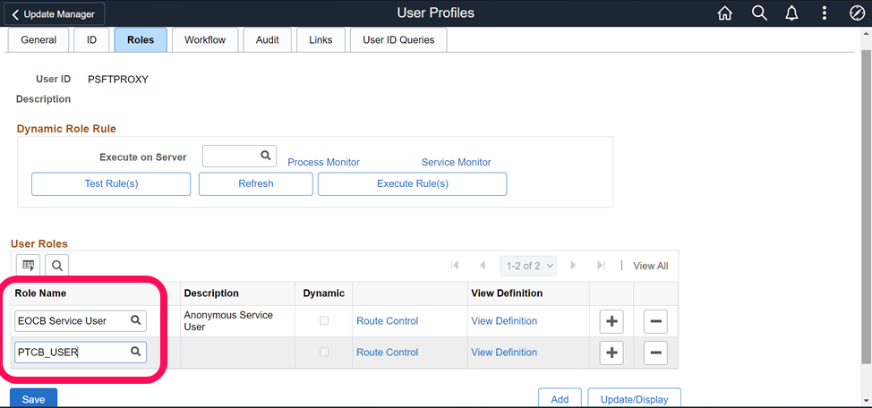
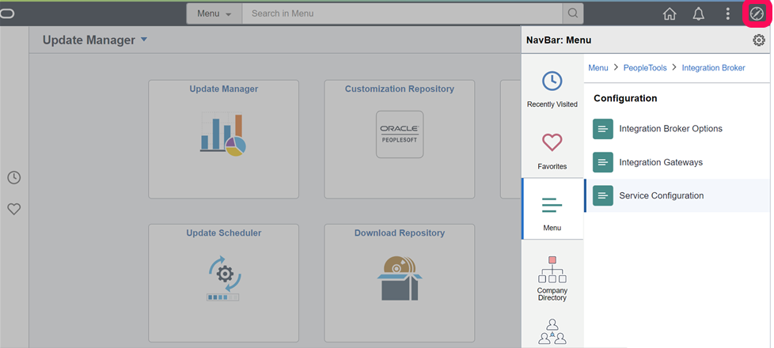
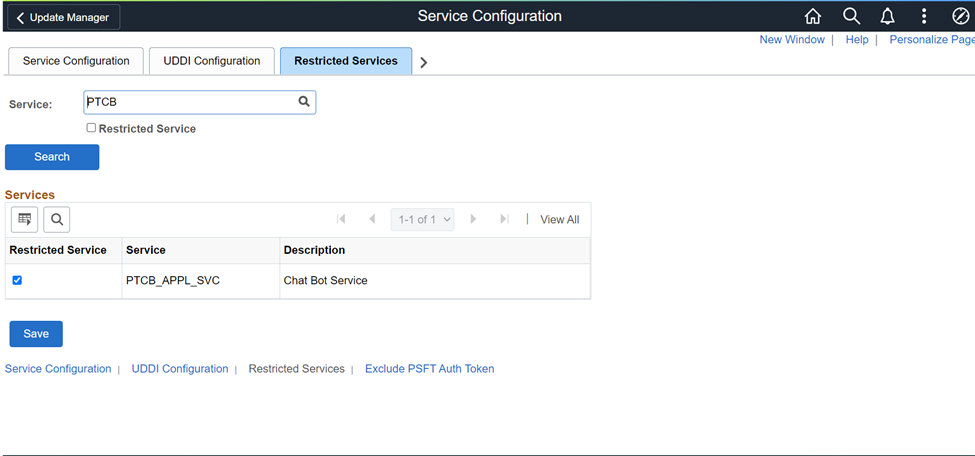
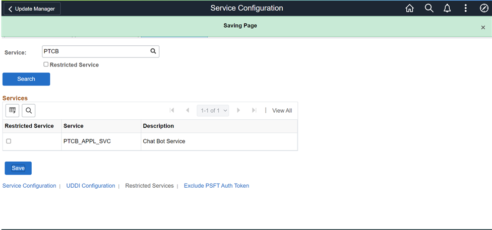

# Configure PeopleSoft for Oracle Digital Assistant

## Introduction

In this lab, you will configure PeopleSoft for integration with Oracle Digital Assistant to run PICASO chatbot.

Estimated Time: 1 hour

### Objectives

To configure PeopleSoft with Oracle Digital Assistant, you will:
*  Create a PROXY User
*  Uncheck Restricted Services
*  Disable SSL Check for Service Operation
*  Update Application Services Security
*  Global Chatbot Configuration

### Prerequisites
*  A PeopleSoft PIA Admin user to create and configure chatbot on PeopleSoft side
.

### Assumptions:
*  PeopleSoft Application Service is accessible on the open internet for the ODA Cloud instance to consume.
*  PeopleSoft holds a certificate signed by a valid CA and not a self-signed certificate
*  Integration Broker is configured, up and running
*  For the ease of documentation, we have taken “HCM” as the PeopleSoft application. However it can be extended for other pillars as well.
*  A user to authenticate PeopleSoft web services “PSFTPROXY” is created. Administrator may use appropriate user id and password based on your preference.

## Task 1:  Create a Proxy User

1. Login to PeopleSoft as an admin user and click on the navigation at the top right corner and then go to PeopleTools >> Security >> User Profiles

  

   Add a new user profile - PSFTPROXY, click on the Add button

  

   Select the Symbolic ID as SYSADM1, type your new password and confirm the password.

  
   
   On the ID tab, Update the ID type as "None"
  

   On the Roles tab, Update it with below roles and click save
  

## Task 2: Uncheck Restricted Services

1. Login to PeopleSoft as an admin user and click on the navigation at the top right corner and then go to PeopleTools >> Integration Broker >> Service Configuration. 

  

  Click on the Restricted services tab and search with "PTCB"
  
  

  Uncheck Restricted services  and save
  

## Task 3: Disable SSL Check for Service Operation

## Task 4: Update Application Services Security

## Task 5: Global Chatbot Configuration

## Summary

In this lab, you launched an instance of PeopleSoft from the OCI marketplace, deployed the PeopleSoft application, and then accessed the PeopleSoft Application.

You may now **proceed to the next lab.**

## Acknowledgements
* **Authors** - Deepak Kumar M, Principal Cloud Architect
* **Contributors** - Deepak Kumar M, Principal Cloud Architect
* **Last Updated By/Date** - Deepak Kumar M, Principal Cloud Architect, October 2022

