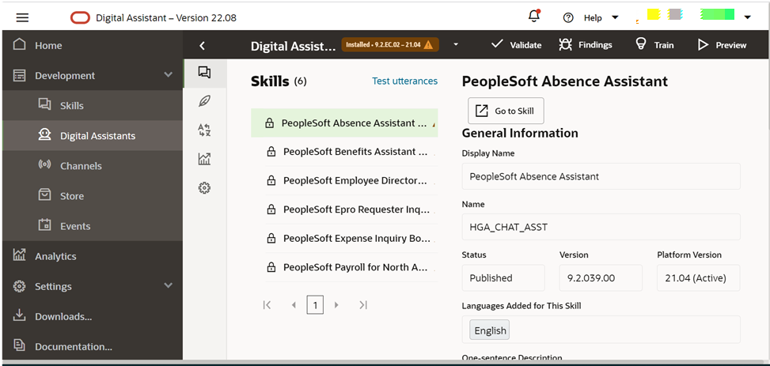
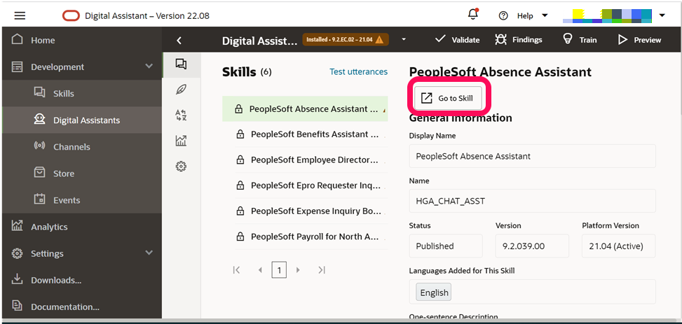
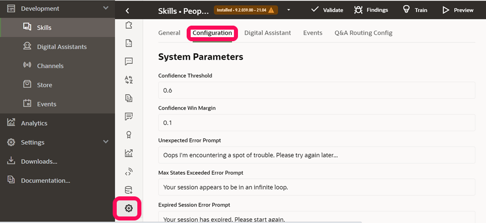
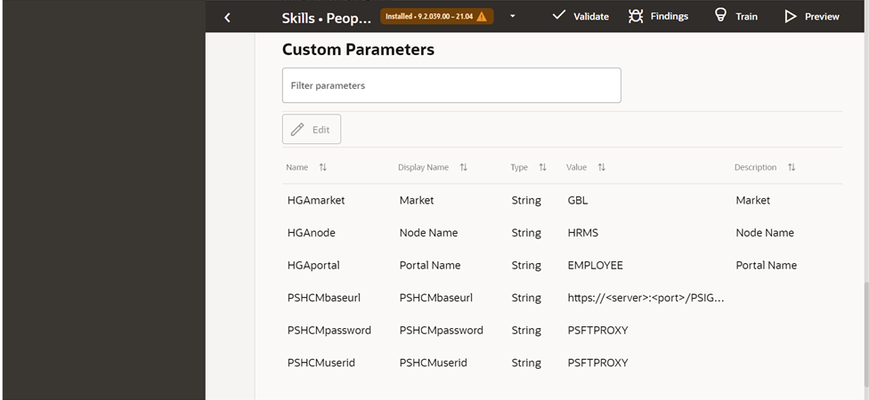

# Update Skill Configuration in Oracle Digital Assistant

## Introduction

In this lab, you will update the skill configuration in Oracle Digital Assistant using the PeopleSoft application web service URL
Estimated Time: 15 minutes


### Objectives

*  Update the skill configuration for all the deployed PeopleSoft skills in Oracle Digital Assistant using the PeopleSoft application web service URL


### Prerequisites

*  A user with access to provision & manage Core OCI services like Oracle Digital Assistant
*  A PeopleSoft PIA Admin user to create and configure chatbot on PeopleSoft side

## Task 1: Update the skill configuration in ODA

1.  On the Oracle Digital Assistants Service Console Home page, click the Navigation Menu in the upper-left corner, select development, and then select the Digital Assistant option and open the PeopleSoft PICASO cloned digital assistant

  

   Click on Go to Skill and navigate to the PeopleSoft Absence Assistant Skill
  

   Click settings on the Absence skills page and click on the configurations tab

   
   
   Scroll to the bottom of the screen, click on edit and set the following values for:

  

   PSHCMbaseurl: It denotes the base url of application service, this need to be replaced with the Masked REST Base URL from Lab 2, Task3. Also, ODA cannot resolve the hostname, so IP address to be used in place of servername. Below is an example.

      ```
      <copy>
    http://IP address:port/PSIGW/RESTListeningConnector/HCM_EMHBVUSZIWE/PTCB_APPL_SVC.v1 
      </copy>
      ```
   PSHCMuserid: Set the peoplesoft proxy user who has access to invoke application services. To start with, Let us leave it, as it is (PSFTPROXY).

   PSHCMpassword: It denotes the password for Proxy user. To start with, Let us leave it, as it is (PSFTPROXY).If you have created PSFTPROXY user with a different password, enter the new password in PSHCMpassword field

   Now go back and repeat the above steps for configuration of all the other skills.


    
## Summary

In this lab, you have updated the skill configuration in Oracle Digital Assistant using the PeopleSoft application web service URL

You may now **proceed to the next lab.**

## Acknowledgements
* **Authors** - Deepak Kumar M, Principal Cloud Architect
* **Contributors** - Deepak Kumar M, Principal Cloud Architect
* **Last Updated By/Date** - Deepak Kumar M, Principal Cloud Architect, Feb 2023


