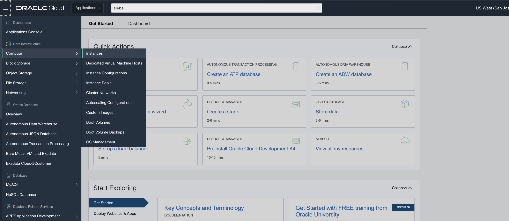
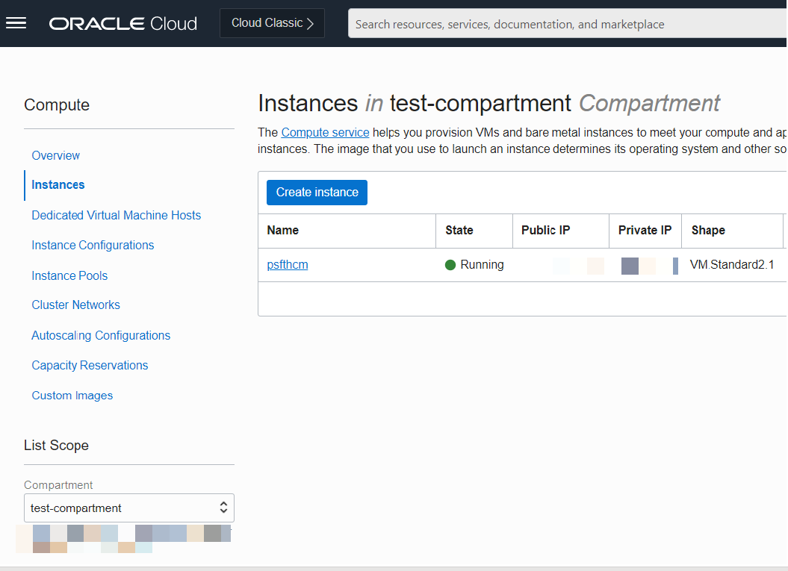
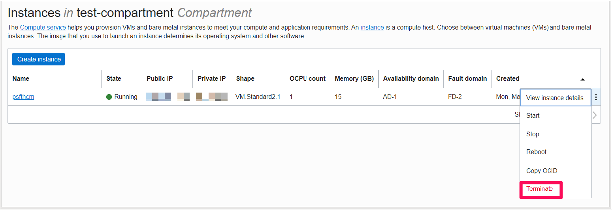
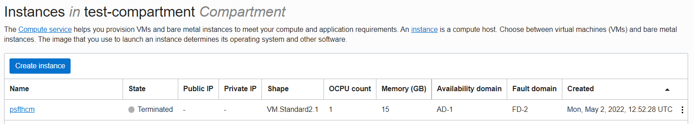

# Test the PeopleSoft PICASO chatbot

## Introduction
In this lab, you will test the PeopleSoft PICASO chatbot configured using Oracle Digital Assistant

Estimated Time: 15 minutes

### Objectives
* Test the PeopleSoft PICASO chatbot

### Prerequisites
*  A PeopleSoft PIA Admin user to create and configure chatbot on PeopleSoft side

## Task 1: Delete the PeopleSoft virtual machine

1. Navigate to the OCI home page.

2. Use the dropdown menu located in the upper left-hand corner of the screen and select **Compute** then **Instances**.

    

3. You are now on the **Instances** page. Make sure that you have the compartment you created in the "Setup" lab selected.

    

4.   You should now be able to see the PeopleSoft instance you created previously.

    Now click on the three dots to the right of your PeopleSoft instance and then select **Terminate**.

    

    Once the image has finished terminating, you will see its state change to terminated.

    

## Summary

In this lab, you tested the PeopleSoft PICASO chatbot configured using Oracle Digital Assistant

## Acknowledgements
* **Authors** - Deepak Kumar M, Principal Cloud Architect
* **Contributors** - Deepak Kumar M, Principal Cloud Architect
* **Last Updated By/Date** - Deepak Kumar M, Principal Cloud Architect, October 2022

