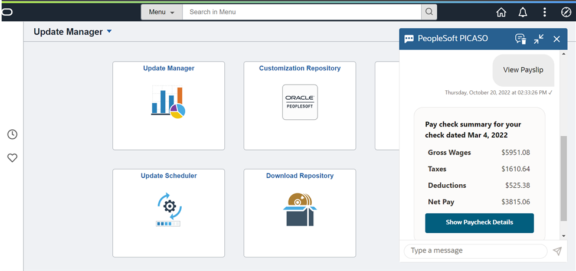

# Test the PeopleSoft PICASO chatbot

## Introduction
In this lab, you will test the PeopleSoft PICASO chatbot configured using Oracle Digital Assistant

Estimated Time: 15 minutes

### Objectives
* Test the PeopleSoft PICASO chatbot

### Prerequisites
*  A PeopleSoft PIA Admin user to create and configure chatbot on PeopleSoft side

## Task 1: Test the PeopleSoft PICASO chatbot

1. On the PeopleSoft Homepage, click on the PICASO chatbot

    

    PeopleSoft PICASO screen pops up with a welcome note for the user

     

    Let's check Absence Assistant
    Either select the options shown for Absence or type in any absence related query

     
    
    How many leaves will I accrue
     

    Show me the absence balance
     
 
    Now moving to Benefits Assistant

    Click on any of the benefits options to check the status
     

    Show my Dependents/Beneficiaries
     

    Moving on to Employee Directory

    Either select the options shown for Employee or type in, in this case we search with " who is my boss"

     

    Moving on to Payroll Asisstant
    
    Either select the options shown for Payroll or type in show me my payslip

     
     

    
## Summary

In this lab, you tested the PeopleSoft PICASO chatbot configured using Oracle Digital Assistant

## Acknowledgements
* **Authors** - Deepak Kumar M, Principal Cloud Architect
* **Contributors** - Deepak Kumar M, Principal Cloud Architect
* **Last Updated By/Date** - Deepak Kumar M, Principal Cloud Architect, October 2022

