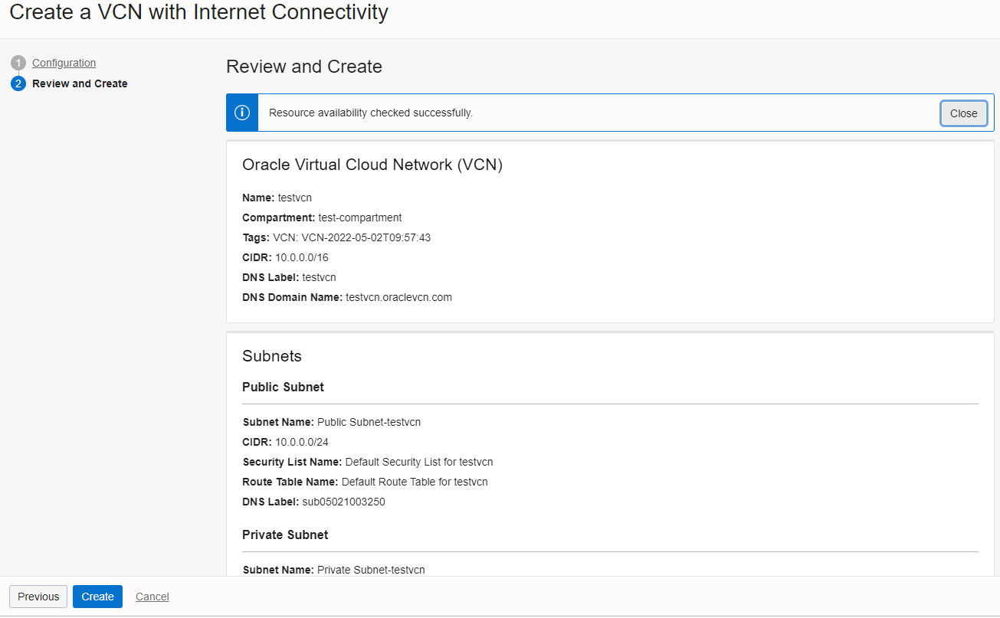
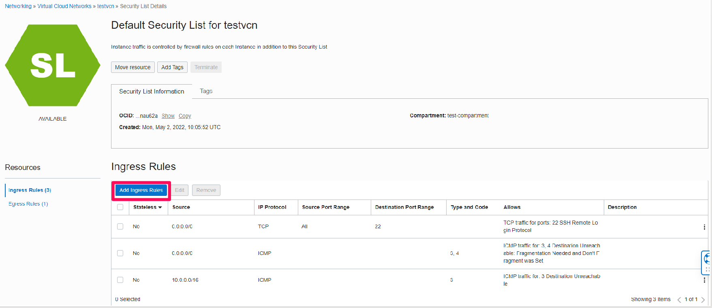

# Set Up OCI for PeopleSoft deployment

## Introduction

In this lab, the recently provisioned OCI Trial tenancy will be set up for the PeopleSoft Application.

Estimated Time: 15 minutes

### Objectives

To set up the OCI tenancy, in this lab, you will:
*   Create a Sub-Compartment
*   Create a Virtual Cloud Network (VCN)
*   Establish Security List Rules to allow access to our PeopleSoft Instance

### Prerequisites
* A user with 'manage' access to Networking and Compute, compartment, and marketplace access
* SSH key

## Task 1: Create a sub-compartment

In this part of the lab, we create a sub-compartment to organize the resources we will create.

Compartments are the primary building blocks you use to organize your cloud resources. You use compartments to organize and isolate your resources to make it easier to manage and secure access to them.

When your tenancy is provisioned, a root compartment is created for you. Your root compartment holds ***all*** of your cloud resources

1.  Please log in to your OCI tenancy, if you are not already signed in. Example for Ashburn location - https://console.us-ashburn-1.oraclecloud.com/

2.  On the Oracle Cloud Infrastructure Console Home page, click the Navigation Menu in the upper-left corner, select Identity & Security, and then select the Compartments option.

  

3.  If you only have a root compartment, you can click the Create Compartment button

    If you have a development compartment click on its name to open it. Inside there we will click on the create compartment button and create a child as shown

    

4.	Choose a Name test compartment, fill out the form and click the ***Create Compartment*** button

  **Note:** that the parent compartment should be either in your, root compartment or your root compartment itself

  

  Now you can click the Oracle icon at the top of your screen to go to the home page and move on to the next step

  

## Task 2:  Create a Virtual Cloud Network (VCN)

To create a VCN on Oracle Cloud Infrastructure:

1. On the Oracle Cloud Infrastructure Console Home page, click the Navigation Menu in the upper-left corner, select Networking, and then select the Virtual Cloud Networks option

  

2.  Select the newly created compartment and then click Start VCN Wizard

  

2.  Select VCN with Internet Connectivity, and then click Start VCN Wizard

  

3. In this window, testvcn is the name of the VCN network to be created, and leave the rest of the following fields with the information shown below:

    **VCN NAME:**

        testvcn     (or any other unique name for the VCN)

    **COMPARTMENT:**

        test-compartment        (or any other compartment previously created)

    **VCN CIDR BLOCK:**

        10.0.0.0/16

    **PUBLIC SUBNET CIDR BLOCK:**

        10.0.2.0/24

    **PRIVATE SUBNET CIDR BLOCK:**

        10.0.1.0/24

    **USE DNS HOSTNAMES IN THIS VCN:**

        Make sure this is checked

    

    Then, scroll down to the bottom and click the ***Next*** button.

4.	On the “Review and Create” page, click on the create button.

    

5. On the “Created Virtual Cloud Network” page wait until you see ***Virtual Cloud Network creation complete*** at the top of the list

    **NOTE:** If any of the necessary resources fail to be created, simply click the retry button and it should correct the issue immediately

    

    Then click on the View Virtual Cloud Network Button shown

    

## Task 3:  Establish security list rules for PeopleSoft

With the VCN in place, define the open inbound and outbound ports that will be available to instances created within the VCN

1.  From the details page of the testvcn, under the ***Resources*** section in the left pane, select ***Security Lists***
  

2.  In the Security Lists section, click the Default ***Security List*** for ***testvcn*** link  
  

3.  On Default Security List, under Resources, click the Add Ingress Rules button.
  
  

4.   Within the interface, click the + ***Additional Ingress Rules*** button and add a rule with the following criteria

        | Stateless | Source Type |	Source CIDR | IP Protocol | Source Port Range |	Destination Port |
        | --- | --- | --- | --- | --- | --- |
        
        | Unchecked | CIDR|	0.0.0.0/0 |	TCP | All |	8000 |

     Click the ***Add Ingress Rules***  blue button when complete

     

    After you have created the  new rule, your security list should look like this

     

These Ingress Rules will be sufficient to allow the network traffic required for the PeopleSoft environment.

## Summary

In this lab, OCI has been set up for the networking required to be able to access the PeopleSoft environment that will be created in the next lab

You may now **proceed to the next lab.**

## Acknowledgements
* **Authors** - Deepak Kumar M, Principal Cloud Architect
* **Contributors** - Deepak Kumar M, Principal Cloud Architect
* **Last Updated By/Date** - Deepak Kumar M, Principal Cloud Architect, April 2022

