# Provision the PeopleSoft Application

## Introduction

In this lab, you will create your PeopleSoft application by provisioning the application from the OCI  Marketplace image for PeopleSoft.

Estimated Time: 1 hour 30 minutes

### Objectives

To deploy the PeopleSoft Instance, in this lab, you will:
*   Launch & deploy an instance of PeopleSoft from Marketplace
*   Access PeopleSoft instance

### Prerequisites
* A user with 'manage' access to Networking and Compute, compartment, and marketplace access
* SSH key
* VCN setup from the previous lab

## Task 1:  Launch PeopleSoft instance from OCI marketplace

1. Make sure you are on the Oracle Cloud Infrastructure console

2. Navigate to ***Oracle Cloud Infrastructure Marketplace*** by using the dropdown menu on the left side of your screen and clicking the ***Marketplace*** and then all applications.

  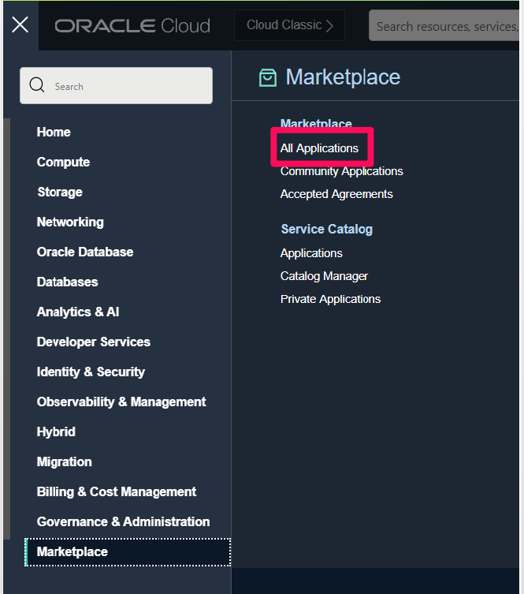

3. In the search bar type in PeopleSoft and hit search. There are 6 PeopleSoft DEMO environments that can be installed
   
    * PeopleSoft HCM
    * PeopleSoft FSCM
    * PeopleSoft ELM
    * PeopleSoft CRM
    * PeopleSoft Campus Solutions
    * PeopleSoft Interaction Hub

  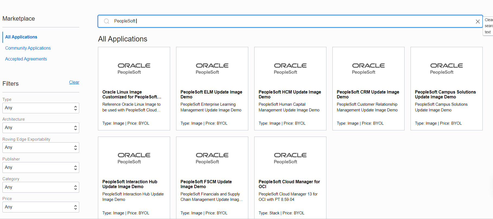


4. On the instance page, select the PeopleSoft HCM Update Image Demo version and then select the compartment you made earlier. Then click ***Launch Instance***

  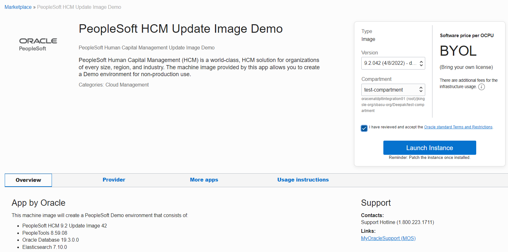

5. On the Create Compute Instance page you will need to fill in additional info for your Instance

    a.  **Name:** You can name it whatever you like, such as "psfthcm"

    b.  **Select compartment:** Select the compartment that you created earlier

    c.  **Placement:** You can leave this as it is by default for this Lab

    d.   For the next **Configure networking** section you will choose the ***SELECT EXISTING VIRTUAL CLOUD NETWORK*** option and choose the ***SELECT EXISTING SUBNET*** option before selecting the Network and Subnet you created in the previous lab

    Make sure that ***ASSIGN A PUBLIC IP ADDRESS*** is also selected since we will use this to deploy our PeopleSoft application

    e. **Add SSH keys:** Here you will need to select the ssh key you created earlier. You can either use the

    *   ***CHOOSE PUBLIC KEY FILES*** and open the public key file you made if you know its location

        or you can use the

    *   ***PASTE PUBLIC KEYS*** and paste the data within the key file if you have the file open

    

    

    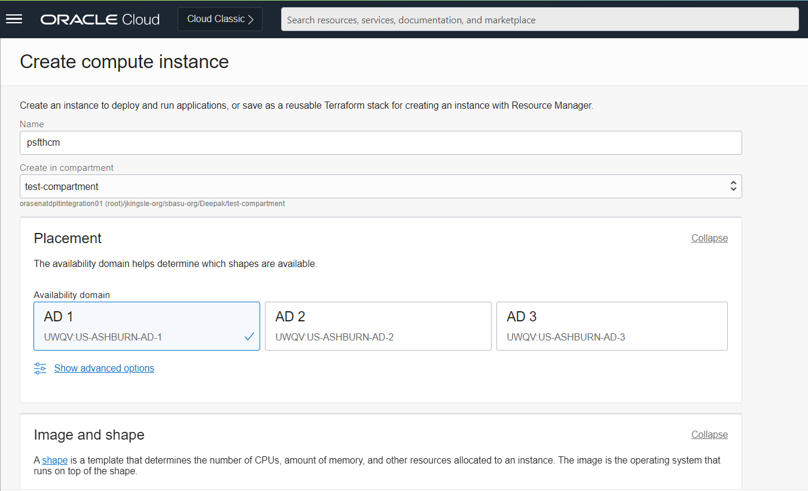
    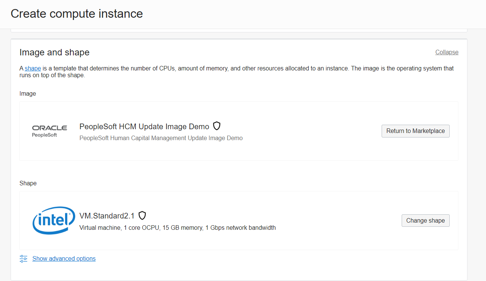
    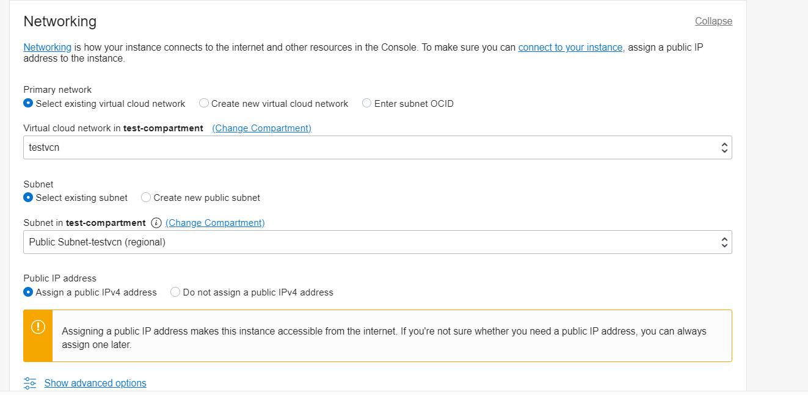
   
    f.  **Configure boot volume:** change the size from default to 300GB

    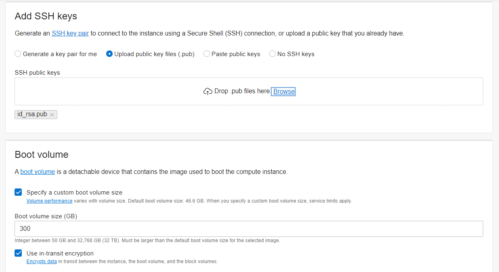

    g. Click Show advanced options, on the management tab, select the option Paste cloud-init script, and enter the configuration information using the JSON format in these examples.

             
          <copy>{
          "connect_pwd":  "password",
          "access_pwd":  "password",
          "admin_pwd":  "password",
          "weblogic_admin_pwd":  "password",
          "webprofile_user_pwd":  "password",
          "gw_user_pwd":  "password",
          "domain_conn_pwd":  "password",
          "opr_pwd": "password"
          }</copy
          
    
    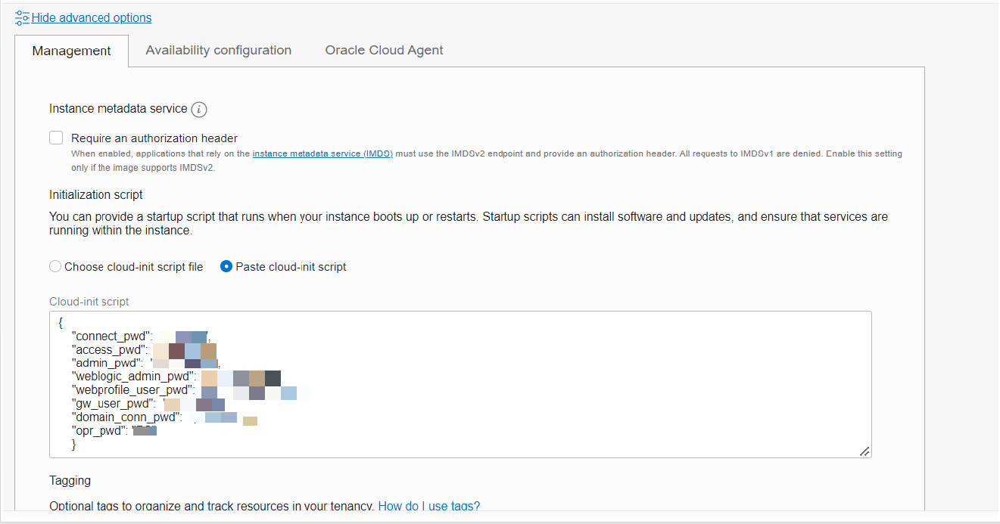
    h. Now review your settings and click ***Create*** at the bottom of the page when you are ready
6. Now you will be taken to the Instance Page, and will see that your newly created instance is provisioning

     Once you see the small orange box change to green, your instance will have provisioned successfully and now you can move onto the next step in the Lab

     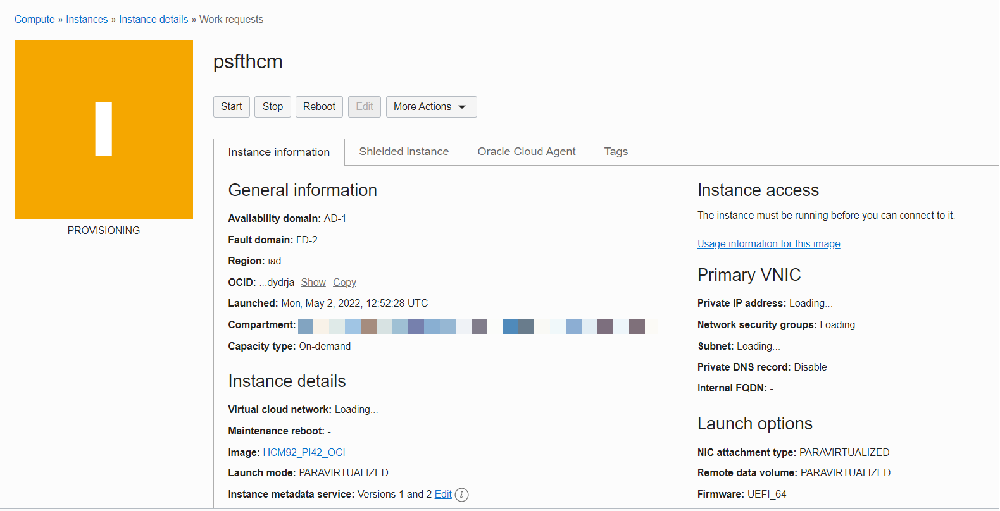
     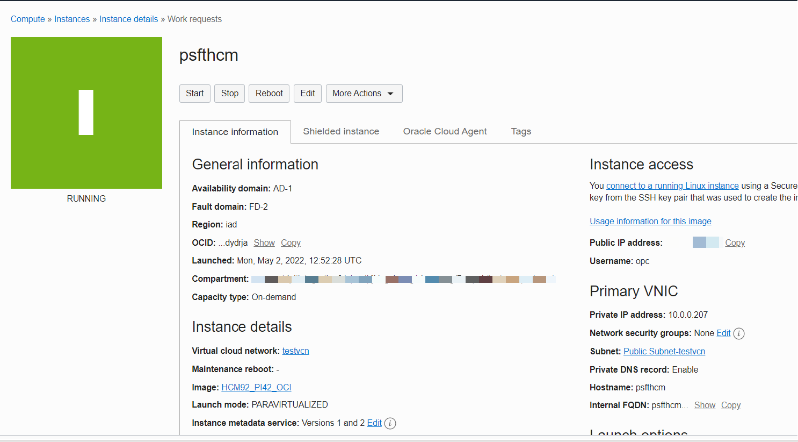


## Task 2: Access the PeopleSoft Application 


1. The PeopleSoft OCI marketplace image can be accessed by logging in with the below URL and port number. 

       ```
       http://<fully-qualified-hostname>:8000/
       ```


  **NOTE:** Before you access the fully qualified hostname or fully qualified domain name (FQDN), it is necessary to add the FQDN or fully qualified hostname of the compute VM in the etc hosts file
  
  For example, if you are a Windows user or MAC user, you can navigate to the below path on the system as an administrator and modify the hosts file with the below entries.
   
    * Windows hosts file path - C:\Windows\System32\drivers\etc\hosts
    * Mac hosts file path - /private/etc/hosts


         ```
        IP address    fully-qualified-hostname
         ```
        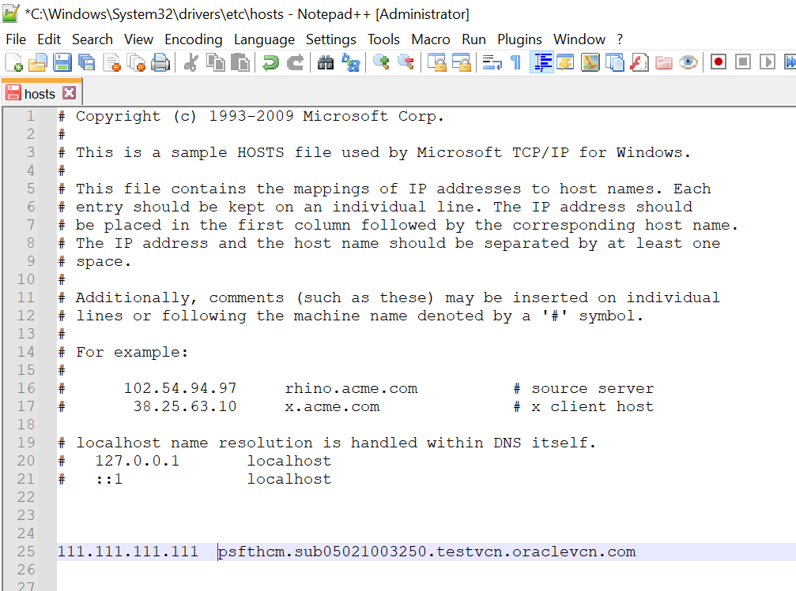
  
  The URL you will need to type into your browser's search bar should look like this:


      http://psfthcm.sub05021003250.testvcn.oraclevcn.com:8000/

    

    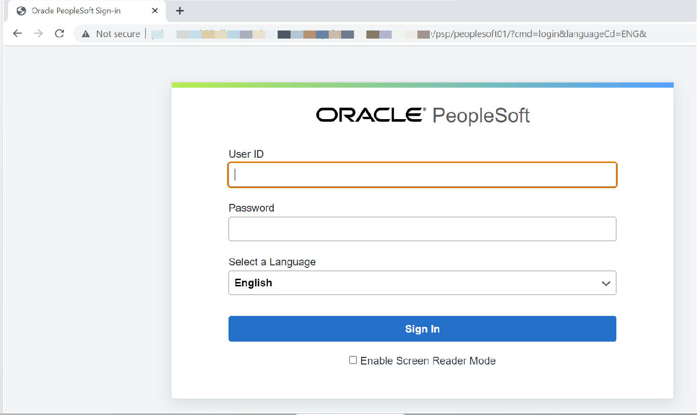

    The login user-id for PeopleSoft HCM application is PS; the password was supplied during the cloud-init script for opr_pwd

    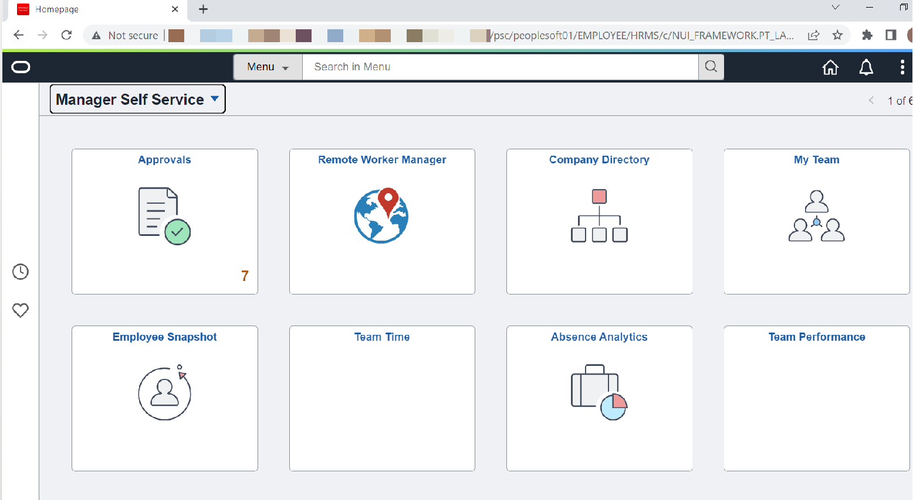
    

## Summary

In this lab, you launched an instance of PeopleSoft from the OCI marketplace, deployed the PeopleSoft application, and then accessed the PeopleSoft Application.

You may now **proceed to the next lab.**


## Acknowledgements
* **Authors** - Deepak Kumar M, Principal Cloud Architect
* **Contributors** - Deepak Kumar M, Principal Cloud Architect
* **Last Updated By/Date** - Deepak Kumar M, Principal Cloud Architect, April 2022


