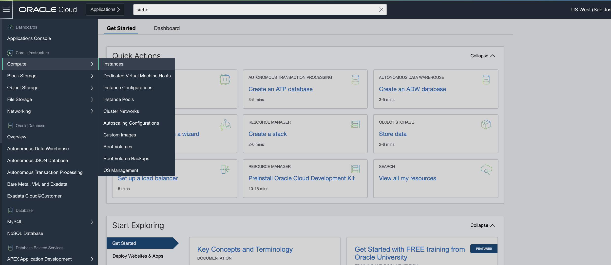
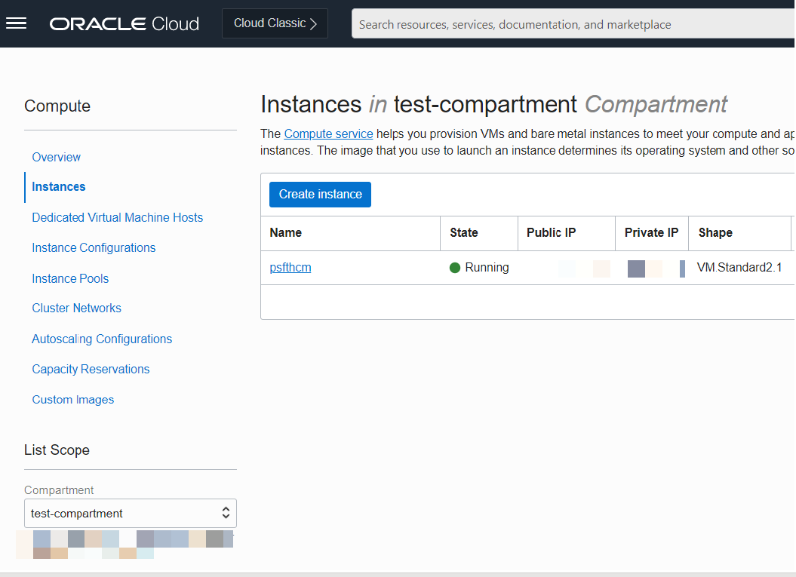
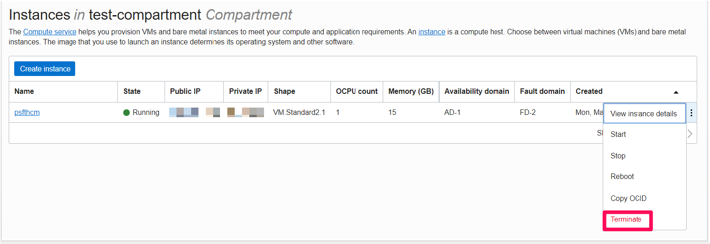
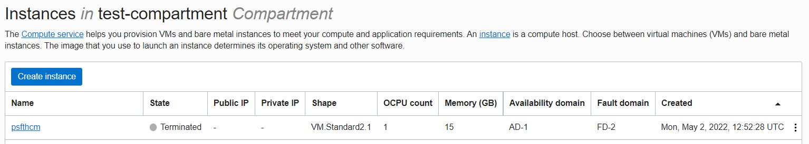
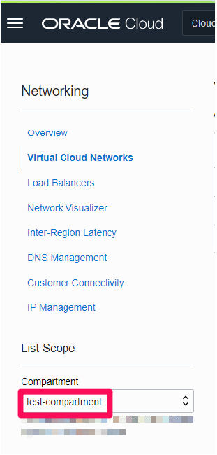
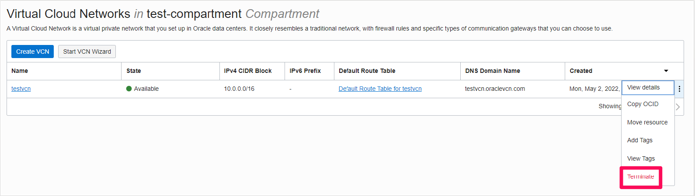
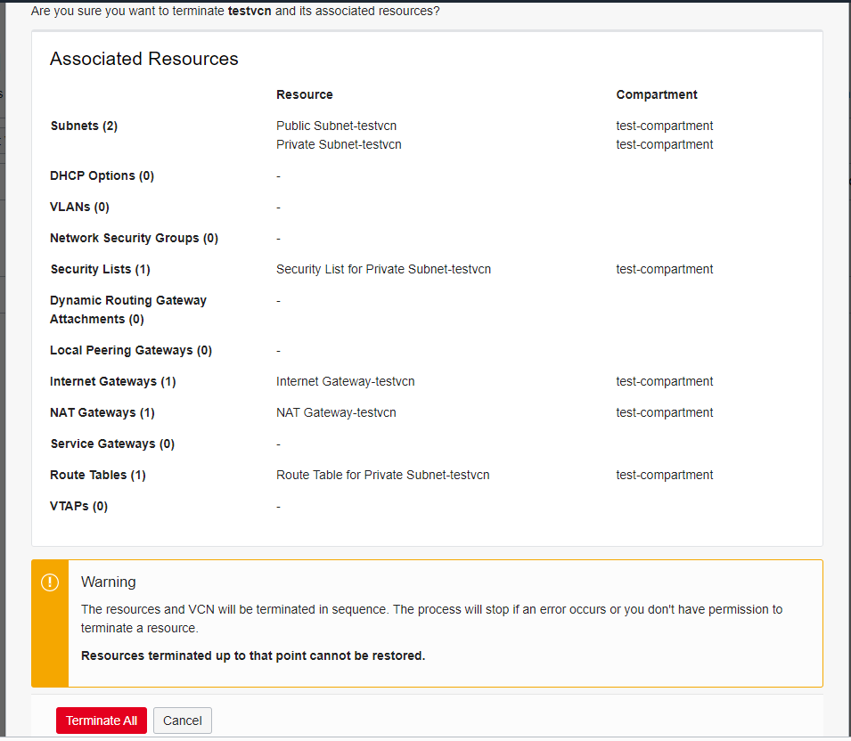
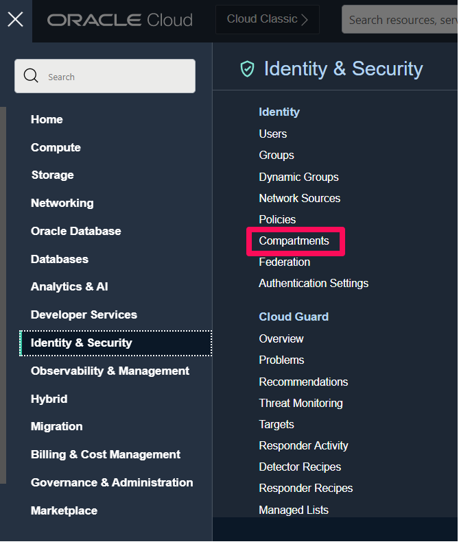
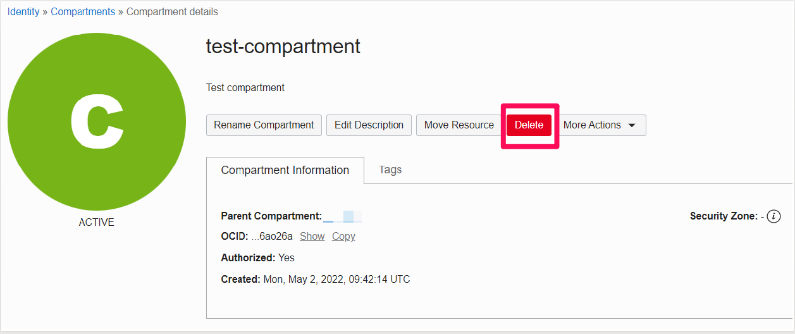

# Teardown your Oracle PeopleSoft Environment

## Introduction
In this lab, we will decommission the PeopleSoft environment by deleting all the resources we created in OCI.

Estimated Time: 15 minutes

### Objectives
* Delete your PeopleSoft virtual machine
* Destroy OCI Resources

### Prerequisites
* Tenancy Admin User
* Tenancy Admin Password

## Task 1: Delete the PeopleSoft virtual machine

1. Navigate to the OCI home page.

2. Use the dropdown menu located in the upper left-hand corner of the screen and select **Compute** then **Instances**.

    

3. You are now on the **Instances** page. Make sure that you have the compartment you created in the "Setup" lab selected.

    

4.   You should now be able to see the PeopleSoft instance you created previously.

    Now click on the three dots to the right of your PeopleSoft instance and then select **Terminate**.

    

    Once the image has finished terminating, you will see its state change to terminated.

    

## Task 2: Terminate the VCN

1. Use the dropdown menu located in the upper left-hand corner of the screen and select **Networking** then **Virtual Cloud Networks**.
    

2. You will now see you are on the **Virtual Cloud Networks** page. Make sure that you have the compartment you created in the "Setup" lab selected.
    

3. You should now be able to see the VCN that you created in the "Setup" lab.

    Now click on the three dots to the right of your VCN and then select **Terminate**.

    

4. On the next screen you will see a list of all of the Associated Resources.

    After the window has finished loading all of the resources, you can click the terminate all button.

    **Note:** It may take a moment for all of the resources to load.

    

    After all the resources have terminated, the VCN itself will terminate and you may then click the close button.

## Task 3: Delete the test compartment

1.  Use the dropdown menu located in the upper left-hand corner of the screen and select **Identity & Security** then **Compartments**.

    

    From this screen, navigate to the compartment you created in the "Setup" lab.

    

    Click the delete button to delete the compartment, after some time the status will be shown as deleted.

    
## Summary

In this lab, you have removed all the resources you created for the PeopleSoft Marketplace environment.

## Acknowledgements
* **Authors** - Deepak Kumar M, Principal Cloud Architect
* **Contributors** - Deepak Kumar M, Principal Cloud Architect
* **Last Updated By/Date** - Deepak Kumar M, Principal Cloud Architect, April 2022

