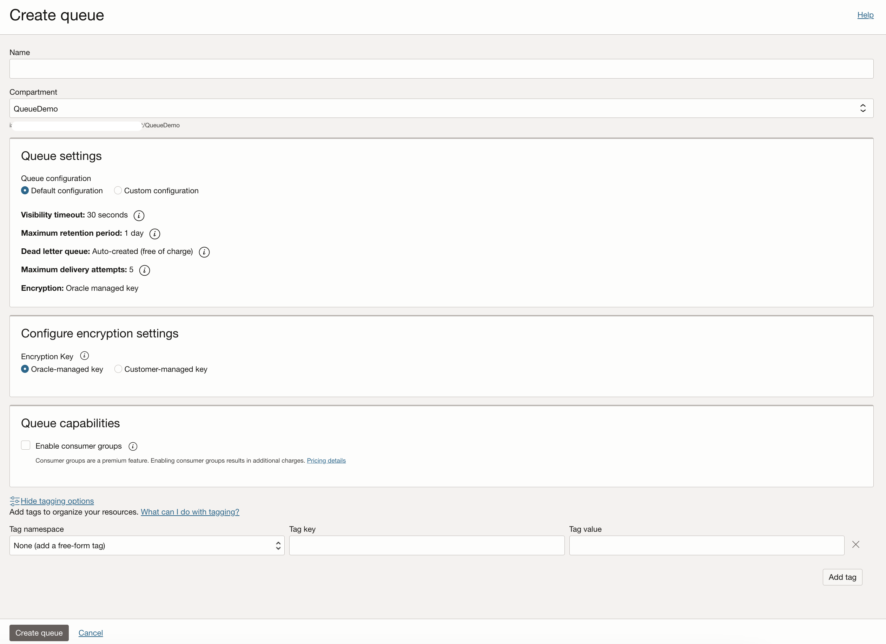

# Lab 1: Deploy OCI Queue

## Introduction

In this lab, you will create an OCI Queue and configure it to enable asynchronous communication between application components.

Estimated Lab Time: 20 minutes

### Objectives

In this lab, you will:

* Create an IAM policy for OCI Queue
* Create an OCI Queue

### Prerequisites

This lab assumes you have:

* An Oracle Cloud account

## Task 1: Log in to the OCI Console

1. Open the [OCI Console](https://cloud.oracle.com/) in your browser.
2. Log in using your Oracle Cloud account credentials.

## Task 2: Add Required IAM Policies

Before creating a queue, ensure that the appropriate IAM policies are in place to allow the required actions. Follow these steps:

1.**Navigate to the IAM Service:**

* Open the navigation menu (☰) in the OCI Console.
* Under **Identity & Security**, select **Identity** → **Policies**.

2.**Create a New Policy:**

* Click **Create Policy**.
* Provide the following details:
  * **Name:** Enter a unique name for the policy, such as QueuePolicy.
  * **Compartment:** Select the compartment where you want to apply the policy.
  * **Description:** Optionally, add a description, such as "Policy to allow Queue management."

3.**Define the Policy Statements:**
Use the following policy statements as per your requirement:

* Allow queue management (administrators):

```
 <copy>
 Allow group QueueAdmins to manage queue-family in compartment <compartment-name>
 </copy>
 ```

* Allow application developers to produce and consume messages:

 ```
 <copy>
 Allow group QueueDevelopers to use queues in compartment <compartment-name>
 </copy>
 ```

Replace *compartment-name* with the name of your compartment and QueueAdmins / QueueDevelopers with the appropriate user groups in your OCI tenancy.

4.**Create the Policy:**

* Click **Next**, review the details, and then click Create Policy.

5.**Assign Users to Groups (if not already done):**

* Ensure that the necessary users are part of the QueueAdmins or QueueDevelopers groups based on their role.

## Task 3: Create an OCI Queue

1. From the OCI Console home page, open the navigation menu (☰) in the top-left corner.
2. Under **Developer Services**, select Application Integration, select Queue.
3. On the **Queues** page, click **Create Queue**.
4. Enter the following details:

* **Name:** Provide a unique name for the queue. For example, *MyQueue*.
* **Compartment:** Select the compartment where the queue will reside.
* **Description (optional):** Add a description for the queue, such as "*Queue for decoupling microservices.*"
* **Queue Settings:** Choose **Default Configuration** or optional **Custom Configuration**

## Task 4: Custom Configuration (Optional)

1. **Retention Period:** Specify the time (in seconds) messages will be retained in the queue. For example, *86400seconds (1 day)*.
2. **Visibility Timeout:** Set the duration (in seconds) for which a message remains invisible after being read. For example, *30 seconds*.
3. **Maximum Channel Consumption (percentage):** Maximum amount of the queue's storage and throughput that a channel can consume. For example *100%*.
4. **Dead letter Queue Settings:**

	**Maximum Delivery Attempts:** The maximum number of retries for a message consumption before it is sent to a dead letter queue (DLQ).

5. **Encryption settings:**

	**Encryption Key:** Leave as Default Encryption Key or select a customer-managed key (CMK) from the OCI Vault for enhanced security.

6. **Tags:** Optionally, add tags to help with resource organization and cost tracking.

## Task 5: Review and Create

1. Review your configuration in the **Summary** section.
2. Click **Create** to provision the queue.


## Task 6: Verify Queue Creation

1. Once the queue is created, it will appear in the list on the **Queues** page.
2. Click the *queue name* to open its details page and verify the configuration.


## Learn More

* [OCI Queue Blog](https://blogs.oracle.com/cloud-infrastructure/post/announcing-oci-queue)
* [OCI Queue Documentation](https://docs.oracle.com/en-us/iaas/Content/queue/home.htm)

## Acknowledgements

* **Author** - Abhishek Bhaumik, Product Manager
* **Last Updated By/Date** - Abhishek Bhaumik, January 2025
