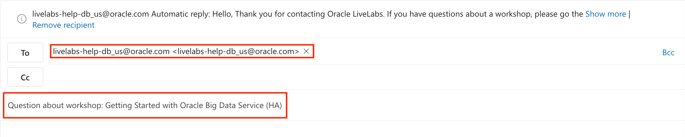
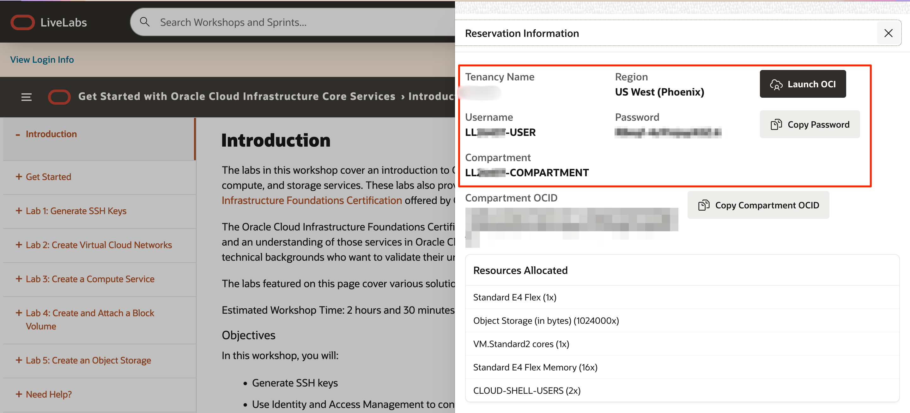
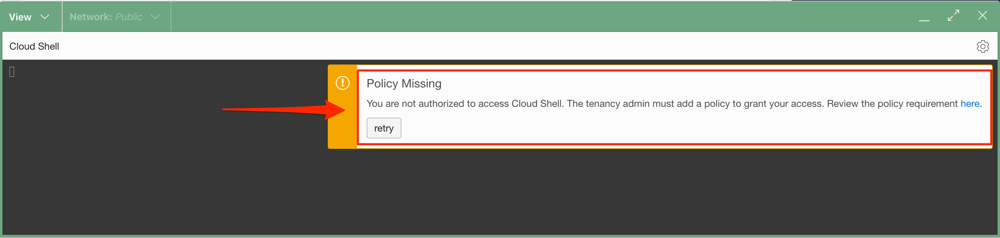

# Need help?

## Introduction
This page is designed to help you solve some common problems users face in this LiveLab.

After reading those troubleshooting tips, if you still find yourself stuck or would like to report an issue with the workshop, click the question mark icon in the upper right corner to contact the LiveLabs team directly via email.

For more about getting support using our email, click [here](#HowtoFormatYourSupportEmailRequest).

### Common Issues Table of Contents
  - [Can't Log in to Oracle Cloud](#CantLogintoOracleCloud)
  - [Can't Create An Oracle Database? Nothing In Your Compartment?](#CantCreateanOracleDatabase?NothinginYourCompartment?)
  - [Connectivity Issues?](#ConnectivityIssues?)
  - [Cannot Access Cloud Shell?](#CannotAccessCloudShell?)
  - [Cannot Connect to the Marketplace Compute Instance Using a Private SSH Key?](#CannotConnecttotheMarketplaceComputeInstanceUsingaPrivateSSHKey?)
  - [Cannot Create Passwords for Database Users?](#CannotCreatePasswordsforDatabaseUsers?)

## How to Format Your Support Email Request
This will construct an email in your default mail application that is auto-populated to address our LiveLabs support inbox and will also include your current workshop in the subject line. Follow the steps below to contact us and get a quick resolution to your issue.

1. In the subject line please provide the **Workshop Name** (see example).
    

2. Include the **Lab Number**, **Task Number**, and **Step Number** where you've encounter the issue. Also, include the **environment** where you are running this workshop (your tenancy or the LiveLabs sandbox tenancy).

3. Include the description of your **issue** and any pertinent information in the contents of your email.

4. Attach a **Screenshot** and **Any Troubleshooting Steps** you've tried, so that we can recreate the issue and provide a timely and accurate solution.

## Can't Log in to Oracle Cloud
1. Double-check that you are using the information and credentials provided to you in the lab banner.

    

2. Make sure you are using the tenancy, username, and password provided to you in the lab banner.

    

3. If you need to view your login information anytime, click **View Login Info**.

    

## Can't Create an Oracle Database? Nothing in Your Compartment?
1. Ensure that under "List Scope", you are selecting the compartment provided to you in the lab banner.

2. If you can't find your compartment in the drop-down box, make sure you *set your region* to the one provided in the lab banner.

    

## Connectivity Issues?

Are you connected to a **VPN**, **Corporate Network**, or behind a strict **Firewall**?

If any of these three conditions are true, some ports in your network may be closed to traffic.

For uploading data through Database Actions in your web browser and applications like the Oracle Analytics Tool could be restricted and may appear to "Hang" or freeze.

While connecting to a noVNC workshop, you might get "Hmmm... can't reach this page" error and could not access the workshop.

Try these options to access the environment again:

1. Please disconnect from your VPN and try again if applicable.

2. If you are connected to a corporate network, try switching to a public or a "clear" network if allowed.

3. Check and disable the ad blocker if there is one setup for your browser.

4. Try running the workshop in a different browser other than your current browser.

5. For the noVNC workshop, check if you can open port 6080.

6. For other standard scenarios, check if you can open ports such as 80, 443, and 22 (for ssh).

7. Alternatively, contact your IT Administrator to see if adding exceptions to your network or firewall would be viable.

## Cannot Access Cloud Shell?

   
If the workshop asks you to open the cloud shell, but you cannot access it, please make sure that you are in the compartment assigned to you.

1. Click the **Navigation Menu** in the upper left, navigate to **Compute**, and select **Instances**.

   

2. Select the compartment you are assigned to (check which compartment you are assigned to on the LiveLabs *Login Info* page). Expand the **root** compartment and then the **Livelabs** compartment. Select the compartment assigned to you.
   
   

3. Relaunch your cloud shell. You should be able to open your cloud shell.
   

## Cannot Connect to the Marketplace Compute Instance Using a Private SSH Key?

   
1. If you cannot connect to your compute instance using your private SSH key, please make sure the private key you provide and use matches the public SSH key you provide when you reserve the workshop on LiveLabs.

## Cannot Create Passwords for Database Users?

1. Make sure the password you enter satisfies the following [restrictions](https://docs.oracle.com/en/cloud/saas/marketing/responsys-user/Account_PasswordRestrictions.htm).

## Acknowledgements

* **Author** - Abhishek Bhaumik, Product Manager
* **Last Updated By/Date** - Abhishek Bhaumik, January 2025