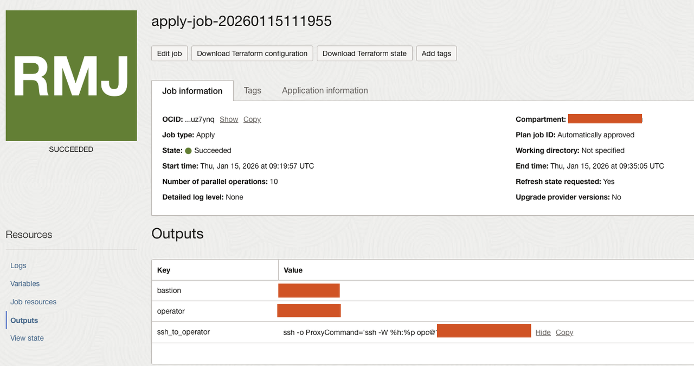

# Deploy Rook-Ceph on OKE

## Introduction

In this lab, you will deploy a complete Rook-Ceph storage cluster on Oracle Kubernetes Engine (OKE). The deployment includes creating an OKE cluster with attached block volumes and installing the Rook operator using Helm.

Estimated Time: 30 minutes

### Objectives

In this lab, you will:

- Deploy an OKE cluster using Terraform
- Attach block volumes to worker nodes
- Install the Rook-Ceph operator
- Verify the Ceph cluster deployment

### Prerequisites

This lab assumes you have:

- Completed the Prerequisites lab
- Gathered required OCIDs and configuration details

## Task 1: Deploy Using OCI Resource Manager

This is the recommended deployment method for beginners.

1. Click the **Deploy to Oracle Cloud** button below:

   [](https://cloud.oracle.com/resourcemanager/stacks/create?zipUrl=https://github.com/dranicu/rook-on-oke/archive/refs/heads/main.zip)

2. If prompted, log in to your OCI tenancy

3. On the **Stack Information** page:
   - **Name**: Enter a name (e.g., `rook-on-oke-stack`)
   - **Compartment**: Select your target compartment
   - Check **I have reviewed and accept the Oracle Terms of Use**
   - Click **Next**

4. On the **Configure Variables** page, fill in the required fields:

   **OKE Cluster Configuration:**
   - **Kubernetes Version**: Select the latest available version
   - **Node Pool Size**: 3 (minimum for Ceph replication)
   - **Node Shape**: VM.Standard.E4.Flex
   - **Node OCPUs**: 2 (minimum)
   - **Node Memory (GB)**: 16 (minimum)

   **Block Volume Configuration:**
   - **Block Volume Size (GB)**: 50 (per node)
   - **Block Volume VPUs Per GB**: 10 (balanced performance)

   **Network Configuration:**
   - **Create New VCN**: Yes (or use existing if you have one)
   - **VCN CIDR**: 10.0.0.0/16

5. Click **Next** to review your configuration

6. On the **Review** page:
   - Verify your settings
   - Check **Run Apply**
   - Click **Create**

7. Monitor the job progress:
   - The stack will create all necessary resources
   - This process takes approximately 15-20 minutes
   - Wait for the job status to show **Succeeded**

## Task 3: Verify Rook-Ceph Deployment

The Terraform deployment automatically installs Rook-Ceph. Let's verify the installation.

1. Connect to the operator using the output from Resurce Manager. You can simply copy the command shown in the output as shown in the below image.



2. Check the Rook operator pods:

    ```bash
    <copy>
    kubectl get pods -n rook-ceph
    </copy>
    ```

   Expected output (wait for all pods to be Running):

    ```text
    NAME                                           READY   STATUS    RESTARTS   AGE
    rook-ceph-operator-6c87b8d789-xxxxx            1/1     Running   0          5m
    rook-ceph-mon-a-xxxxxxxxx-xxxxx                2/2     Running   0          4m
    rook-ceph-mon-b-xxxxxxxxx-xxxxx                2/2     Running   0          4m
    rook-ceph-mon-c-xxxxxxxxx-xxxxx                2/2     Running   0          3m
    rook-ceph-mgr-a-xxxxxxxxx-xxxxx                2/2     Running   0          3m
    rook-ceph-osd-0-xxxxxxxxx-xxxxx                2/2     Running   0          2m
    rook-ceph-osd-1-xxxxxxxxx-xxxxx                2/2     Running   0          2m
    rook-ceph-osd-2-xxxxxxxxx-xxxxx                2/2     Running   0          2m
    ```

3. Download, deploy and access the Rook [toolbox](./files/toolbox.yaml):

    ```bash
    <copy>
    # Apply the toolbox deployment from the rook-files directory
    kubectl apply -f toolbox.yaml
    
    # Wait for the toolbox pod to be ready
    kubectl wait --for=condition=ready pod -l app=rook-ceph-tools -n rook-ceph --timeout=120s
    </copy>
    ```

4. Check Ceph cluster status:

    ```bash
    <copy>
    kubectl exec -it deploy/rook-ceph-tools -n rook-ceph -- ceph status
    </copy>
    ```

   Expected output:

    ```text
    cluster:
      id:     a1b2c3d4-e5f6-7890-abcd-ef1234567890
      health: HEALTH_OK

    services:
      mon: 3 daemons, quorum a,b,c (age 5m)
      mgr: a(active, since 4m)
      osd: 3 osds: 3 up (since 3m), 3 in (since 3m)

    data:
      pools:   1 pools, 1 pgs
      objects: 0 objects, 0 B
      usage:   3.0 GiB used, 147 GiB / 150 GiB avail
      pgs:     1 active+clean
    ```

5. View OSD (Object Storage Daemon) status:

    ```bash
    <copy>
    kubectl exec -it deploy/rook-ceph-tools -n rook-ceph -- ceph osd status
    </copy>
    ```

   Expected output:

    ```text
    ID  HOST       USED  AVAIL  WR OPS  WR DATA  RD OPS  RD DATA  STATE
     0  10.0.10.2  1.0G   49.0G      0        0       0        0   exists,up
     1  10.0.10.3  1.0G   49.0G      0        0       0        0   exists,up
     2  10.0.10.4  1.0G   49.0G      0        0       0        0   exists,up
    ```

## Task 5: Verify Block Volumes

Confirm that the OCI Block Volumes are attached and being used by Ceph:

1. Check the block devices on each node:

    ```bash
    <copy>
    for pod in $(kubectl get pods -n rook-ceph -l app=rook-ceph-osd -o jsonpath='{.items[*].metadata.name}'); do
      echo "=== $pod ==="
      kubectl exec -n rook-ceph $pod -- lsblk
    done
    </copy>
    ```

2. Verify via the OCI Console:
   - Navigate to **Compute** → **Instances**
   - Select each worker node
   - Click **Attached Block Volumes**
   - Confirm the volumes are attached

## Troubleshooting

### Pods Stuck in Pending State

If pods are stuck in Pending:

```bash
kubectl describe pod <pod-name> -n rook-ceph
```

Common issues:
- Insufficient resources: Increase node size or add more nodes
- Block volumes not attached: Verify in OCI Console

### Ceph Health Warnings

If `ceph status` shows warnings:

```bash
kubectl exec -it deploy/rook-ceph-tools -n rook-ceph -- ceph health detail
```

Common warnings:
- `HEALTH_WARN too few PGs`: This is normal for a small cluster
- `clock skew detected`: NTP synchronization issue between nodes

### OSD Not Starting

If OSDs fail to start:

```bash
kubectl logs -n rook-ceph -l app=rook-ceph-osd --all-containers
```

Ensure block volumes:
- Are not formatted with any filesystem
- Are properly attached to the nodes
- Have sufficient size (minimum 10GB recommended)

You may now **proceed to the next lab**.

## Learn More

- [Rook Ceph Quickstart](https://rook.io/docs/rook/latest/Getting-Started/quickstart/)
- [OKE Terraform Module](https://github.com/oracle-terraform-modules/terraform-oci-oke)
- [Ceph Cluster CRD](https://rook.io/docs/rook/latest/CRDs/Cluster/ceph-cluster-crd/)

## Acknowledgements

* **Author** - Dragos Nicu, Cloud Infrastructure Engineer
* **Last Updated By/Date** - Dragos Nicu, January 2026
