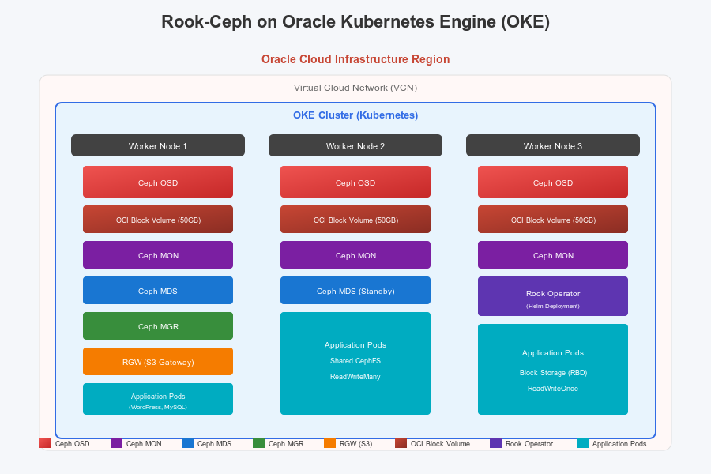

# Introduction

## About this Workshop

In this workshop, you will learn how to deploy and manage Rook-Ceph distributed storage on Oracle Kubernetes Engine (OKE). Rook is an open source, cloud-native storage orchestrator that turns distributed storage systems into self-managing, self-scaling, self-healing storage services.

By combining Oracle's managed Kubernetes service (OKE) with Rook-Ceph, you can create a powerful, scalable, and highly available storage solution for your containerized applications.

Estimated Workshop Time: 90 minutes

### What is Rook?

Rook is a cloud-native storage orchestrator for Kubernetes. It provides file, block, and object storage to cloud-native environments by automating deployment, bootstrapping, configuration, provisioning, scaling, upgrading, migration, disaster recovery, monitoring, and resource management.

Key benefits of Rook include:

- **Self-Managing Storage**: Rook automates storage administrator tasks
- **Multiple Storage Types**: Support for block, file system, and object storage
- **High Availability**: Built-in replication and failover capabilities
- **Kubernetes Native**: Uses Kubernetes primitives for scheduling and management
- **Open Source**: Released under Apache 2.0 license

### What is Ceph?

Ceph is a highly scalable distributed storage system that provides:

- **Object Storage**: S3/Swift compatible object storage
- **Block Storage**: RBD (RADOS Block Device) for persistent volumes
- **File System**: CephFS for shared file systems across pods

Ceph components include:

- **Monitors (MON)**: Maintain cluster state and maps
- **Object Storage Daemons (OSD)**: Store data and handle replication
- **Metadata Servers (MDS)**: Required for CephFS file system
- **Managers (MGR)**: Provide monitoring and interfaces

### What is Oracle Kubernetes Engine (OKE)?

Oracle Kubernetes Engine (OKE) is Oracle's managed Kubernetes service that enables you to deploy, manage, and scale containerized applications using Kubernetes. OKE provides:

- Fully managed Kubernetes clusters
- Integration with OCI services (networking, storage, identity)
- Enterprise-grade security and compliance
- High availability across availability domains

### Objectives

In this workshop, you will learn how to:

- Deploy an OKE cluster with attached block volumes for Ceph storage
- Install Rook-Ceph operator using Terraform and Helm
- Configure Ceph storage classes for block, file, and object storage
- Deploy sample applications using Rook-Ceph storage
- Monitor and manage your Ceph cluster

### Prerequisites

This lab assumes you have:

- An Oracle Cloud Infrastructure (OCI) tenancy
- An OCI user with permissions to create OKE clusters and compute resources
- Basic knowledge of Kubernetes concepts
- Familiarity with Terraform (optional, for CLI deployment)

### Architecture Overview

The architecture consists of:

1. **OKE Cluster**: Managed Kubernetes cluster with worker nodes
2. **Block Volumes**: OCI Block Volumes attached to worker nodes for Ceph OSDs
3. **Rook Operator**: Manages the Ceph cluster lifecycle
4. **Ceph Cluster**: Distributed storage providing block, file, and object storage
5. **Storage Classes**: Kubernetes storage classes for dynamic provisioning

## Learn More

- [Rook Documentation](https://rook.io/docs/rook/latest/)
- [Ceph Documentation](https://docs.ceph.com/en/latest/)
- [OKE Documentation](https://docs.oracle.com/en-us/iaas/Content/ContEng/home.htm)
- [GitHub Repository: rook-on-oke](https://github.com/dranicu/rook-on-oke)

## Acknowledgements

* **Author** - Dragos Nicu, Cloud Infrastructure Engineer
* **Last Updated By/Date** - Dragos Nicu, January 2026
