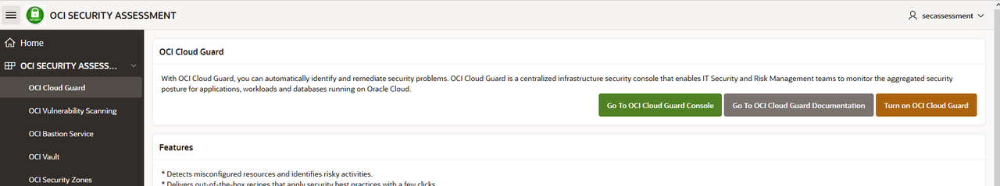
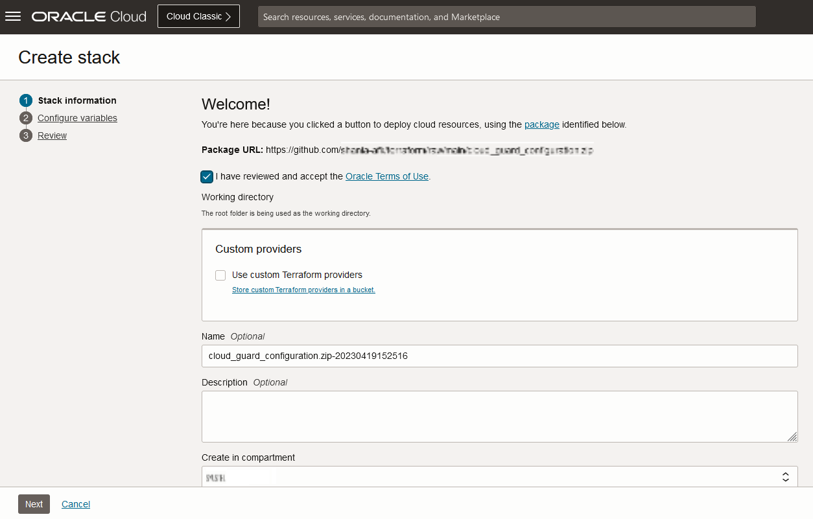
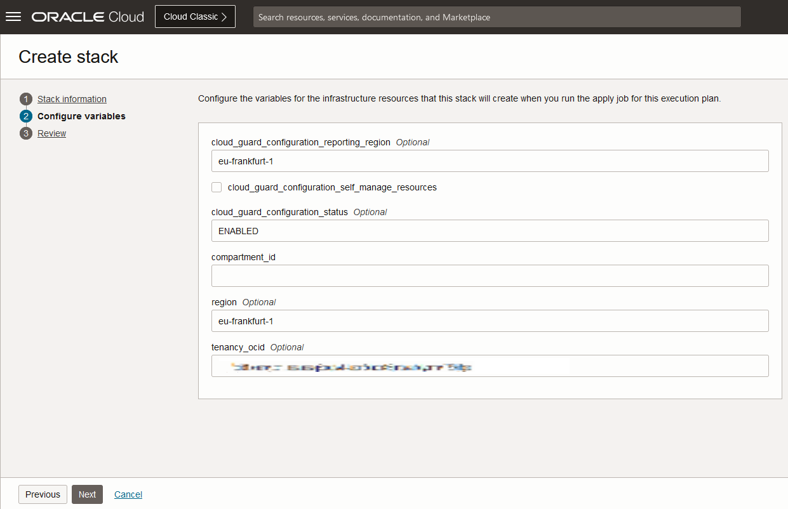
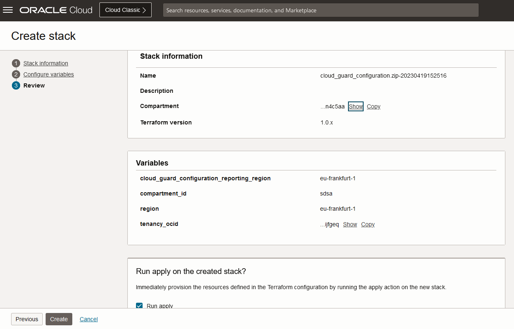

# Automatic activation of Cloud Guard

## Introduction
This lab will show you how to use your Security Dashboard to activate Cloud Guard.

### Objectives
* Go to your Security Dashboard
* Enable Cloud Guard

### What Do You Need?
This lab assumes that you have successfully completed the previous labs in the **Contents** menu on the right.

## Task 1: Automatic activation of Cloud Guard
Oracle recommends strongly to activate Oracle Cloud Guard as the first step for your OCI onboarding, to have a complete view of your OCI security.

To see if it is enabled in your tenant, log in to your OCI Security dashboard, as you did in the previous lab.  

In case Oracle Cloud Guard is not enabled, follow the next steps:

1. Go to your security dashboard and click to the section Cloud Guard in the left menu:

  

  You will be able to view a dedicated page for Cloud Guard service, where you can see some descriptions about the functionality, features, benefits and overview of the service. At the same time, you have 3 buttons on the top of the page for different purposes:

  * **Go To OCI Cloud Guard Console**. If you click this button, you will be redirected to the Cloud Guard service in your OCI tenant, where you can enable the service in case it is disabled, or do some configurations if required.
  * **Go To OCI Cloud Guard Documentation**. If you click this button, you will be redirected to the Oracle public documentation for all information related to Cloud Guard, in case you want to know more details about the service.
  * **Turn on OCI Cloud Guard**. If you click this button, you will be able to activate Cloud Guard automatically in case the service is not activated. A Terraform script will load automatically, and you will be prompted to a console where you have to enter the mandatory parameters.

Click the button Turn on OCI Cloud Guard.

## Task 2: Enter required parameters

Once you clicked the button, you will be redirected to the Terraform stack that was loaded automatically. 

1. Select the box "I have reviewed and accept the Oracle Terms of Use" to load the package.

  After selecting the box, the package will be loaded successfully if you can see the Name of the package in the corresponding field:

  

2. Click Next. Now you have to enter the required parameters to activate Cloud Guard. These parameters are the following:

* cloud\_guard\_configuration\_reporting\_region: eu-frankfurt-1
* cloud\_guard\_configuration\_status: ENABLED
* compartment\_id: OCID of your compartment
* region: eu-frankfurt-1
* tenancy\_ocid: already populated with your tenancy id

  

3. Click Next to review your configuration and click Create. 

  

The Cloud Guard Cloud service is already enabled. You will have to wait just some minutes to see some findings on it.

**This concludes this lab.**

## Learn More
* [Oracle Cloud Marketplace Partner Portal Documentation](https://docs.oracle.com/en/cloud/marketplace/partner-portal/index.html)
* [Oracle Cloud Marketplace Partner Portal Videos](https://docs.oracle.com/en/cloud/marketplace/partner-portal/videos.html)

## Acknowledgements
* **Author** - Sonia Yuste
* **Contributors** Damien Rilliard
* **Last Updated By/Date** - Sonia Yuste, September 15 2022
