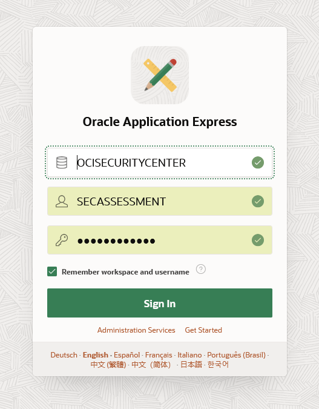

# Get delighted with your first Unique Security Experience

## Introduction
This lab will show you how to automate the journey to security by using the provided key components that will make you have that Unique Security Experience.

### Objectives
- Download and run security assessment script
- Store reports in Autonomous Database
- Check your Security Dashboard

### Prerequisites
This lab assumes you have completed previous lab.

## Task 1: Download and run security assessment script

1.	Go to the Oracle Cloud Shell and run the following commands:

        <copy>
        wget <TODO>
        </copy>

        <copy>
        python3 security_assessment.py -dt –-output-to-bucket ‘security_assessment’
        </copy>

    After running the python script, you will see a similar output in Cloud Shell:

    

    The output of the script is displaying in the console which security services are enabled. After the script is executed and the output displayed in the console, a CSV file called “security\_assessment\_report.csv” is created automatically in a directory in the Cloud Shell with following format name: /<tenancy\_name\>\-<date\> and, at the same time, it is stored in your recently created bucket.

    This file is the OCI security assessment report generated by the Python script. If you want to know deeper about the script usage, please refer to the Appendix.


2. (Optional) Run the CIS Benchmark Compliance Assessment by running the following command:

    ````
    <copy>
    python3 cis_reports.py -dt –-report-directory './Security_Assessment_Reports /'
    </copy>
    ````  

## Task 2: Store reports in Autonomous Database

1. Now you need to upload the CSV files generated in your bucket to your recently created Autonomous Database. To do that, you have to call the table API that you have exposed. In the Cloud Shell terminal, run the following:

    ````
    <copy>
    curl -X POST '<your curl command location URL>/batchload?batchRows=500' ' -H 'Content-type: text/plain'  -H 'cache-control: no-cache' --data-binary @security_assessment_report.csv
    </copy>
    ````

    Where <your curl command location URL> is the URL you noted down for your table, once you enabled it for REST.
    To verify that everything went well, you should have an output as following:

    

2. (Optional) Same for CIS Summary report:

    ````
    <copy>
    curl -X POST '<your curl command location URL>/batchload?batchRows=500' -H 'Content-type: text/plain'  -H 'cache-control: no-cache' --data-binary @cis_summary_report.csv
    </copy>
    ````

3. (Optional) As a verification step, you can go back in the SQL tools:  

      

      

and enter the following command (logged in as SECASSESSMENT user):

    <copy>
     SELECT * from OCISECURITYCENTER;
    </copy>


  

It should display the results, proving that the load of the data has been working correctly:

  


## Task 3: Check your Security Dashboard

After the script is completely executed, and you loaded the CSV file in your Autonomous Database, you can log in to your APEX and the Security Dashboard appears. This dashboard is showing in a graphical format the security assessment report info.

1.	On the Autonomous Database dashboard, click on SecAssessments under Instance Name on APEX Instance section:

    

2.	Click Launch APEX.

    

3. The log in page for APEX will be prompted and you need to log in as SECASSESSMENT user.

    

4. Once you are logged in, click in App Builder and in the Security Dashboard application that you installed earlier. Click Run Application.

    

5. Log in as SECASSESSMENT user

    

6. The OCI Security Assessment dashboard will appear. Click on the card to view your security assessment results.

    


7. Once you click, you will see the results obtained in the Security Assessment report in a table.

  In this section, you can easily see the suggestions in the OCI Security Assessment dashboard, to enable or not some security services according to your current implementation with three different options and colours:

  *	**Green**. Security services that are enabled.
  *	**Yellow**. Security services that were enabled but currently deleted for some reason.
  *	**Grey**. Security services that are not enabled and you may want to have a look.

    

    After a review of the status of your security services enabled in your tenant, you may want to know more about them. Therefore, you will see in the menu on the left one tab for each security service that you can enable in OCI. Each tab contains a description about each security service and three buttons with the following options:

*	**Go to the OCI security service dashboard**. Click here to implement the service manually in the OCI console.
*	**Go to the documentation**. Click here to see more detailed information about the service.
*	**Implement automatically**. Click here to directly be redirected to Resource Manager service with the corresponding Terraform stack loaded to implement the required security service.

  <TODO> add example image of one security service page

  *Note:* If you want to re-run the scripts and reload the tables, before running the curl command again, you need to empty the tables first in the SQL tool. For this run the following command then the “select” to verify it’s empty:

      ````
      <copy>
      truncate table OCISECURITYCENTER;
      select * from OCISECURITYCENTER;
      </copy>
      ````
      ````
      <copy>
      truncate table OCICISCOMPLIANCECHECK;
      select * from OCICISCOMPLIANCECHECK;
      </copy>
      ````


## Learn More
* [Oracle Cloud Marketplace Partner Portal Documentation](https://docs.oracle.com/en/cloud/marketplace/partner-portal/index.html)
* [Oracle Cloud Marketplace Partner Portal Videos](https://docs.oracle.com/en/cloud/marketplace/partner-portal/videos.html)


## Acknowledgements
* **Author** - Rene Fontcha, LiveLabs Platform Lead, NA Technology, February 2021
* **Last Updated By/Date** - Rene Fontcha, LiveLabs Platform Lead, NA Technology, December 2021
