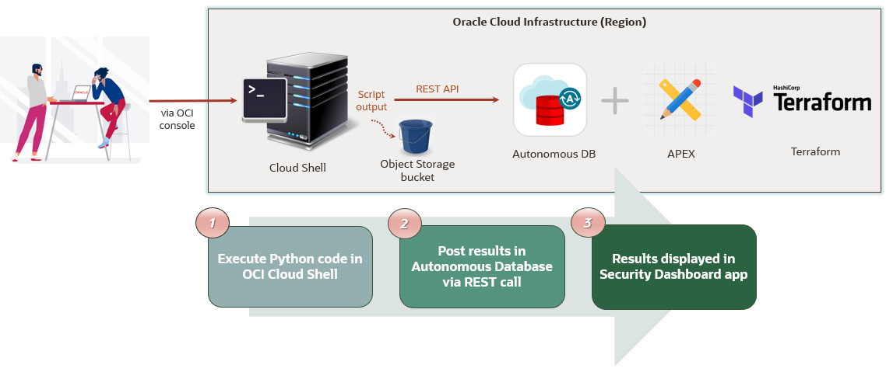
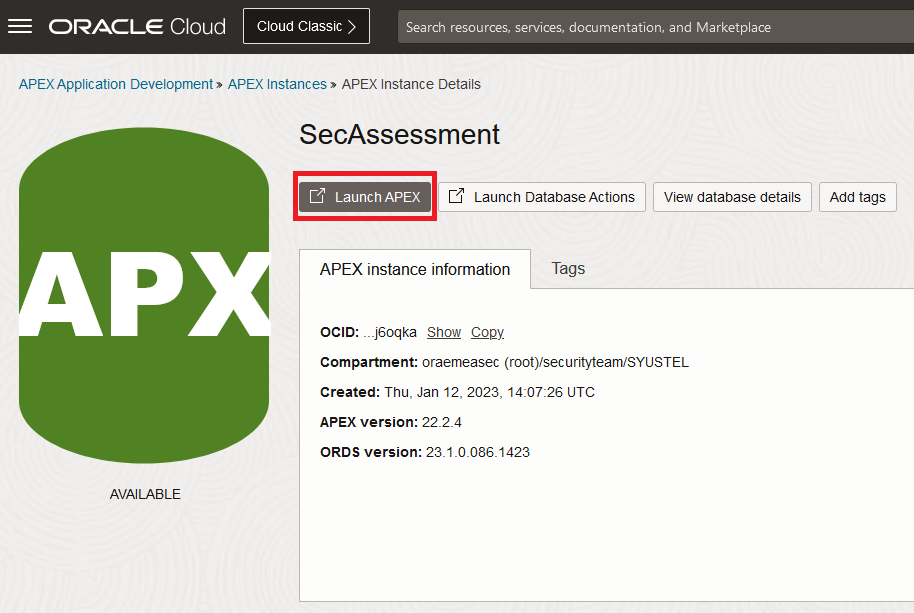

# Get delighted with your first Unique Security Experience

## Introduction
This lab will show you how to automate the journey to security by using the provided key components that will make you have that Unique Security Experience.

Estimated time: 45 minutes

### Objectives
In this lab, you will:

- Download and run security and compliance assessment scripts
- Store assessment results in the Object Storage buckets
- Post results in Autonomous Database via REST calls
- Check those results in Security Dashboard UI

Please see picture below with the components and actions involved in this lab:

   


### Prerequisites
This lab assumes you have completed previous lab.

## Task 1: Download and run security assessment script

1.	Download the [security assessment script.](https://c4u04.objectstorage.us-ashburn-1.oci.customer-oci.com/p/EcTjWk2IuZPZeNnD_fYMcgUhdNDIDA6rt9gaFj_WZMiL7VvxPBNMY60837hu5hga/n/c4u04/b/livelabsfiles/o/oci-library/security_assessment.py)
    In order to be able to run the script, you will need some specific permissions. Before continue, check the appendix and see the needed permissions. Once you ensure you have those permissions, you can run now that security assessment script in the Oracle Cloud Shell: open the Oracle Cloud Shell by clicking in the Cloud Shell icon in the Console header:

    

2.  Upload the script in the Cloud Shell terminal by doing drag and drop. You will see a similar message:

    

    Before running the script, create a dedicated folder for the security assessment reports. Run the following command in Cloud Shell for that purpose:

    ```
    mkdir security_assessments
    ```

3. Move the script to the created folder and run the script there with the following commands:

    ```
    mv security_assessment.py security_assessments
    ```
    ```
    cd security_assessments
    ```
    ```
    python3 security_assessment.py -dt --output-to-bucket security_assessment
    ```
    
    After running the python script, you will see a similar output in Cloud Shell:

    

    The output of the script is displaying in the console which security services are enabled. After the script is executed and the output displayed in the console, a CSV file called “security\_assessment\_report.csv” is created automatically in a directory in the Cloud Shell with following format name: /&lt;tenancy&gt;-&lt;date&gt; and, at the same time, it is stored in your recently created bucket.

    This file is the OCI security assessment report generated by the Python script. If you want to know deeper about the script usage, please refer to the Appendix.


4. (Optional) Do the same for the CIS Benchmark Compliance Assessment script:

    Download the [CIS reports script.](https://c4u04.objectstorage.us-ashburn-1.oci.customer-oci.com/p/EcTjWk2IuZPZeNnD_fYMcgUhdNDIDA6rt9gaFj_WZMiL7VvxPBNMY60837hu5hga/n/c4u04/b/livelabsfiles/o/oci-library/cis_reports.py) 

    Upload the script in the Cloud Shell terminal by doing drag and drop as you did before.

    Create a dedicated folder for the CIS reports by running the following command in the Cloud Shell:
    
    ```
    mkdir cis_reports
    ```
    And move the script to the folder:

    ```
    mv cis_reports.py cis_reports
    ```
    
    Run the script within the created directory:

    ```
    cd cis_reports
    ```

    ```
    python3 cis_reports.py -dt --output-to-bucket cis_report
    ```  


## Task 2: Store reports in Autonomous Database

1. Now you need to upload the CSV file generated in your bucket to your recently created Autonomous Database. To do that, you will perform a REST call to the table where you want to store these results (the table that you created and enabled previously for REST in previous lab). 

    In the Cloud Shell terminal, run the following:
    
    ```
    cd security_assessments/<tenancy_name>-<date>
    ``` 
    
    where /&lt;tenancy\_name&gt;\-&lt;date&gt; is the directory created by the script and where the security assessment results file is stored.

    Now, run the command for the REST call to load the file into the Database table you created in the previous lab:
    
    ```
    curl -X POST '<your curl command location URL>/batchload?batchRows=500' -H 'Content-type: text/plain'  -H 'cache-control: no-cache' --data-binary @security_assessment_report.csv
    ```

    where &lt;your curl command location URL&gt; is the URL you noted down for table OCISECURITYCENTER, once you enabled it for REST.
    
    To verify that everything went well, you should have an output as following:

    

2. (Optional) Same for CIS Summary report:

    ```
    cd cis_reports/<tenancy_name>-<date>
    ```  

    where &lt;tenancy\_name&gt;\-&lt;date&gt; is the directory created by the script and where the compliance assessment results file is stored.
    
    ```
    curl -X POST '<your curl command location URL>/batchload?batchRows=500' -H 'Content-type: text/plain'  -H 'cache-control: no-cache' --data-binary @cis_summary_report.csv
    ```
    where &lt;your curl command location URL&gt; is the URL you noted down for table OCICISCOMPLIANCECHECK, once you enabled it for REST.

3. (Optional) As a verification step, you can go back in the SQL tools by clicking Database Actions on your Autonomous Database, and log in as SECASSESSMENT user:  

    

**Note:** You may need to log in first as ADMIN, then Click Sign Out, and log in as SECASSESSMENT user.

Once you are logged in as SECASSESSMENT user, click SQL under Development:

   

Enter the following command in the SQL Web Developer (logged in as SECASSESSMENT user):

```
SELECT * from OCISECURITYCENTER;
```
and run the command in the picture below:

  

It should display the results, proving that the load of the data has been working correctly. You should have something similar to:

  


## Task 3: Check your Security Dashboard

After the script is completely executed, and you loaded the CSV file in your Autonomous Database, you can log in to your APEX and the Security Dashboard appears. This dashboard is showing in a graphical format the security assessment report info.

1.	On the Autonomous Database dashboard, click on SecAssessments under Instance Name on APEX Instance section:

    

2.	Click Launch APEX.

    

3. The log in page for APEX will be prompted and you need to log in as SECASSESSMENT user.

    

4. Once you are logged in, click App Builder and the Security Dashboard application that you installed earlier. Click Run Application.

    

5. Log in as SECASSESSMENT user in the application:

    

6. The OCI Security Assessment dashboard will appear. Click on the card to view your security assessment results.

    


7. Once you click, you will see the results obtained in the Security Assessment report in a table.

    In this section, you can easily see the suggestions in the OCI Security Assessment dashboard, to enable or not some security services according to your current implementation with three different options and colours:

    *	**Green**. Security services that are enabled.
    *	**Yellow**. Security services that were enabled but currently deleted for some reason.
    *	**Grey**. Security services that are not enabled and you may want to have a look.

    As an example, if all services are enabled, you will see something similar to:
  
    

    As well, at the bottom of the page you can see a button to be redirected to Oracle contacts page, in case you want to request an Oracle Security Workshop.
    
    After a review of the status of your security services enabled in your tenant, you may want to know more about them. In order to do that, you can click on the hamburger menu in the top left corner and a menu with different options showing the different security services will appear:

    
    
    Each section contains a description about each security service and three buttons with the following options:

    *	**Go to OCI Security Service Console**. Click here to implement the service manually in the OCI console.
    *	**Go to OCISecurity Service Documentation**. Click here to see more detailed information about the service.

    And in the Cloud Guard section, you also have the following button:

    *	**Turn on OCI Cloud Guard**. Click here to directly be redirected to Resource Manager service with the corresponding Terraform stack loaded to implement Cloud Guard.

    Pressing this button and see results will be the action performed in the next lab.

    You can play around and explore the different views of the dashboard. For example, for section OCI Cloud Guard:

    

    And for section OCI Vulnerability Scanning:

     

     Even you can see the compliance reports in section Tenant CIS Compliance section, in case you performed the optional actions in the previous labs. You will see something similar to:

      

    You may need to add hidden columns or reorder. As you can see, it is an interactive report where you have the possibility to do that by clicking in the button "Actions".

    For example, you can add hidden columns by doing the following:

     Click "Actions" menu and click Columns:

     

     In case there are hidden columns, you can select the columns you want to display:

     


    **Note:** If you want to re-run the scripts and reload the tables, before running the curl command again, you need to empty the tables first in the SQL tool. For this run the following command then the “select” to verify it’s empty:

    ```
    truncate table OCISECURITYCENTER;
    select * from OCISECURITYCENTER;
    ```

    

    Do the same with the Compliance table in case you loaded with data:

    ```
    truncate table OCICISCOMPLIANCECHECK;
    select * from OCICISCOMPLIANCECHECK;
    ```

**This concludes this lab.**
You may now **proceed to the next lab**.

## Appendix: How to use the Python script security_assessment.py
Information provided in this Appendix is rather intended as guidance for workshop users using security_assessment.py script to execute an OCI security assessment.

### Permissions needed

If you are not admin, you will need to have specific permissions to be able to run the script. Please check with your admin to get the following required permissions:

    ```
    Allow group <your group> to inspect all-resources in tenancy
    Allow group <your group> to read buckets in tenancy
    Allow group <your group> to read file-family in tenancy
    Allow group <your group> to read network-security-groups in tenancy
    Allow group <your group> to read users in tenancy
    Allow group <your group> to use cloud-shell in tenancy
    Allow group <your group> to manage objects in tenancy
    Allow group <your group> to read data-safe in tenancy
    ```
Where your group is the group in OCI that your user need to belong to.

### Script usage
```
security_assessment.py  	[-h][-t CONFIG_PROFILE][-p PROXY]
                            [--output-to-bucket OUTPUT_BUCKET]
                            [--report-directory REPORT_DIRECTORY]
                            [print-to-screen PRINT_TO_SCREEN][-ip][-dt]

```
### Input parameters


| Input variable     | Default value                            | Allowed values/example | Description                                                        |
| ------------------ | ---------------------------------------- | ---------------------- | ------------------------------------------------------------------ |
| -t                 | ""                                       | Tenancy profile        | Config file section to use                                         |
| -p                 | ""                                       | ww-proxy-server.com:80 | Set proxy                                                          |
| --output-to-bucket | ""                                       | my-reporting-bucket    | Set output bucket name                                             |
| --report-directory | /&lt;tenancy name&gt;-&lt;start date&gt; | /my/path/              | Set output report directory                                        |
| --print-to-screen  | True                                     | True/False             | Set to false if you want to see only non-enabled security services |
| -ip                | False                                    | -                      | Use instance principals for authentication                         |
| -dt                | False                                    | -                      | Use delegation token for authentication                            |

As you can see, the script has three options for authentication:  
* **Instance Principals**  
A security token is used for an instance principal.  Using the metadata endpoint for the instance (http://169.254.169.254/opc/v2) we can discover the region the instance is in, its leaf certificate and any intermediate certificates (for requesting the token) and the tenancy (as) that is in the leaf certificate. To do that, X509FederationClient is leveraged, so it can also refresh the security token and also get the private key needed to sign requests (via the client’s session\_key\_supplier).  
* **Delegation Token**  
A delegation token allows the instance to assume the privileges of the user for which the token was created.  
* **Config file**  
Using the default configuration location \~/.oci/config you can load any profile. By default, the DEFAULT profile is used.


## Learn More
* [CIS compliance script](https://github.com/oracle-quickstart/oci-cis-landingzone-quickstart/blob/main/compliance-script.md)
* [Using cURL with REST-Enabled SQL Service](https://docs.oracle.com/en/database/oracle/oracle-rest-data-services/22.3/orddg/rest-enabled-sql-service.html#GUID-E44BF01E-7F11-44B4-B9AF-2755267D9D62)
* [SQL Developer Web for Oracle Autonomous Database](https://blogs.oracle.com/developers/post/sql-developer-web-now-available-for-oracle-autonomous-database)
* [CIS](https://www.cisecurity.org/ )
* [OCI SDK and CLI configuration file](https://docs.oracle.com/en-us/iaas/Content/API/Concepts/sdkconfig.htm)

## Acknowledgements
* **Authors** - Sonia Yuste (OCI Security Specialist), Damien Rilliard (OCI Security Senior Director) 
* **Last Updated By/Date** - Sonia Yuste, April 2023
