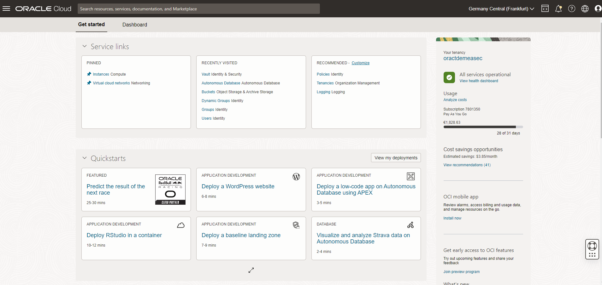

# Get started - Cloud login

Estimated Time: 5 minutes

## Introduction

For the purpose of today's hands-on lab, you have been provided with an OCI Cloud environment. This lab walks you through the steps required in order to gain access to the Oracle Cloud Infrastructure console. Upon entering the Hands-On Lab you should have been given a paper with all the information, including accounts and passwords, which are personal to you to execute this lab. If not please refer to one of the trainer for assitance.

### Objectives

- Learn how to log in to your Oracle Cloud Account to perform today's Hands-On Lab

### Prerequisites
- Cloud Account Name - The name of your tenancy 
- Username
- Password

These parameters are supplied by the Trainers.

## Task 1:  Log in to Oracle Cloud
If you've signed out of the Oracle Cloud, use these steps to sign back in.

1. Go to [cloud.oracle.com](https://cloud.oracle.com) and enter your Cloud Account Name and click **Next**. 

    

2. Click **Next** and display the menu for the **Oracle Cloud Infrastructure Direct Sign-In** option to reveal the login input fields:

    

3. Enter your Cloud Account credentials and click **Sign In**. For this step please use your user account called "Secops_XXX" where XXX is your training student number. All the account information should have been given to you when you entered the training room, if not please call a trainer to assist. 

    

4. You are now signed in to Oracle Cloud!

    

You may now **proceed to the next lab**.

## Acknowledgements
- **Authors** - Damien Rilliard (OCI Senior Security Director), Sonia Yuste (OCI Security Specialist) 
- **Last Updated By** - Sonia Yuste, July 2023