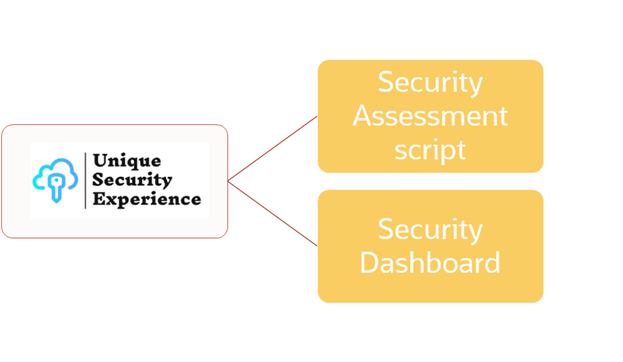
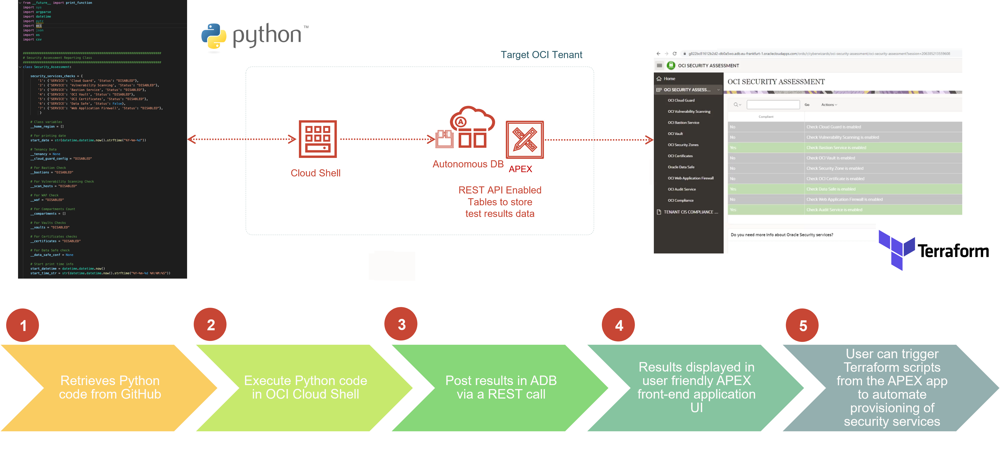
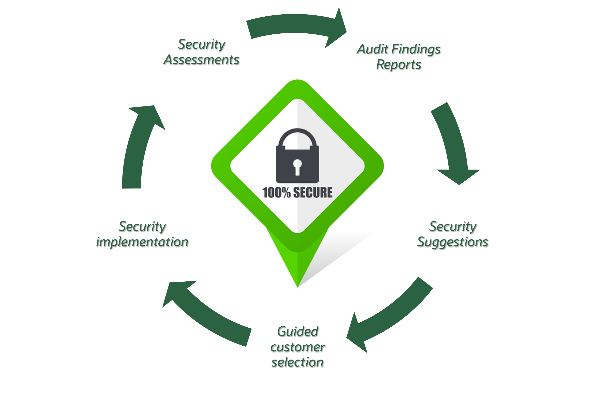

# Introduction

The purpose of this workshop is to help you and make more simple for you to do your first security assessment in your Oracle Cloud Infrastructure (OCI) tenancy, having as a result a Unique Security Experience.

## About this Workshop

By having this Unique Security Experience, your journey to OCI security will be automated, by indicating you at any time the required services to activate according to your personalized security assessments.

During this workshop, you will be provided with a Security Center application to be installed in your tenant, that will act as the user interface for your security assessment in OCI. By usiing this user interface, you will be able to automate the following tasks:

* Security assessments. To determine, for each OCI Security Service, whether you have activated it and if you are using it, or not yet.
* Suggestions based on your assessments. In case you are not leveraging a specific security service, the Security Center dashboard will provide you with all the details on that service.
* Guided security services selection. The Security Center dashboard will guide you to enable the needed security services, by giving you descriptions with benefits, purpose of the service and options with direct links to the console and the documentation.
* Security services implementation. The Security Center dashboard will offer you as well the option to direct links to Terraform script to activate a security service with a click.

These are the main components you will receive as part of this workshop:

* Security Assessment script to generate your own security report
*	OCI Security Center application as your own Security Dashboard

Estimated Workshop Time: -- hours -- minutes (This estimate is for the entire workshop - it is the sum of the estimates provided for each of the labs included in the workshop.)

## Objectives

  * Set up the environment
  * Execute security assessment
  * Post results in an Autonomous Database via a REST call
  * Check results in your Security Dashboard
  * Have a view to your dashboard and analyse your security needs
  * Enable automatically Cloud Guard

## Architecture

In this workshop, you will use the following OCI services and components:

* Oracle Cloud Shell
* Provided Python script to generate your security assessment reports
* Autonomous Database
* APEX hosted in Autonomous Database
* Provided application as your Security Dashboard
* Oracle Cloud Guard

Below you can see the architecture for this Unique Security Experience, with associated task to each component:

In general, you could extend the use of the provided Security Dashboard and assessment script. As security should be always a lifecycle, you can always go back to first step after you finish with some security services implementations, and start from the beginning, completing the security lifecycle:

In that case, then have a view of the following figure, where you can see the complete diagram of all possible OCI services that this Unique Security Experience could apply:

## Lab Breakdown
- **Lab 1:** Set up environment
- **Lab 2:** Get delighted with your first Unique Security Experience
- **Lab 3:** Automatic activation of Cloud Guard

## What's Next?

  You are all set to begin the labs! Click Lab 1: Prepare your OCI tenant to use the USE tool in the Contents menu.

## Learn More

* [Oracle Cloud Infrastructure Security](https://www.oracle.com/security/)

## Acknowledgements
* **Author** - Sonia Yuste, OCI Security Specialist
* **Contributors** -  <Name, Group> -- optional
* **Last Updated By/Date** - Sonia Yuste, August 2022
