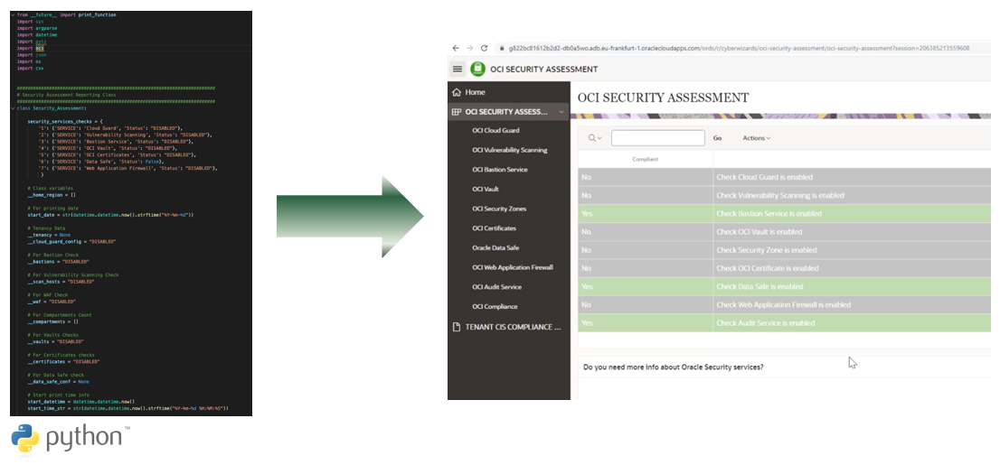

# Introduction

The purpose of this workshop is to help you and make more simple for you to do your first security assessment in your Oracle Cloud Infrastructure (OCI) tenancy, going at the same time through a guided selection of available security services according to the results of your security assessment. By doing this workshop, you will enjoy the Oracle Unique Security Experience.

## About this Workshop

As a summary, during this workshop, you will be provided with a Python script to execute your security asssessment, and a user interface (APEX application) that will show you your Security Center dashboard. In this dashboard, you will be able to find the results of your assessment, together with a guided selection of the proper security services. 

In more details: 

* The security assessment will determine which OCI security services you have activated and which not. 
* The Security Center dashboard will provide you:

    * Suggestions based on your assessments. In case you are not leveraging a specific security service, the Security Center dashboard will provide you with all the details on that service.

    * Guided security services selection. The Security Center dashboard will guide you to enable the needed security services, by giving you descriptions with benefits, purpose of the service and options with direct links to the console and the documentation.

    * Security services implementation. The Security Center dashboard will offer you as well the option to direct links to Terraform script to activate a security service with a click.

Below you can see the high level diagram:

Estimated Workshop Time: 2 hours 30 minutes (this estimate is for the entire workshop - it is the sum of the estimates provided for each of the labs included in the workshop.)

## Objectives

* Execute your first security assessment by launching the provided Python script in Oracle Cloud Shell (Oracle Cloud Shell is a Linux terminal provided by Oracle Cloud to run scripts on your OCI tenant).
* Security assessment reports excel files will be stored automatically in an Object Storage bucket in CSV format.
* Send the security assessment reports to an Autonomous Database table via REST API calls.
* Deploy the provided APEX application (Security Center dashboard) in the APEX instance hosted in the Autonomous Database.
* Check all results of your security assessments in the Security Center dashboard, and navigate through the different pages to check available security services that you could deploy in OCI.
* Optionally, enable one security service automatically (Cloud Guard) via the Security Center dashboard by using Terraform.

Below you can see the architecture components for this Unique Security Experience:

## Architecture

In this workshop, you will use the following OCI services and components:

* Oracle Cloud Shell
* Provided Python script
* Object Storage buckets
* Autonomous Database
* APEX hosted in Autonomous Database
* Provided APEX application 
* Oracle Cloud Guard

In general, you could extend the use of the provided Security Center dashboard and assessment script. As security should be always a lifecycle, you can always go back to first step after you finish with some security services implementations, and start from the beginning, completing the security lifecycle.

In that case, then have a view of the following figure, where you can see the complete diagram of all possible OCI services that this Unique Security Experience could apply:

## Lab Breakdown
- **Lab 1:** Prepare your OCI tenant
- **Lab 2:** Get delighted with your first Unique Security Experience
- **Lab 3:** Automatic activation of Cloud Guard

## What's Next?

  You are all set to begin the labs! Click Lab 1: Prepare your OCI tenant in the Contents menu.

## Learn More

* [Oracle Cloud Infrastructure Security](https://www.oracle.com/security/)

## Acknowledgements
* **Author** - Sonia Yuste, OCI Security Specialist
* **Contributors** -  Damien Rilliard, OCI Specialist Senior Director
* **Last Updated By/Date** - Sonia Yuste, Dec 2022

[def]: ./images/intro-diagram.png " "