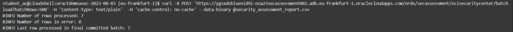
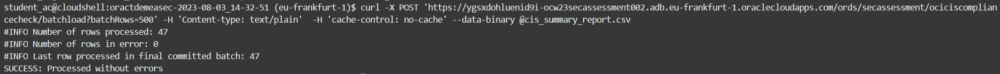
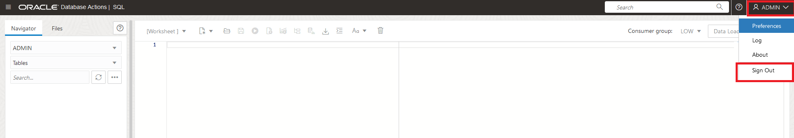
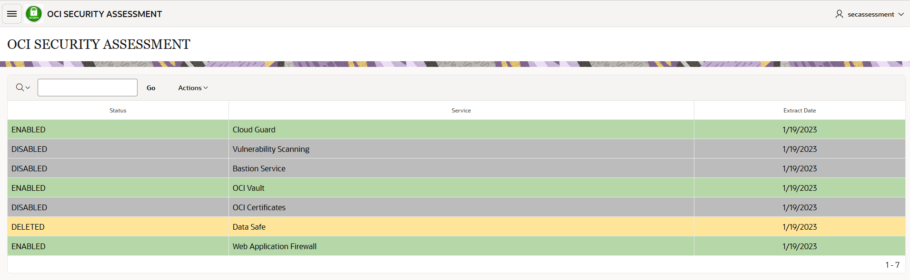

# View report on OCI Security Center Dashboard

## Introduction
This lab will show you how to use the OCI Security Center dashboard.

Estimated time: 25 minutes

[Walk Through the Lab](videohub:1_txvp2x9p)

### Objectives
In this lab, you will:

- Post security reports in Autonomous Database via REST calls
- Check those reports in Security Dashboard UI


### Prerequisites
This lab assumes you have completed previous lab.


## Task 1: Store reports in Autonomous Database

In this task, you will upload the security assessment report (and CIS report in case you generated it in the previous lab) into an Autonomous Database that was created previously for you for the purpose of this lab.

The Autonomous Database is having two tables created, one table will store the security assessment, called OCISECURITYCENTER. The second table will store the CIS compliance report, and it will be called OCICISCOMPLIANCECHECK. Both tables are REST enabled, and each of them can be refererenced by a specific URL. Therefore, you will use a curl command in Cloud Shell to send the generated reports in the Cloud Shell machine into the Autonomous Database's tables.

Please check below the Autonomous Database details that you will need:

* **Autonomous Database name**: ocw23-OCI-SecAssessment\_XXX, where XXX is your student number.
* **Tables created (REST enabled)**: OCISECURITYCENTER, OCICISCOMPLIANCECHECK.
* **Users**: ADMIN, SECASSESSMENT
* **Passwords**: Provided to you by the trainers
* **Curl command location URLs**:
    * For OCISECURITYCENTER table: https://ygsxdohluenid9i-ocw23secassessmentXXX.adb.eu-frankfurt-1.oraclecloudapps.com/ords/secassessment/ocisecuritycenter/  where you need to replace XXX with your student number.
    * For OCICISCOMPLIANCECHECK table: https://ygsxdohluenid9i-ocw23secassessmentXXX.adb.eu-frankfurt-1.oraclecloudapps.com/ords/secassessment/ociciscompliancecheck/ where you need to replace XXX with your student number.

1. First, you will perform a REST call to the table where you will store the mentioned reports. To do that, you need to be located in the directory where the security assessment report was generated in the previous lab. Therefore, run the following in the Cloud Shell terminal (assuming you are currently located in home directory):
    
    ```
    cd security_assessments
    ``` 
    ```
    ls -l
    ``` 
    the directory where the security assessment report was generated in the previous lab should be displayed in the following format: /oractdemeasec-&lt;date&gt;:
    
    
    
    Go into the oractdemeasec-&lt;date&gt; directory by running the following command (the date will be different depending on when you ran the script from Lab 2 / Task 1):

    ```
    cd oractdemeasec-<date>
    ``` 

    please ensure you replace the directory with yours.

    Now, run the command for the REST call to load the file into the Database table OCISECURITYCENTER:
    
    ```
    curl -X POST '<your curl command location URL>/batchload?batchRows=500' -H 'Content-type: text/plain'  -H 'cache-control: no-cache' --data-binary @security_assessment_report.csv
    ```

    where &lt;your curl command location URL&gt; is the URL for table OCISECURITYCENTER that you can see in the Autonomous Database details provided above. 
    
    To verify that everything went well, you should see something similiar to:

    
    
    

2. Perform the same for CIS Summary report. Go to the specific directory where the CIS compliance report was generated by running the following:

    ```
    cd ../..
    ``` 
    ```
    cd cis_reports
    ```  
    ```
    ls -l
    ``` 
    the directory where the CIS compliance report was generated in the previous lab should be displayed in the following format: /oractdemeasec-&lt;date&gt;_&lt;time&gt;:

    

    Go into the oractdemeasec-&lt;date&gt;_&lt;time&gt; directory by running the following command (the date will be different depending on when you ran the script from Lab 2 / Task 2):

    ```
    cd oractdemeasec-<date>_<time>
    ``` 
    please ensure you replace the directory with yours.

3.  Now, run the command for the REST call to load the file into the Database table OCICISCOMPLIANCECHECK:
    
    ```
    curl -X POST '<your curl command location URL>/batchload?batchRows=500' -H 'Content-type: text/plain'  -H 'cache-control: no-cache' --data-binary @cis_summary_report.csv
    ```
    where &lt;your curl command location URL&gt; is the URL you noted down for table OCICISCOMPLIANCECHECK.

    You will get a similar ouput as the one below:

    

4. As a verification step, you can go to your Autonomous Database by opening navigation menu, click on *"Oracle Database"* and *"Autonomous Database"*:

    

5. Once in the Autonomous Database page, specify the compartment ocw23-OCI-Security-Assessment-HOL:

    

6. Identify your Autonomous Database in the list, and click on it. Once there, click Database Actions button and click SQL in the displayed menu:  

    

7. It is needed to log in first as ADMIN, with the provided password supplied by the trainers:

    

8. Have a look to the Web SQL Developer provided with your Autonomous Database. You are logged in as ADMIN, but the tables where you stored the reports are under a different schema. Therefore, click Sign Out on the top corner right:

    

9. Now you can log in as SECASSESSMENT, with the provided password supplied by the trainers:

    


10. Once you are logged in as SECASSESSMENT user, click SQL under Development section. You can see now both tables where your reports are stored. Let's verify first that the security assessment report is stored in the corresponding table: enter the following command in the Web SQL Developer:

    ```
    SELECT * from OCISECURITYCENTER;
    ```
    and run the command by pressing the "Run Script" button, highlighted in red in the picture below:

    

    It should display the results, proving that the load of the data has been working correctly. You should have something similar to:

    

11. If you loaded CIS report as well, run the following command in SQL Web Developer:
    
    ```
    SELECT * from OCICISCOMPLIANCECHECK;
    ```
    You can verify the data is loaded successfully.

## Task 2: Check your Security Dashboard

After the script is completely executed, and you loaded the CSV file in your Autonomous Database, you can log in to your APEX and the Security Dashboard appears. This dashboard is showing in a graphical format the security assessment report info.

1.	On the Autonomous Database dashboard, click on ocw23-OCI-SecAssessment\_XXX under Instance Name on APEX Instance section, where XXX is your student number:

    

2.	Click Launch APEX.

    

3. The log in page for APEX will be prompted and you need to log in as SECASSESSMENT user.

    

4. Once you are logged in, click App Builder and then click in the application called OCI SECURITY ASSESSMENT:

    

5. Click Run Application:

    

6. Log in as SECASSESSMENT user in the application:

    

7. The OCI Security Assessment dashboard will appear. Click on the card to view your security assessment results.

    


8. Once you click, you will see the results obtained in the Security Assessment report in a table.

    In this section, you can easily see the suggestions in the OCI Security Assessment dashboard, to enable or not some security services according to your current implementation with three different options and colours:

    *	**Green**. Security services that are enabled.
    *	**Yellow**. Security services that were enabled but currently deleted for some reason.
    *	**Grey**. Security services that are not enabled and you may want to have a look.

    As an example, you will see something similar to:
  
    

    As well, at the bottom of the page you can see a button to be redirected to Oracle contacts page, in case you want to request an Oracle Security Workshop.
    
    After a review of the status of your security services enabled in your tenant, you may want to know more about them. In order to do that, you can click on the hamburger menu in the top left corner and a menu with different options showing the different security services will appear. This will be explored in the next lab.

    
    
9. Even you can see the compliance reports in section Tenant CIS Compliance section. If you click on the last section of the menu, TENANT CIS COMPLIANCE, you will see something similar to:

      

    You may need to add hidden columns or reorder. As you can see, it is an interactive report where you have the possibility to do that by clicking in the button "Actions".

    For example, you can add hidden columns by doing the following:

     Click "Actions" menu and click Columns:

     

     In case there are hidden columns, you can select the columns you want to display:

     


    **Note:** If you want to re-run the scripts and reload the tables, before running the curl command again, you need to empty the tables first in the SQL tool. For this run the following command then the “select” to verify it’s empty:

    ```
    truncate table OCISECURITYCENTER;
    select * from OCISECURITYCENTER;
    ```

    

    Do the same with the Compliance table in case you loaded with data:

    ```
    truncate table OCICISCOMPLIANCECHECK;
    select * from OCICISCOMPLIANCECHECK;
    ```

To summarize, in previous labs you have completed the following process, which consist of the Oracle Unique Security Experience:

   

**This concludes this lab.**
You may now **proceed to the next lab**.


## Learn More

* [Using cURL with REST-Enabled SQL Service](https://docs.oracle.com/en/database/oracle/oracle-rest-data-services/22.3/orddg/rest-enabled-sql-service.html#GUID-E44BF01E-7F11-44B4-B9AF-2755267D9D62)
* [SQL Developer Web for Oracle Autonomous Database](https://blogs.oracle.com/developers/post/sql-developer-web-now-available-for-oracle-autonomous-database)


## Acknowledgements
* **Authors** - Sonia Yuste (OCI Security Specialist), Damien Rilliard (OCI Security Senior Director) 
* **Last Updated By/Date** - Sonia Yuste, July 2023
