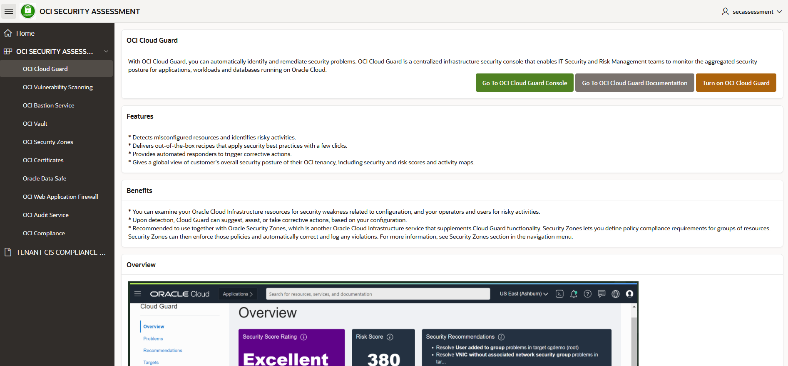

# Lab 2: View report on OCI Security Center Dashboard

## Introduction
This lab will show you how to use the OCI Security Center dashboard.

Estimated time: 25 minutes

### Objectives
In this lab, you will:

- Post security reports in Autonomous Database via REST calls
- Check those reports in Security Dashboard UI

As you remember, in previous lab you performed step 1, described in the picture below. In this lab, you will perform steps 2 and 3:

   


### Prerequisites
This lab assumes you have completed previous lab.


## Task 1: Store reports in Autonomous Database

For the purpose of this lab, an Autonomous Database was created for you with following details:

* **Autonomous Database name**: SecAssessment\_XXX, where XXX is your student´s number.
* **Tables created (REST enabled)**: OCISECURITYCENTER, OCICISCOMPLIANCECHECK.
* **Users**: ADMIN, SECASSESSMENT
* **Passwords**: Provided to you by the trainers
* **Curl command location URLs**:
    * For OCISECURITYCENTER table:
    * For OCICISCOMPLIANCECHECK table:

1. Now you need to upload the CSV file stored in your bucket to your Autonomous Database. To do that, you will perform a REST call to the table where you want to store these results. To do that, run the following in the Cloud Shell terminal:
    
    ```
    cd security_assessments/<tenancy_name>-<date>
    ``` 
    
    where /&lt;tenancy\_name&gt;\-&lt;date&gt; is the directory created by the script and where the security assessment results file is stored.

    Now, run the command for the REST call to load the file into the Database table OCISECURITYCENTER:
    
    ```
    curl -X POST '<your curl command location URL>/batchload?batchRows=500' -H 'Content-type: text/plain'  -H 'cache-control: no-cache' --data-binary @security_assessment_report.csv
    ```

    where &lt;your curl command location URL&gt; is the URL for table OCISECURITYCENTER.
    
    To verify that everything went well, you should have an output as following:

    

2. (Optional) Same for CIS Summary report:

    ```
    cd cis_reports/<tenancy_name>-<date>
    ```  

    where &lt;tenancy\_name&gt;\-&lt;date&gt; is the directory created by the script and where the compliance assessment results file is stored.
    
    ```
    curl -X POST '<your curl command location URL>/batchload?batchRows=500' -H 'Content-type: text/plain'  -H 'cache-control: no-cache' --data-binary @cis_summary_report.csv
    ```
    where &lt;your curl command location URL&gt; is the URL you noted down for table OCICISCOMPLIANCECHECK.

3. As a verification step, you can go to your Autonomous Database by opening navigation menu, click on *"Oracle Database"* and *"Autonomous Database"*:

    

4. Once in the Autonomous Database page, specify the compartment ocw23-SecAssessment-HOL:


5. Identify your Autonomous Database in the list, and click on it. Once there, click Database Actions button:  

    

    **Note:** You may need to log in first as ADMIN, then Click Sign Out, and log in as SECASSESSMENT user.

6. Once you are logged in as SECASSESSMENT user, click SQL under Development:

   

    Enter the following command in the SQL Web Developer (logged in as SECASSESSMENT user):

    ```
    SELECT * from OCISECURITYCENTER;
    ```
    and run the command by pressing the "Run Script" button, highlighted in red in the picture below:

    

    It should display the results, proving that the load of the data has been working correctly. You should have something similar to:

    

7. If you loaded CIS report as well, run the following command in SQL Web Developer:
    
    ```
    SELECT * from OCICISCOMPLIANCECHECK;
    ```
    You can verify the data is loaded successfully.

## Task 2: Check your Security Dashboard

After the script is completely executed, and you loaded the CSV file in your Autonomous Database, you can log in to your APEX and the Security Dashboard appears. This dashboard is showing in a graphical format the security assessment report info.

1.	On the Autonomous Database dashboard, click on SecAssessment\_XXX under Instance Name on APEX Instance section:

    

2.	Click Launch APEX.

    

3. The log in page for APEX will be prompted and you need to log in as SECASSESSMENT user.

    

4. Once you are logged in, click App Builder and the Security Dashboard application that you installed earlier. Click Run Application.

    

5. Log in as SECASSESSMENT user in the application:

    

6. The OCI Security Assessment dashboard will appear. Click on the card to view your security assessment results.

    


7. Once you click, you will see the results obtained in the Security Assessment report in a table.

    In this section, you can easily see the suggestions in the OCI Security Assessment dashboard, to enable or not some security services according to your current implementation with three different options and colours:

    *	**Green**. Security services that are enabled.
    *	**Yellow**. Security services that were enabled but currently deleted for some reason.
    *	**Grey**. Security services that are not enabled and you may want to have a look.

    As an example, if all services are enabled, you will see something similar to:
  
    

    As well, at the bottom of the page you can see a button to be redirected to Oracle contacts page, in case you want to request an Oracle Security Workshop.
    
    After a review of the status of your security services enabled in your tenant, you may want to know more about them. In order to do that, you can click on the hamburger menu in the top left corner and a menu with different options showing the different security services will appear:

    
    
    Each section contains a description about each security service and three buttons with the following options:

    *	**Go to OCI Security Service Console**. Click here to implement the service manually in the OCI console.
    *	**Go to OCISecurity Service Documentation**. Click here to see more detailed information about the service.

    And in the Cloud Guard section, you also have the following button:

    *	**Turn on OCI Cloud Guard**. Click here to directly be redirected to Resource Manager service with the corresponding Terraform stack loaded to implement Cloud Guard.

    Pressing this button and see results will be the action performed in the next lab.

    You can play around and explore the different views of the dashboard. For example, for section OCI Cloud Guard:

    

    And for section OCI Vulnerability Scanning:

     

     Even you can see the compliance reports in section Tenant CIS Compliance section, in case you performed the optional actions in the previous labs. You will see something similar to:

      

    You may need to add hidden columns or reorder. As you can see, it is an interactive report where you have the possibility to do that by clicking in the button "Actions".

    For example, you can add hidden columns by doing the following:

     Click "Actions" menu and click Columns:

     

     In case there are hidden columns, you can select the columns you want to display:

     


    **Note:** If you want to re-run the scripts and reload the tables, before running the curl command again, you need to empty the tables first in the SQL tool. For this run the following command then the “select” to verify it’s empty:

    ```
    truncate table OCISECURITYCENTER;
    select * from OCISECURITYCENTER;
    ```

    

    Do the same with the Compliance table in case you loaded with data:

    ```
    truncate table OCICISCOMPLIANCECHECK;
    select * from OCICISCOMPLIANCECHECK;
    ```

**This concludes this lab.**
You may now **proceed to the next lab**.


## Learn More

* [Using cURL with REST-Enabled SQL Service](https://docs.oracle.com/en/database/oracle/oracle-rest-data-services/22.3/orddg/rest-enabled-sql-service.html#GUID-E44BF01E-7F11-44B4-B9AF-2755267D9D62)
* [SQL Developer Web for Oracle Autonomous Database](https://blogs.oracle.com/developers/post/sql-developer-web-now-available-for-oracle-autonomous-database)


## Acknowledgements
* **Authors** - Sonia Yuste (OCI Security Specialist), Damien Rilliard (OCI Security Senior Director) 
* **Last Updated By/Date** - Sonia Yuste, July 2023
