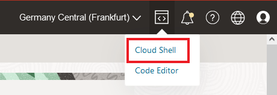
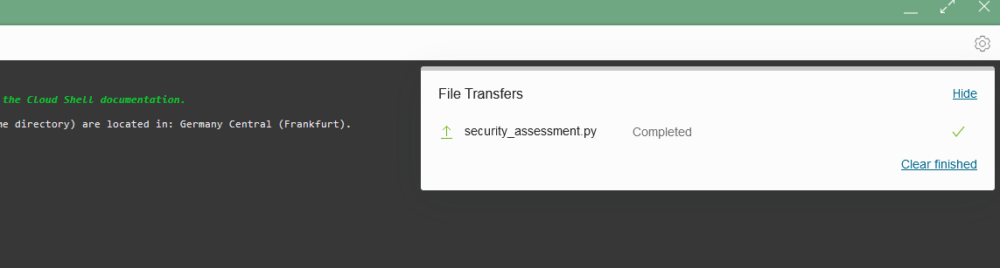
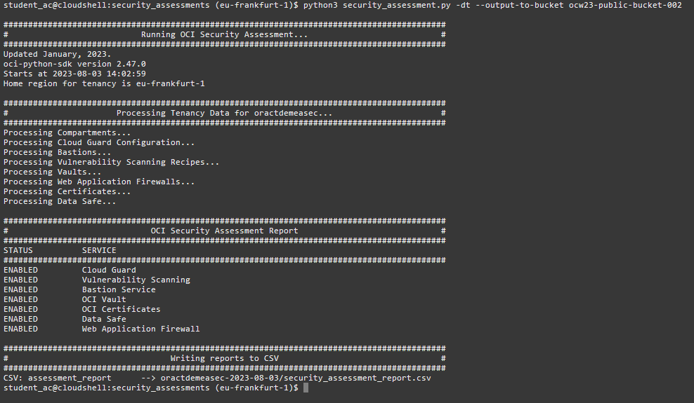
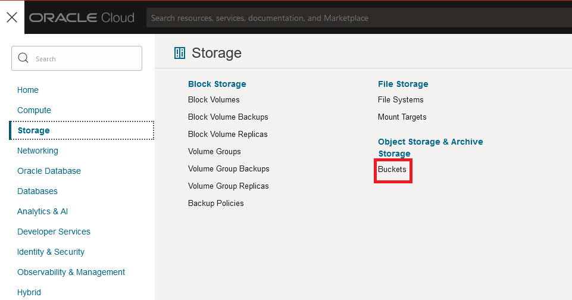
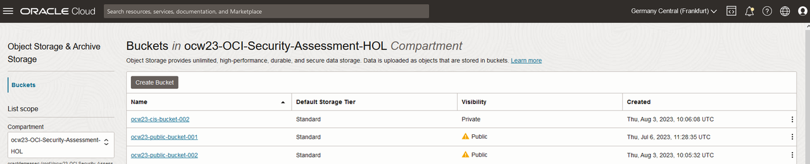
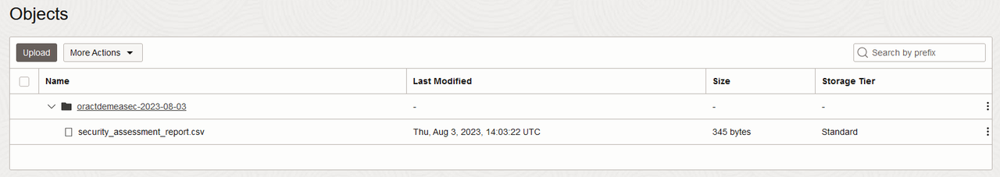
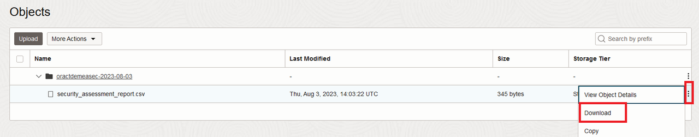
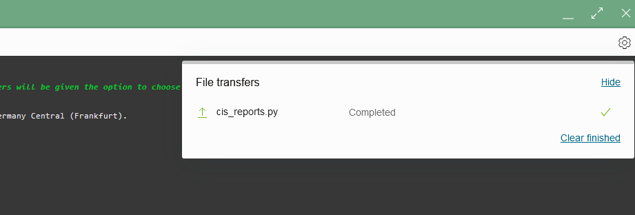

# Run your first OCI security assessment

## Introduction
This lab will show you how to start to automate the journey to security by using the provided key components that will make you have that Unique Security Experience. 

Estimated time: 20 minutes

[Walk Through the Lab](videohub:1_2g98saxu)

### Objectives
In this lab, you will:

- Download and run security and compliance assessment scripts in Oracle Cloud Shell
- Check assessment reports stored in OCI Cloud Shell machine and Object Storage buckets 

### Prerequisites
This lab assumes you got access to the OCI tenant provided for this workshop. 

## Task 1: Download and run security assessment script

In this task we will provide you with a link where you can download the Python script that you can execute to run your first security assessment in OCI. Once you download the script, you can save it locally and then you will run it in OCI Cloud Shell.

1. Log in to OCI as states in previous section "Getting Started".

1.	Download the [security assessment script.](https://c4u04.objectstorage.us-ashburn-1.oci.customer-oci.com/p/EcTjWk2IuZPZeNnD_fYMcgUhdNDIDA6rt9gaFj_WZMiL7VvxPBNMY60837hu5hga/n/c4u04/b/livelabsfiles/o/oci-library/security_assessment.py)
    Now you can run that security assessment script in the Oracle Cloud Shell. In order to do that, open the Oracle Cloud Shell by clicking in the Cloud Shell icon in the Console header:

    

2.  Upload the script in the Cloud Shell terminal by doing drag and drop. You will see a similar message:

    

    Before running the script, create a dedicated folder for the security assessment reports. Run the following command in Cloud Shell for that purpose:

    ```
    mkdir security_assessments
    ```

3. Move the script to the created folder: 

    ```
    mv security_assessment.py security_assessments
    ```
4. Move to the recently created folder: 

    ```
    cd security_assessments
    ```
5. Run the script and save results in a specific bucket:

    **Important**: You have been provided with a different bucket for the purpose of this lab. To identify your bucket's name, this time the bucket has the following format: ocw23-security-bucket-XXX, where XXX corresponds to your student number, provided to you by the trainers. 
 
    For example, if your student number is 001, you need to run following command:

    ```
    python3 security_assessment.py -dt --output-to-bucket ocw23-security-bucket-001
    ```
    
    After running the python script, you will see a similar output in Cloud Shell:

    

    The output of the script is displaying in the console which security services are enabled. After the script is executed and the output displayed in the console, a CSV file called “security\_assessment\_report.csv” is created automatically in a directory in the Cloud Shell with following format name: /&lt;tenancy&gt;-&lt;date&gt; and, at the same time, it is stored in your bucket.

    This file is the OCI security assessment report generated by the Python script. If you want to know deeper about the script usage, please refer to the Appendix.

6. To verify that the file was successfully uploaded into your bucket, navigate through the main hamburger menu, click **Storage** and now click **Buckets** under **Oject Storage & Archive Storage**.

    

7. Select the compartment ocw23-OCI-Security-Assessment-HOL on the menu left and locate your bucket (remember your bucket name is ocw23-security-bucket-XXX where XXX is your student number). Click on your bucket:

    

8. As you can see, if you scroll a bit down, the new Object was created in your bucket, corresponding to the report generated by the script you have just executed. The script generated a folder as Object, called oractdemeasec-&lt;date&gt;. If you display the content of this folder by clicking on the little arrow, you will see the generated CSV file, which corresponds to the security assessment report in CSV format:

    

9. You will see the content of this file in the next steps. However, if you are curious now, you can always have a look into it. Optionally, click on the 3 dots on the right next to the report and click **Download**:

    

10. The download will start and when it is finished, you can open the file. It will have same content you saw displayed in the cloud shell.


## Task 2: Download and run CIS benchmark compliance assessment script

In this task, similar process should be followed, but this time you will execute the compliance assessment.

1. Download the [CIS reports script](https://c4u04.objectstorage.us-ashburn-1.oci.customer-oci.com/p/EcTjWk2IuZPZeNnD_fYMcgUhdNDIDA6rt9gaFj_WZMiL7VvxPBNMY60837hu5hga/n/c4u04/b/livelabsfiles/o/oci-library/cis_reports.py) and save it locally.

2. Upload the script in the Cloud Shell terminal by doing drag and drop as you did with the security assessment script in previous task. 

    

3. Before going to the next step, please make sure you are on your home directory. Run the following command that will take you to your home directory:

    ```
    cd ~
    ```

3. Now, create a dedicated folder for the CIS reports by running the following command in the Cloud Shell: 
    
    ```
    mkdir cis_reports
    ```
4. Move the script to the folder:

    ```
    mv cis_reports.py cis_reports
    ```
    
5. Run the script within the created directory:

    ```
    cd cis_reports
    ```
    to run the script and store the generated report in a bucket, specify in the command your bucket for CIS compliance reports. In this case, the bucket's name is ocw23-cis-bucket-XXX, where XXX is your student number. For example, if your student number is 001, you need to run following command:

    ```
    python3 cis_reports.py -dt --output-to-bucket ocw23-cis-bucket-001
    ```  
6. This script is analyzing the CIS compliance of the current configuration in the tenancy. You can verify the new generated report in your bucket for CIS reports (ocw23-cis-bucket-XXX where XXX is your student number) as you did in the previous steps with the security assessment report.

**This concludes this lab.**
You may now **proceed to the next lab**.

## Appendix: How to use the Python script security_assessment.py
Information provided in this Appendix is rather intended as guidance for workshop users using security_assessment.py script to execute an OCI security assessment.

### Script usage
```
security_assessment.py  	[-h][-t CONFIG_PROFILE][-p PROXY]
                            [--output-to-bucket OUTPUT_BUCKET]
                            [--report-directory REPORT_DIRECTORY]
                            [print-to-screen PRINT_TO_SCREEN][-ip][-dt]

```
### Input parameters


| Input variable     | Default value                            | Allowed values/example | Description                                                        |
| ------------------ | ---------------------------------------- | ---------------------- | ------------------------------------------------------------------ |
| -t                 | ""                                       | Tenancy profile        | Config file section to use                                         |
| -p                 | ""                                       | ww-proxy-server.com:80 | Set proxy                                                          |
| --output-to-bucket | ""                                       | my-reporting-bucket    | Set output bucket name                                             |
| --report-directory | /&lt;tenancy name&gt;-&lt;start date&gt; | /my/path/              | Set output report directory                                        |
| --print-to-screen  | True                                     | True/False             | Set to false if you want to see only non-enabled security services |
| -ip                | False                                    | -                      | Use instance principals for authentication                         |
| -dt                | False                                    | -                      | Use delegation token for authentication                            |

As you can see, the script has three options for authentication:  
* **Instance Principals**  
A security token is used for an instance principal.  Using the metadata endpoint for the instance (http://169.254.169.254/opc/v2) we can discover the region the instance is in, its leaf certificate and any intermediate certificates (for requesting the token) and the tenancy (as) that is in the leaf certificate. To do that, X509FederationClient is leveraged, so it can also refresh the security token and also get the private key needed to sign requests (via the client’s session\_key\_supplier).  
* **Delegation Token**  
A delegation token allows the instance to assume the privileges of the user for which the token was created.  
* **Config file**  
Using the default configuration location \~/.oci/config you can load any profile. By default, the DEFAULT profile is used.


## Learn More
* [CIS compliance script](https://github.com/oracle-quickstart/oci-cis-landingzone-quickstart/blob/main/compliance-script.md)
* [CIS](https://www.cisecurity.org/ )
* [OCI SDK and CLI configuration file](https://docs.oracle.com/en-us/iaas/Content/API/Concepts/sdkconfig.htm)

## Acknowledgements
* **Authors** - Sonia Yuste (OCI Security Specialist), Damien Rilliard (OCI Security Senior Director) 
* **Last Updated By/Date** - Sonia Yuste, July 2023
