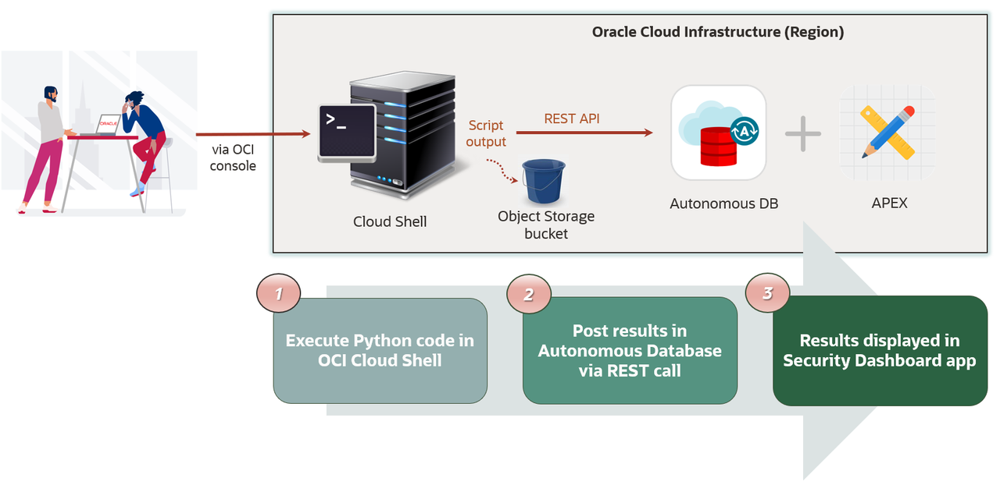
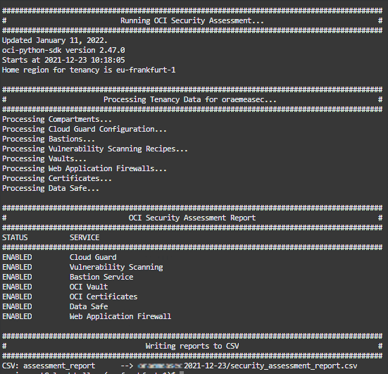

# Lab 1: Run your first OCI security assessment

## Introduction
This lab will show you how to start to automate the journey to security by using the provided key components that will make you have that Unique Security Experience. You will start by running the OCI Security Assessment.

Estimated time: 20 minutes

### Objectives
In this lab, you will:

- Download and run security and compliance assessment scripts
- Store assessment results in Object Storage buckets

Please see picture below with the components and actions involved in the Unique Security Experience:

   

You will perform step 1 in this lab. The steps 2 and 3 will be performed in the next lab.

### Prerequisites
This lab assumes you got access to the OCI tenant provided for this workshop. Log in to the Oracle Cloud tenant as states in previous section "Getting Started".

## Task 1: Download and run security assessment script

1.	Download the [security assessment script.](https://objectstorage.us-ashburn-1.oraclecloud.com/p/Ei1_2QRw4M8tQpk59Qhao2JCvEivSAX8MGB9R6PfHZlqNkpkAcnVg4V3-GyTs1_t/n/c4u04/b/livelabsfiles/o/oci-library/security_assessment.py)
    Now you can run that security assessment script in the Oracle Cloud Shell. In order to do that, open the Oracle Cloud Shell by clicking in the Cloud Shell icon in the Console header:

    

2.  Upload the script in the Cloud Shell terminal by doing drag and drop. You will see a similar message:

    

    Before running the script, create a dedicated folder for the security assessment reports. Run the following command in Cloud Shell for that purpose:

    ```
    mkdir security_assessments
    ```

3. Move the script to the created folder: 

    ```
    mv security_assessment.py security_assessments
    ```
4. Move to the recently created folder: 

    ```
    cd security_assessments
    ```
5. Run the script and save results in your bucket:

    **Note**: You have been provided with a specific bucket for the purpose of this lab. To identify your bucket's name, it has the following format: security\_assessment\_XXX, where XXX corresponds to your student's number, provided to you by the trainers. 

    ```
    python3 security_assessment.py -dt --output-to-bucket security_assessment_XXX
    ```
    
    After running the python script, you will see a similar output in Cloud Shell:

    

    The output of the script is displaying in the console which security services are enabled. After the script is executed and the output displayed in the console, a CSV file called “security\_assessment\_report.csv” is created automatically in a directory in the Cloud Shell with following format name: /&lt;tenancy&gt;-&lt;date&gt; and, at the same time, it is stored in your bucket.

    This file is the OCI security assessment report generated by the Python script. If you want to know deeper about the script usage, please refer to the Appendix.

## Task 2 (Optional): Download and run CIS benchmark compliance assessment script

1. Download the [CIS reports script.](https://objectstorage.us-ashburn-1.oraclecloud.com/p/Ei1_2QRw4M8tQpk59Qhao2JCvEivSAX8MGB9R6PfHZlqNkpkAcnVg4V3-GyTs1_t/n/c4u04/b/livelabsfiles/o/oci-library/cis_reports.py) 

2. Upload the script in the Cloud Shell terminal by doing drag and drop as you did with the security assessment script in previous task.

3. Create a dedicated folder for the CIS reports by running the following command in the Cloud Shell:
    
    ```
    mkdir cis_reports
    ```
4. Move the script to the folder:

    ```
    mv cis_reports.py cis_reports
    ```
    
5. Run the script within the created directory:

    ```
    cd cis_reports
    ```
    to run the script and store the generated report in a bucket, specify in the command your bucket for CIS compliance reports. In this case, the bucket's name is cis\_report\_XXX, where XXX is your student's number:

    ```
    python3 cis_reports.py -dt --output-to-bucket cis_report_XXX
    ```  


**This concludes this lab.**
You may now **proceed to the next lab**.

## Appendix: How to use the Python script security_assessment.py
Information provided in this Appendix is rather intended as guidance for workshop users using security_assessment.py script to execute an OCI security assessment.

### Script usage
```
security_assessment.py  	[-h][-t CONFIG_PROFILE][-p PROXY]
                            [--output-to-bucket OUTPUT_BUCKET]
                            [--report-directory REPORT_DIRECTORY]
                            [print-to-screen PRINT_TO_SCREEN][-ip][-dt]

```
### Input parameters


|   Input variable       |     Default value    |   Allowed values/example        |   Description      |
|------------------------|------------------------|------------------------|------------------------|   
|  -t  |  ""      |        Tenancy profile      |    Config file section to use    |
|  -p  |  ""      |        ww-proxy-server.com:80  |  Set proxy  |
|  --output-to-bucket    |   ""    |   my-reporting-bucket    |    Set output bucket name   |
|   --report-directory   |      /&lt;tenancy name&gt;-&lt;start date&gt;   |   /my/path/  |  Set output report directory  |
|   --print-to-screen    |   True   |    True/False    |   Set to false if you want to see only non-enabled security services   |
|   -ip   |   False   |    -    |  Use instance principals for authentication  |
|   -dt  |   False   |    -    |  Use delegation token for authentication  |

As you can see, the script has three options for authentication:  
* **Instance Principals**  
A security token is used for an instance principal.  Using the metadata endpoint for the instance (http://169.254.169.254/opc/v2) we can discover the region the instance is in, its leaf certificate and any intermediate certificates (for requesting the token) and the tenancy (as) that is in the leaf certificate. To do that, X509FederationClient is leveraged, so it can also refresh the security token and also get the private key needed to sign requests (via the client’s session\_key\_supplier).  
* **Delegation Token**  
A delegation token allows the instance to assume the privileges of the user for which the token was created.  
* **Config file**  
Using the default configuration location \~/.oci/config you can load any profile. By default, the DEFAULT profile is used.


## Learn More
* [CIS compliance script](https://github.com/oracle-quickstart/oci-cis-landingzone-quickstart/blob/main/compliance-script.md)
* [CIS](https://www.cisecurity.org/ )
* [OCI SDK and CLI configuration file](https://docs.oracle.com/en-us/iaas/Content/API/Concepts/sdkconfig.htm)

## Acknowledgements
* **Authors** - Sonia Yuste (OCI Security Specialist), Damien Rilliard (OCI Security Senior Director) 
* **Last Updated By/Date** - Sonia Yuste, July 2023
