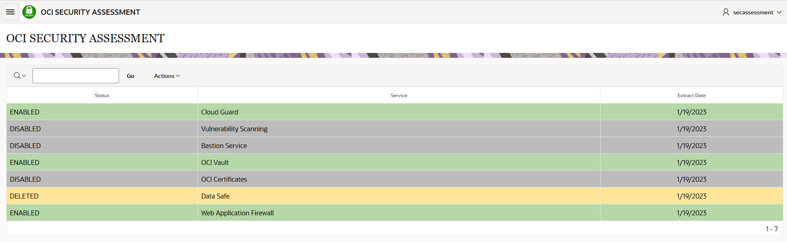
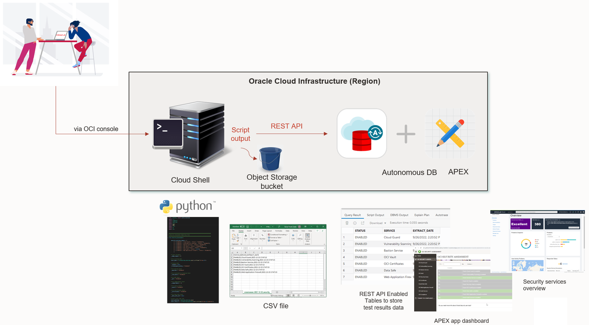
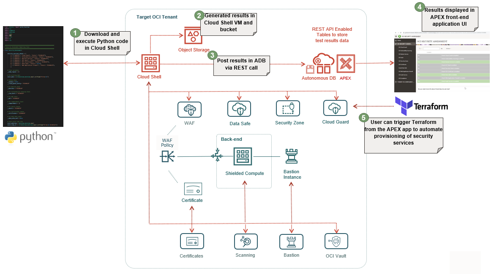

# Introduction

The purpose of this workshop is to accompany you on your journey to security and compliance in Oracle Cloud Infrastructure (OCI). During this workshop, you will be able to discover and get familiar with all the security capabilities that Oracle Cloud offers natively, besides checking the CIS (Center Internet Security) compliance. This will make sure you can enjoy your first Oracle Unique Security Experience.

### About this Workshop

In this workshop, you will go through a first lab to take a tour of several very interesting integrated security services in an Oracle Cloud Infrastructure tenancy, where you will be able to explore and try the different native services for real such as Cloud Security Posture Management, Database security, etc. The next labs will show you how to identify at a glance if you are using those security services and how to make it simpler to assess your tenant security. For this purpose, those labs will walk you through the execution of your first security and compliance asssessments in OCI. Apart from that, you will check the assessments results in a provided User Interface: your Security and Compliance Center. Below you can see an example:

Estimated Time: 90 minutes (this estimate is for the entire workshop - it is the sum of the estimates provided for each of the labs included in the workshop.)

### Objectives

   * Take a tour and explore by yourself for real the main security services in Oracle Cloud Infrastructure.
   * Execute your first security and compliance assessment by launching a Python script in Oracle Cloud Shell. Oracle Cloud Shell is a web browser-based terminal accessible from the Oracle Cloud Console, and provides an ephemeral machine to use as a host for a Linux shell. 
    The script generates your security and compliance assessment reports in CSV files, and stores those files in two locations simulataneously:

      * The Cloud Shell Linux machine
      * An Object Storage bucket

   * Send the security and compliance assessment reports from the Cloud Shell Linux machine to specifc Autonomous Database tables via REST API calls.
   * Check assessments results in the Security and Compliance Center. Navigate through the different pages to check available security services in OCI.

Below you can see the architecture components for this Unique Security Experience:

### Architecture

In this workshop, you will use the following OCI services and components:

* Oracle Cloud Shell
* Provided Python script
* Object Storage buckets
* Autonomous Database
* APEX hosted in Autonomous Database
* Provided APEX application 
* Oracle Cloud Guard and Threat Intelligence Service
* Oracle Data Safe
* Oracle Compliance documents

In general, you could extend the use of the provided Security Center dashboard and assessment script. As security should be always a lifecycle, you can always go back to first step after you finish with some security services implementations, and start from the beginning, completing the security lifecycle.

In that case, then have a view of the following figure, where you can see the complete diagram of all possible OCI services that this Unique Security Experience could apply:

  

By following the above architecture, red connections and components are referring to the different parts that are part of this workshop. 

Numbers indicate the order of each task. In this way, it is clear to see the procedure that will be followed in this workshop.

## Lab Breakdown

- **Lab 1:** Run your first OCI security assessment
- **Lab 2:** View reports on OCI Security Center Dashboard
- **Lab 3:** Overview of OCI security services

## What's Next?

  You are all set to begin the labs! You may now **proceed to the next lab**.

## Learn More

* [Oracle Cloud Infrastructure Security](https://www.oracle.com/security/)

## Acknowledgements
* **Authors** - Sonia Yuste (OCI Security Specialist), Damien Rilliard (OCI Specialist Senior Director)
* **Last Updated By/Date** - Sonia Yuste, August 2023

