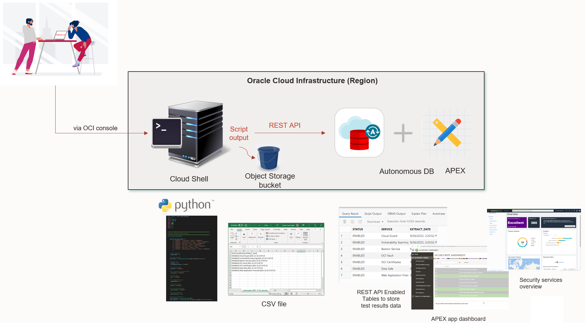

# Introduction

The purpose of this workshop is to accompany you on your journey to your first security and compliance assessments in Oracle Cloud Infrastructure (OCI). During this workshop, you will be able to discover and get familiar with all the security capabilities that Oracle Cloud offers natively, besides checking the CIS (Center Internet Security) compliance. This will make sure you can enjoy your first Oracle Unique Security Experience.

### About this Workshop

In order to be able to perform this workshop, you will be provided with a link to download two Python scripts. By running those scripts in OCI, you will be able to execute your security and compliance asssessments. Apart from that, an APEX application running on an Oracle Autonomous Database will act as User Interface for your Security and Compliance Center. In this UI, you will be able to find the results of your assessments, together with an overview of available security services. You will have the opportunity to try some of these security services as the last part of the workshop.

Below you can see an example of the Security and Compliance Center showing security and compliance assessments:

Estimated Workshop Time: 60 minutes (this estimate is for the entire workshop - it is the sum of the estimates provided for each of the labs included in the workshop.)

### Objectives

* Execute your first security and compliance assessment by launching a Python script in Oracle Cloud Shell. Oracle Cloud Shell is a web browser-based terminal accessible from the Oracle Cloud Console, and provides an ephemeral machine to use as a host for a Linux shell. 
The script generates your security and compliance assessment reports in CSV files, and stores those files in two locations simulataneously:

    * The Cloud Shell Linux machine
    * An Object Storage bucket

* Transfer the security assessment reports from the Cloud Shell Linux machine to an Autonomous Database table via REST API calls.
* Check all results of your security and compliance assessments in the Security and Compliance Center. Navigate through the different pages to check available security services available in OCI.
* Have a look and try some main security services in OCI.

Below you can see the architecture components for this Unique Security Experience:

### Architecture

In this workshop, you will use the following OCI services and components:

* Oracle Cloud Shell
* Provided Python script
* Object Storage buckets
* Autonomous Database
* APEX hosted in Autonomous Database
* Provided APEX application 
* Oracle Cloud Guard and Threat Intelligence Service
* Oracle Data Safe
* Oracle Compliance documents

In general, you could extend the use of the provided Security Center dashboard and assessment script. As security should be always a lifecycle, you can always go back to first step after you finish with some security services implementations, and start from the beginning, completing the security lifecycle.

In that case, then have a view of the following figure, where you can see the complete diagram of all possible OCI services that this Unique Security Experience could apply:
Complete architecture

By following the above architecture, red connections and components are referring to the different parts that are part of this workshop. 

Numbers indicate the order of each task. In this way, it is clear to see the procedure that will be followed in this workshop.

## Lab Breakdown

- **Lab 1:** Run your first OCI security assessment
- **Lab 2:** View reports on OCI Security Center Dashboard
- **Lab 3:** Overview of OCI security services

## What's Next?

  You are all set to begin the labs! You may now **proceed to the next lab**.

## Learn More

* [Oracle Cloud Infrastructure Security](https://www.oracle.com/security/)

## Acknowledgements
* **Authors** - Sonia Yuste (OCI Security Specialist), Damien Rilliard (OCI Specialist Senior Director)
* **Last Updated By/Date** - Sonia Yuste, July 2023

