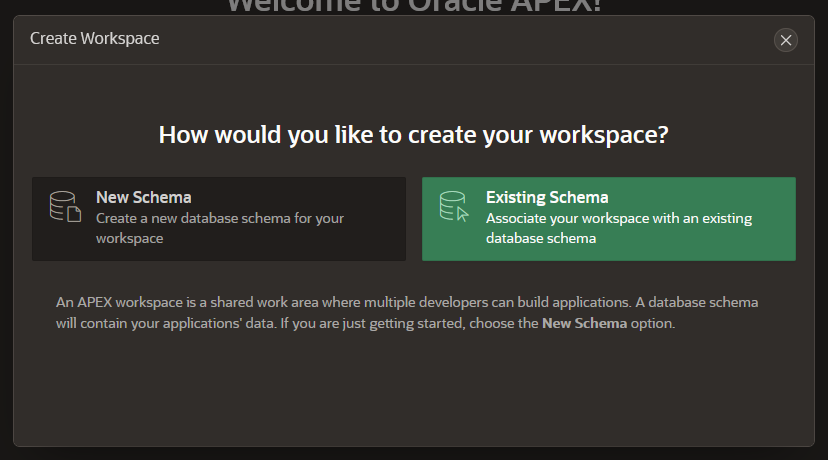
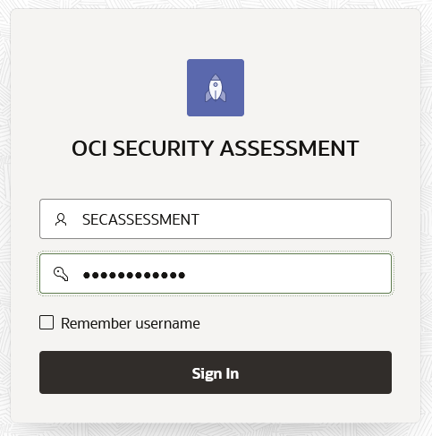

# Prepare your OCI tenant to execute the Unique Security Experience tool

## Introduction

This lab will show you how to set up your OCI tenant in order to have your Unique Security Experience.

Estimated Time: -- minutes

### Objectives

In this lab, you will:
*  Set up Oracle Cloud Shell
*  Create your compartment
*  Create your buckets
*  Provision and configure your Autonomous Database
*  Install the Security Dashboard application

### Prerequisites (Optional)

This lab assumes you have:
* An Oracle Cloud account


*This is the "fold" - below items are collapsed by default*

## Task 1: Set up Oracle Cloud Shell

To be able to execute the security assessments, you will run a Python script in Oracle Cloud Infrastructure (OCI) Cloud Shell. The SDK Python is pre-configured with your credentials and ready to use immediately from within Cloud Shell. For more information on using the SDK for Python from within Cloud Shell, see [SDK for Python Cloud Shell Quick Start](https://docs.oracle.com/en-us/iaas/Content/API/Concepts/cloudshellquickstart_python.htm#Cloud_Shell_Quick_Start_SDK_for_Python).

OCI Cloud Shell is a web browser-based terminal accessible from the Oracle Cloud Console. Cloud Shell is free to use (within monthly tenancy limits), and provides access to a Linux shell, with a pre-authenticated Oracle Cloud Infrastructure CLI, a pre-authenticated Ansible installation, and other useful tools for following Oracle Cloud Infrastructure service tutorials and labs. Cloud Shell is a feature available to all OCI users, accessible from the Console. Your Cloud Shell will appear in the Oracle Cloud Console as a persistent frame of the Console and will stay active as you navigate to different pages of the Console.
Cloud Shell provides:
* An ephemeral machine to use as a host for a Linux shell, pre-configured with the latest version of the OCI Command Line Interface (CLI) and a number of useful tools
* 5GB of storage for your home directory
* A persistent frame of the Console which stays active as you navigate to different pages of the console
To get started with Cloud Shell, you’ll need to grant user access to Cloud Shell via an IAM policy. Each service in Oracle Cloud Infrastructure integrates with IAM for authentication and authorization, for all interfaces (the Console, SDK or CLI, and REST API). The following is an example policy to grant access to Cloud Shell:

```
allow group <GROUP-NAME> to use cloud-shell in tenancy
```

After that, you have to install python in Cloud Shell and download the python scripts that will execute the security and compliance assessments. In order to do that, follow the next steps:

1. Log in to the OCI console.

2. Click the Cloud Shell icon in the Console header. Note that the OCI CLI running in the Cloud Shell will execute commands against the region selected in the Console's Region selection menu when the Cloud Shell was started.

  

This displays the Cloud Shell in a "drawer" at the bottom of the console:


3. Install setup venv and install OCI

    ```
    python3 -m venv python-venv   
    source python-venv/bin/activate    
    pip3 install oci
    ```

4. If error message appears with new version available, you can upgrade with

    ```
    pip install –upgrade pip
    ```

## Task 2: Create your compartment

First you need to create a new compartment for your deployment. To do that, follow the next steps:

1. Log in to the OCI console and navigate through the main hamburger menu to *"Identity & Security > Compartments"*


2.	Create a new compartment by clicking Create Compartment and name it “USE_Workshop”


## Task 3: Create your buckets

You will create a bucket in Object Storage to store your security assessment reports. Optionally, you can create a second bucket if you want to run as well the CIS compliance assessment.

To create the buckets, please follow the next steps:

1. Log in to OCI console and navigate through the main hamburger menu to *"Storage > Object Storage > Buckets"*.


2. Create a bucket in the previously created compartment USE_Workshop by selecting the compartment and click Create Bucket.


3. Name it security_assessment and click Create.


4.	(Optional) Create a second bucket to store the CIS Compliance Assessment, and name it cis_report by following previous steps.

## Task 4: Provision and configure your Autonomous Database

You will create an Autonomous Database that will provide you the following functionalities in this workshop:

* Repository for your security assessment reports
* Front-end user interface by using the hosted APEX

1. To provision an Autonomous Database, navigate through the main hamburger menu to: *Oracle Database > Autonomous Database*.


2.	Click Create Autonomous Database:


3.	Fill the parameters as follows:
    *   Compartment: USE_Workshop
    *	Display Name: SecAssessments
    *	Database Name: SecAssessments
    *	Workload type: Transaction Processing
    *	Deployment type: Shared Infrastructure
    *	Configure the database: \<Leave it as default>
    *	Administrator credentials: \<your ADMIN password>
    *	Network access: Secure access from everywhere
    *	License type: Bring Your Own License (BYOL)
    *   Oracle Database Edition: Oracle Database Standard Edition (SE)

and click Create Autonomous Database. Then wait until the database status is set to green and ACTIVE.


Now, you will create the database user to manage APEX applications.

The Autonomous Database ADMIN account is REST Enabled. This allows for REST Services to be published in the ADMIN schemas and allows you to access Database Actions using the ADMIN database user account. Oracle recommends you create an application schema account for your RESTful Services and REST enabled objects.

The authenticated database user is only permitted access if the schema is REST enabled and the URL mapping for the request points to their own schema. A user is not authenticated when a request points to any other database schema.


4.	Once the Autonomous Database status is set to green and ACTIVE, click on Database Actions.


5. Log in with ADMIN user and the password you provided during database creation.


6.	Click on SQL box, under Development section.


7.	Web SQL Developer will launch, and you will be able to run SQL queries to create users and tables.

  


8. Create a database schema named SECASSESSMENT and grant required permissions, as we will use it in trying out RESTful services. To do that, copy the following SQL code and paste it on the SQL developer. Then click the button "Run Script" and you will be able to see the Script Output showing the actions were successfully performed:


    ```
    CREATE USER SECASSESSMENT IDENTIFIED BY <your password>;
    GRANT CONNECT TO SECASSESSMENT;
    GRANT RESOURCE TO SECASSESSMENT;
    GRANT UNLIMITED TABLESPACE TO SECASSESSMENT;
    ```
    


    *Note:* A new user is granted CONNECT and RESOURCE roles when Web Access is selected.
    Granting UNLIMITED TABLESPACE privilege allows a user to use all the allocated storage space. You cannot selectively revoke tablespace access from a user with the UNLIMITED TABLESPACE privilege. You can grant selective or restricted access only after revoking the privilege.
    For sake of simplicity, you can use same password you used for ADMIN user.

9. Enable REST for the new created schema SECASSESSMENT. To do that, go to the Autonomous Database dashboard, click Database Actions and click DATABASE USERS under the section Administration.


10. You will be able to see all users in the Autonomous Database. Click in the menu the recently created user SECASSESSMENT and select Enable REST:


11. A window will prompt, you can leave default values and click REST Enable User:


12. After you created the user and granted all required permissions to manage APEX, you will create now a table to store security assessments by running the following script:
    ```
    CREATE TABLE SECASSESSMENT.OCISECURITYCENTER
    (   STATUS VARCHAR2(50 BYTE) COLLATE "USING_NLS_COMP",
        SERVICE VARCHAR2(255 BYTE) not null,
        EXTRACT_DATE DATE not null
    )   DEFAULT COLLATION "USING_NLS_COMP";
    ```
    

13. In same way that you enabled your schema SECASSESSMENT for REST, you need to enable the OCISECURITYCENTER table for REST as well. To do that, you have to log in in Web SQL Developer as SECASSESSMENT. You can do it in a quick way by going again to the Database Users view:

      

    Click in Open in new tab, you will have to enter the credentials for SECASSESSMENT schema and click Sign in:

    

14. Go to SQL under Development again, and now you are signed as SECASSESSMENT in Web SQL Developer. Right click on the OCISECURITYCENTER table and select REST --> Enable…


15.	Note the curl command location URL (Preview URL) from the new window, and click Enable:


16. (Optional) If you decided to run the OCI Compliance assessment as well, you need to create the tables to store the outcome data of OCI CIS Compliance Benchmark:

    ```
    CREATE TABLE "SECASSESSMENT"."OCICISCOMPLIANCECHECK"
        (   "Recommendation #" NUMBER,
            "Section" VARCHAR2(50 BYTE) COLLATE "USING_NLS_COMP",
            "Level" NUMBER,
            "Compliant" VARCHAR2(50 BYTE) COLLATE "USING_NLS_COMP",
            "Findings" NUMBER,
            "Title" VARCHAR2(255 BYTE) not null,
            "extract_date" DATE not null
        )   DEFAULT COLLATION "USING_NLS_COMP"  ;
    ```
    You will need to enable for REST this table in same way as you did for the OCISECURITYCENTER table.


## Task 5: Install the Security Dashboard application

Proceed to OCI console to perform the next steps:

1. On the Autonomous Database dashboard, click on SecAssessments under Instance Name on APEX Instance section:
    


2. Click launch APEX

    

3.	The log in page for APEX will be prompted and you need to enter the ADMIN password of your Autonomous Database to log in:

    

4. Create your workspace by clicking Create Workspace:

    

5. You will be prompted with a windows asking you how you would like to create your workspace. For this lab, you will select Existing Schema, as you will associate the new workspace with the database schema that you just created:

    

6. Create your workspace with following information:

    * Database User: SECASSESSMENT 
    * Workspace Name: OCISECURITYCENTER
    * Workspace Username: SECASSESSMENT
    * Workspace Password: \<your password for SECASSESSMENT>

    


7. Sign out of Administration Services and sign in to OCISECURITYCENTER to begin building applications. Click Sign Out:

    

9. Sign in with the following credentials:

    


10. Now download the packaged APEX application: TODO  

11. Click App Builder and Import.

    

    

12. Select Database Application, Page or Component Export and drag and drop the provided zip file: OCISecurityCenter.zip. Click Next.

    

13. Click Next.

    

14.	Review the details and click Install Application.

    

15.	Once you see the message for Application Installed, click Run Application.

    

16.	You will be redirected to the APEX application log in page, and you will be asked to enter the credentials for SECASSESSMENT user.

    

17.	You are now able to see the OCI Security Center Dashboard. Click on the OCI SECURITY ASSESSMENT card:

    

18.	As you still did not run the Security and Compliance Assessment scripts, you do not have any data on it. Let’s continue and start with the Unique Security Experience in the next lab.


**This concludes this lab.**

## Appendix 1: USE Tool Python script security_assessment.py
Information provided in this Appendix is rather intended as guidance for workshop users using security_assessment.py script to execute an OCI security assessment as prescribed in this guide.

## Script usage
```
security_assessment.py  	[-h][-t CONFIG_PROFILE][-p PROXY]
                                              	[--output-to-bucket OUTPUT_BUCKET]
                                              	[--report-directory REPORT_DIRECTORY]
                                              	[print-to-screen PRINT_TO_SCREEN][-ip][-dt]

```
## Acknowledgements
* **Author** - Sonia Yuste, OCI Security Specialist, August 2022
* **Contributors** - 
* **Last Updated By/Date** - Sonia Yuste, OCI Security Specialist, August 2022


## Learn More

*(optional - include links to docs, white papers, blogs, etc)*

* [URL text 1](http://docs.oracle.com)
* [URL text 2](http://docs.oracle.com)

## Acknowledgements
* **Author** - <Name, Title, Group>
* **Contributors** -  <Name, Group> -- optional
* **Last Updated By/Date** - Sonia, September 22 2022