# Go for a walk through OCI Security

## Introduction

This lab will walk you through OCI Security, by having a look at main security services offered in OCI, their features and capabilities. 

Estimated Time: 25 minutes

[Walk Through the Lab](videohub:1_f7p6in14)

### Objectives

In this lab, you will:
*  Get familiar with Oracle Cloud Guard, the Cloud Security Posture Management solution native in Oracle Cloud Infrastructure. You will use Cloud Guard to perform automatic remediation for detected security problems in your tenant.
*  Explore Oracle Threat Intelligence service and threat detector in Cloud Guard, to discover new detected threats. 
*  Have an overview of Oracle Databases security service: Data Safe, and take a tour through the generated reports of few Oracle Databases.
*  Find compliance documents provided in the Oracle Cloud Infrastructure tenant.

### Prerequisites

This lab assumes you have completed the previous labs.

## Task 1: Detected problems in Cloud Guard and automatic remediation

In this task you will have a look at detected security problems in your OCI tenant. This will be shown in Cloud Guard service. 

1. To get more familiar with security services provided in OCI tenant, log in to your provided OCI tenant and navigate through the main hamburger menu to *"Identity & Security"*, and click *"Cloud Guard"*:

    

2. Cloud Guard is already enabled in this tenant and you can have a look at the **Overview** page, which will help you to quickly get a sense of the overall state of security in your environment, and quickly focus on the highest risk problems Cloud Guard has detected:

    

3. To view summary information on problems, click on the section **Problems** in the menu on the left:

    

4. Select the root compartment on the menu on the left, and check the option to "Include child compartments" to view all detected problems within the OCI tenant:

    
 
    Have a look to the list of detected problems within the OCI tenant. If you select now the compartment ocw23-OCI-Security-Assessment-HOL, you will see that Cloud Guard detected public buckets in it, and it is shown as a critical risk security problem:

    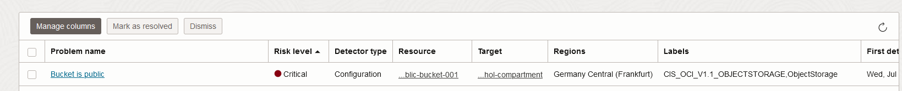

    You will test now the automatic remediation provided in Cloud Guard to solve that security problem.  

5. Identify the security problem corresponding to the public bucket with your student number (ocw23-OCI-public-bucket-XXX, where XXX is your student number). Look at the **Resource** column, and check the termination of the bucket name:
    
    

6. Once you identified the problem associated to your bucket, click on it and review the details, recommendations and all the info that Cloud Guard reports about the problem:

    

7. After you reviewed, you can click on **Remediate** to change the visibility of the bucket to private:

    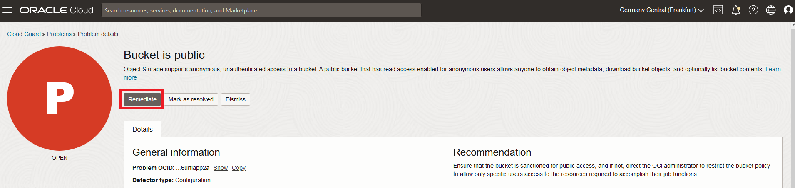

8. Once you click on **Remediate**, you will be prompted to a window with few options. Click on **Remediate** again:

     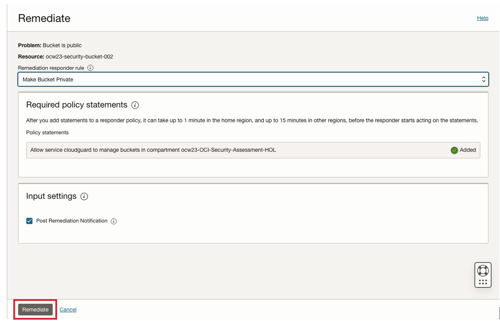

8. Refresh the list of problems in Cloud Guard and make sure that the problem associated to your bucket is not listed there anymore. To verify deeper, navigate to the hamburger menu and click *"Storage"*, then click *"Buckets"* under *"Object Storage"*:

    

10. Search for your bucket. You will be able to see the list of buckets under the specified compartment and the visibility. You can see that the visibility for your bucket is now private:

    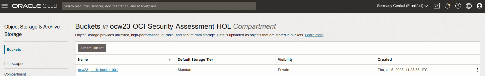

## Task 2: Discover new detected threats in Cloud Guard and Threat Intelligence service

Oracle Cloud Infrastructure (OCI) is making it easier for you to drive informed security decisions with Oracle Threat Intelligence Service. Oracle Threat Intelligence Service provides integrated, actionable threat intelligence to Oracle Cloud Guard and the Oracle Cloud Guard Threat Detector to help protect resources in your OCI tenancy.

Cloud Guard Threat Detector helps to identify malicious activities and rescue security operators from drowning in a sea of alerts. We anchored Threat Detector in the MITRE ATT&CK framework, and leverage Oracle's threat intelligence and data science capabilities to surface sightings of nefarious behaviors that really deserve your attention. You can avoid the trap of investigating every anomaly!

Threat Detector is an Oracle Cloud Guard detector recipe that continuously monitors OCI audit events looking for malicious activity. It uses a data platform capable of running machine learning (ML)-based behavioral attack models over long periods of time. Models are aligned with MITRE ATT&CK techniques so they are narrow enough to carry clear intent, yet broad enough to be durable as procedures evolve.

Threat Detector maintains user profiles that include the sequence of attack sightings and associated risk score. The risk score is formulated to track attack progression by considering factors such as severity and confidence of individual sightings, tactics and techniques involved, and their timing.

For example, let's investigate threats in your OCI tenant:

1. Open the navigation menu and click *"Identity & Security"*. Under *"Cloud Guard"*, select *"Threat Monitoring"*:

    

2. Have an overview of the Threat Monitoring page. On this page, you can see resource profiles generated for each OCI user and their key attributes to quickly identify the highest priority events. Ensure you are in root compartment to have global visibility. You will see something similar to:

    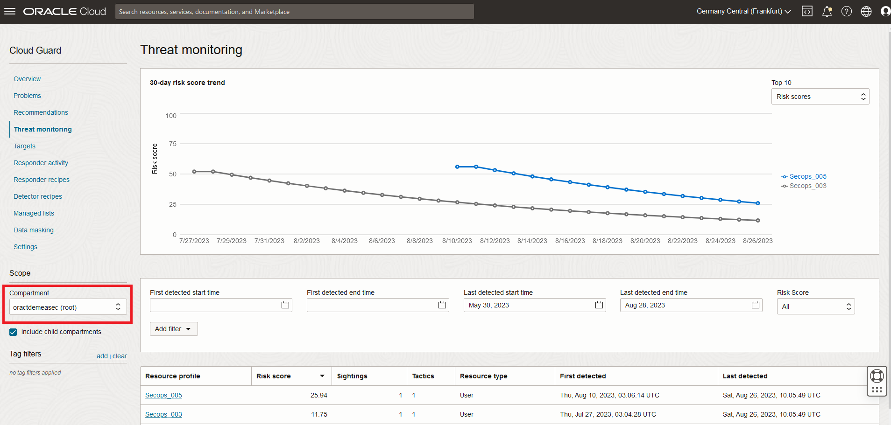

    Take into account that the collected data and corresponding graphics will be different in your case, as this is being updated with the time and correlated with users' activity in the tenant. 

    To view information for a particular resource profile, click one of the links in the **Resource profile** column, which corresponds to one of the OCI users:

    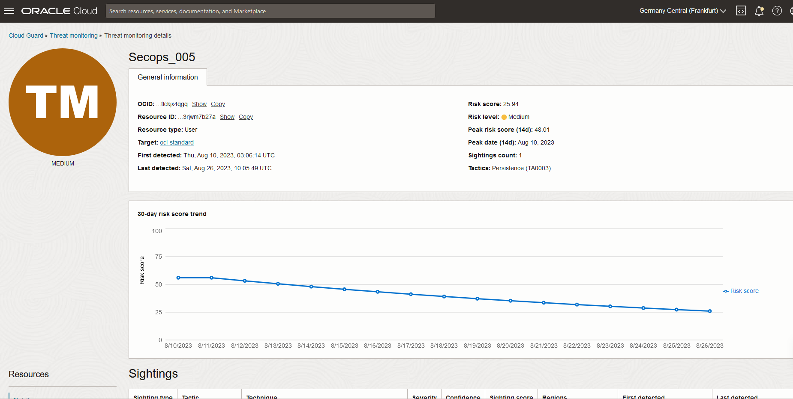

    * The **General Information** tab summarizes the threat.
    * The **30-day Risk Score Trend** chart shows **Risk Score** changes over time for this particular resource profile.
    * The **Sightings** section lists the sightings that factor into the risk score.
    * Under **Resources**, in the lower left corner, select another resource to display different information:
        * Impacted Resources shows information on the resources involved.
        * Endpoints shows the IP addresses involved.
    * If the **Risk Score** for this **Resource Profile** on the **Threat Monitoring** page is 80 or greater, a problem has been triggered. For guidance on processing problems, see [Processing and Resolving Problems on the Problems Page](https://docs.oracle.com/en-us/iaas/cloud-guard/using/problems-page.htm#problems-page).

3. After you review the Threat Monitoring page, let's have a look to OCI Threat Intelligence Service. OCI Threat Intelligence aggregates threat intelligence data across many different sources and manages this data to provide actionable guidance for threat detection and prevention in Oracle Cloud Guard and other Oracle Cloud Infrastructure services. This service provides insights from Oracle security researchers, our own unique telemetry, open source feeds such as abuse.ch and Tor exit relays, and third-party partners such as CrowdStrike, a cybersecurity company that correlates trillions of security events per day to deliver actionable insights to secure endpoints, workloads, identities, and data. To have a look at the service, open the navigation menu, click *"Identity & Security"* and *"Threat Intelligence"*:

    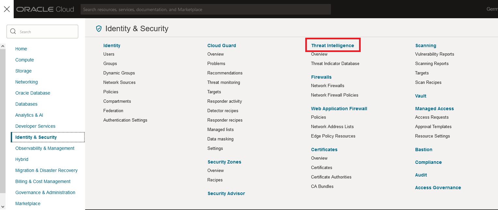

4. You can use Threat Intelligence to search for information about known threat indicators, including suspicious IP addresses, domain names, and other digital fingerprints. To do that, click on **View threat indicator database** button:

    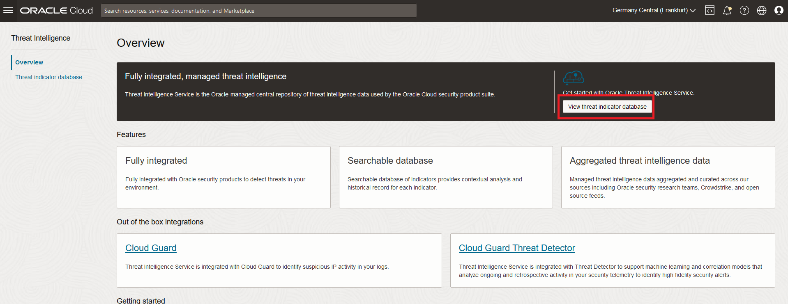

5. Search the Threat Intelligence database to learn more about specific threat indicators, such as an IP address. To do that, click on the Search field under **Search database** section and select IP address:

    

6. Click **Search** button and see the list that appears:

    

7. If you click on one of the IP addresses in the list, you will be able to see all the related info provided: 
    * On the **Information** tab, you will see a high level summary that provides key basic information like recency, geolocation and aggregate confidence score. Confidence level is the indication of "maliciousness" of the indicator based on quality of sources, observed behavior, and recency. 
    * On **Indicator history** section, you can see the summary of the sources that have reported this indicator to Threat Intelligence Service. It does not reflect activity in OCI tenancy. It is background information on who reported the indicator as potentially malicious. 

     

You have already had an overview on Threat Intelligence capabilities in OCI. To know more, please see provided links in section "Learn More" at the bottom of the page.

## Task 3: Improve the security for your Oracle Databases with Data Safe

Now you will have an overview of Data Safe service. Oracle Data Safe empowers organizations to understand data sensitivity, evaluate data risks, mask sensitive data, implement and monitor security controls, assess user security, and monitor user activity—all in a single, unified console. These capabilities help to manage the day-to-day security and compliance requirements of Oracle Databases, both on-premises and in the cloud.

1. Open the navigation menu, click *"Oracle Database"* and *"Data Safe - Database Security"*:

    

2. You can see the Oracle Data Safe page for onboarding. If you have a look, you have available several wizards to onboard Oracle Databases. This step you can skip, as there are some Oracle Databases that are being registered already. Click on the **Data Safe dashboard** button:

    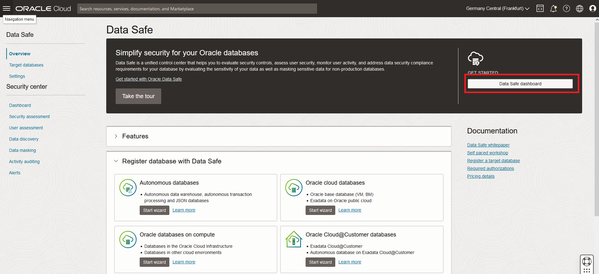

3. Select root compartment on the menu on the left, so that you can see all data related all registered Oracle Databases:

    

4. As you can see, the overview page of Data Safe is showing summary information and different dashboards corresponding to the generated reports for registered databases. Features provided by Data Safe are the following:

    * Security Assessment to assess the security of your database configurations.
    * User Assesment to assess the security of your database users and identify high risk users.
    * Data Discovery to find sensitive data in your databases.
    * Data Masking to mask sensitive data so that the data is safe for non-production purposes.
    * Activity Auditing to audit user activity on your databases so you can monitor database usage. 
    * Alerts to keep you informed of unusual database activities as they happen. 

5. You can take your time to have a look on the different sections in that page.

## Task 4: Find compliance documents 

Oracle provides information about frameworks for which an Oracle line of business has achieved a third-party attestation or certification for one or more of its services in the form of “attestations.” These attestations can assist in your compliance and reporting, providing independent assessment of the security, privacy and compliance controls of the applicable Oracle cloud services. In reviewing these third-party attestations, it is important that you consider they are generally specific to a certain cloud service and may also be specific to a certain data center or geographic region. The Compliance Documents service lets you view and download compliance documents. 

1. To list all compliance documents, open the navigation menu, click *"Identity & Security"*, and then click *"Compliance"*:

    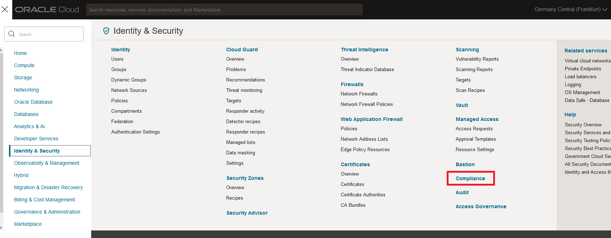

    As you can see, the Compliance Documents page displays all the documents that you have permission to view. From this page, you can sort documents by name, type, or creation date. You can also download documents to your local computer. 

   

2. To download one of the documents, you have to find the document you want to download, click the Actions menu to the right side of it, and then select **Download**:

     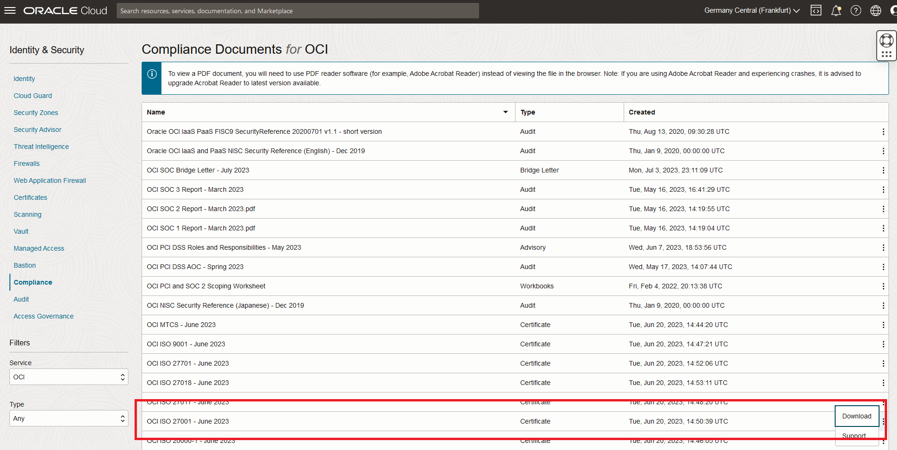

3. Review the terms of use. When you're ready, select the **I have reviewed and accept these Terms and Conditions** check box, and then click **Download File**:

    

You have successfully completed this lab and the workshop is complete!

## Learn more

### Understand Cloud Guard components and terminology

Cloud Guard examines your Oracle Cloud Infrastructure resources for security weakness related to configuration, and your operators and users for risky activities. Upon detection, Cloud Guard can suggest, assist, or take corrective actions, based on your configuration. These terms are important for you to understand as you work with Cloud Guard:

* Target

    Defines the scope of what Cloud Guard is to check. For Oracle Cloud Infrastructure, this scope is tied to the compartment where the target is defined and all the child compartments from that point until another target is encountered. The other target that's encountered takes over from that point into any descending compartments.

    *  A target can consist of your entire OCI tenancy (target at the root compartment).
    *  To monitor IAM policies, the root compartment must be a target.
    *  You must specify at least one target when you enable Cloud Guard. You can modify that target and define more targets later.
    *  Targets can't overlap, and only a single target at a time is applied to a compartment and its resources.
    *  A compartment (and its children) can be exempted from checks by being declared a target, but not having detector recipes applied to that target.

* Detector
  
    Performs checks and identifies potential security problems based on their type and configuration.

    * Detector recipe: Provides the baselines for examining the resources and activities in the target.
    * Detector rule: Provides a specific definition of a class of resources, with specific actions or configurations, that cause a detector to report a problem. A detector recipe consists of multiple detector rules. If any one rule is triggered, it causes the detector to report a problem. Each rule in a detector recipe can be configured individually.

* Problem

    Any action or setting on a resource that could potentially cause a security problem. Cloud Guard monitors your Oracle Cloud Infrastructure tenancy’s network activity to identify and resolve problems. Problems:

    * Are created when Cloud Guard discovers a deviation from a detector rule.
    * Are defined by the type of detector that creates them: activity or configuration.
    * Contain data about the specific type of issue that was found.
    * Can be resolved, dismissed, or remediated.

* Responder
    An action that Cloud Guard can take when a detector has identified a problem. The available actions are resource-specific. Responders are structured similar to detectors:

    * Responder recipe: Defines the action or set of actions to take in response to a problem that a detector has identified.
    * Responder rule: Defines the specific actions to take. If any one responder rule is triggered, it triggers the responder. Each rule in a detector recipe can be configured individually.
    Cloud Guard provides a set of responders with default rules. You can use these responders as is. You can clone any of the default responders and modify the rules to meet specific needs. You can enable and disable responder rules individually. You can limit the scope for applying individual rules by specifying conditions to limit the scope. 

* Managed list
    A reusable list of parameters that makes it easier to set the scope for detector and responder rules. For example, a predefined "Trusted Oracle IP address space" list contains all the Oracle IP addresses that you want to regard as trusted when you define rules for detectors and responders.

* Regions in Cloud Guard
    Activity that Cloud Guard monitors can occur it two types of regions:

    * Reporting Region: The default region for your Cloud Guard tenancy. The first region defined when your Cloud Guard tenancy was enabled. Integration with Notifications and Events services to send notification happens only in the reporting region. Selecting a particular region  from the Regions list at the top of the console has no effect on information displayed. To filter information by region, use the Filters on the Cloud Guard pages.
    * Monitored Regions: Other regions that your Cloud Guard tenancy monitors.
    * OCI Home Region: For Cloud Guard, the OCI home region is an unchangeable constant in the OCI environment.

### References

* [Oracle Cloud Guard - OCI Security Posture Management solution](https://www.oracle.com/security/cloud-security/cloud-guard/)
* [Video introduction to the Cloud Guard service](https://apexapps.oracle.com/pls/apex/f?p=44785:265:0:::265:P265_CONTENT_ID:31677)
* [OCI Threat Intelligence service](https://blogs.oracle.com/cloudsecurity/post/threat-intelligence-available-in-oci)
* [Oracle Data Safe](https://www.oracle.com/security/database-security/data-safe/)
* [Oracle Cloud Security services](https://www.oracle.com/security/cloud-security/)
* [Compliance in Oracle Cloud](https://www.oracle.com/corporate/cloud-compliance/)

## Acknowledgements
* **Authors** - Sonia Yuste (OCI Security Specialist), Damien Rilliard (OCI Specialist Senior Director)
* **Last Updated By/Date** - Sonia Yuste, August 2023