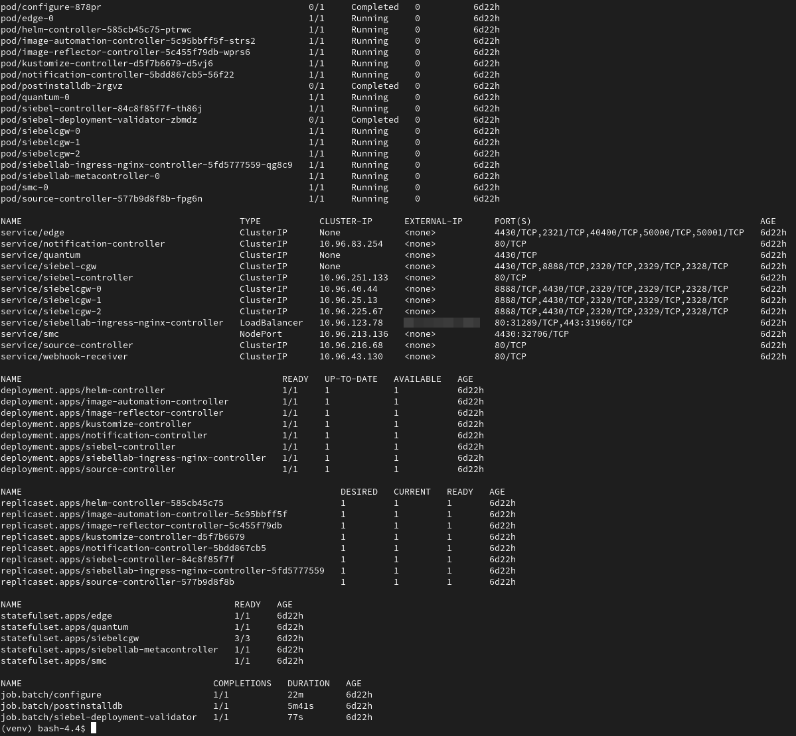

# Access the Siebel Kubernetes Cluster

## Introduction

In this lab, we shall access the Siebel Kubernetes Cluster that hosts the newly deployed Siebel CRM. In this way, we can see the various pods, services, and other Kubernetes resources running in the cluster and manage them as required.

Estimated Time: 20 minutes

### Objectives

In this lab, you will:
*   Gather connection details of the Siebel Kubernetes Cluster
*   Set up access to the Cluster from Siebel Cloud Manager instance
*   View the Siebel CRM environment in Kubernetes

### Prerequisites

* SSH Key

## Task 1: Gather connection details of the Siebel Kubernetes Cluster

1. Log in to Oracle Cloud Console and navigate to **Developer Services** and **Kubernetes Clusters (OKE)**

2. In the **List Scope** section on the left side panel, choose the compartment **SiebelLab**

3. Drill down on the cluster name, **siebellab\_oke\_cluster**

4. Click ***Access Cluster***

5. Click ***Local Access*** and note the commands mentioned.

## Task 2: Set up access to connect to the Cluster from Siebel Cloud Manager instance

1. Connect to the Siebel Cloud Manager instance through PuTTY using the ssh private key that we had created in Lab 1. Enter the username as **opc**

2. Execute the following command to enter the Siebel Cloud Manager container.

   ```
   $ <copy>docker exec -it cloudmanager bash</copy>
   ```

3. Now, execute the commands mentioned in the **Local Access** page from Oracle Cloud Console one by one in the PuTTY session. The commands would look like this,

   ```
   $ <copy>mkdir -p $HOME/.kube</copy>
   ```
   ```
   $ <copy>oci ce cluster create-kubeconfig --cluster-id {OCID_of_the_Cluster} --file $HOME/.kube/config --region us-ashburn-1 --token-version 2.0.0  --kube-endpoint PUBLIC_ENDPOINT</copy>
   ```
   ```
   $ <copy>export KUBECONFIG=$HOME/.kube/config</copy>
   ```
4. The config information will be written to the **$HOME/.kube/config** file of the Siebel Cloud Manager container. We are now ready to access the cluster.

## Task 3: View the Siebel CRM environment in Kubernetes

1. To view all the resources that were created as part of the new Siebel CRM environment, execute the following command.

   ```
   $ <copy>kubectl -n siebellab get all</copy>
   ```

   

In the above screenshot, the **siebelcgw-0** pod represents the Siebel Gateway, the **edge-0** pod represents the Siebel Server, and the **quantum-0** pod represents the Siebel Application Interface.

2. To enter a particular pod to execute commands or check services' status and so on, execute the following command.

    ```
    $ <copy>kubectl -n siebellab exec -it {Pod_Name} -- /bin/bash</copy>
    ```
    For example:
    ```
    $ <copy>kubectl -n siebellab exec -it edge-0 -- /bin/bash</copy>
    ```
## Summary

In this lab, we accessed the Siebel Kubernetes Cluster and viewed the various resources that support the Siebel CRM environment.

## Acknowledgements

* **Author:** Shyam Mohandas, Principal Cloud Architect, Cloud Engineering
* **Contributors** - Vinodh Kolluri, Raj Aggarwal, Mark Farrier, Sandeep Kumar
* **Last Updated By/Date** - Shyam Mohandas, Principal Cloud Architect, Cloud Engineering