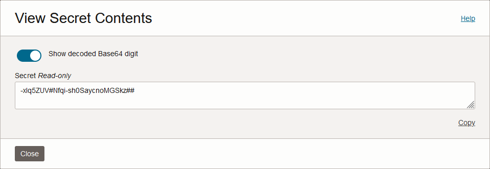
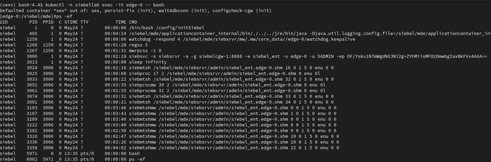

# Access the Siebel Kubernetes Cluster

## Introduction

In this lab, we access the Siebel Kubernetes Cluster hosting our deployed Siebel CRM Enterprise. We'll see the various pods, services, and other Kubernetes resources running in the cluster.

Estimated Time: 15 minutes

### Objectives

In this lab, you will:
*   View the Siebel CRM environment in Kubernetes

### Prerequisites

* SSH Key

## Task 1: View the Siebel CRM environment in Kubernetes

1. First log in via SSH to the SCM machine.

2. Once logged in to the SCM via SSH, enter the following command

   ```
   <copy>docker exec -it cloudmanager bash</copy>
   ```

   This drops us into a shell inside the cloudmanager container.

3. In Lab 4, we deployed Siebel CRM and, via a REST API call, we received an environment ID, referred to as **env_id**, which we used to follow the progress of the deployment. 

   Now we will want to interrogate the Kubernetes environment deployed for that environment. To begin, we can issue the following command for the environment.

   ```
   <copy>source /home/opc/siebel/{env_id}/k8sprofile</copy>
   ```

4. To view all the resources that were created as part of the new Siebel CRM environment, execute the following command (assuming you stuck with the name 'SiebelLab' in your environment payload)

   ```
   $ <copy>kubectl -n siebellab get all</copy>
   ```

   

   In the above screenshot, the **siebelcgw-0** pod represents the Siebel Gateway, the **edge-0** pod represents the Siebel Server, and the **quantum-0** pod represents the Siebel Application Interface.

6. You can verify the version of the Siebel container in use as follows.

    ```
    $ <copy>kubectl -n siebellab describe edge-0 | grep -i version</copy>
    ```

   or

    ```
    $ <copy>kubectl -n siebellab describe edge-0 | grep -i image</copy>
    ```


5. To enter a particular pod to execute commands or check services' status and so on, execute the following command.

    ```
    $ <copy>kubectl -n siebellab exec -it {Pod_Name} -- /bin/bash</copy>
    ```
    For example:
    ```
    $ <copy>kubectl -n siebellab exec -it edge-0 -- /bin/bash</copy>
    ```

6. From within the edge-0 pod, you can now connect to the database should you need to.

   ```
   $ <copy>sqlplus admin/{admin_password}@siebellab_tp</copy>
   ```

   When revisiting the vault secret for the password, ensure to click the radio button to show the decoded Base64 value if you aim to cut and paste the value you used.

   


7. We could also view the typical siebel processes running within the container.

   ```
   $ <copy>ps -ef</copy>
   ```

   

## Summary

In this lab, we accessed the Siebel Kubernetes Cluster,viewed the various resources that support the Siebel CRM environment, and delved briefly into the edge-0 container.

## Acknowledgements

* **Author:** Duncan Ford, Software Engineer; Shyam Mohandas, Principal Cloud Architect; Sampath Nandha, Principal Cloud Architect
* **Contributors** - Vinodh Kolluri, Raj Aggarwal, Mark Farrier, Sandeep Kumar
* **Last Updated By/Date** - Duncan Ford, Software Engineer, May 2024