# Deploy Siebel CRM

## Introduction

In this lab, we will deploy Siebel CRM. We prepare a JSON payload containing required environment details and send a **POST** request to the Siebel Cloud Manager (**SCM**) API to activate the deployment process.

Estimated Time: 1 hour

### Objectives

In this lab, you will:

*   Generate an Oracle Cloud Infrastructure (**OCI**) User Auth Token
*   Prepare a payload to deploy Siebel CRM
*   Install and set up Postman
*   Submit the payload for processing
*   Monitor the deployment
*   Launch the Siebel Application

### Prerequisites

* OCI Devops and SCM Instances

## Task 1: Generate an OCI User Auth Token

We need to log in to the OCI Tenancy and generate an [auth token for our user](https://docs.oracle.com/en-us/iaas/Content/Registry/Tasks/registrygettingauthtoken.htm). When SCM comes to the point where it needs to store Siebel containers in the tenancy's container registry, this token will be used, supplied as the **registry_password** in the payload.

1. Log in to the OCI tenancy.

2. Click the **Profile** icon at the top right and then click **My Profile**

   

3. On the left side panel, in the **Resources** section, click ***Auth Tokens***

   

4. Click **Generate Token**

   

5. Populate the **Description** with a useful name, then click **Generate Token**.

   

   ```
   <copy>SCM Registry Access</copy>
   ```

5. Copy the generated auth token and store it somewhere safe before closing the window as it will not be accessible again afterward. However, you can always delete the token and re-create a new one if required.

   

## Task 2: Prepare a payload to deploy Siebel CRM

We're now ready to use SCM to deploy Siebel CRM on OCI. To do this, we shall first prepare a suitable JSON payload and then **POST** this payload to SCM for processing.

1. Consider the sample payload below. Substitute parameter values inside **{}** as required.

   ```
   <copy>
   {
   "name": "SiebelLab",
   "siebel": {
         "registry_url": "{Available_Registry_Endpoint_In_Your_Region}",
         "registry_user": "{User_Id_To_Connect_To_Container_Registry}",
         "registry_password": "{User_Auth_Token}",
         "database_type": "Vanilla",
         "industry": "Financial Services"
      },
      "infrastructure": {
        "git": {
            "git_type": "byo_git",
            "byo_git": {
                "git_protocol_type": "http",
                "git_scm_repo_url": "https://devops.scmservice.***.oci.oraclecloud.com/namespaces/***/repositories/livelabs-flux",
                "git_scm_repo_branch": "main",
                "git_scm_flux_folder": "scm-flux",
                "git_helm_repo_url": "https://devops.scmservice.***.oci.oraclecloud.com/namespaces/***/repositories/livelabs-helm",
                "git_helm_repo_branch": "main",
                "git_accesstoken": "{User_Auth_Token}",
                "git_user": "{tenancy_name}/{username}"
            }
        },
        "load_balancer_type": "public",
        "kubernetes": {
            "kubernetes_type": "OKE",
            "oke": {
                "oke_node_count": 3,
                "oke_node_shape": "VM.Optimized3.Flex",
                "oke_node_shape_config": {
                    "memory_in_gbs": "60",
                    "ocpus": "4"
                }
            }
        }
      },
      "database": {
         "db_type": "ATP",
         "atp": {
            "admin_password": "{OCID_For_Vault_Secret_For_Admin_Password}",
            "storage_in_tbs": "1",
            "cpu_cores": "2",
            "wallet_password": "{OCID_For_Vault_Secret_For_Wallet_Password}"
         },
         "auth_info": {
            "table_owner_password": "{OCID_For_Vault_Secret_For_TBLO_Password}",
            "table_owner_user": "SIEBEL",
            "default_user_password": "{OCID_For_Vault_Secret_For_Default_User}",
            "anonymous_user_password": "{OCID_For_Vault_Secret_For_Anonymous_User_Password}",
            "siebel_admin_password": "{OCID_For_Vault_Secret_For_Admin_Password}",
            "siebel_admin_username": "SADMIN"
         }
      },
      "size": {
         "ses_resource_limits": {
            "cpu": "2",
            "memory": "15Gi"
         },
         "cgw_resource_limits": {
            "cpu": "2",
            "memory": "15Gi"
         },
         "sai_resource_limits": {
            "cpu": "1",
            "memory": "15Gi"
         }
      }
   }
   </copy>
   ```

### Payload Parameter Options

   The below table describes a couple of key payload parameters. For further details, please review the full SCM documentation in the [Siebel Bookshelf](https://www.oracle.com/documentation/siebel-crm-libraries.html) for the version you are deploying; e.g. [24.4](https://docs.oracle.com/cd/F26413_52/books/DeploySCM/c-deploying-siebel-crm-on-oci.html#Parameters-in-Payload-Content)

   


| Payload Parameter | Description |
|---|---|
| registry_url | Specify the URL of the Docker container registry. If you are using the OCI registry in your tenancy, then use the container registry from the same region as the Siebel Cloud Manager instance. For example, for the Ashburn region, you might use iad.ocir.io. For other regions, see [https://docs.oracle.com/en-us/iaas/Content/Registry/Concepts/registryprerequisites.htm](https://docs.oracle.com/en-us/iaas/Content/Registry/Concepts/registryprerequisites.htm) |
| registry_user | Specify the OCI user ID in either of the following formats,<br>Federated tenancies: {tenancy-namespace}/oracleidentitycloudservice/{username}<br>Non-Federated tenancies: {tenancy-namespace}/{username}<br>Refer to [https://docs.oracle.com/en-us/iaas/Content/Functions/Tasks/functionslogintoocir.htm](https://docs.oracle.com/en-us/iaas/Content/Functions/Tasks/functionslogintoocir.htm) |
| database_type | "Vanilla" or "Sample |
| db_type | Specifies the database type. Options are "ATP", "DBCS_VM", "BYOD" |
| industry | Provides a one-string method to deploy a given swathe of CRM functionality. Review the documentation for the version you are deploying. Valid values for 24.4 are "Automotive", Financial Services", "Life Sciences", "Sales", "Service", "Partner Relationship Management", "Public Sector", "Telecommunications", "Loyalty", "Consumer Goods", "Hospitality"

## Task 3: Create vault secrets for passwords

**Note:**

When creating passwords in Oracle Cloud Infrastructure (OCI) vaults for Siebel deployment, please note the following requirements:

   * ATP database administrator user passwords must have at least 12 to 30 characters, contain one upper case character, one lower case character, and one number, and not include double quotes or the word "admin".
   * Table owner passwords in the auth_info section of your vault should be 9 to 30 characters long and meet the database password requirements, which include at least two upper case characters, two lower case characters, two special characters (#), and two numbers.
   * Wallet passwords can have a length of 8 to 60 characters using only alphanumeric characters, with no special characters allowed.

Furthermore, don't include dictionary words in the password.

1. Navigate to the OCI menu for **Vault** under **Identity & Security**

   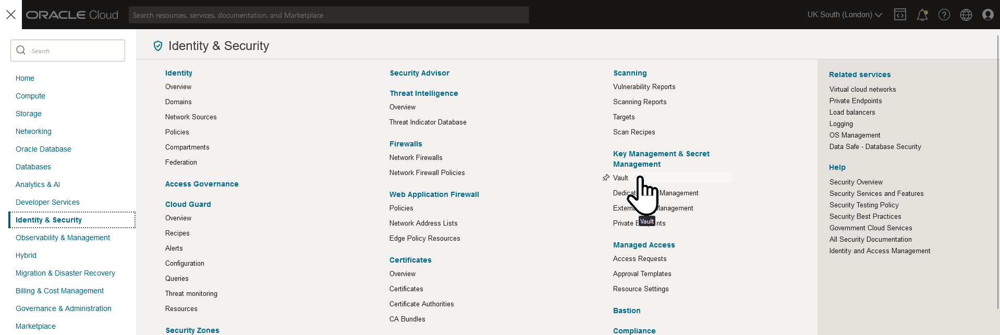

2. Ensure you've selected the correct compartment. This was created during Lab 2.

   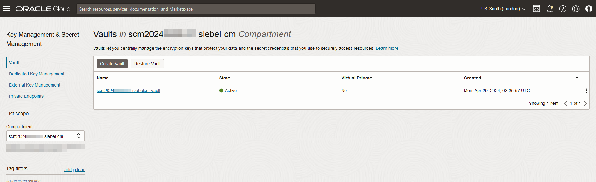

3. Click on name of the vault that was created. 

   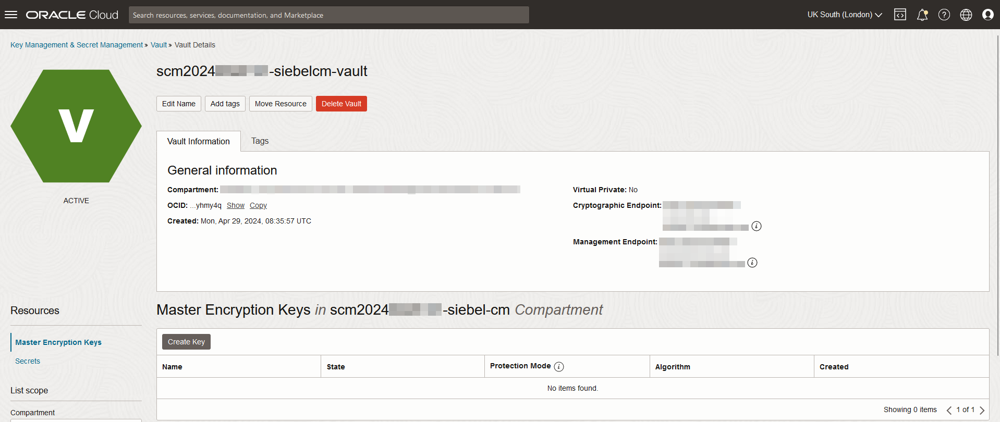

4. Click **Create Key** to create a new master encryption key for the secrets we're about to create.

   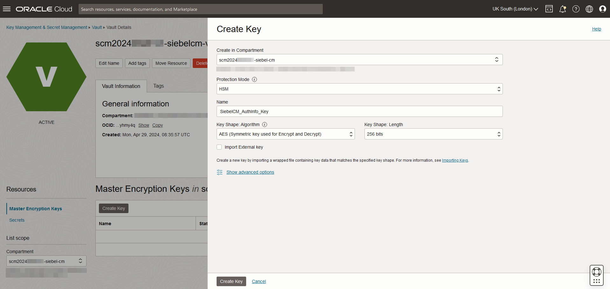

5. After a few moments, the state of the new encryption key will changes from **Creating** to **Enabled**, at which point you can proceed.

   

4. Now select **Secrets** at the bottom left of the screen.

   

4. Now create the secret, or secrets, you need using the **Create Secret** button. For simplicity in the live lab, we'll create a single secret and use that for all of the auth_info passwords. Give it a name and be sure to follow the note above to create a password that will be accepted. Select the Encryption Key we just created.

   

5. Click **Create Secret** to finalise the creation of the secret. Similarly with the encryption key creation, the secret is ready when the state changes from **Creating** to **Active**

   

6. Now click on the name of the secret, and copy the OCID of the newly created secret. It's this OCID value that is requried for the auth_info values.

   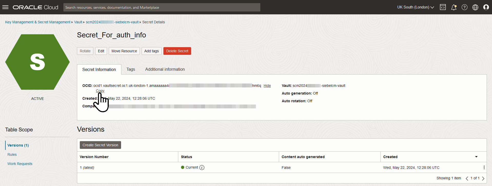

7. Now repeat this process to create two additional secrets. One each for the ATP database password and wallet password.

   

## Task 4: Login to Postman

We need to submit the payload above to Siebel Cloud Manager in order to get things rolling. There are many options for this, but we'll use an application called Postman.

Postman is an API platform for building and using APIs. Postman can be either downloaded and installed or used direcxtly from the web. For this lab, we shall use the web version, but for higher security you should install locally to your platform.

**Note:**

At the time of writing, these steps were taken using Google Chrome. Firefox seemed not to be able to correctly present the Postman user interface.

1. Go to this website - [https://www.postman.com/downloads/](https://www.postman.com/downloads/)

2. In the **Postman on the web** section, click **Try the web version**

   

3. Create a Postman account by following one of the methods mentioned on that page.

   

4. Once we complete the account onboarding process, we arrive at our new workspace. You can return here any time by visiting [https://web.postman.co/workspaces](https://web.postman.co/workspaces)

   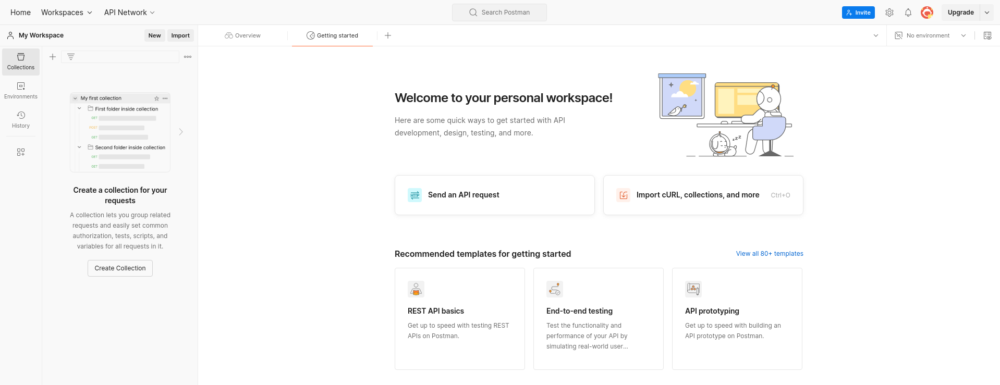

## Task 4: Execute the payload

1. Click **Send an API request**. This creates a new empty request for us to populate.

   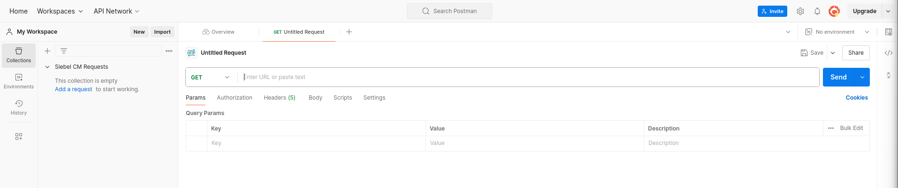

2. In the horizontal menu, navigate to **Authorization**. Choose the Type **Basic Auth** from the drop-down.

   

3. Populate the **Username** and **Password** as follows.

    **Username**

        <copy>admin</copy>

    **Password**

   The password is randomly generated at the time SCM is deployed. Obtain the value for your instance by using SSH (or Putty) to connect to the SCM instance. The admin password can be found in **/home/opc/config/api_creds.ini**

   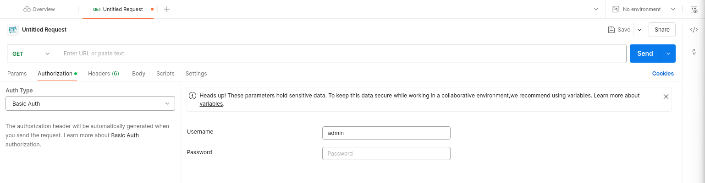

   e.g
   ```
   [opc@scm2024xxxx-siebel-cm config]$ pwd

   /home/opc/config

   [opc@scm2024xxxx-siebel-cm config]$ more api_creds.ini 

   [basic_auth]

   basic_auth_password = m4799g6z7d5DTp6l-oDUFifPl8FxOHtFv3UEMWmcOVgK34DxiWxxxx
   ```

   You may prefer to use Postman's capability to set the Authorization parameters for all requests in a collection.

   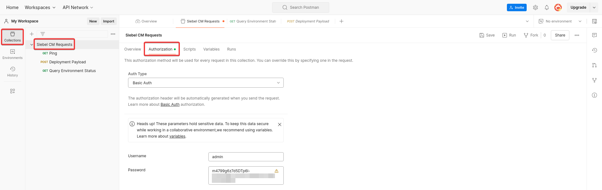 

   If you do this, set **Auth Type** for individual requests to **Inherit auth from parent**

4. Navigate to **Body** menu and select the **raw** radio button. Verify that **JSON** is selected as the format.

    


5. Paste the populated Payload in the body section, indicated by the arrow above

6. Set the following attributes for the request.

   **Method**

        <copy>POST</copy>

   **Request URL**

        <copy>http://{Public IP of the Siebel Cloud Manager Instance}:16690/scm/api/v1.0/environment</copy>

    


7. Hopefully your request should look at little like this at this stage

   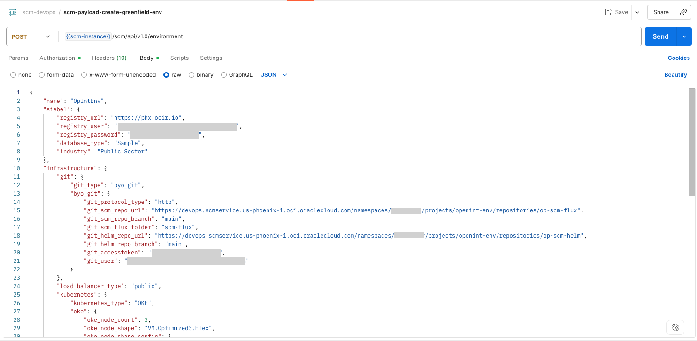 

8. Click **Save** to save your work. Give it a name and place it in a collection, creating a new collection if necessary.

9. Click **Send**

10. If you receive errors in the response and make changes to the payload, be sure to hit save each time. There's a lot of cut and pasting to generate the payload at present. You can validate the JSON using various online tools. Search for JSON Validator on Google for some ideas.

11. Save the response to a file as this has vital information on the Siebel environment that we are creating.

12. Note the value of **env_id** from the response

   

## Task 5: Monitor the deployment

After sending a post request with our payload, the Siebel Cloud Manager will prepare and deploy the Siebel CRM environment stack. This will take a while.

1. We can monitor the state of the deployment using the **env_id** that we noted earlier. To do this, create a **GET** request to Siebel Cloud Manager from Postman as below.

   Start by creating a new request in Postman as follows:

   **Method**

        <copy>GET</copy>

   **Request URL**

        <copy>http://{Public IP of the Siebel Cloud Manager Instance}:16690/scm/api/v1.0/environment/{env_id}</copy>

   Ensure you populate the Authorization section with the user name **admin** and the password for your SCM deployment if you didn't setup Authorization already at the collection level.
   
   The log file generated during the deployment process will be returned as a response.

   The response body will have a section named **stages** that indicates the particular stage of deployment. The **status** parameter in each stage can have values such as **passed, in-progress, failed**, etc.

   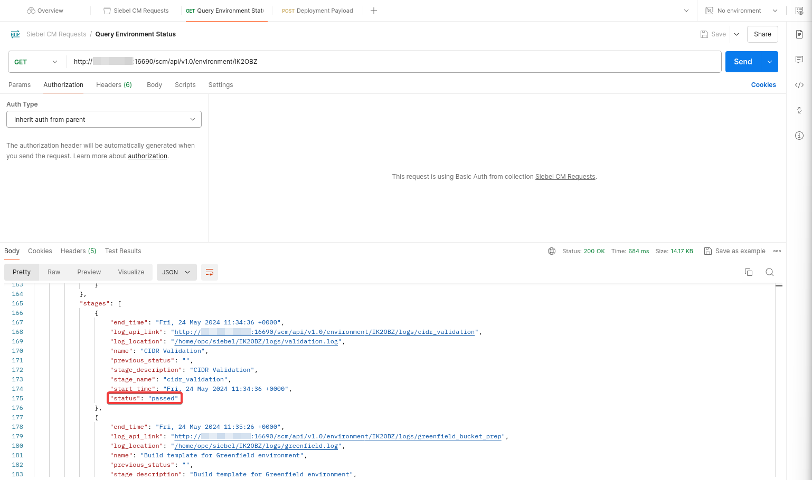 

2. We can also monitor the **Oracle Resource Manager (ORM)** stack logs from the Oracle Cloud console to see the progress of the stack deployment.

    

3. In the list scope section on the left side panel, choose the compartment **scm{date}-siebel-cm**.

    

4. Click on the stack name and then drill down on the job name.

   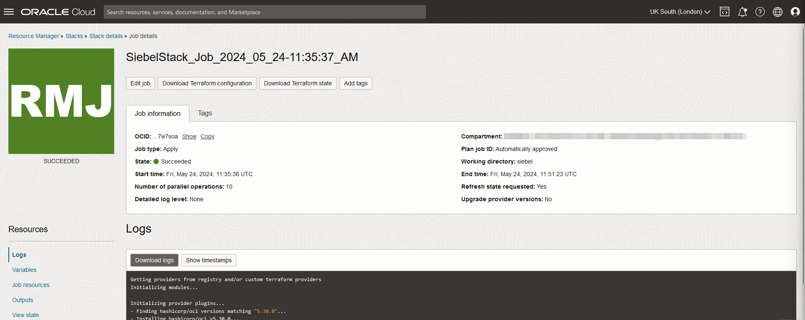 

   Monitor the logs to observe the resources' creation statii.

   The ORM stack deployment is just one of the many **stages** of the overall Siebel CRM deployment. To check the other stages and their statii regularly, repeat step 1 above to send a **GET** request to the Siebel Cloud Manager API.

   Each stage has its own log and the path to it can be found in the respective section as **log_location**. If required, SSH to the Siebel Cloud Manager and view the specific log.

    

5. After all the **stages** have been completed successfully as **passed**, the list of application URLs for the deployed industry will be described at the end of the response.

   

## Task 6: Launch the Siebel Application

1. Launch the application URL in a new browser session and enter the below credentials.

   

   **User Id**

        <copy>{siebel_admin_username}</copy>

   **Password**

        <copy>[siebel_admin_password]</copy>

   These values correspond to those values you populated into the vault secrets, whose IDs were sent in the deployment payload.

   


## Summary

We have successfully deployed a new Siebel CRM environment using the Siebel Cloud Manager. Please follow the Siebel Cloud Manager documentation to understand the different payload parameters that can be customized while deploying Siebel CRM.
In the next lab, you can view and manage the Siebel's Kubernetes Cluster to connect to the Siebel pods and perform administration and management.

## Acknowledgements

* **Author:** Duncan Ford, Software Engineer; Shyam Mohandas, Principal Cloud Architect; Sampath Nandha, Principal Cloud Architect;Rosmin Siby Cherickal, Software Engineer
* **Contributors** - Vinodh Kolluri, Raj Aggarwal, Mark Farrier, Sandeep Kumar
* **Last Updated By/Date** - Rosmin Siby Cherickal, Software Engineer, July 2025