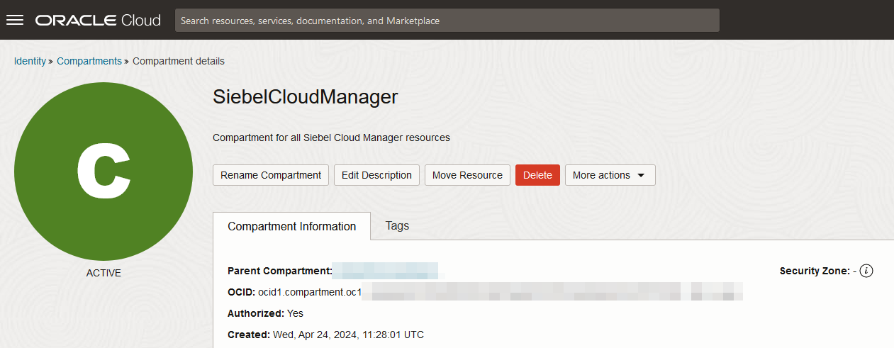
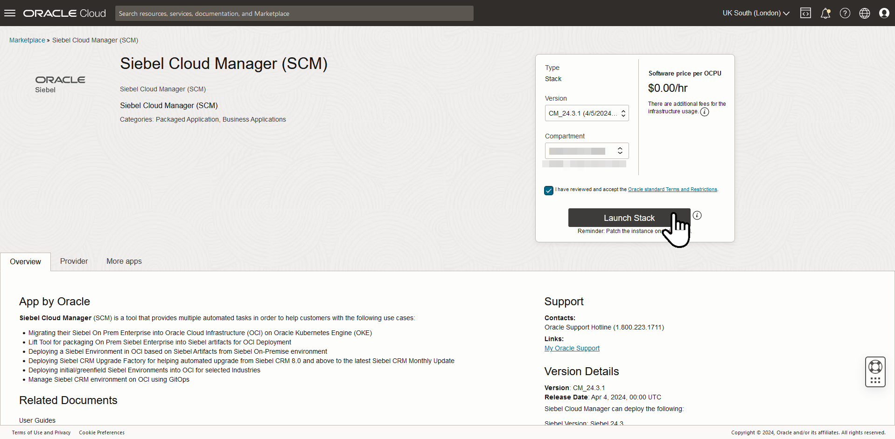
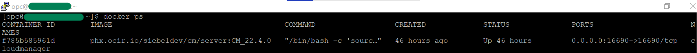

# Provision the Siebel Cloud Manager Instance

## Introduction

In this lab, we will first create a new compartment to organize all our lab-related cloud resources. Later, we'll deploy the Siebel Cloud Manager stack to provision a virtual machine that has the Siebel Cloud Manager application pre-installed.

Estimated Time: 20 minutes

### Objectives

In this lab, you will:
*   Create a compartment
*   Create a Siebel Cloud Manager instance from the Marketplace image
*   Verify the Siebel Cloud Manager application

### Prerequisites

* A user with 'manage' access to all resources in the new compartment.
* A user with 'manage' access to Dynamic Groups in Tenancy
* A tenancy with the Oracle Cloud Infrastructure Marketplace containing Siebel Cloud Manager image
* SSH key

## Task 1: Create a compartment

1. Log in to the Oracle Cloud Infrastructure Tenancy and in the console, click the icon at the top left, sometimes referred to as the **hamburger icon**, and navigate to **Identity and Security** then **Compartments**

   

2. On the Compartments page, click **Create Compartment**

3. Give a **Name** and **Description**; an example is given below. In the **Parent Compartment** field choose either the root compartment or the compartment your OCI administrator has indicated should be the parent.

    **Name**

        <copy>SiebelCloudManager</copy>

    **Description**

        <copy>Compartment for all Siebel Cloud Manager resources</copy>

   

4. Click **Create Compartment** and the compartment will be created.

5. Note the **OCID** of this compartment. You many want to copy this to a digital notepad for use later.

   

## Task 2: Create a Siebel Cloud Manager instance from the Marketplace image

The Siebel Cloud Manager Stack will create the following resources,

   - A Sub-Compartment
   - Network resources; i.e. VCN, public/private subnets, security lists, route table and rules, dynamic group, policies, etc.
   - A compute instance with the Siebel Cloud Manager application pre-installed as a container on a Linux Operating System.


1. In the Oracle Cloud Console, click the ***hamburger icon***

2. Navigate to **Marketplace** and **All Applications**

   

3. In the search bar, type in **siebel** and hit search. Click ***Siebel Cloud Manager*** image.

   

4. On the page that appears, choose the latest **Version** and the compartment as **SiebelCloudManager**

5. Click ***Launch Stack***

   

6. On the **Create Stack** page, click ***Configure Variables***

7. Fill up the following,

    a. **Root Compartment OCID:** This is the OCID of **SiebelCloudManager** compartment.

    b. **Cloud manager public ssh key:** Either upload or paste the public SSH key that we created as part of Lab 1.

    c. **Resource prefix to name the OCI resources:** scm

    d. Click ***Next*** and review the Stack Information and Configuration Variables. Check **Run Apply**

    e. Click ***Create***

8. Now, we will be directed to the **Stack Details** page and we will see that our terraform apply job is running.

   The **Logs** section will show the progress of the apply job. This can be monitored to check the various resources that are getting created. In case there are any errors, they will be displayed too. After running for a while, the stack apply job's state will show **Succeeded**.

9. In the **Logs** section of the stack apply job, make a note of the following information:
   * **CloudManagerApplication**: The URL for running Siebel Cloud Manager, which uses the public IP address and port number of the newly created instance.
   The output would appear as below.
   ```
   CloudManagerApplication = "http://{Public IP of Siebel Cloud Manager}:16690/"
   ```

## Task 3: Verify the Siebel Cloud Manager application

Once the stack is successfully deployed, the Siebel Cloud Manager instance can be accessed from **Compute** and **Instances** section.

We shall now verify if the Siebel Cloud Manager application is running.

1. Connect to this instance through an ssh client such as PuTTY using the ssh private key that we had used to create this instance. Enter the username as **opc**

2. Run the following command.

   ```
   $ <copy>docker ps</copy>
   (The above command will give the output of the running Siebel cloud manager container)
   ```
   

3. To check the response, launch the Cloud Manager Application URL that was shown in the stack apply job.
   ```
   CloudManagerApplication = "http://{Public IP of Siebel Cloud Manager}:16690/"
   ```


The above page indicates that the Siebel Cloud Manager application is up and running.

## Summary

In this lab, the Siebel Cloud Manager instance has been provisioned. In the next lab, we will install and configure a GitLab instance.

You may now **proceed to the next lab**.


## Acknowledgements

* **Author:** Shyam Mohandas, Principal Cloud Architect; Sampath Nandha, Principal Cloud Architect
* **Contributors** - Vinodh Kolluri, Raj Aggarwal, Mark Farrier, Sandeep Kumar
* **Last Updated By/Date** - Sampath Nandha, Principal Cloud Architect, March 2023