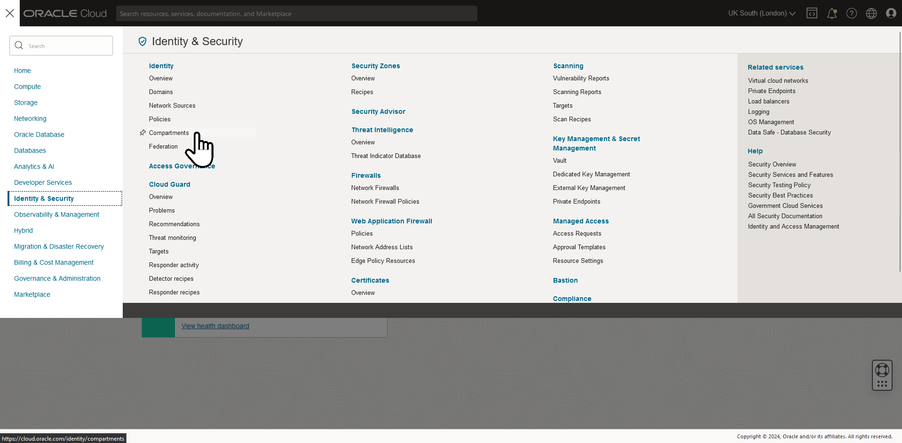
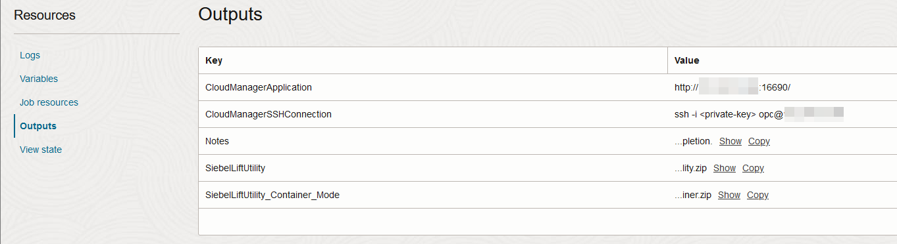
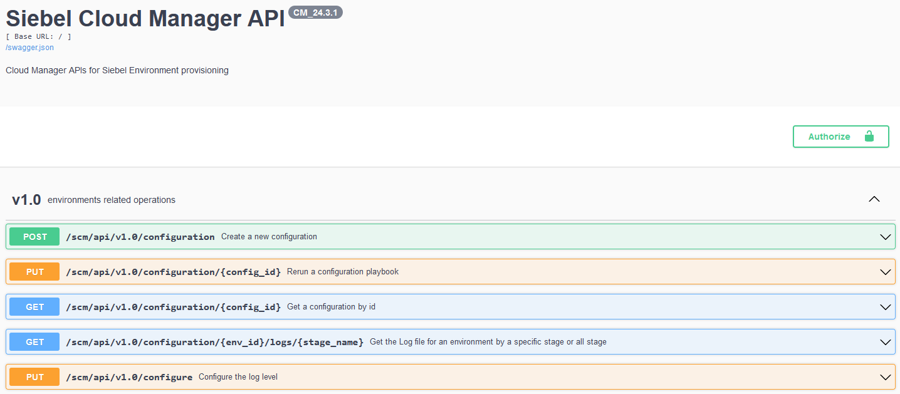
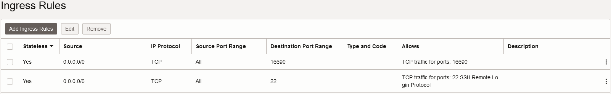

# Provision the Siebel Cloud Manager Instance

## Introduction

In this lab, we will first create a new compartment to organize all our lab-related cloud resources. Later, we'll deploy the Siebel Cloud Manager stack to provision a virtual machine that has the Siebel Cloud Manager application pre-installed.

Estimated Time: 20 minutes

### Objectives

In this lab, you will:
*   Create a compartment
*   Create a Siebel Cloud Manager instance from the Marketplace image
*   Verify the Siebel Cloud Manager application

### Prerequisites

* A user with 'manage' access to all resources in the new compartment.
* A user with 'manage' access to Dynamic Groups in Tenancy
* A tenancy with the Oracle Cloud Infrastructure Marketplace containing Siebel Cloud Manager image
* SSH key

## Task 1: Create a compartment

1. Log in to your Oracle Cloud Infrastructure Tenancy and, in the console, click the icon at the top left, sometimes referred to as the **hamburger icon**.

   

2. Navigate to **Identity & Security** then **Compartments**

   

3. On the Compartments page, click **Create Compartment**

4. Give a **Name** and **Description**; an example is given below. In the **Parent Compartment** field choose either the root compartment or the compartment your OCI administrator has indicated should be the parent.

    **Name**

        <copy>SiebelCloudManager</copy>

    **Description**

        <copy>Compartment for all Siebel Cloud Manager resources</copy>

   

5. Click **Create Compartment** and the compartment will be created.

6. Click on the new Compartment that's now added to the list. You may need to first click on the parent Compartment you selected to see the new Compartment.

7. Note the **OCID** of this compartment. You many want to copy this to a digital notepad for use later.

   

## Task 2: Create a Siebel Cloud Manager instance from the Marketplace Image

The Siebel Cloud Manager Stack will create the following resources,

   - A Sub-Compartment
   - Network resources; i.e. VCN, public/private subnets, security lists, route table and rules, dynamic group, policies, etc.
   - A compute instance with the Siebel Cloud Manager application pre-installed as a container on a Linux Operating System.


1. In the Oracle Cloud Console, click the ***hamburger icon***

   

2. Navigate to **Marketplace** and **All Applications**

   

3. In the search bar, type in **siebel**. The list of available applications will change as you type. Click the card for ***Siebel Cloud Manager (SCM)***.

   

4. On the page that appears, choose the latest **Version** and the compartment as **SiebelCloudManager**

5. If you wish to proceed, you must click the checkbox to agree that you reviewed and agree to the terms of service.

6. Click ***Launch Stack***

   

7. On the **Create Stack** page, click ***Configure Variables***

   

8. Fill in the following details in the following way, at least on your first run through the process:

    a. **Root Compartment OCID:** This is the OCID of **SiebelCloudManager** compartment from Task 1, Step 7. If you didn't make a digital note earlier that's easy to copy, feel free to open a second browser tab to find and copy the OCID now.

   

    b. **Cloud manager public ssh key:** Either upload or paste the public SSH key that was created as part of Lab 1. You will use this to login via SSH.

   

    c. **Resource prefix to name the OCI resources:** We suggest using the value ***scm*** combined with the current date in some format.

   

    d. We don't need a powerful compute resource for the Siebel Cloud Manager. For the CloudManager instance configuration, start by selecting ***VM.Optimized3.Flex***. Don't worry if your list of options looks different. If in doubt, use another browser to review the available types and select something appropriate.

   

    e. With a flixible instance type such as the one we've selected, you can now tailor the number of CPUs and memory. We suggest something very modest as the workload is not high on the SCM instance itself. The minumum values are 2 CPUs and 15 GB of Memory. Select higher if you feel you will need more compute.

   

    f. Ensure you click to assign a public ip address initially. This will allow easy initial access for SSH and the SCM UI. No other ports will be exposed by default, and you can constrain access to SCM's web interface to your specific IP address or set of addresses later on, or configure a bastion service, VPN access and so on.

   

    g. For Key Management, select to create a new vault unless you already have one assigned to you by your cloud administrator, in which case enter the OCID of that vault.

   

    h. We're leaving this blank for the lab meaning we'll accept default VCN configuration. If you're using an existing VCN in your tenancy, consult your cloud administrator on how to set this up here.

   

    i. Click ***Next*** at the bottom left of the form, review the Stack Information and Configuration Variables. Note that **Run Apply** is enabled by default. 

   

    j. Click ***Create*** at the bottom left.


8. Now, we will be directed to the **Stack Details** job page and we can see that a terraform job is running.

   

   The **Logs** section will show the progress of the apply job. This can be monitored to check the various resources that are getting created. In case there are any errors, they will be displayed too. After running for a while, the stack apply job's state should show **Succeeded**.

   

9. In the **Outputs** section, take note of the value for **CloudManagerApplication**. This is the URL to access your instance of Siebel Cloud Manager.

   

## Task 3: Verify the Siebel Cloud Manager application

Once the stack is successfully deployed, the Siebel Cloud Manager instance can be accessed from **Compute** and **Instances** section.

   

   

We shall now verify that the Siebel Cloud Manager application is running.

1. Connect to this instance using ssh (you can use a client such as PuTTY) using the private key related to the public key you pasted into the stack creation job above. Enter the username as **opc**.
- In the **Outputs** listed above, you also can use the **CloudManagedSSHConnection** value as a guide

   ```
   [~]$ ssh -i cloudshellkey opc@***.***.***.***

   The authenticity of host '***.***.***.*** (***.***.***.***)' can't be established.
   ED25519 key fingerprint is SHA256:hygK------------------------------------------------.
   This key is not known by any other names
   Are you sure you want to continue connecting (yes/no/[fingerprint])? yes
   Warning: Permanently added '***.***.***.***' (ED25519) to the list of known hosts.

   Enter passphrase for key 'cloudshellkey': 

   [opc@scm2024****-**-siebel-cm ~]$ 
   ```

2. Run the following command.

   ```
   $ <copy>docker ps</copy>
   ```

   The above command will give the output of the running Siebel cloud manager container, which will look something like this


   


3. Now launch the Cloud Manager Application using the URL that was shown in the stack job outputs.

   ```
   CloudManagerApplication = "http://{Public IP of Siebel Cloud Manager}:16690/"
   ```


The above page indicates that the Siebel Cloud Manager application is up and running.

4. As you may infer, this page is public visible to the globe. If you wish to constrain access, you can do this in a very flexible way by controlling the security list for the instance. Click on the instance listed above to access the instance details.

5. Click on the subnet link


6. Click on **security-list-for-cm**


7. Now adjust the ingress rules to your needs. While port 22 is globally open, access is limited by your ssh key. You may wish to restrict port 16690 to be visible to a select CIDR.



## Summary

In this lab, the Siebel Cloud Manager instance was provisioned. In the next lab, we will install and configure a OCI Devops instance.

You may now **proceed to the next lab**.

## Acknowledgements

* **Author:** Duncan Ford, Software Engineer; Shyam Mohandas, Principal Cloud Architect; Sampath Nandha, Principal Cloud Architect; Rosmin Siby Cherickal, Software Engineer
* **Contributors** - Vinodh Kolluri, Raj Aggarwal, Mark Farrier, Sandeep Kumar
* **Last Updated By/Date** - Rosmin Siby Cherickal, Software Engineer, July 2025