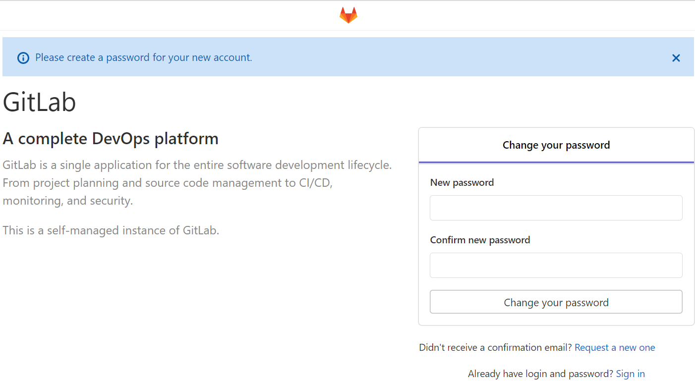

# Install and Configure GitLab

## Introduction

In this lab, we will install and configure a GitLab instance.
 
Siebel Cloud Manager uses GitLab to store the configuration of each deployment that it performs. Then, it will access the configuration files from GitLab to do the actual deployment.

Estimated Time: 40 minutes

### Objectives

In this lab, you will:
*   Deploy the GitLab stack
*   Configure HTTPS for GitLab
*   Upgrade GitLab for enhanced security
*   Generate a GitLab Access Token

### Prerequisites

* Oracle Cloud Infrastructure tenancy access
* PuTTY Client and SSH Key

## Task 1: Deploy the GitLab stack

In this task, we will visit the Oracle Architecture Center to deploy the GitLab stack. This stack will create a Virtual Machine with the GitLab application pre-installed in it.

During the stack creation, review all default values displayed. Confirm each value or enter a new value as appropriate for our task.

1. Go to this document about deploying GitLab - [https://docs.oracle.com/en/solutions/deploy-gitlab-ci-cd-oci/index.html](https://docs.oracle.com/en/solutions/deploy-gitlab-ci-cd-oci/index.html)

2. In the Deploy section of this page, click the **Deploy to Oracle Cloud** link.

    

3. In the stack information section, specify the compartment in which to create the GitLab stack and leave the default values for **Working Directory**, **Name**, **and Description** . Click ***Next***

    

4. In **Compute Configuration** section, specify the new compartment **scm-siebel-cm** (created by the Siebel Cloud Manager stack) and the rest of the options such as **Availability Domain, Instance name, DNS Hostname Label, Flex Shape OCPUs, and Compute Image** as shown below. Leave the default values for **External URL, Tag key name, and Tag value**

    **Availability Domain:**

        (Choose any available AD from the list)

    **Instance Name:**

        <copy>gitlab-server</copy>

    **DNS Hostname Label:**

        <copy>gitlabserver</copy>

    **Flex Shape OCPUs:**

        <copy>1</copy>
    **Flex Shape Memory:**

        <copy>6</copy>

    **Compute Image**

        (Choose any image from the list)

    **Network Compartment**

        <copy>scm-siebel-cm</copy>

    **Network Strategy**

        Use Existing VCN and Subnet

    **Existing VCN**

        (Choose the VCN that was previously created by the Siebel Cloud Manager stack)

    **Subnet Type**

        Public Subnet

    **Existing Subnet**

        (Choose the Public Subnet that was previously created by the Siebel Cloud Manager stack)

    **Network Security Group Configuration**

        Use Recommended Configuration

5. Click ***Next***

6. Verify the configuration variables. To immediately provision the resources defined in the Terraform configuration, check **Run Apply**
   
7. Click ***Create***

     The GitLab stack **apply** job will run successfully.

## Task 2: Configure HTTPS for GitLab

1. On the Oracle Cloud Console page, navigate to **Compute** and **Instances**.

2. In the **List Scope** section on the left side panel, choose our compartment **scm-siebel-cm**.

3. Drill down on the instance name **gitlab-server** and note the Public IP address.

   

4. Connect to this instance through an ssh client such as PuTTY using the ssh private key that we had created in Lab 1. Enter the username as **opc**

5. After successful login, execute the following command to change to root user.

   ```
   $ <copy>sudo su</copy>
   ```

6. In the **/etc/gitlab/gitlab.rb** file, edit the **external_url** parameter as shown below using the vi editor.

   ```
   $ <copy>vi /etc/gitlab/gitlab.rb</copy>

   external_url 'https://{Public IP of the GitLab Instance}'
   ```

7. In the same file, disable the **letsencrypt** feature by setting its value to **false**

   ```
   $ <copy>vi /etc/gitlab/gitlab.rb</copy>

   letsencrypt['enable'] = false
   ```
8. Create the self-signed certificates using OpenSSL. Run the following commands one by one.

    > **Note:** The self-signed certificates are only for this lab. For a real-world implementation, use Certificate Authority (CA) signed certificates for security reasons.

   ```
   $ <copy>sudo mkdir -p /etc/gitlab/ssl</copy>
   ```
   ```
   $ <copy>sudo chmod 755 /etc/gitlab/ssl</copy>
   ```
   ```
   $ <copy>cd /etc/gitlab/ssl</copy>
   ```
   ```
   $ <copy>openssl genrsa -out rootCA.key 2048</copy>
   ```
   ```
   $ <copy>openssl req -x509 -new -nodes -key rootCA.key -sha256 -days 365 -out rootCA.crt -subj "/C=US/ST=UT/L=Lehi/O=Oracle/OU=Support/CN=localhost"</copy>
   ```
   ```
   $ <copy>openssl genrsa -out {Public IP of GitLab instance}.key 2048</copy>
   ```
   ```
   $ <copy>openssl req -new -key {Public IP of GitLab instance}.key -out {Public IP of GitLab instance}.csr -subj "/CN=localhost"</copy>
   ```
9. Create a configuration file named **device-csr.conf** under **/etc/gitlab/ssl** directory with the following content.

   ```
   <copy>[req]
   distinguished_name = req_distinguished_name
   req_extensions = v3_req
   prompt = no
   [req_distinguished_name]
   C = US
   ST = UT
   L = Lehi
   O = Oracle
   OU = Corp
   CN = localhost
   [v3_req]
   keyUsage = nonRepudiation, digitalSignature, keyEncipherment
   extendedKeyUsage = serverAuth
   subjectAltName = @alt_names
   [alt_names]
   IP.1 = {Public IP of GitLab instance}</copy>
   ```
10. After the file **device-csr.conf** is created, run the following command.

   ```
   $ <copy>openssl x509 -req -in {Public IP of GitLab instance}.csr -CA rootCA.crt -CAkey rootCA.key -CAcreateserial -out {Public IP of GitLab instance}.crt -extfile device-csr.conf -extensions v3_req -days 365</copy>
   ```
11. Reconfigure GitLab by running the below command.

   ```
   $ <copy>sudo gitlab-ctl reconfigure</copy>
   ```
12. Copy the **rootCA.crt** from **/etc/gitlab/ssl** folder to the Siebel Cloud Manager instance's **/home/opc/certs** folder.

## Task 3:  Upgrade GitLab for enhanced security

To avoid **CVE-2021-22205** vulnerability, we shall now upgrade GitLab.


1. In the GitLab instance's terminal, run the following command.

   ```
   $ <copy>sudo yum install -y gitlab-ee-13.8.8-ee.0.el8</copy>
   ```

2. Once the above command finishes upgrading GitLab, restart GitLab by executing the below command.

   ```
   $ <copy>sudo gitlab-ctl restart</copy>
   ```

## Task 4:  Generate a GitLab Access Token

We need to generate a GitLab Access Token that will be used in Lab 4 where we deploy Siebel CRM.

1. Launch GitLab using the following URL.

   ```
   <copy>https://{Public IP of GitLab Instance}</copy>
   ```
   > **Note:** Sometimes, we might encounter the **502 Error** upon launching the GitLab URL and refreshing the page at the time should display the right content.

   
2. Give a new password for the **root** user per the prompt, confirm the password, and click ***Change your password***.

   

3. We will be prompted to log in to GitLab. Enter the following credentials and click ***Sign in***.

    **Username**

        <copy>root</copy>

    **Password**

        {The new password that was set earlier}

4. After logging in, click the ***Profile Icon*** in the right-hand top corner and click ***Settings***.

   

5. In the left side panel, navigate to ***Access Tokens*** page.

6. Give the following values for the respective fields.

    **Name:**

        <copy>Siebel</copy>

    **Expires at:**

        {Give a distant future date}

    **Scope:**

        api

   

7. Click ***Create Personal Access Token***.

8. Note the token displayed in the **Your new personal access token** field.

   

## Summary

In this lab, the GitLab instance has been set up and configured. In the next lab, we will prepare a payload to send to the Siebel Cloud Manager API for deploying the Siebel CRM environment.

You may now **proceed to the next lab**.

## Acknowledgements

* **Author:** Shyam Mohandas, Principal Cloud Architect, Cloud Engineering
* **Contributors** - Vinodh Kolluri, Raj Aggarwal, Mark Farrier, Sandeep Kumar
* **Last Updated By/Date** - Shyam Mohandas, Principal Cloud Architect, Cloud Engineering