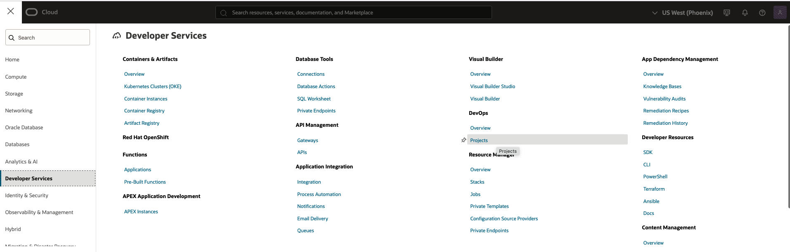
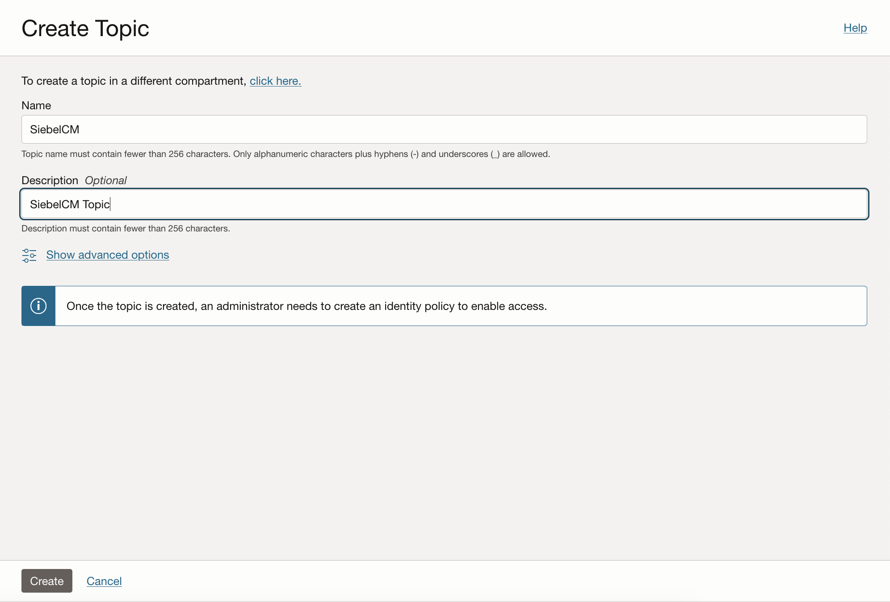
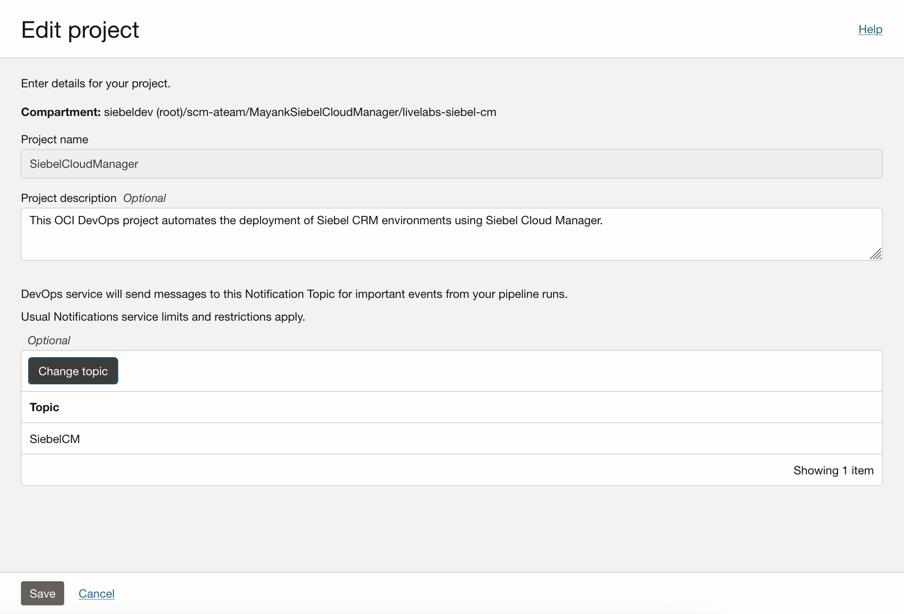
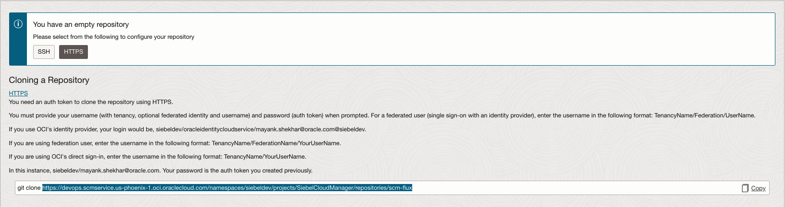

# Install and Configure OCI Devops

## Introduction

In this lab, you'll set up an OCI DevOps instance.

Siebel Cloud Manager utilizes repositories to manage the configuration of each deployment. Any changes made to these repositories are automatically reflected in the deployed environment.

Estimated Time: 20 minutes

### Objectives

In this lab, you will:
*   Create an OCI Devops project
*   Configure 2 repositories for Helm and Flux

### Prerequisites

* Oracle Cloud Infrastructure tenancy access

## Task 1: Configure OCI Devops project

1. Log in to your Oracle Cloud Infrastructure (OCI) tenancy and access the console.

2. Click on the icon in the top left corner of the page, sometimes referred to as the "hamburger" icon.

3. Navigate to **Developer Services** > **Projects**.

   

4. On the DevOps Projects page, choose the appropriate compartment and then click **Create devops project**.

5. Provide a **Project name** and **Description** for your project. For example:

    **Project name:**

        <copy>SiebelCloudManager</copy>

    **Description:**

        <copy>This OCI DevOps project automates the deployment of Siebel CRM environments using Siebel Cloud Manager.</copy>

   

6. Click on the **Select Topic** button.

7. You can choose an existing topic by searching for its name or providing its OCID. If you don't have a topic, click **Create topic** to create a new one.

   

8. On Create Topic page, provide a suitable name and description for your topic.

   
   
9. Once you've created the topic, navigate back to the DevOps Projects page and select the newly created topic.

10. Click **Save Record** to complete the process.

   

## Task 2: Create code repositories

Once the project is created, you can now create code repositories to store your SCM configuration files.

1. Navigate to the **Code Repositories** tab within your DevOps project.

2. Click on **Create repository** to begin creating a new repository.

   

3. Provide a below **Repository name**, **Description**, and **Branch name** for your repository, then click **Create**.

    **Repository name:**

        <copy>scm-flux</copy>

    **Description:**

        <copy>scm-flux</copy>

    **Branch name**

        <copy>main</copy> 

   

4. You will be taken to the code repository record page. Scroll down and copy the **HTTPS URL**, as you'll need this URL when creating the payload for your Siebel deployment.

   

5. Repeat these steps to create a separate code repository for your **scm-helm** configuration files.

6. Note down the HTTPS URLs for both repositories, as you'll need them later in the process.

## Summary

In this lab, the OCI devops instance has been set up and configured. In the next lab, we will prepare a payload to send to the Siebel Cloud Manager API for deploying the Siebel CRM environment.

You may now **proceed to the next lab**.

## Acknowledgements

* **Author:** Rosmin Siby Cherickal, Software Engineer
* **Contributors** - Sayooj O, Prabhu Dhanabalan
* **Last Updated By/Date** - Rosmin Siby Cherickal, Software Engineer, July 2025