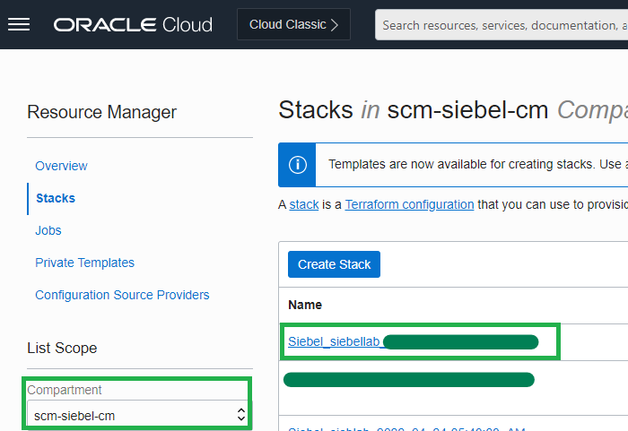

# Teardown the Siebel Cloud Manager Lab Environment

## Introduction

In this lab, we will destroy the Siebel Cloud Manager lab environment by deleting all the resources we have created so far.

Estimated Time: 20 minutes

### Objectives
* Destroy Siebel CRM environment Stack
* Destroy GitLab instance
* Destroy Siebel Cloud Manager instance

### Prerequisites
* Oracle Cloud Infrastructure tenancy access
* User with 'manage' access to **SiebelCloudManager** and **scm-siebel-cm** compartments

## Task 1: Destroy Siebel CRM environment Stack

1. From the Oracle Cloud Console, navigate to **Developer Services** and **Stacks**.

2. In the **List Scope** section on the left side panel, choose **siebellab_compartment**.

3. From the **Stack List**, drill down on the stack name. The stack name would be of the below format.

   ```
   Siebel_siebellab_{timestamp}
   ```

   

4. On the **Stack Details** page, click ***Destroy***.

5. On the **Destroy** page, leave the default **Job** name and click ***Destroy***. The Destroy job will run for a while and succeed.

## Task 2: Destroy GitLab instance

1. From the Oracle Cloud Console, navigate to **Developer Services** and **Stacks**.

2. In the **List Scope** section on the left side panel, choose **scm-siebel-cm**.

3. From the **Stack List**, drill down on the GitLab stack name.

4. Run **Destroy** job for this stack too as done earlier. This job will run for a while and succeed.

## Task 3: Destroy Siebel Cloud Manager instance

1. Navigate to **Developer Services** and **Stacks**.

2. In the **List Scope** section on the left side panel, choose **SiebelCloudManager**.

3. From the **Stack List**, drill down on the Siebel Cloud Manager stack name.

4. Run **Destroy** job for this stack too as done earlier. This job will run for a while and succeed.

## Summary

In this lab, we have destroyed all the resources that were created for this workshop.

## Acknowledgements

* **Author:** Shyam Mohandas, Principal Cloud Architect; Sampath Nandha, Principal Cloud Architect
* **Contributors** - Vinodh Kolluri, Raj Aggarwal, Mark Farrier, Sandeep Kumar
* **Last Updated By/Date** - Sampath Nandha, Principal Cloud Architect, March 2023