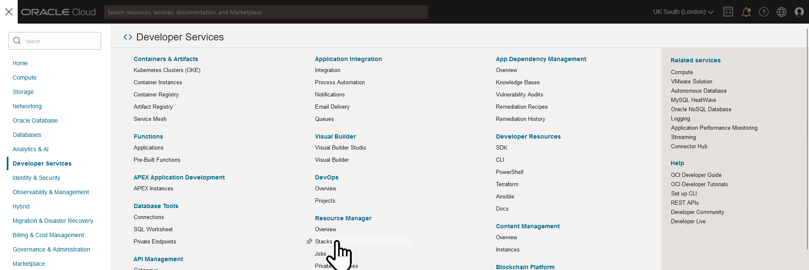
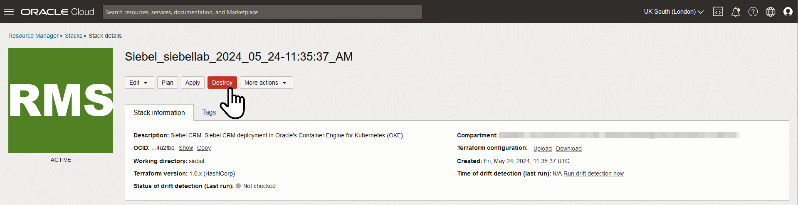
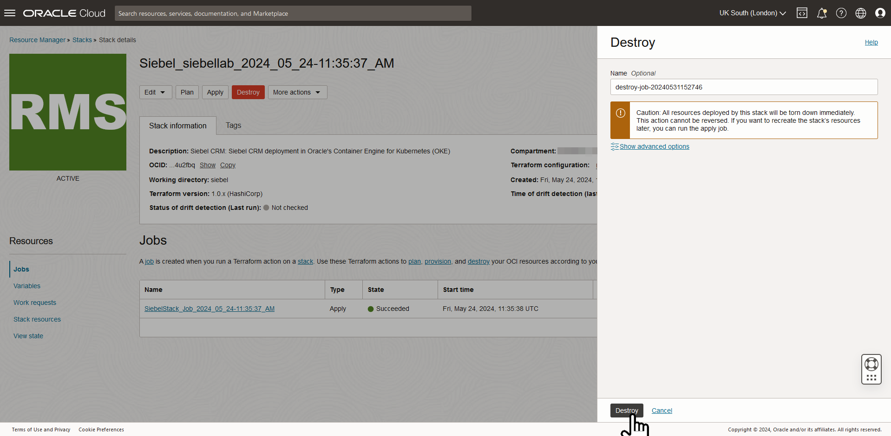

# Teardown the Siebel Cloud Manager Lab Environment

## Introduction

In this lab, we will destroy the Siebel Cloud Manager lab environment by deleting all the resources we have created so far.

Estimated Time: 20 minutes

### Objectives
* Destroy Siebel CRM environment Stack
* Destroy OCI Devops instance
* Destroy Siebel Cloud Manager instance

### Prerequisites
* Oracle Cloud Infrastructure tenancy access
* User with 'manage' access to **SiebelCloudManager** and **scm{date}-siebel-cm** compartments

## Task 1: Destroy Siebel CRM environment Stack

1. From the Oracle Cloud Console, navigate to **Developer Services** and **Stacks**.

   

2. In the **List Scope** section on the left side panel, find and select **scm{date}-siebel-cm**.

   

3. From the list, drill down on the **SiebelLab** stack name. The stack name would be of the below format.

   ```
   Siebel_siebellab_{timestamp}
   ```

4. On the **Stack Details** page, click ***Destroy***.

   

5. On the **Destroy** pane, leave the default **Job** name and click ***Destroy***. The Destroy job will run for a while and should succeed.

   

## Task 2: Destroy OCI Devops instance

1. From the Oracle Cloud Console, navigate to **Developer Services** and **Projects**.

2. In the **List Scope** section on the left side panel, choose **scm{date}-siebel-cm**.

3. From the **Project List**, drill down on your OCI Devops project.

4. Click **Delete** Button. 

5. In the confirmation box, type your project name and Check **Cascade delete** box. Then click **Schedule delete**.

## Task 3: Destroy Siebel Cloud Manager instance

1. Navigate to **Developer Services** and **Stacks**.

2. In the **List Scope** section on the left side panel, choose **SiebelCloudManager**.

3. From the **Stack List**, drill down on the Siebel Cloud Manager stack name.

4. Run **Destroy** job for this stack too as done earlier. This job will run for a while and succeed.


## Summary

In this lab, we have destroyed nearly all the resources that were created for this workshop. You could also delete the compartment and the vault, but you may wish to reuse these if you are going to repeat the lab straight away to gain some more comfort with the processes.

## Acknowledgements

* **Author:** Duncan Ford, Software Engineer; Shyam Mohandas, Principal Cloud Architect; Sampath Nandha, Principal Cloud Architect; Rosmin Siby Cherickal, Software Engineer
* **Contributors** - Vinodh Kolluri, Raj Aggarwal, Mark Farrier, Sandeep Kumar
* **Last Updated By/Date** - Rosmin Siby Cherickal, Software Engineer, July 2025