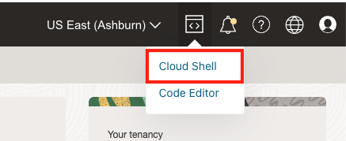
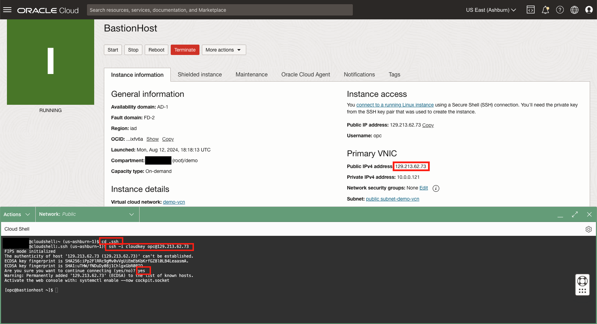
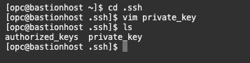

# Title of the Lab

## Introduction

This lab walks you through connecting to the Bastion Host and then using that host as a jump server to acces the private instance. 

Estimated Lab Time: 10 minutes

### About Bastion Host

In this lab we will see how the BastionHost acts as a jump host. Once connected to the Bastion Host you will upload the SSH keys to be able to access the private insance created in the previous lab. 

### Objectives


In this lab, you will:
* SSH into bastion host compute instance 
* SSH into private compute instance through bastion host instance


### Prerequisites 

This lab assumes you have:
* An Oracle Cloud account
* All previous labs successfully completed
* Have saved private SSH key generated in Lab 1


## Task 1: SSH into instances

(optional) Task 1 opening paragraph.

1. Open Cloud Shell

	

2. Navigate to ssh folder within Cloud Shell 

```
cd .ssh
```

3. SSH into Bastion Host to ensure connection.  

```
ssh -i <private_ssh_key> opc@<BastionHost_public_ip_address> 
```

  
4. Update SSH key for BastionHost 

Navigate to SSH files

```
cd .ssh
```

Create a new file called private_key

```
vim private_key
```

Paste the private key generated in Lab 1

Save the changes made to private_key file 
hit escapte followed by the command bellow. 

```
:wq!
```
hit Enter.

You can use the command ls to check to make sure the new file exists. 



5. SSH into private instance through Bation Host 

```
ssh -i private_key opc@<private-1_private_ip_address> 
```

You should now see that you have successfully navigated to the instnace private-1 


## Learn More

*(optional - include links to docs, white papers, blogs, etc)*

* [URL text 1](http://docs.oracle.com)
* [URL text 2](http://docs.oracle.com)

## Acknowledgements
* **Authors** - Olivia Maxwell, Cloud Enginner; Taylor Rees, Cloud Engineer
* **Last Updated By/Date** - Taylor Rees, August 2024
