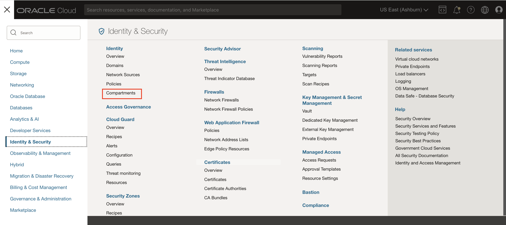
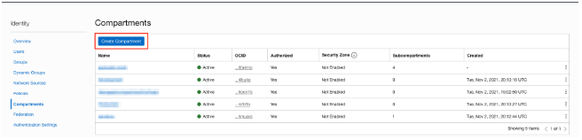
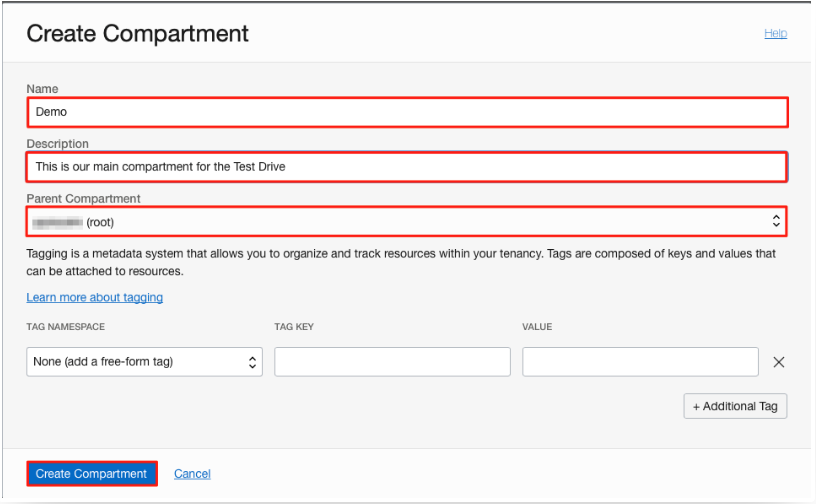
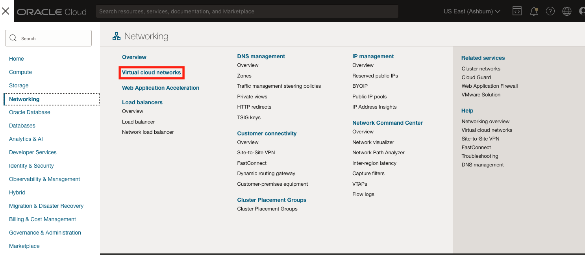
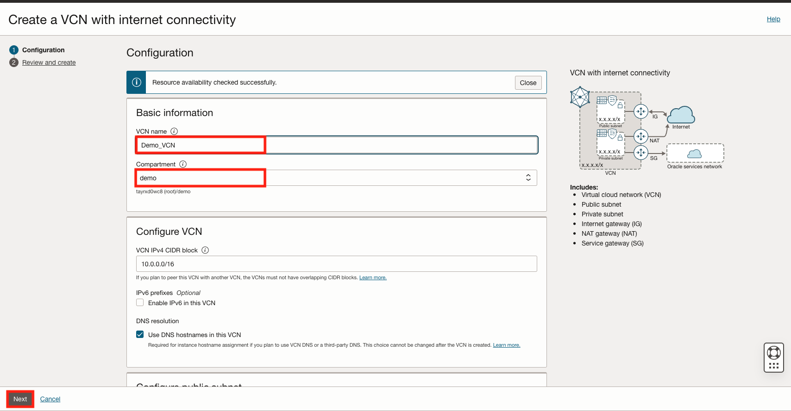
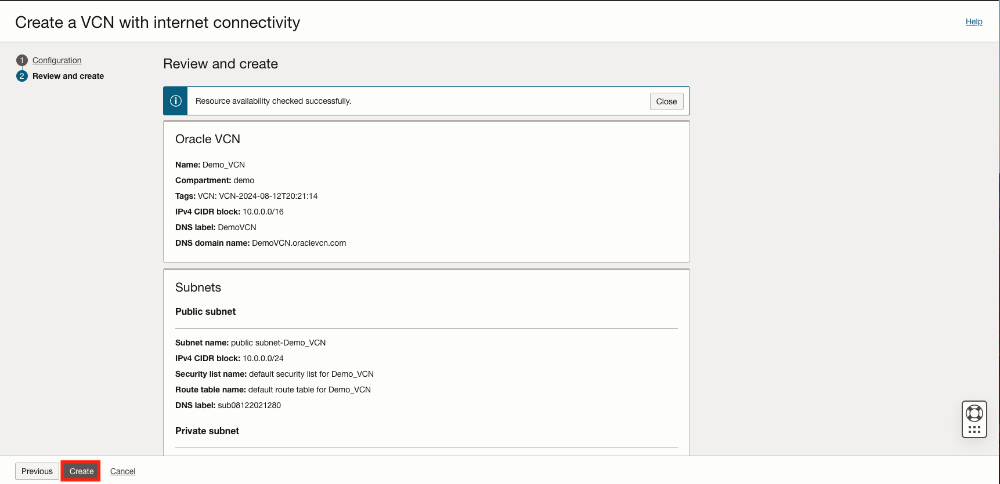
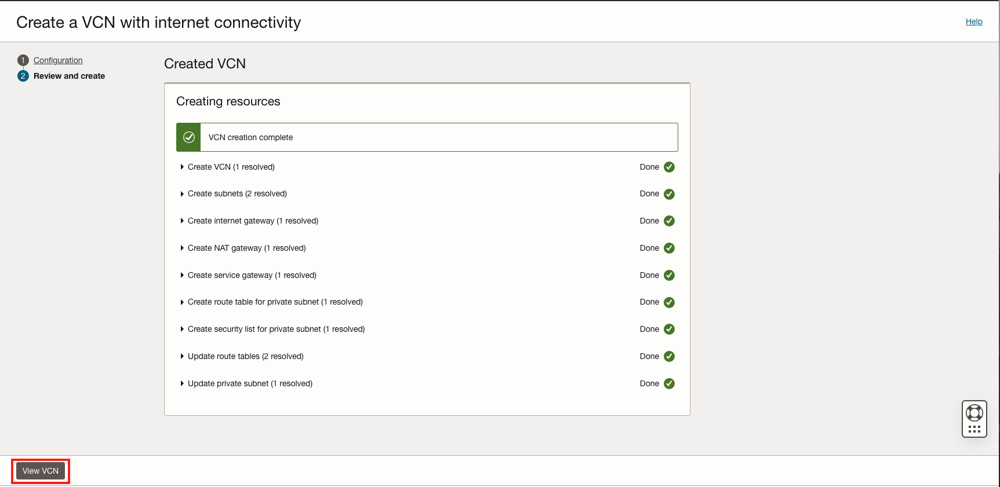

# Title of the Lab

## Introduction

Estimated Lab Time: 15 minutes

### Objectives

In this lab, you will:

* Create a compartment
* Create a virtual cloud network 

### Prerequisites 

This lab assumes you have:
* An Oracle Cloud account
* All previous labs successfully completed

## Task 1: Create a compartment

Compartments are a logical collection of related resources. Compartments allow for organization and isolation of your cloud resources.

1. Navigate to Identity & Security and select Compartments

	

 Click **Create Compartment**

  

2. Name the compartment **Demo** and provide a short description. Be sure your root compartment is shown as the partent compartment. Press the blue **Create Compartment** button when ready. 

  

3. You have just created a compartment!

## Task 2: Create a VCN

In this task we will be using the VCN Wizard, if you would like to create the VCN mannuall, feel free to skip to the alternative task below. 

1. Navigate to Networking and select Virtual cloud networks

  

2. Select Start VCN Wizard

Name VCN **Demo_VCN** 

Select **Demo** compartment

Leave all other inputs as the default 

Click **Next**

  

3. Review and click **Create** button to create the VCN

  

It will take a moment to create the VCN and a progress screen will show the workflow. 

4. Once you see that the createion is complete, click the **View Virtual Cloud Network** button. 

  

5. You have successfully created a Virtual Cloud Network! You can see the details of the VCN. 
## Alternative Task: Create VCN without VCN Wizard

1. Navigate to Netowrking and select Virtual Cloud Networks

2. Select Create VCN 

3. Name VCN **Demo_VCN**

4. Assign IPv4 CIDR Blocks **10.0.0.0/16**

5. Leave all other inputs as is and click the **Create VCN** button

### Create public and private subnets

1. Once VCN is created you will see the Virtual Cloud Network Details page. Click the **Create Subnet** button. 

2. Name the subnet **demo-public**

3. Assign IPv4 **10.0.0.0/24** and leave all other inputs the same.  Click the **Create Subnet** button. 

4. Click the **Create Subnet** button

5. click **Create Subnet** button on the Virtual Cloud Network Details page 

6. Name the subnet demo-private

7. Assign IPv4 **10.0.1.0/24**

8. Under Subnet Access select Private Subnet

9. Click the **Create Subnet** button

### Create Internet Gateway

1. Navigate to Internet Gateway

2. Click create Internet Gateway

3. Name it InternetGateway

### Create NAT Gateway 

1. Navigate to NAT Gateway

2. Click the **Create NAT Gateway** button 

3. Name it **NATGateway**

4. Click **Create NAT Gateway**

### Create Service Gateway

1. Navigate to Service Gateways

2. Click the **Create Service Gateway** button 

3. Name it **ServiceGateway**

4. For sercies select **All IAD Services In Oracle Services Network**

5. Click the **create Service Gateway** button 

### Create Security Lists

1. Navigate to Security Lists

2. Click the **Create Security List** button 

3. Name it **security list for private subnet**

4. Click the **Create Security List** button 

5. Click on **security list for private subnet**

#### Add Ingress Rules
1. Click on the **Add Ingress Rules** button 

2. Assign Source CIDR **10.0.0.0/16**

3. Assign Destination Port Range  **22**

4. Click **+ Another Ingress Rule** button

5. Assign Source CIDR **0.0.0.0/0**

6. Select IP Protocol **ICMP**

7. Assign Type **3** and Assign Code **4**

8. Click **+ Another Ingress Rule** button 

9. Assign Source CIDR **10.0.0.0/16**

10. Select IP Protocol **ICMP**

11. Assing Type **3**

12. Click **Add Ingress Rules** butto
 
#### Default Security List

1. Navigate back to Security Lists through breadcrumbs

2. Select Default Security List
confirm that it has the same rules that we just created for the private subnet

### Create Route Tables 

1. Navigate to Route Tables

2. Select **Default Route Table for Demo_VCN**

3. Click the **Add Route Rules** button 

4. Select type **Internet Gateway**

5. Assign Destination CIDR Block **0.0.0.0/0**

6. Select Target Internet Gateway **InternetGateway**

7. Click the **Add Route Rules** button 

8. Navigate back to Route Tables through breadcrumbs

#### Private Subnet Route Table
1. Click the **Create Route Table** button 

2. Name Route Table **route table for private subnet**

3. Select the newly created route table

4. Click the **Add Route Rules** button 

5. Select Target Type **NAT Gateway**

6. Enter Destination CIDR Block **0.0.0.0/0**

7. Select Target NAT Gateway **NATGateway**

8. Click **+ Another Route Rule** button

9. Select Target Type **Service Gateway**

10. For Destination Service select **ALL IAD Services In Oracle Service Network**

11. For Target Service Gateway select **ServiceGateway**

12. Click the **Add Route Rules** button 

Your VCN should now look identical to a VCN created with the VCN Wizard!

## Learn More

*(optional - include links to docs, white papers, blogs, etc)*

* [URL text 1](http://docs.oracle.com)
* [URL text 2](http://docs.oracle.com)

## Acknowledgements
* **Authors** - Olivia Maxwell, Cloud Enginner; Taylor Rees, Cloud Engineer
* **Last Updated By/Date** - Taylor Rees, August 2024
