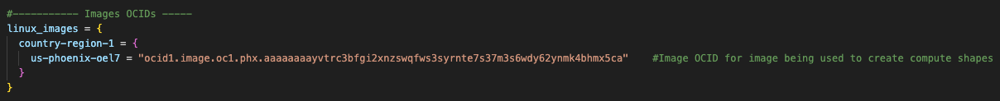
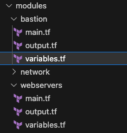

# Setting up Highly Available and Secure Infrastructure with Terraform

## Introduction

This lab walks you through how to set up Terraform to define a comoute instance in OCI. 

Estimated Time: 20 minutes

### About Compute Service
Oracle Cloud Infrastructure Compute lets you provision and manage compute hosts, known as instances. You can define instances as needed to meet your compute and application requirements.

### Objectives

In this lab, you will:
* Learn how to use/setup Terraform
* Learn how to provision OCI resources through Terraform

This lab assumes you have:
* An Oracle Cloud account
* Familiarity with Networking is desirable, but not required
* Some understanding of cloud, networking, Terraform
* Familiarity with Oracle Cloud Infrastructure (OCI) is helpful

## Task 1: SSH Keys and Image OCIDS

**1. SSH Keys**
  In terraform.tfvars, at the top of the file we have set the location of our SSH keys for us to access our instances. 

  ```
  <copy>
  ssh_public_key  = "<replace-public-sshkeypath-here>"
  ssh_private_key = "<replace-private-sshkeypath-here>"
  </copy>
  ```

  Copy and paste the following in the ssh_keys data structure. 

  Provide the path to your SSH keys.
  
  After editing, it would be similar to this. 

  

  **2. Image OCIDs**

  Next we will be providing our Image OCID. 

  An Image OCID is how Oracle Identifies a specific image to a specific region. 

  Dependent on where you are provisiong your resources you will identify the correct Image OCID. 

  For this example we will use the US Pheonix Region. 

```
<copy>
us-phoenix-oel7 = "replace-phoenix-oraclelinux7-image-ocid"
</copy>
```

For other regions
```
<copy>
country-region-oel7 = "replace-region-oraclelinux7-image-ocid"
</copy>
```
Copy and paste the following to the Image OCIDs section of the terraform.tfvars file.

In this [Documentation](https://docs.oracle.com/en-us/iaas/images/image/266adc03-7428-41fc-b17d-2f88ea56dff0/), you will be able to find Image OCIDs for Oracle Enterprise Linux 7. 

We will search for the Pheonix Region and find the Image OCID. 


We were able to find and implment our Image OCID needed to define out compute instances. Image OCIDs are software with configurations needed to launch our instances.

After entering your Image OCID, you should have something similar to this. 



## Task 2: Understanding The Bastion Variables

**1. Define the Bastion**

  A Bastion is a way to provide secure and monitored access for authorised users while preventing unauthorised users access. It acts as a single point of entry to reduce attack surface and provide security.

  We will use this bastion we define to access our webservers. 

  In terraform.tfvars, we are going to edit the Bastion Host Specifications. Copy this code block into the bastion data structure in terraform.tfvars file.
  ```
  <copy>
  compartment_data     = "comp-ocid"                     
  subnet_name          = "pub-subnet-oci-WebBastion-vcn" 
  ssh_public_key       = "ssh_public_key"                
  ssh_private_key      = "ssh_private_key"               
  display_name         = "replace-bastion-name-here"                      
  shape                = "replace-bastion-shape-here"               
  version              = "replace-bastion-version-here"                     
  ad                   = replace-ad-here                              
  fault_domain         = replace-fd-here                              
  boot_volume_size     = replace-bv-size-here                             
  preserve_boot_volume = replace-bv-perserve-true-or-false-here                         
  assign_public_ip     = replace-public-assign-true-or-false-here                            
  freeform_tags        = {}
  </copy>
  ```

**2. Edit The Bastion Host Specifications**

  We will be replacing the variables needed to define a compute instance. 

  Editing these varibales are the same as editing it the instance on the OCI console.

  When you define an instance on the OCI Console you start by giving it a name (refered as "display_name" in terraform code).

  ```
  display_name         = "bastion"
  ```

  Next we determine its shape.

  A shape of an instance is a predefined virtual machine (VM) configuration that has the number of CPUs, amount of memory, and other characteristics of the VM instance. In this case we will be using a Standard shape, which is suitable for our bastion host.

  Here is a list of different [Shapes](https://docs.oracle.com/en-us/iaas/Content/Compute/References/computeshapes.htm) in OCI.

  ```
  shape                = "VM.Standard2.1"
  ```

  The Operating System or OS (refered as "version" in our code) is the software that is going to be running the instance. In Task 1, we sought our image already and we determined that an Image OCID is required for a specific region. Since we are provisioning in the pheonix region we will use our **'us-pheonix-oel7'** oracle linux image OCID.

  Here is a list of different [Images](https://docs.oracle.com/en-us/iaas/images/).

  ```
  version              = "us-phoenix-oel7"
  ```
  
  Next we can decide which Availability Domain (AD) and Fault Domain (FD). 
  
  Availability Domains are Data centers within a region that are physically isolated from each other. These AD's have their own power, colling and networking. 
  A Fault Domain is is a grouping of hardware and infrastructure within an availability domain. Each availability domain contains three fault domains.

  All regions vary in how many Availability Domains they have to offer. For example the pheonix region has 3 Availiabilty Domains.<br>
  Here we have the option to place it in the 1st, 2nd, or 3rd AD. If it was in another region like Sydney, there would only be one AD.

  Here is a list of [Regions and Availability Domains](https://docs.oracle.com/en-us/iaas/Content/General/Concepts/regions.htm)

  ```
  ad                   = 1
  fault_domain         = 1
  ```

  **Note**

  If you set your ad to the 3rd Availability Domain and the region only supports 1. The instance will **NOT** be defined and Terraform will throw an error during execution. 

  ```
  ad = 3
  ```

  A Boot Volume contains the operating system and other files needed to boot the instance.

  Here is more info on [Boot Volumes](https://docs.oracle.com/en-us/iaas/Content/Block/Concepts/bootvolumes.htm)

  ```
  boot_volume_size     = 50
  ```

  The preserve status determines if the boot volume lives after the instance is terminated. If set to false it will deleted along with the instance. Else it will be retained which can be useful when keeping important data or configurations. 

  ```
  preserve_boot_volume = false
  ```
  
  Lastly we will determine if we assign the Bastion a public ip. In this case we will assign a public ip as we are going to be using the Bastion as a single point of entry to our webservers.
  
  ```
  assign_public_ip     = true
  ```

  After editing you should have something similar to this. 

  

## Task 3: Understanding The Webserver Variables

**1. Define The Webservers**

In this section we will be editing the webservers. As we defined our Bastion before. We will define our webserver in a similar fashion. However, we are **not** going to assign a public ip to our webservers. Hence we have the bastion to help us access them in a secure manner. 

In terraform.tfvars, we are going to edit the Webserver Specifications. Copy this code block into each webserver data structure in terraform.tfvars file.

```
<copy>
compartment_data     = "comp-ocid"                     
subnet_name          = "pub-subnet-oci-WebBastion-vcn" 
ssh_public_key       = "ssh_public_key"                
ssh_private_key      = "ssh_private_key"
webserver_data       = "webserver01"           
display_name         = "replace-webserver1-name-here"                      
shape                = "replace-webserver1-shape-here"               
version              = "replace-webserver1-version-here"                     
ad                   = replace-ad-here                             
fault_domain         = replace-fd-here                              
boot_volume_size     = replace-bv-size-here                             
preserve_boot_volume = replace-bv-perserve-true-or-false-here                          
assign_public_ip     = replace-public-assign-true-or-false-here                            
freeform_tags        = {}
</copy>
```

**2. Edit The Webserver Specifications**

Similarly how we defined our Bastion we will define our webservers

We will give it a ```display_name```. For example ```webserver01``` is simple and easy to track.

```
display_name         = "webserver01"                                       
```

we will determine the ```shape``` of the webserver. We will be using a ```VM.Standar2.1```.

```                
shape                = "VM.Standard2.1"                                       
```

Next is the ```version```. In this example we are provisioning in the Phoenix region, we will be using ```us-phoenix-oel7```.

```            
version              = "us-phoenix-oel7"                                              
```

For our Availability Domain and Fault Domain we will assign it to 1.

```                     
ad                   = 1                             
fault_domain         = 1                                                    
```

Boot Volume size is set to 50 and we will not be perserving it.

```                            
boot_volume_size     = 50                             
preserve_boot_volume = false                                                   
```

We will **not** be assinging our webservers a public ip.

```                       
assign_public_ip     = false                            
```

**Note**
* As we mentioned to make our webservers secure, we will be using the Bastion as a single point of entry to our webservers

After editing all three servers, you should have the following

**Webserver01**


**Webserver02**


**Webserver03**


## Understanding Modules

Modules are a way to make your code more structured and modular. We have used this concept to help promote reusability with our code.<br>
A module encapsulates a set of resources and variables within a defined namespace. 

In the terraform code you have a folder called modules.



Here we can can see our Bastion Module contains a main.tf, output.tf, and variables.tf

* The main.tf file is where you define the resources and configurations.
* The variables.tf file is where you define input variables for the module.
* The output.tf file is where you define the output values the module will produce after running.

In the variables.tf file, we can see that it has a Data Structure with a Data Block mapping the parameters needed to provision a bastion.


In the main.tf file we see how to define the bastion instance using the defined bastion parameters. 


Take note at the end of the file we are using the provisioner to do some actions after the resource was created. There are different provisioner types for different tasks, in this example we use the file provisioner to copy a file on to the instance. We will be copying our SSH private key onto to the Bastion. This will allow us to access our webservers.


Following this we use the remote-execution type of provisioner. The remote-execution type lets us run scripts to run commands on a remote sournce. Here run some commands to modify the permissions onto the file for ease of use.


## Learn More

* [Compute Service](https://docs.oracle.com/en-us/iaas/Content/Compute/Concepts/computeoverview.htm)
* [Oracle + Terraform](https://docs.oracle.com/en-us/iaas/developer-tutorials/tutorials/tf-compute/01-summary.htm)
* [Oracle Linux Image OCIDs](https://docs.oracle.com/en-us/iaas/images/image/266adc03-7428-41fc-b17d-2f88ea56dff0/)
* [Physical Architecture Concepts](https://docs.oracle.com/en-us/iaas/Content/GSG/Concepts/concepts-physical.htm)

## Acknowledgements
* **Author** - <Name, Title, Group>
* **Contributors** -  <Name, Group> -- optional
* **Last Updated By/Date** - <Name, Month Year>
