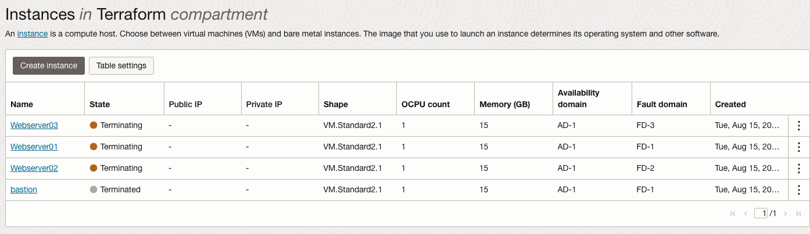

# Set up Highly Available and Secure Infrastructure with Terraform on OCI

## Introduction

This lab will go through deploying your terraform code and watch its creation from the console.

Estimated Time: 30 minutes

### Prerequisites

This lab assumes you have:
* An Oracle account
* Familiarity with Networking is desirable, but not required
* Some understanding of cloud, networking, and Terraform
* Familiarity with Oracle Cloud Infrastructure (OCI) is helpful

### Objectives

In this lab, you will:
* Learn how to use/setup Terraform
* Learn how to provision OCI resources through Terraform


## Task 1: Deploy your Terraform

**Terraform Initialize**

1. On your local terminal, navigate to your directory where the tf-provider is located in. 

2. Run the init command.
        ```
        <copy>
        terraform init
        </copy>
        ```

    Example output:

    

**Terraform Plan**

Next we will create an execution plan to check whether the changes shown in the execution plan match your expectations, without changing the real resources. 

3. Run the Terraform plan command

    ```
    <copy>
    terraform plan
    </copy>
    ```
        
    This will provide you the plan. 

    Example output:

    
  
**Terraform Apply** 

Finally we will apply the plan. This command will take a couple of minutes to run. 

4. Run the terraform apply command.

    ```
    <copy>
    terraform apply
    </copy>
    ```

5. Terraform will prompt you to enter yes when applying.

    

    After running you will receive outputs from the output.tf files. 

    Example output:

    

    In Addition if you have your console open you can see your resources get provisioned!

    

    

## Task 2: Destroy your Terraform

**Terraform Destroy**

On your local terminal, in the same directory as your tf-provider, we can tear down our infrastructure. 

6. Run the the terraform destroy command.

    ```
    <copy>
    terraform destroy
    </copy>
    ```

7. Terraform will prompt you to enter yes when destroying.

    

    Example output:

    

    Just like when you apply you can also watch your resources get destroyed on the console!

    

Congratulations on finishing this Livelab! Now you have a terraform template to use when provisioning resources on OCI!

## Learn More

* [CLI + Terraform](https://developer.hashicorp.com/terraform/tutorials/cli)

## Acknowledgements
* **Author** - Germain Vargas, Cloud Engineer
* **Contributors** -  David Ortega, Cloud Engineer
* **Last Updated By/Date** - Germain Vargas, August 2023
