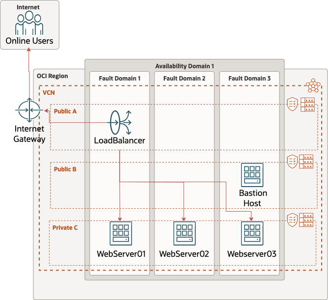

# Set up Highly Available and Secure Infrastructure with Terraform on OCI

## About this Workshop

This Lab will show you how to set up a highly available web server architecture on OCI.

We will show how to set up a VCN, Load Balancer, Bastion, and 2 Compute Instances with Terraform.

We will provide the Terraform environment and give a step by step guide on how to set it up on a Tenancy.

Here is the Architecture Diagram of our infrastructure we will be provisioning on OCI.

Estimated Workshop Time: 4 hours 00 minutes (This estimate is for the entire workshop - it is the sum of the estimates provided for each of the labs included in the workshop.)

### Prerequisites

This lab assumes you have:
* An Oracle account
* Familiarity with Networking is desirable, but not required
* Some understanding of cloud, networking, and Terraform
* Familiarity with Oracle Cloud Infrastructure (OCI) is helpful

### Objectives

In this workshop, you will learn how to:
* Setup the foundation for Terraform and Gather Tenancy information
* Edit Terraform provider to use OCI syntax
* Understand the use of Modules in terraform
* Deploying Terraform

## Learn More

* [OCI Provider](https://registry.terraform.io/providers/oracle/oci/latest/docs)
* [Oracle Documentation](http://docs.oracle.com)

## Acknowledgements
* **Authors** - Germain Vargas, Cloud Engineer
* **Contributors** - David Ortega, Cloud Engineer
* **Last Updated By/Date** - Germain Vargas, August 2023
