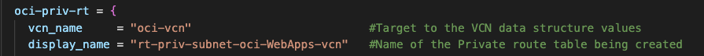

# Setting up Highly Available and Secure Infrastructure with Terraform

## Working with Networking on Terraform

### Introduction

This lab walks you through how to set up Networking Infrastruce as code using Terraform on OCI. 

Estimated Time: 30 minutes

### About <Product/Technology> 
In Terrafrom, there are mulitple files that are created to define input variables for infrastructure deployment. It is one of several ways to provide values to the variables used in a Terrafrom configuration. In this section we will be using the ".tf" extension which stands for Terrafrom.

In the terraform environment provided for this lab, you can see that there are mulitple files with the .tf extension. These files contain the infrastructure-as-code (IAC) instructions that define and describe the resources and services you want to provision and manage in OCI.


<!--- 
### Objectives

*List objectives for this lab using the format below*


In this lab, you will:
* Learn about 
* Learn how to provision OCI resources through Terraform
* Objective 3
-->

<!--- 
### Prerequisites (Optional)

*List the prerequisites for this lab using the format below. Fill in whatever knowledge, accounts, etc. is needed to complete the lab. Do NOT list each previous lab as a prerequisite.*

This lab assumes you have:
* An Oracle Cloud account
* Familiarity with Networking is desirable, but not required
* Some understanding of cloud, networking, Terraform terms is helpful
* Familiarity with Oracle Cloud Infrastructure (OCI) is helpful


*Below, is the "fold"--where items are collapsed by default.*
-->
## Task 1: Creating a VCN in Terraform
<!--In Terrafrom, there are mulitple files that are created to define input variables for infrastructure deployment. It is one of several ways to provide values to the variables used in a Terrafrom configuration. In this secrtion we will explaining the ".tfvars" extension which stands for Terraform Variables. The "terrafrom.tfvars" file allows you to define variables in a seperate file rather than hardcoding them directly into the configuration of a resource. This seperation helps keep sensitive infromation out of the main configuration files, making it easier to manage and share the codebase. 
-->
**1. Open terraform.tfvars**

Open the terrafrom.tfvars file. In the file you will see that there is maps of data structures containing several attributes for configuring OCI resources.


**2. Compartment OCID**

In the terrafrom.tfvars file, navigate to the compartment\_ids variable block. Copy the comp-ocid variable string below and paste it in the compartment\_ids variable block. Replace the string value with the compartment OCID gathered in the previous lab. This compartment is where all resources defined in the terraform enviroment will be deployed.

```
<copy>
comp-ocid = "&lt;replace-compartment-ocid-here&gt;" 
</copy>
```


**3. Creating VCN**

We can now start creating a VCN in Terraform by navigating to the vcn\_params data structure. Copy the variable strings below and paste it in the vcn\_params data block. 

```
<copy>
compartment_data = "comp-ocid" 
display_name     = "&lt;replace-vcn-name-here&gt" 
vcn_cidr         = "&lt;replace-vcn-cidr-here&gt"
dns_label        = "&lt;replace-vcn-dnslabel-here&gt"
</copy>
```

Replace the following string values to the respective variables in the vcn\_params data block.

* display_name = oci-WebApps-vcn
* vcn_cidr = 10.0.0.0/16
* dns_label = ociwebappsvcn

These values will provided the necessay atrributes to create the VCN on OCI with the respective values in Terraform.


**Step 4**

The next step consist of creating private and public subnets for the VCN that you just created in Terraform. For this VCN you will be creating one private subnet and two public subnets. Navigate to the subnet_params data structure in the terraform.tfvars file.

Replace the following for each varaible in the oci-priv-subnet data structure within subnet_params.

* display_name = priv-subnet-oci-WebApps-vcn
* vcn_cidr = 10.0.1.0/24
* dns_label = privsubdnsWeb


Replace the following for each varaible in the oci-pub-subnet-01 data structure within subnet_params.

* display_name = pub-subnet-oci-WebLB-vcn
* vcn_cidr = 10.0.3.0/24
* dns_label = pubsubdnsLB


Replace the following for each varaible in the oci-pub-subnet-02 data structure within subnet_params.

* display_name = pub-subnet-oci-WebBastion-vcn
* vcn_cidr = 10.0.2.0/24
* dns_label = pubsubdnsBas


You have now created a VCN with pirvate and public subnets in the Terraform environment.

## Task 2: Creating a Secuirty Lists in Terraform for Private and Public subnets.

**Step 1** 

In the terrafrom.tfvars file, navigate to the sl_params data structure. Within the sl_params you will see there is combination of data structures that create ingress and egress rules for the private and public subnets created in the previous task.

We can take oci-priv-sl as an example to better understand what is going on. 


## Task 3: Creating a Route tables and Gateways in Terraform for Private and Public subnets.

**Step 1**

In this section you will first be creating an Internet gateway, Nat gateway and Service gate way that will then be attached to their respective route table.

In the terrafrom.tfvars file, navigate to the igw_params data structure. 

Replace the following for each varaible in the oci-ig data structure within igw_params.

* display_name = service-gateway-oci-WebApps-vcn


Replace the following for each varaible in the oci-ngw data structure within ngw_params.

* display_name = ngw-oci-WebApps-vcn


Replace the following for each varaible in the oci-sgw data structure within sqw_params.

* display_name = service-gateway-oci-WebApps-vcn
* service_name = All PHX Services In Oracle Services Network


Replace the following for each varaible in the oci-priv-rt data structure within rt_params.

* display_name = rt-priv-subnet-oci-WebApps-vcn



Attaching Service gateway to the private route table consists of replace the following for each varaible in the route_rules data structure within oci-priv-rt.

* destination = null
* use_igw     = false
* igw_name    = null
* use_sgw     = true
* sgw_name    = oci-sgw
* ngw_name    = null

Attaching Nat gateway to the private route table consists of replace the following for each varaible in the route_rules data structure within oci-priv-rt.

* destination = "0.0.0.0/0"
* use_igw     = false
* igw_name    = null
* use_sgw     = false
* sgw_name    = null
* ngw_name    = oci-ngw


Replace the following for each varaible in the oci-pub-rt data structure within rt_params.

* display_name = rt-pub-subnet-oci-WebApps-vcn


Attaching Service gateway to the private route table consists of replace the following for each varaible in the route_rules data structure within oci-pub-rt.

* destination = "0.0.0.0/0"
* use_igw     = true
* igw_name    = null
* use_sgw     = oci-ig
* sgw_name    = null
* ngw_name    = null


## Task 4: Creating a Loadbalancer in Terraform.

## Task 5: Creating a Network Security Group in Terraform.

Replace the following for each varaible in the oci-lb data structure within lb_params.

* display_name = oci-WebApps-lb
* shape = flexible
* defaultmax = 100
* defaultmin = 10

Replace the following for each varaible in the oci-lb-listener data structure within listener_params.

* display_name = oci-WebLB-listener
* port = 80
* protocol = HTTP

Replace the following for each varaible in the oci-lb-backendset data structure within backendset_params.

* display_name = oci-lb-backendset
* policy = ROUND_ROBIN

Replace the following for each varaible in the oci-lb-backend01 data structure within backend_params.


## Learn More

*(optional - include links to docs, white papers, blogs, etc)*

* [URL text 1](http://docs.oracle.com)
* [URL text 2](http://docs.oracle.com)

## Acknowledgements
* **Author** - <Name, Title, Group>
* **Contributors** -  <Name, Group> -- optional
* **Last Updated By/Date** - <Name, Month Year>
