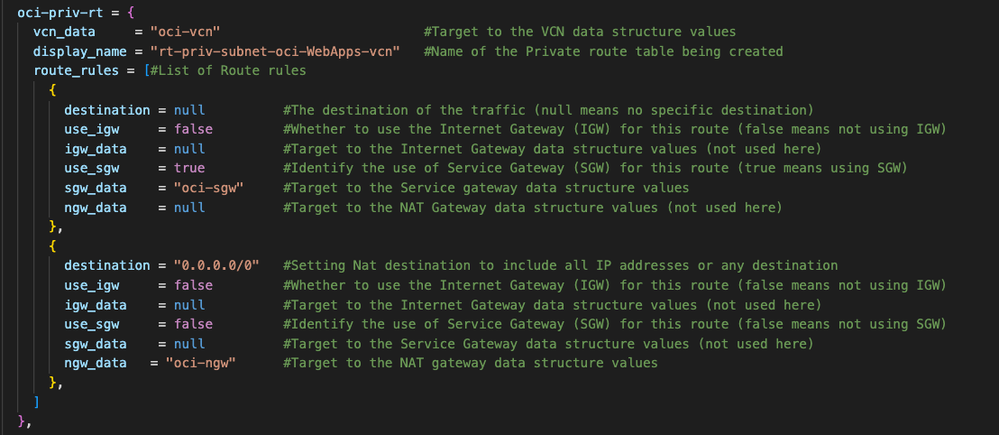

# Set up Highly Available and Secure Infrastructure with Terraform on OCI

## Work with Networking on Terraform

### Introduction

This hands-on lab goes through the process of setting up Networking Infrastructure as code using Terraform on Oracle Cloud Infrastructure(OCI). In this lab, you will learn how to harness the power of Terraform to define and provision OCI networking resources programmatically. By leveraging the OCI Terraform environment provided in the previous lab, you will be able to define and create a variety of networking resources, just as you would in the OCI console, but in a more automated and repeatable manner.

Throughout the lab, you will be guided through multiple tasks that demonstrate how to define various networking components, such as Virtual Cloud Networks(VCNs), Route Tables and Load Balancers. By the end of this lab, you will have gained practical experience in utilizing Terraform to design and deploy OCI networking resources, understanding how to input the necessary parameters that mirror those found in the OCI console.

Estimated Time: 1 hour and 30 minutes

### Prerequisites

This lab assumes you have:
* An Oracle account
* Familiarity with Networking is desirable, but not required
* Some understanding of cloud, networking, and Terraform
* Familiarity with Oracle Cloud Infrastructure (OCI) is helpful

### Objectives

In this lab, you will:
* Define a VCN with Private and Public subnets in Terraform
* Define Security Lists for VCN subnets in Terraform
* Define Gateways and Route Tables for VCN subnets in Terraform
* Define a Load Balancer in Terraform
* Define a Network Security Group in Terraform

## Task 1: Defining a VCN that will be created in Terraform

In Terraform, managing input variables is a critical aspect of building flexible and reusable infrastructure configurations. One of the ways to define resources in Terraform is by using the terraform.tfvars file. The .tfvars extension stands for Terraform Variables.

The terraform.tfvars file allows you to define and assign values to variables separately from the resource module configuration files. This separation helps keep sensitive information out of the module configuration files, making it easier to manage and share the code infrastructure. 

<!--**terraform.tfvars** -->

1. Open the terraform.tfvars file in the Terraform environment provided in the previous lab.  

    

    The file contains maps of data structures containing several attributes for configuring resources on OCI. These maps, structured as data structures, facilitate the definition of complex configurations with ease. Each map corresponds to a specific OCI resource and contains a set of key-value pairs representing various resource properties.

<!--**Defining the Compartment OCID**-->

2. In the terraform.tfvars file, navigate to the compartment\_ids variable block. 

3. Copy the comp-ocid variable string below and paste it into the compartment\_ids variable block. 

4. Replace the string value with the compartment OCID gathered in the previous lab. 

    ```
    <copy>
    comp-ocid = "&lt;replace-compartment-ocid-here&gt;" 
    </copy>
    ```

    The compartment\_ids block holds the compartment OCID in the Terraform Environment. This OCID serves as the compartment location in which all resources will be created on OCI. Each resource data structure reaches out for the compartment OCID, recognizing it by the identifier comp-ocid. This connection ensures that every resource being created will deploy within the intended compartment.

    

<!--**Defining a VCN**-->

5. In the terraform.tfvars file, navigate to the vcn\_params data structure. 

6. Copy the variable strings below and paste it into the oci-vcn data block. 

    ```
    <copy>
    compartment_data = "comp-ocid" 
    display_name     = "&lt;replace-vcn-name-here&gt" 
    vcn_cidr         = "&lt;replace-vcn-cidr-here&gt"
    dns_label        = "&lt;replace-vcn-dnslabel-here&gt"
    </copy>
    ```

7. Replace the following string values to the respective variables in the oci-vcn data block.

    ```
    display_name = oci-WebApps-vcn
    vcn_cidr     = 10.0.0.0/16
    dns_label    = ociwebappsvcn
    ```

    The display\_name variable provides the VCN with a name that will be displayed on the OCI console. The vcn\_cidr variable assigns a specific Classless Inter-Domain Routing (CIDR) block to the VCN, defining its IP address range and subnetting. While the dns\_label variable gives a DNS label to the VCN, which serves as a basis for generating the VNC's DNS Domain Name. In the VCN data block you can also find that the compartment\_data attribute calls upon the comp-ocid variable, housing the compartment OCID for the targeted OCI compartment where the VCN will be provisioned. These attributes form the backbone of the VCN configuration, providing Terraform with the required information needed to orchestrate and create the VCN on an OCI environment.

    

<!--**Defining Private and Public subnets**-->

8. In the terraform.tfvars file, navigate to the subnet\_params data structure. 

    In the data structure there are three different data blocks that are used to provide attributes to create subnets for the VCN. The next step consist of defining private and public subnets for the VCN being created in Terraform. For this VCN you will be defining one private subnet and two public subnets. 

    The first subnet being created defined is a Private subnet. 

9. In the subnet\_params data structure. Copy the variable strings below and paste it into the oci-priv-subnet data block. 

    ```
    <copy>
    vcn_data          = "oci-vcn"
    sl_data           = "oci-priv-sl"
    rt_data           = "oci-priv-rt"
    display_name      = "<replace-private-subnet-name-here>"
    cidr_block        = "<replace-private-subnet-cidr-here>"
    dns_label         = "<replace-private-subnet-dnslabel-here>"
    </copy>
    ```

10. Replace the following for each variable in the oci-priv-subnet data block.

    ```
    display_name = priv-subnet-oci-WebApps-vcn
    cidr_block   = 10.0.1.0/24
    dns_label    = privsubdnsWeb
    ```

    This Private subnet serves as the designated subnet for hosting the Web Server instances, which will be created with the help of Terraform. By designating the Web Server instances to reside within the Private subnet, a security-conscious approach is adopted, ensuring that the web servers are shielded from direct exposure to the public internet.

    

The next subnet being defined is the first Public subnet associated with the VCN. 

11. In the subnet\_params data structure. Copy the variable strings below and paste it into the oci-pub-subnet-01 data block. 

    ```
    <copy>
    vcn_data          = "oci-vcn"
    sl_data           = "oci-priv-sl"
    rt_data           = "oci-priv-rt"
    display_name      = "<replace-private01-subnet-name-here>"
    cidr_block        = "<replace-private01-subnet-cidr-here>"
    dns_label         = "<replace-private01-subnet-dnslabel-here>"
    </copy>
    ```

12. Replace the following for each variable in the oci-pub-subnet-01 data block.

    ```
    display_name = pub-subnet-oci-WebLB-vcn
    vcn_cidr     = 10.0.3.0/24
    dns_label    = pubsubdnsLB
    ```

    This Public subnet serves as the designated subnet for hosting the Load Balancer, which will be created with the help of Terraform. The Public subnet will be configured to have direct access to the internet through an associated Internet Gateway, facilitating seamless communication between the Load Balancer and clients accessing the Web Servers.

    

The last subnet being defined is the second Public subnet associated with the VCN. 

13. In the subnet\_params data structure. Copy the variable strings below and paste it into the oci-pub-subnet-02 data block. 

    ```
    <copy>
    vcn_data          = "oci-vcn"
    sl_data           = "oci-priv-sl"
    rt_data           = "oci-priv-rt"
    display_name      = "<replace-private02-subnet-name-here>"
    cidr_block        = "<replace-private02-subnet-cidr-here>"
    dns_label         = "<replace-private02-subnet-dnslabel-here>"
    </copy>
    ```

14. Replace the following for each variable in the oci-pub-subnet-02 data block.

    ```
    display_name = pub-subnet-oci-WebBastion-vcn
    vcn_cidr     = 10.0.2.0/24
    dns_label    = pubsubdnsBas
    ```

    This Public subnet serves as the designated subnet for hosting the Bastion instance, which will be created with the help of Terraform. The Public subnet will be configured to have direct access to the Private subnet, facilitating seamless communication between the Bastion and Web Servers.The primary function of the Bastion instance existing in the Public subnet is to act as a secure gateway or jump host that provides privileged access to the Private subnet, allowing authorized addresses to establish secure remote connections from external networks, such as the internet, to the Bastion instance.

    

    While defining the Subnets there were several attributes being called and defined. The display\_name variable was used to provide the Subnets with a user-defined name that will be displayed on the OCI console. The cidr\_block variable assigned a specific CIDR block to the Subnets, defining their IP address range. Additionally, the dns\_label variable was utilized to assign a DNS label to the Subnets, which serves as a basis for generating the Subnet's DNS Domain Names. 

    Within each Subnet data block there are other attributes that help define the configuration of the Subnet. Among these attributes, the is\_subnet\_private value determined whether the Subnet defined is public or private. If the value is set to true, the subnet created will indeed be private. However if the value is set to false, the subnet created will be public.

    The data block also specifies the VCN in which the subnet will exist, making use of the vcn\_data variable. By doing so, it established the association between the subnets and the parent VCN.

    Lastly, the subnets required the attachment of both a Security List and Route Table. These attachments are facilitated through the sl\_data variable for Security List and rl\_data variable for Route table. These attributes serve as the backbone of the subnet configuration, providing Terraform with the required information needed to orchestrate and create the subnets on an OCI environment.You have now defined a VCN with private and public subnets in the Terraform environment.

## Task 2: Defining Security Lists in Terraform for Private and Public subnets.

1. In the terraform.tfvars file, navigate to the sl\_params data structure. Within the sl\_params you will see that there is combination of data blocks which define ingress and egress rules for the private and public subnets defined in the previous task. 

    The first set of ingress and egress rules being defined are attached to the private subnet. This was achieved by utilizing the sl_data variable and specifying the oci-priv-sl data block as its value. This section encompasses the creation of the Security List along with defining the associated ingress and egress rules. 

2. Copy the variable strings below and paste it into the first set of empty curly brackets within the ingress\_rules list of the oci-priv-sl data block.

    ```
    <copy>
    stateless   = "<replace-true-or-false-here>"                      
    protocol    = "<replace-traffic-protocol-here>"                          
    source      = "<replace-traffic-source-here>"                
    source_type = "<replace-source-type-here>"                 
    tcp_options = [                            
        {
            min = <replace-min-destination-port-here>                              
            max = <replace-max-destination-port-here>                             
        }
    ]
    udp_options  = []                           
    icmp_options = []
    </copy>
    ```

3. Replace the following for each variable in the ingress\_rule data block.

    ```
    stateless    = false                    
    protocol     = 6                          
    source       = 10.0.2.0/24                
    source\_type = CIDR_BLOCK
    min          = 22
    max          = 22   
    ```

    This ingress rule is defined to enable secure SSH access from the public subnet, where the bastion instance resides, to the private subnet housing the web servers. The rule specifically permits SSH traffic, which operates on port 22, from the bastion instance's IP address or range to reach the web servers within the private subnet. This approach enhances the overall security posture of the infrastructure by limiting SSH access exclusively to the authorized bastion instance. As a result, potential attackers are effectively prevented from directly accessing the web servers, significantly reducing the risk of unauthorized logins or security breaches.

4. Copy the variable strings below and paste it into the second set of empty curly brackets within the ingress_rules list of the oci-priv-sl data block.

    ```
    <copy>
    stateless   = "<replace-true-or-false-here>"                      
    protocol    = "<replace-traffic-protocol-here>"                          
    source      = "<replace-traffic-source-here>"                
    source_type = "<replace-source-type-here>"                 
    tcp_options = [                            
        {
            min = <replace-min-destination-port-here>                              
            max = <replace-max-destination-port-here>                             
        }
    ]
    udp_options  = []                           
    icmp_options = []
    </copy>
    ```

5. Replace the following for each variable in the second ingress\_rule data block.

    ```
    stateless    = false                    
    protocol     = 6                          
    source       = 10.0.3.0/24                
    source\_type = CIDR_BLOCK
    min          = 80
    max          = 80  
    ```

    This ingress rule is defined to enable the public subnet, housing the Load Balancer, to gain controlled and secure internet access to the private subnet housing the web servers. The rule specifically permits HTTP traffic, which operates on port 80, from the Load Balancer IP address or range to reach the web servers within the private subnet. This approach optimizes the performance and availability of the web servers, as the Load Balancer effectively distributes incoming internet traffic across multiple backend instances, ensuring seamless scalability and efficient load distribution. Additionally, the private subnet's isolation from direct external exposure enhances security by reducing the attack surface and mitigating potential threats from the internet.

6. Copy the variable strings below and paste it into the set of empty curly brackets within the egress_rules list of the oci-priv-sl data block.

    ```
    <copy>
    stateless   = "<replace-true-or-false-here>"                      
    protocol    = "<replace-traffic-protocol-here>"                       
    destination = "<replace-traffic-destination-here>"                   
    description = "<replace-rule-description-here>"  
    </copy>
    ```

7. Replace the following for each variables in the egress\_rule data block.

    ```
    stateless   = false                    
    protocol    = all    
    destination = 0.0.0.0/0
    description = All traffic for all ports
    ```

    This egress rule is defined to allow all outbound traffic from private subnet housing the web servers. By configuring this egress rule, we establish an open pathway for the web servers to communicate freely with external destinations on the internet. This approach is particularly useful when the web servers need to interact with external services, fetch data, or respond to requests from clients across the internet.

    


    The second set of ingress and egress rules being defined are attached to the public subnet housing the Load Balancer. This was achieved by utilizing the sl_data variable and specifying the oci-pub-sl-01 data block as its value.

8. Copy the variable strings below and paste it into the set of empty curly brackets within the ingress\_rules list of the oci-pub-sl-01 data block.

    ```
    <copy>
    stateless   = "<replace-true-or-false-here>"                      
    protocol    = "<replace-traffic-protocol-here>"                          
    source      = "<replace-traffic-source-here>"                
    source_type = "<replace-source-type-here>"                 
    tcp_options = [                            
        {
            min = <replace-min-destination-port-here>                              
            max = <replace-max-destination-port-here>                             
        }
    ]
    udp_options  = []                           
    icmp_options = []
    </copy>
    ```

9. Replace the following for each variables in the ingress\_rule data block.

    ```
    stateless   = false                    
    protocol    = 6                          
    source      = 10.0.3.0/24               
    source\_type = CIDR_BLOCK
    min = 22
    max = 22                 
    ```

    This ingress rule is defined to enable secure SSH access from the public subnet, where the bastion instance resides, to the public subnet housing the Load Balancer. The rule specifically permits SSH traffic, which operates on port 22, from the bastion instance's IP address or range to reach the Load Balancer and any other resources within the public subnet. This approach enhances the overall security posture of the infrastructure by limiting SSH access exclusively to the authorized bastion instance.

10. Copy the variable strings below and paste it into the set of empty curly brackets within the egress_rules list of the oci-pub-sl-01 data block.

    ```
    <copy>
    stateless   = "<replace-true-or-false-here>"                      
    protocol    = "<replace-traffic-protocol-here>"                       
    destination = "<replace-traffic-destination-here>"                   
    description = "<replace-rule-description-here>"  
    </copy>
    ```

11. Replace the following for each variables in the egress\_rule data block.

    ```
    stateless   = false                    
    protocol    = all    
    destination = 0.0.0.0/0
    description = All traffic for all ports
    ```

    This egress rule is defined to allow all outbound traffic from public subnet housing the Load Balancer. By configuring this egress rule, we establish an open pathway for the Load Balancer to communicate freely with external destinations on the internet. 

    

    The last set of ingress and egress rules being defined are attached to the public subnet housing the Bastion instance. This was achieved by utilizing the sl_data variable and specifying the oci-pub-sl-02 data block as its value.

12. Copy the variable strings below and paste it into the set of empty curly brackets within the ingress\_rules list of the oci-pub-sl-02 data block.

    ```
    <copy>
    stateless   = "<replace-true-or-false-here>"                      
    protocol    = "<replace-traffic-protocol-here>"                          
    source      = "<replace-traffic-source-here>"                
    source_type = "<replace-source-type-here>"                 
    tcp_options = [                            
        {
            min = <replace-min-destination-port-here>                              
            max = <replace-max-destination-port-here>                             
        }
    ]
    udp_options  = []                           
    icmp_options = []
    </copy>
    ```

13. Replace the following for each variables in the ingress\_rule data block.

    ```
    stateless    = false                    
    protocol     = 6                          
    source       = 0.0.0.0/0                
    source\_type = CIDR_BLOCK
    min          = 22
    max          = 22                 
    ```

    This ingress rule is defined to enable secure SSH access from the public subnet, where the bastion instance resides. The rule specifically permits SSH traffic, which operates on port 22. However, it is essential to highlight a security enhancement that can be implemented to further strengthen the architecture. By replacing the current source of the ingress rule, which is set to 0.0.0.0/0 (allowing any IP address), with the specific IP address of your computer, you can significantly enhance the security posture.

    This enhancement ensures that only your computer's IP address is granted SSH access to the bastion instance. As a result, unauthorized access attempts from other IP addresses are effectively mitigated, reducing the risk of potential security breaches.

    ```
    <copy>
    stateless   = "<replace-true-or-false-here>"                      
    protocol    = "<replace-traffic-protocol-here>"                       
    destination = "<replace-traffic-destination-here>"                   
    description = "<replace-rule-description-here>"  
    </copy>
    ```

14. Replace the following for each variables in the egress\_rule data block.

    ```
    stateless   = false                    
    protocol    = all    
    destination = 0.0.0.0/0
    description = All traffic for all ports
    ```

    This egress rule is defined to allow all outbound traffic from public subnet housing the Bastion instance. By configuring this egress rule, we establish an open pathway for the Bastion instance to communicate freely with external destinations on the internet. 

    

## Task 3: Defining Route tables and Gateways in Terraform for Private and Public Subnets.

1. In the terraform.tfvars file, navigate to the igw\_params data structure. Within the igw\_params you will see that there is an oci-ig data blocks that defines an Internet gateway.

2. Copy the variable strings below and paste it into the oci-ig data block.

    ```
    <copy>
    vcn_data     = "oci-vcn"                          
    display_name = "<replace-igw-name-here>" 
    </copy>
    ```

3. Replace the following for the display\_name variable in the oci-id data block.

    ```
    display_name = internet-gateway-oci-WebApps-vcn
    ```

    The display\_name variable provides the Internet gateway with a name that will be displayed on the OCI console. In the oci-igw data block you can also find that the vcn\_data attribute specifies the VCN in which the Internet gateway will exist.

    


    In the terraform.tfvars file, navigate to the ngw\_params data structure. Within the ngw\_params you will see that there is an oci-ngw data blocks that defines an Nat gateway.

4. Copy the variable strings below and paste it into the oci-ngw data block.

    ```
    <copy>
    vcn_data     = "oci-vcn"              
    display_name = "<replace-ngw-name-here>"
    </copy>
    ```

5. Replace the following for the display\_name variable in the oci-ngw data block.

    ```
    display_name = ngw-oci-WebApps-vcn
    ```

    The display\_name variable provides the Nat gateway with a name that will be displayed on the OCI console. In the oci-ngw data block you can also find that the vcn\_data attribute specifies the VCN in which the Nat gateway will exist.

    

6. In the terraform.tfvars file, navigate to the sgw\_params data structure. Within the sgw\_params you will see that there is an oci-sgw data blocks that defines an Service gateway.

7. Copy the variable strings below and paste it into the oci-sgw data block.

    ```
    <copy>
    vcn_data     = "oci-vcn"                                      
    display_name = "<replace-sgw-name-here>"              
    service_name = "<replace-sgw-region-service-here>"
    </copy>
    ```

8. Replace the following variable values in the oci-sgw data block.

    ```
    display_name = service-gateway-oci-WebApps-vcn
    service_name = All PHX Services In Oracle Services Network
    ```

    The display\_name variable provides the Service gateway with a name that will be displayed on the OCI console. While the service\_name identifies the region for the services allowed. If you are deploying the OCI resources in a different region, make sure to change PHX to your specific region such as IAD if deploying the OCI resources in Ashburn region. In the oci-sgw data block you can also find that the vcn\_data attribute specifies the VCN in which the Nat gateway will exist.


9. In the terraform.tfvars file, navigate to the rt\_params data structure. Within the rt\_params you will see that there is combination of data blocks that define route rules for the private and public route tables which will be attached to the subnets defined in the previous tasks.

    The first set of route rules being defined are attached to the private subnet. This was achieved by utilizing the rt\_data variable and specifying the oci-priv-rt data block as its value. This section encompasses the creation of the Route Tables along with defining the associated route rules.

10. Copy the variable strings below and paste it into the first set of empty curly brackets within the route\_rules list of the oci-priv-rt data block.

    ```
    <copy>
    destination = <replace-traffic-destination-here>          
    use_igw     = <replace-igw-true-or-false-here>        
    igw_data    = <replace-igw-data-structure-here>         
    use_sgw     = <replace-sgw-true-or-false-here>         
    sgw_data    = <replace-sgw-data-structure-here>   
    ngw_data    = <replace-ngw-data-structure-here>
    </copy>
    ```

11. Replace the following for each variable in the route\_rules data block.

    ```
    destination = null
    use_igw     = false
    igw_data    = null
    use_sgw     = true
    sgw_data    = oci-sgw
    ngw_data    = null
    ```

    In the route rule, use\_sgw is set as true which indicates that the route rule is being used to attach a Service gateway. The sgw\_data is then used to target the Service gateway that was defined in the previous tasks. The rest of the variables are then sent to null and false since those values are not needed to identify a Service gateway.

12. Copy the variable strings below and paste it into the second set of empty curly brackets within the route_rules list of the oci-priv-rt data block.

    ```
    <copy>
    destination = <replace-traffic-destination-here>          
    use_igw     = <replace-igw-true-or-false-here>        
    igw_data    = <replace-igw-data-structure-here>         
    use_sgw     = <replace-sgw-true-or-false-here>         
    sgw_data    = <replace-sgw-data-structure-here>   
    ngw_data    = <replace-ngw-data-structure-here> 
    </copy>
    ```

13. Replace the following for each variable in the route\_rules data block.

    ```
    destination = "0.0.0.0/0"
    use_igw     = false
    igw_data    = null
    use_sgw     = false
    sgw_data    = null
    ngw_data    = oci-ngw
    ```

    In the route rule, destination is set to 0.0.0.0/0 (allowing any IP address), which indicates that the route rule is being used to attach a NAT gateway. The ngw\_data is then used to target the Nat gateway that you defined in the previous tasks. The rest of the variables are then sent to null and false since those values are not needed to identify a Nat gateway.

    

    The second set of route rules being defined are attached to the public subnets. This was achieved by utilizing the rt\_data variable and specifying the oci-pub-rt data block as its value.

14. Copy the variable strings below and paste it into the set of empty curly brackets within the route\_rules list of the oci-pub-rt data block.

    ```
    <copy>
    destination = <replace-traffic-destination-here>          
    use_igw     = <replace-igw-true-or-false-here>        
    igw_data    = <replace-igw-data-structure-here>         
    use_sgw     = <replace-sgw-true-or-false-here>         
    sgw_data    = <replace-sgw-data-structure-here>   
    ngw_data    = <replace-ngw-data-structure-here>   
    </copy>
    ```

15. Replace the following for each variable in the route\_rules data block.

    ```
    destination = "0.0.0.0/0"
    use_igw     = true
    igw_data    = oci-ig
    use_sgw     = false
    sgw_data    = null
    ngw_data    = null
    ```

    In the route rule, use\_igw is set as true which indicates that the route rule is being used to attach a Internet gateway. The igw\_data is then used to target the Internet gateway that you defined in the previous tasks. The rest of the variables are then sent to null and false since those values are not needed to identify a Internet gateway.

    

## Task 4: Defining a Load Balancer in Terraform.

1. In the terraform.tfvars file, navigate to the lb\_params data structure. Within the lb\_params you will see that there is an oci-lb data block that defines a Load Balancer.

2. Copy the variable strings below and paste it into the oci-lb data block.

    ```
    <copy>
    compartment_data = "comp-ocid"         
    subnet_data      = "oci-pub-subnet-01" 
    nsg_data         = "oci-nsg"           
    display_name     = "<replace-lb-name-here>"    
    shape            = "<replace-lb-shape-here>"          
    defaultmax       = <replace-connection-max>                
    defaultmin       = <replace-connection-min>    
    </copy>
    ```

3. Replace the following for each variable in the oci-lb data block.

    ```
    display_name = oci-WebApps-lb
    shape        = flexible
    defaultmax   = 100
    defaultmin   = 10
    ```

    While creating the Load Balancer there will be several attributes called by Terraform. The display\_name variable is used to provide the Load Balancer with a user-defined name that will be displayed on the OCI console. The shape variable specifies the shape of the Load Balancer in this case it will be flexible. The defaultmax and defaultmin variables define the maximum and minimum number of allowed connections per backend server. 

    In the Load Balancer data block you can also find that the compartment_data attribute calls upon the comp-ocid variable, housing the compartment OCID for the targeted OCI compartment where the Load Balancer will be provisioned. 

    Lastly, the Load Balancer contains both a Public subnet and Network Security Group attachment. These attachments are facilitated through the subnet\_data variable for the Public subnet and nsg\_data variable for Network Security Group. These attributes help link the Load Balancer with the appropriate configurations, providing Terraform with the required information needed to orchestrate and create the Load Balancer on an OCI environment.

    

4. In the terraform.tfvars file, navigate to the listener\_params data structure. Within the listener\_params you will see that there is an oci-lb-listener data block that defines a Listener for the Load Balancer.

5. Copy the variable strings below and paste it into the oci-lb-listener data block.

    ```
    <copy>
    lb_data      = "oci-lb"                
    backend_data = "oci-lb-backendset"    
    display_name = "<replace-listener-name-here>"      
    port         = "<replace-listener-port-here>"                  
    protocol     = "<replace-listener-protocol-here>"   
    </copy>
    ```

6. Replace the following for each variable in the oci-lb-listener data block.

    ```
    display_name = oci-WebLB-listener
    port         = 80
    protocol     = HTTP
    ```

    The display\_name variable is used to provide the Listener with a user-defined name that will be displayed on the OCI console. 

    The port variable designates the port on which the Listener stands to intercept incoming network traffic. In this context, the Listener is primed to await connections on port 80, which corresponds to the HTTP protocol—an integral conduit for web-based communications.

    Furthermore, the protocol variable establishes the communication protocol to be employed by the Listener. In this instance, it is attuned to the HTTP protocol, delineating the standardized method by which the Listener will interact with the backend servers. 

    Lastly, the Listener contains both a Load Balancer and Backend set attachment. The lb\_data assigns the Listener to the Load Balancer created in the pervious step. The backend\_data connects the backend set that will be defined in the next step. 

    

7. In the terraform.tfvars file, navigate to the backendset\_params data structure. Within the backendset\_params you will see that there is an oci-lb-backendset data block that defines a Backend set for the Load Balancer.

8. Copy the variable strings below and paste it into the oci-lb-backendset data block.

    ```
    <copy>
    lb_data      = "oci-lb"             
    display_name = "<replace-backendset-name-here>"  
    policy       = "<replace-traffic-policy-here>"   
    </copy>
    ```

9. Replace the following for each variable in the oci-lb-backendset data block.

    ```
    display_name = oci-lb-backendset
    policy       = ROUND_ROBIN
    ```

    The display\_name variable is used to provide the Backend set with a user-defined name that will be displayed on the OCI console. The policy variable defines the policy for distributing incoming traffic among the backend servers. In this scenario, the Backend set is configured to adopt a ROUND_ROBIN policy, ensuring an equitable and balanced distribution of incoming requests across the available backend servers.

    Lastly, the Backend set gets attached to the Load Balancer defined in the previous steps via the lb\_data variable.

    

10. In the terraform.tfvars file, navigate to the backend\_params data structure. Within the backend\_params you will see that there are three data block that create the Backends for the Load Balancer. In this section, we will be creating three identical Backend server attachments. The distinguishing factor between these attachments lies in the distinct names attributed to each Web Server instance.

11. Copy the variable strings below and paste it into the oci-lb-backend01 data block.

    ```
    <copy>
    lb_data   = "oci-lb"               
    backend_data = "oci-lb-backendset" 
    webserver_name = "<replace-webserver1-name-here>"     
    backup       = "<replace-backup-true-or-false-here>"             
    drain        = "<replace-drain-true-or-false-here>"              
    offline      = "<replace-offline-true-or-false-here>"            
    port         = "<replace-backend-port-here>"                
    weight       = "<replace-backend-weight-here>"   
    </copy>
    ```

12. Replace the following for each variable in the oci-lb-backend01 data block.

    ```
    webserver_name = Webserver01
    backup         = false         
    drain          = false                 
    offline        = false          
    port           = 80                
    weight         = 1     
    ```

13. Copy the variable strings below and paste it into the oci-lb-backend02 data block.

    ```
    <copy>
    lb_data   = "oci-lb"               
    backend_data = "oci-lb-backendset" 
    webserver_name = "<replace-webserver2-name-here>"     
    backup       = "<replace-backup-true-or-false-here>"             
    drain        = "<replace-drain-true-or-false-here>"              
    offline      = "<replace-offline-true-or-false-here>"            
    port         = "<replace-backend-port-here>"                
    weight       = "<replace-backend-weight-here>"   
    </copy>
    ```

14. Replace the following for each variable in the oci-lb-backend02 data block.

    ```
    webserver_name = Webserver02
    backup         = false         
    drain          = false                 
    offline        = false          
    port           = 80                
    weight         = 1
    ```

15. Copy the variable strings below and paste it into the oci-lb-backend03 data block.

    ```
    <copy>
    lb_data   = "oci-lb"               
    backend_data = "oci-lb-backendset" 
    webserver_name = "<replace-webserver3-name-here>"     
    backup       = "<replace-backup-true-or-false-here>"             
    drain        = "<replace-drain-true-or-false-here>"              
    offline      = "<replace-offline-true-or-false-here>"            
    port         = "<replace-backend-port-here>"                
    weight       = "<replace-backend-weight-here>"   
    </copy>
    ```

16. Replace the following for each variable in the oci-lb-backend03 data block.

    ```
    webserver_name = Webserver03
    backup         = false         
    drain          = false                 
    offline        = false          
    port           = 80                
    weight         = 1
    ```

    For each of the three backend servers there is a different name associated with the webserver\_name variable, while the remaining variables maintain uniform settings. The backup variable designates backup status, all currently configured as false—ensuring non-backup roles. The drain variable indicates if the backend server is set to drain mode. We have set all drain values as false, enabling continuous HTTP request forwarding by the Load Balancer. The offline variable governs online/offline status, currently all backend servers are set as false to maintain online accessibility. The port variable designates the port for incoming traffic, maintaining consistency with all other ports at port 80. Meanwhile, the weight variable defines traffic allocation proportion for each backend server. All backends have been assigned a weight of 1, ensuring equal distribution of new connections.
    
    Lastly, all the backend data blocks are attached to the Load Balancer defined in the previous steps via the lb\_data variable. Concurrently, the backend\_data variable facilitates the Backend attachments to the Backend Set. This comprehensive orchestration optimizes load distribution while preserving a standardized and reliable network environment.

    


## Task 5: Defining a Network Security Group in Terraform.

1. In the terraform.tfvars file, navigate to the nsg\_params data structure. Within the nsg\_params you will see that there is an oci-nsg data block that defines a Network Security Group.

2. Copy the variable strings below and paste it into the oci-nsg data block.

    ```
    <copy>
    vcn_data     = "oci-vcn" 
    display_name = "<replace-nsg-name-here>"    
    </copy>
    ```

3. Replace the following for each variable in the oci-nsg data block.

    ```
    display_name = nsg-oci-WebApps-vcn
    ```

    The display_name variable is used to provide the Network Security Group with a user-defined name that will be displayed on the OCI console. The vcn\_data variable is then used to a attach the Network Security Group to the VCN defined in the previous tasks.


4. In the terraform.tfvars file, navigate to the nsgsr\_params data structure. Within the nsgsr\_params you will see that there is an oci-nsg-sr data block that we will use to define a Security Rule for the Network Security Group defined in the previous step.

5. Copy the variable strings below and paste it into the oci-nsg-sr data block.

    ```
    <copy>
    nsg_data     = "oci-nsg"               
    direction    = "<replace-traffic-direction-here>"               
    protocol     = "<replace-traffic-protocol-here>"                    
    destination  = "<replace-traffic-destination-here>"                    
    source       = "<replace-traffic-source-here>"             
    stateless    = "<replace-true-or-false-here>"              
    source_type  = "<replace-source-type-here>"    
    </copy>
    ```

6. Replace the following for each variable in the oci-nsg-sr data block.

    ```
    direction = INGRESS             
    protocol = 6                     
    destination = 80                   
    source = 0.0.0.0/0            
    stateless = false              
    source\_type = CIDR_BLOCK
    ```

    In the oci-nsg-sr data block we have several variables that define the Security Rule. The direction variable dictates traffic orientation, with its value set to INGRESS it permits outbound traffic. The protocol variable has a value of 6, corresponding to TCP traffic. The destination variable, dictates a port range allocation which is set to port 80 for HTTP. The source variable is set to 0.0.0.0/0 which means any IP address can be the source of outbound traffic. The stateless variable value is set as false to indicate a stateful security rule. While the source\_type variable is set to CIDR_BLOCK which specifies the type of the source specification.

    Lastly, the nsg\_data variable attaches the Security Rule to the Network Security Group defined in the previous step.

    

You may now **proceed to the next lab**

## Acknowledgements
* **Author** - David Ortega, Cloud Engineer
* **Contributors** -  Germain Vargas, Cloud Engineer
* **Last Updated By/Date** - David Ortega, August 2023
